```mermaid
graph TD
    subgraph "MertFormer Titan: 18-Layer Synaptic Flow"
        direction TB
        Phase4["💎 WISDOM - Layers 16-17<br/>Final Liquid Seal | Transformation into Language"]
        Phase3["🎭 REASONING - Layers 10-15<br/>Liquid Momentum | Strategic Logic & Cultural Adaptation"]
        Phase2["☁️ ABSTRACTION - Layers 3-9<br/>MoE Expert Distribution | Conceptual Depth & First Liquid Contact (L4)"]
        Phase1["🧱 FOUNDATION - Layers 0-2<br/>BitNet 1.58-bit | Grammar Setup & RMSNorm Stabilization"]
        
        Phase1 ==> Phase2 ==> Phase3 ==> Phase4
    end
    
    subgraph "The Engineering Heart of Every Layer (Block)"
        style BlockInner fill:#1a1a1a,stroke:#3fb1e3,stroke-width:2px
        BlockInner[Input] --> Norm1[RMSNorm]
        Norm1 --> MLA["Multi-Head Latent Attention (MLA)"]
        MLA --> Norm2[RMSNorm]
        Norm2 --> Router{"LiquidRouter (Temporal Selector)"}
        Router -- "Top-2 Experts" --> MoE["BitSwiGLU Experts"]
        Router -- "Dynamic Flow" --> Liquid["Liquid CfC Cell"]
        MoE --> Combine[Combined Signal]
        Liquid --> Combine
        Combine --> FinalNorm[Residual Add]
    end
```

<div align="center">
  <a href="README.md">🇬🇧 English</a> | <a href="README_TR.md">🇹🇷 Türkçe</a>
</div>

---

## Lawful Safety Deployment Policy (Build 30)

This repository is designed for lawful, auditable, human-approved deployment.

- Human-in-the-loop is mandatory for operational decisions.
- Audit trail and policy boundaries are mandatory in orchestrator/runtime.
- Unauthorized surveillance, covert tracking, and unapproved intervention are out of scope.
- Security and governance checks must pass before any pilot claim.

## Closure 57 Report

Build 30 includes a machine-checkable closure gate:

```bash
python3 scripts/check_57_matrix.py
mertformer 57-report --out reports/closure_57_matrix.json
```

Outputs:
- `reports/closure_57_matrix.json`
- `reports/closure_57_matrix.md`
- `reports/closure_57_matrix_TR.md`
<br />

```
 __  __          _   ______                              
 |  \/  |        | | |  ____|                             
 | \  / | ___ _ _| |_| |__ ___  _ __ _ __ ___   ___ _ __  
 | |\/| |/ _ \ '__| __|  __/ _ \| '__| '_ ` _ \ / _ \ '__|
 | |  | |  __/ |  | |_| | | (_) | |  | | | | | |  __/ |   
 |_|  |_|\___|_|   \__|_|  \___/|_|  |_| |_| |_|\___|_|   
      _______ _ _                 
     |__   __(_) |                
        | |   _| |_ __ _ _ __     
        | |  | | __/ _` | '_ \    
        | |  | | || (_| | | | |   
        |_|  |_|\__\__,_|_| |_|   
                                  
   M  O  B  I  L  E     F  I  R  S  T     E  D  G  E     A  I
```

# 🦅 MertFormer Titan: Autonomous Swarm Architecture
> **Target: near-frontier coding capability at mobile compute cost (pending training/benchmarks).**
> **Development Stage:** Pilot-ready pre-training baseline (`Build 30`, training/benchmark claims pending).

## 🇹🇷 Executive Summary (Non-Technical)
> **For decision makers who are not reading source code**

**What is this project?**  
MertFormer is designed as an offline-first AI system that can run on controlled local hardware and continue operating without always-on cloud dependency.

**Why is it strategically relevant?**
1. **Data Control:** Primary design goal is local/offline operation to reduce external data exposure.
2. **Operational Continuity:** The architecture is designed to keep functioning under constrained connectivity.
3. **Language/Domain Adaptation:** Turkish-first documentation and workflow alignment are treated as core requirements.

**In short:** The system is positioned as a disciplined, mission-focused AI infrastructure rather than a generic internet chatbot.

### ✅ Validation Evidence (Latest Local Run)
| Gate | Result |
| :--- | :--- |
| `python3 -m pytest -q` | `89 passed, 3 skipped` |
| `.titan-venv/bin/python -m ruff check .` | `All checks passed` |
| `bash scripts/verify_all.sh` | `[verify] OK` |

## 🚀 Training Readiness (Operational)
**Status:** `READY TO START TRAINING PIPELINE (GATED)`

**Feature highlight:** Build30 now includes a strict `run.sh --train-ready` gate with machine-readable reason codes for portable multi-GPU handoff.

This repository is no longer in idea/prototype-only state. Core validation gates are green and the training pipeline can be launched as soon as the final data/hardware prerequisites are satisfied.

### Evidence Snapshot
1. **Core quality gates passed**
   - `pytest` passed (`89 passed, 3 skipped`)
   - `ruff check` passed (`All checks passed`)
   - `verify_all.sh` passed (`[verify] OK`)
2. **Architecture and safety checks passed**
   - Offline preflight completed with all-green status.
   - Operator gate passed (overfit, failure-budget, golden-samples).
3. **Traceable artifacts generated**
   - `logs/preflight/titan_preflight.log`
   - `logs/operator_mode/*.manifest.json`

### Final prerequisites before long-run training
- Dataset license/hash workflow must remain compliant.
- Target hardware allocation (GPU/edge) must be reserved.
- Full training run and benchmark outputs will be recorded only after those prerequisites.

### Start command (when prerequisites are satisfied)
```bash
TITAN_OFFLINE=0 TITAN_INSTALL=1 TITAN_PROFILE=stable bash run.sh
```

### Portable Train-Ready Checklist (Zip/Transfer Workflow)
1. Select profile contract:
```bash
# Stable baseline (default)
bash run.sh --train-ready

# Max architecture overlay (all advanced flags in one switch)
TITAN_PROFILE=max_arch bash run.sh --train-ready
```
2. Validate strict readiness without starting training:
```bash
bash run.sh --train-ready
```
3. Required environment variables:
- `HF_TOKEN` (required, gated teacher + online datasets)
- `WANDB_API_KEY` (optional)
4. One-command training start after transfer/unzip:
```bash
bash run.sh
```
5. Strict readiness report:
- `logs/preflight/train_ready_status.json` (`status`, `reason_code`, check details)
6. Dataset manifest policy:
- Build30 Final Convergence keeps the current dataset manifest pinned (no major dataset expansion in this lock pass).

| Engineering Status | `Pilot-ready pre-training baseline` |
| :--- | :--- |
| **Training Start Readiness** | ✅ APPROVED (`gates green, start command ready`) |
| **Codebase** | ✅ Implemented (tests + offline preflight passing) |
| **Offline Verification** | ✅ PASS (`bash scripts/verify_all.sh`) |
| **Dataset Compliance** | ✅ Training-start compliant (`license/hash workflow active; continuous refresh`) |
| **Full Training Run** | ▶️ Not started yet (`starts with first long-run on allocated hardware`) |
| **Benchmarks** | ⛔ Not eligible for claim without a trained checkpoint (`NOT ELIGIBLE FOR CLAIM`) |

### Parameter Disclosure (Claim Boundary)
- **Design target (Build 30):** `2.64B` parameters.
- **Latest measured runtime total:** `3,698,246,156` parameters (`~3.70B`).
- **Interpretation:** `2.64B` is the architecture/positioning target; `~3.70B` is the current measured runtime total and is the authoritative figure for factual claims.

Engineering truth (strict): see `reports/verified_matrix.md`.

> **MertFormer is a structural efficiency standard that decentralizes enterprise intelligence by minimizing AI inference costs at the device level.**

---

### 💼 Executive Brief
**This section translates the structural-efficiency positioning into operational outcomes for technical and executive decision-makers.**

*   **💰 Targeted ~90% Operational Savings (Estimate)**: Cloud server expenses can be minimized in target deployments. MertFormer aims to reduce processing costs by optimizing energy at the NPU level.
*   **🛡️ Data Sovereignty**: Data is designed to be processed on-device. This is a structural advantage for markets with high security standards, such as defense, law, and finance.
*   **🌍 Scalable Access (Target)**: An autonomous system aiming for GPT-3.5-class capability after training, even in low-bandwidth regions without always-on internet.

*Note: All performance and training-duration figures are pre-training estimates and will be empirically validated after full runs.*

---

### 🏰 The Strategic Moat
**Why MertFormer Titan remains unparalleled:**
1.  **Edge-Native Architecture**: Models from Big Tech are optimized for massive compute on the cloud. Titan's 1.58-bit layers are designed as hardware-aware components from the ground up, creating a clear efficiency gap compared to post-quantized models.
2.  **Liquid Momentum**: The proprietary `LiquidRouter` treats data as a temporal flow (momentum), not just a static input. This mathematical approach positions the system with an advantage that competitors cannot close with hardware power alone.
3.  **Forensic Trust**: Chained training logs and cryptographic outputs are designed to support transparency and compliance verification once real runs are produced.

### 🔒 License Boundary (Quick Note)
- This repository is **proprietary and confidential**.
- Source code, assets, and methods may only be used under explicit written agreement or employment contract with the owner.
- Any third-party disclosure of confidential technical details requires signed NDA terms.
- Full legal terms remain in [`LICENSE`](LICENSE) and [`LICENSE_TR`](LICENSE_TR).

---

[](./LICENSE)
[](https://github.com/latentcore/mertformer-titan-v27)
[](https://github.com/latentcore/mertformer-titan-v27)
[](https://www.microsoft.com/en-us/research/publication/the-era-of-1-bit-llms-all-large-language-models-are-in-1-58-bits/)
[](https://arxiv.org/abs/2310.11453)

## 🏗️ Design Principles
*   **Production-First Mindset**: Built for stability, security, and scalability from Day 1.
*   **Security-Aware Architecture**: Built-in secret management, role-based access, and red-teaming.
*   **Scalable Agent Orchestration**: From 3 agents (Nano) to 45 agents (Omega) based on task complexity.
*   **Observability-Ready**: Full logging, post-mortem analysis, and forensic audit trails.

---

## 📋 Table of Contents

- [Docs Index](#docs-index)
- [Overview](#overview)
- [Real-World Application (Experimental)](#real-world-application-experimental)
- [Key Features](#key-features)
- [Architecture](#architecture)
- [Performance](#performance)
- [Quick Start](#quick-start)
- [SDK API Quick Start](#sdk-api-quickstart)
- [Troubleshooting](#troubleshooting)
- [Training](#training)
- [Training Strategy (Baseline -> v28)](#training-strategy-baseline-v28)
- [Deployment](#deployment)
- [Integration Targets](#integration-targets)
- [Benchmarks](#benchmarks)
- [Turkish Vision](#turkish-vision)
- [FAQ](#faq)
- [License](#license)
- [Strategic Collaboration](#strategic-collaboration)
- [Scalability Vision](#scalability-vision)
- [Contact](#contact)

---

<a id="docs-index"></a>
## 📚 Docs Index

**Core**
Primary entry docs and checklists.
- [README.md](README.md) — English overview.
- [README_TR.md](README_TR.md) — Turkish overview.
- [CITATION.cff](CITATION.cff) — Citation metadata (Cite this repository).
- [CONTRIBUTING.md](CONTRIBUTING.md) — Contribution guidelines (internal use).
- [CONTRIBUTING_TR.md](CONTRIBUTING_TR.md) — Contribution guidelines (TR).
- [README_CHECKLIST.md](README_CHECKLIST.md) — README audit checklist (EN).
- [README_CHECKLIST_TR.md](README_CHECKLIST_TR.md) — README audit checklist (TR).
- [scripts/README.md](scripts/README.md) — Scripts catalog (EN).
- [scripts/README_TR.md](scripts/README_TR.md) — Scripts catalog (TR).
- [snake_demo.py](snake_demo.py) — Pygame cyberpunk Snake autoplayer (LIVE DEMO).
- [USAGE_GUIDE.md](USAGE_GUIDE.md) — Operational usage guide (EN).
- [USAGE_GUIDE_TR.md](USAGE_GUIDE_TR.md) — Operational usage guide (TR).

**SDK**
Package + CLI for edge deployments.
- [mertformer_sdk/](mertformer_sdk/) — SDK package (API + CLI + kernels).
- [SDK_GUIDE.md](SDK_GUIDE.md) — SDK quick guide (EN).
- [SDK_GUIDE_TR.md](SDK_GUIDE_TR.md) — SDK quick guide (TR).

**Plans**
Execution roadmaps and operator plans.
- [TASK.md](TASK.md) — Operator Mode task plan (EN).
- [TASK_TR.md](TASK_TR.md) — Operator Mode task plan (TR).
- [IMPLEMENTATION_PLAN.md](IMPLEMENTATION_PLAN.md) — Implementation plan (EN).
- [IMPLEMENTATION_PLAN_TR.md](IMPLEMENTATION_PLAN_TR.md) — Implementation plan (TR).
- [TRAINING_PLAN.md](TRAINING_PLAN.md) — Training roadmap (EN).
- [TRAINING_PLAN_TR.md](TRAINING_PLAN_TR.md) — Training roadmap (TR).
- [CHANGELOG.md](CHANGELOG.md) — Release changelog (EN).
- [CHANGELOG_TR.md](CHANGELOG_TR.md) — Release changelog (TR).

**Technical**
Deep-dive architecture and research references.
- [TECHNICAL_REPORT.md](TECHNICAL_REPORT.md) — Technical deep dive (EN).
- [TECHNICAL_REPORT_TR.md](TECHNICAL_REPORT_TR.md) — Technical deep dive (TR).
- [WHITE_PAPER_LIQUIDROUTER.md](WHITE_PAPER_LIQUIDROUTER.md) — LiquidRouter white paper (EN).
- [WHITE_PAPER_LIQUIDROUTER_TR.md](WHITE_PAPER_LIQUIDROUTER_TR.md) — LiquidRouter white paper (TR).

**Internal**
Internal roadmap and capability gap mapping (non-public).
- [INTERNAL_AGI_GAP.md](INTERNAL_AGI_GAP.md) — Internal AGI gap map (EN).
- [INTERNAL_AGI_GAP_TR.md](INTERNAL_AGI_GAP_TR.md) — Internal AGI gap map (TR).

**Audit & Strategy**
Report accuracy audit and strategic value summary.
- [reports/report_accuracy_audit.md](reports/report_accuracy_audit.md) — Report accuracy audit (EN).
- [reports/report_accuracy_audit_TR.md](reports/report_accuracy_audit_TR.md) — Report accuracy audit (TR).
- [reports/codex_deep_audit_EN.md](reports/codex_deep_audit_EN.md) — Deep engineering audit (EN).
- [reports/codex_deep_audit_DE.md](reports/codex_deep_audit_DE.md) — Deep engineering audit (DE).
- [reports/codex_deep_audit_TR.md](reports/codex_deep_audit_TR.md) — Deep engineering audit (TR).
- [reports/codex_deep_audit_EN_TR.md](reports/codex_deep_audit_EN_TR.md) — EN audit Turkish pointer file (TR, canonical content in `codex_deep_audit_TR.md`).
- [reports/codex_deep_audit_DE_TR.md](reports/codex_deep_audit_DE_TR.md) — DE audit Turkish pointer file (TR, canonical content in `codex_deep_audit_TR.md`).
- DE-language audit files are retained as external review artifacts for German-speaking stakeholders.
- [reports/verified_matrix.md](reports/verified_matrix.md) — Verified vs Target matrix (EN).
- [reports/verified_matrix_TR.md](reports/verified_matrix_TR.md) — Verified vs Target matrix (TR).
- [reports/review_checklist.md](reports/review_checklist.md) — External review checklist (EN).
- [reports/review_checklist_TR.md](reports/review_checklist_TR.md) — External review checklist (TR).
- [reports/release_snapshot.md](reports/release_snapshot.md) — Release snapshot (EN).
- [reports/release_snapshot_TR.md](reports/release_snapshot_TR.md) — Release snapshot (TR).
- [reports/final_sync_matrix.md](reports/final_sync_matrix.md) — Final sync matrix (EN).
- [reports/final_sync_matrix_TR.md](reports/final_sync_matrix_TR.md) — Final sync matrix (TR).
- [reports/go_status_matrix.md](reports/go_status_matrix.md) — GO/NO-GO status matrix (EN).
- [reports/go_status_matrix_TR.md](reports/go_status_matrix_TR.md) — GO/NO-GO status matrix (TR).
- [reports/go_nogo_signoff_onepager.md](reports/go_nogo_signoff_onepager.md) — Technical GO/NO-GO one-pager (EN).
- [reports/go_nogo_signoff_onepager_TR.md](reports/go_nogo_signoff_onepager_TR.md) — Technical GO/NO-GO one-pager (TR).
- [reports/cleanroom_verification.md](reports/cleanroom_verification.md) — Fresh-clone reproducibility evidence (EN).
- [reports/cleanroom_verification_TR.md](reports/cleanroom_verification_TR.md) — Fresh-clone reproducibility evidence (TR).
- [reports/legal_cleanroom_signoff_internal.md](reports/legal_cleanroom_signoff_internal.md) — Internal cleanroom legal sign-off record (EN).
- [reports/teacher_output_license_assessment.md](reports/teacher_output_license_assessment.md) — Teacher/output license internal assessment (EN).
- [reports/contamination_report_build30.md](reports/contamination_report_build30.md) — Build30 contamination report (EN).
- [reports/kpi_contract_build30.md](reports/kpi_contract_build30.md) — Technical KPI contract for GO decision (EN).
- [reports/benchmarks/README.md](reports/benchmarks/README.md) — Benchmark outputs guide (EN).
- [reports/benchmarks/README_TR.md](reports/benchmarks/README_TR.md) — Benchmark outputs guide (TR).
- [reports/benchmarks/smoke_train_metrics.json](reports/benchmarks/smoke_train_metrics.json) — Smoke benchmark metrics snapshot (machine-readable).
- [reports/strategic_value.md](reports/strategic_value.md) — Strategic value summary (EN).
- [reports/strategic_value_TR.md](reports/strategic_value_TR.md) — Strategic value summary (TR).
- [reports/efficiency_convergence_analysis.md](reports/efficiency_convergence_analysis.md) — Convergence analysis (BitNet/Liquid/MoE, forecast, EN).
- [reports/efficiency_convergence_analysis_TR.md](reports/efficiency_convergence_analysis_TR.md) — Convergence analysis (BitNet/Liquid/MoE, forecast, TR).

**Pitch & Assets**
Investor-facing materials and launch assets.
- [PITCH.md](PITCH.md) — Investor pitch (EN).
- [PITCH_TR.md](PITCH_TR.md) — Investor pitch (TR).
- [reports/investor_deck.pptx](reports/investor_deck.pptx) — Investor deck (EN).
- [reports/investor_deck_TR.pptx](reports/investor_deck_TR.pptx) — Investor deck (TR).
- [reports/one_pager.md](reports/one_pager.md) — One-pager (EN).
- [reports/one_pager_TR.md](reports/one_pager_TR.md) — One-pager (TR).
- [reports/technical_snapshot.md](reports/technical_snapshot.md) — Technical snapshot (EN).
- [reports/technical_snapshot_TR.md](reports/technical_snapshot_TR.md) — Technical snapshot (TR).
- [reports/asset_stack.md](reports/asset_stack.md) — Asset index (EN).
- [reports/asset_stack_TR.md](reports/asset_stack_TR.md) — Asset index (TR).
- [reports/demo_video_script.md](reports/demo_video_script.md) — Demo video script (EN).
- [reports/demo_video_script_TR.md](reports/demo_video_script_TR.md) — Demo video script (TR).
- [assets/snake_demo_proof.mp4](assets/snake_demo_proof.mp4) — 30-second snake demo proof clip.
- [assets/snake_demo_preview.gif](assets/snake_demo_preview.gif) — Embedded snake demo preview (GIF).
- [assets/sources/README.md](assets/sources/README.md) — Editable visual source archive standard (EN).
- [assets/sources/README_TR.md](assets/sources/README_TR.md) — Editable visual source archive standard (TR).


Open full clip: [assets/snake_demo_proof.mp4](assets/snake_demo_proof.mp4)
- [reports/founders_hub_application.md](reports/founders_hub_application.md) — Founders Hub draft (EN).
- [reports/founders_hub_application_TR.md](reports/founders_hub_application_TR.md) — Founders Hub draft (TR).
- [reports/security_compliance.md](reports/security_compliance.md) — Security & compliance brief (EN).
- [reports/security_compliance_TR.md](reports/security_compliance_TR.md) — Security & compliance brief (TR).
- [reports/poc_protocol.md](reports/poc_protocol.md) — Pilot/PoC protocol (EN).
- [reports/poc_protocol_TR.md](reports/poc_protocol_TR.md) — Pilot/PoC protocol (TR).
- [reports/pilot_readiness_kit.md](reports/pilot_readiness_kit.md) — Pilot readiness kit (EN).
- [reports/pilot_readiness_kit_TR.md](reports/pilot_readiness_kit_TR.md) — Pilot readiness kit (TR).
- [reports/pilot_offer_packages.md](reports/pilot_offer_packages.md) — Standard pilot offer packages (EN).
- [reports/pilot_offer_packages_TR.md](reports/pilot_offer_packages_TR.md) — Standard pilot offer packages (TR).
- [reports/sales_funnel_90d.md](reports/sales_funnel_90d.md) — 90-day B2B pilot sales funnel (EN).
- [reports/sales_funnel_90d_TR.md](reports/sales_funnel_90d_TR.md) — 90-day B2B pilot sales funnel (TR).
- [reports/drone_sitl_demo.md](reports/drone_sitl_demo.md) — SITL drone proof protocol (EN).
- [reports/drone_sitl_demo_TR.md](reports/drone_sitl_demo_TR.md) — SITL drone proof protocol (TR).
- [reports/pilots/README.md](reports/pilots/README.md) — Pilot evidence folder standard (EN).
- [reports/pilots/README_TR.md](reports/pilots/README_TR.md) — Pilot evidence folder standard (TR).
- [reports/pilot_acceptance_signoff.md](reports/pilot_acceptance_signoff.md) — Pilot acceptance signature template (EN).
- [reports/pilot_acceptance_signoff_TR.md](reports/pilot_acceptance_signoff_TR.md) — Pilot acceptance signature template (TR).
- [reports/ip_licensing_split.md](reports/ip_licensing_split.md) — Sectoral IP split framework (EN).
- [reports/ip_licensing_split_TR.md](reports/ip_licensing_split_TR.md) — Sectoral IP split framework (TR).
- [reports/dataset_health.md](reports/dataset_health.md) — Dataset health report (EN).
- [reports/dataset_health_TR.md](reports/dataset_health_TR.md) — Dataset health report (TR).
- [reports/model_health.md](reports/model_health.md) — Model health report (EN).
- [reports/model_health_TR.md](reports/model_health_TR.md) — Model health report (TR).
- [reports/system_hardware.md](reports/system_hardware.md) — System hardware report (EN).
- [reports/system_hardware_TR.md](reports/system_hardware_TR.md) — System hardware report (TR).
- [reports/cli_smoke_log.md](reports/cli_smoke_log.md) — CLI smoke log (EN).
- [reports/cli_smoke_log_TR.md](reports/cli_smoke_log_TR.md) — CLI smoke log (TR).

*Note: This step did not modify PPTX files (per plan). We can add a one-line update later if needed.*

**Ops & Governance**
Security, provenance, reproducibility, and ops notes.
- [MODEL_CARD.md](MODEL_CARD.md) — Model card (EN).
- [MODEL_CARD_TR.md](MODEL_CARD_TR.md) — Model card (TR).
- [USE_POLICY.md](USE_POLICY.md) — Use policy (EN).
- [USE_POLICY_TR.md](USE_POLICY_TR.md) — Use policy (TR).
- [SECURITY.md](SECURITY.md) — Security policy (EN).
- [SECURITY_TR.md](SECURITY_TR.md) — Security policy (TR).
- [DECISIONS.md](DECISIONS.md) — Architecture decisions (EN).
- [DECISIONS_TR.md](DECISIONS_TR.md) — Architecture decisions (TR).
- [datasets/README.md](datasets/README.md) — Dataset overview (EN).
- [datasets/README_TR.md](datasets/README_TR.md) — Dataset overview (TR).
- [datasets/SOURCES.md](datasets/SOURCES.md) — Data sources (EN).
- [datasets/SOURCES_TR.md](datasets/SOURCES_TR.md) — Data sources (TR).
- [datasets/LICENSES.md](datasets/LICENSES.md) — Data licenses (EN).
- [datasets/LICENSES_TR.md](datasets/LICENSES_TR.md) — Data licenses (TR).
- [datasets/inventory.md](datasets/inventory.md) — Dataset inventory (auto, EN).
- [datasets/inventory_TR.md](datasets/inventory_TR.md) — Dataset inventory (auto, TR).
- [datasets/inventory.json](datasets/inventory.json) — Dataset inventory (auto, machine-readable).
- [repro/seed_policy.md](repro/seed_policy.md) — Seed policy (EN).
- [repro/seed_policy_TR.md](repro/seed_policy_TR.md) — Seed policy (TR).
- [repro/python.md](repro/python.md) — Python 3.11 baseline setup (EN).
- [repro/python_TR.md](repro/python_TR.md) — Python 3.11 baseline setup (TR).
- [repro/accelerate_default.yaml](repro/accelerate_default.yaml) — Example accelerate config (local).
- [repro/pip_freeze.txt](repro/pip_freeze.txt) — Environment snapshot (pip freeze).
- [logs/README.md](logs/README.md) — Logs index + unified logbook notes.
- `logs/ALL_LOGS.jsonl` — Unified logbook artifact (gitignored; generated via `.titan-venv/bin/python scripts/logbook_build.py --append`).
- [.github/workflows/ci.yml](.github/workflows/ci.yml) — CI pipeline (pytest + preflight + secret scan).
- [interfaces/inference_contract.md](interfaces/inference_contract.md) — Inference contract (EN).
- [interfaces/inference_contract_TR.md](interfaces/inference_contract_TR.md) — Inference contract (TR).
- [interfaces/pilot_report_v1.schema.json](interfaces/pilot_report_v1.schema.json) — Pilot report JSON schema.
- [economics/cost_model.md](economics/cost_model.md) — Cost model (EN).
- [economics/cost_model_TR.md](economics/cost_model_TR.md) — Cost model (TR).
- [economics/efficiency_report.md](economics/efficiency_report.md) — Efficiency report (EN).
- [economics/efficiency_report_TR.md](economics/efficiency_report_TR.md) — Efficiency report (TR).
- [limits/scaling_breakpoints.md](limits/scaling_breakpoints.md) — Scaling breakpoints (EN).
- [limits/scaling_breakpoints_TR.md](limits/scaling_breakpoints_TR.md) — Scaling breakpoints (TR).
- [postmortems/README.md](postmortems/README.md) — Postmortem guide (EN).
- [postmortems/README_TR.md](postmortems/README_TR.md) — Postmortem guide (TR).
- [postmortems/_template.md](postmortems/_template.md) — Postmortem template (EN).
- [postmortems/_template_TR.md](postmortems/_template_TR.md) — Postmortem template (TR).
- [postmortems/example_001.md](postmortems/example_001.md) — Example postmortem (EN).
- [postmortems/example_001_TR.md](postmortems/example_001_TR.md) — Example postmortem (TR).
- [prompts/changelog.md](prompts/changelog.md) — Prompt change log (EN).
- [prompts/changelog_TR.md](prompts/changelog_TR.md) — Prompt change log (TR).
- [tokenizer/stats.md](tokenizer/stats.md) — Tokenizer stats (EN).
- [tokenizer/stats_TR.md](tokenizer/stats_TR.md) — Tokenizer stats (TR).
- [tokenizer/drift_report.md](tokenizer/drift_report.md) — Tokenizer drift report (EN).
- [tokenizer/drift_report_TR.md](tokenizer/drift_report_TR.md) — Tokenizer drift report (TR).
- [tokenizer/tr/README.md](tokenizer/tr/README.md) — Turkish tokenizer cache note (EN).
- [tokenizer/tr/README_TR.md](tokenizer/tr/README_TR.md) — Turkish tokenizer cache note (TR).
- [ablations/results.md](ablations/results.md) — Ablation results (EN).
- [ablations/results_TR.md](ablations/results_TR.md) — Ablation results (TR).
- [ablations/no_moe/README.md](ablations/no_moe/README.md) — Ablation: no MoE (EN).
- [ablations/no_moe/README_TR.md](ablations/no_moe/README_TR.md) — Ablation: no MoE (TR).
- [ablations/no_liquid/README.md](ablations/no_liquid/README.md) — Ablation: no Liquid (EN).
- [ablations/no_liquid/README_TR.md](ablations/no_liquid/README_TR.md) — Ablation: no Liquid (TR).
- [ablations/dense_only/README.md](ablations/dense_only/README.md) — Ablation: dense-only (EN).
- [ablations/dense_only/README_TR.md](ablations/dense_only/README_TR.md) — Ablation: dense-only (TR).
- [ablations/bitlinear_off/README.md](ablations/bitlinear_off/README.md) — Ablation: BitLinear off (EN).
- [ablations/bitlinear_off/README_TR.md](ablations/bitlinear_off/README_TR.md) — Ablation: BitLinear off (TR).
- [experiments/exp_001_baseline/notes.md](experiments/exp_001_baseline/notes.md) — Experiment notes (EN).
- [experiments/exp_001_baseline/notes_TR.md](experiments/exp_001_baseline/notes_TR.md) — Experiment notes (TR).
- [tools/abuse_tests.md](tools/abuse_tests.md) — Tool abuse tests (EN).
- [tools/abuse_tests_TR.md](tools/abuse_tests_TR.md) — Tool abuse tests (TR).
- [tools/sandbox/README.md](tools/sandbox/README.md) — Tool sandbox guide (EN).
- [tools/sandbox/README_TR.md](tools/sandbox/README_TR.md) — Tool sandbox guide (TR).
- [tools/contracts/README.md](tools/contracts/README.md) — Tool contracts (EN).
- [tools/contracts/README_TR.md](tools/contracts/README_TR.md) — Tool contracts (TR).
- [training_dynamics/cold_vs_warm.md](training_dynamics/cold_vs_warm.md) — Training dynamics notes (EN).
- [training_dynamics/cold_vs_warm_TR.md](training_dynamics/cold_vs_warm_TR.md) — Training dynamics notes (TR).

---

<a id="overview"></a>
## 🎯 Overview

MertFormer Titan is a cutting-edge **2.64B parameter** language model designed for **on-device inference** on mobile platforms. Combining **BitNet 1.58-bit quantization**, **Liquid Neural Networks**, **Sparse Mixture of Experts (MoE)**, and **Multi-Head Latent Attention (MLA)**, it **targets GPT-3.5 level performance (pre-training target)** while running entirely on a smartphone.

Name expansion:
- **MERT**: **Modular Edge Reasoning Transformer**
- **MertFormer**: **Modular Edge Reasoning Transformer Framework for On-device Modular Execution and Reliability**

### Why MertFormer Titan?

- 🛡️ **Privacy-First**: 100% on-device, zero cloud dependency
- ⚡ **Ultra-Efficient**: theoretical **~20x smaller than FP32** (32-bit → 1.58-bit; requires low-bit inference path)
- 🏭 **Industrial-Grade**: Industry-standard optimizations (Flash Attention 2, torch.compile, NCCL tuning)
- 📱 **Mobile-Optimized**: JIT compilation for Samsung S25 NPU
- 🧪 **Research-Grade**: Novel LiquidRouter architecture (contextual MoE routing)
- 🇹🇷 **Turkish-Ready**: Optimized for Turkish language and culture

<a id="real-world-application-experimental"></a>
### 🚁 Real-World Application (Experimental)

- **Proof-of-system target:** Designed to be validated on autonomous UAV/drone-class platforms under real-world constraints.
- **System focus:** Perception → decision → control chain under constrained hardware, latency, and sensor uncertainty.
- **Safety-first behavior:** Fail-safe guardrails and watchdog-style overrides are expected to force deterministic fallback when risk/confidence thresholds are breached.
- **Positioning:** Engineering validation scope only; this is not presented as a certified or production deployment claim.
- **Current constraint:** Validation throughput is currently limited by access to GPU/edge hardware and controlled field-test resources.
- **Collaboration request:** We welcome collaboration for compute support, controlled test environments, and engineering mentorship to accelerate milestones.

---

<a id="key-features"></a>
## 🔥 Key Features

### 1. **BitNet 1.58-bit Quantization** 🤏
- Ternary weights: `{-1, 0, +1}`
- INT8 activations: `[-127, 127]`
- **theoretical ~20x smaller than FP32** (32-bit → 1.58-bit; requires low-bit inference path)
- Straight-Through Estimator (STE) for gradient flow
- RMS scaling for stability (legacy path integrated into Build 30)

### 2. **LiquidRouter (World's First)** 🌍
- **Novelty**: First-ever use of Liquid Neural Networks for **MoE Routing** (Traffic control, not just memory).
- **Impact**: **estimated 15-20% better routing quality** vs standard routers (stateless).
- **Temporal Routing**: Decisions are based on **historical context**, preventing expert collapse.
- **Dynamic**: Time-constant adaptation with jitter boost for stability.
- **Academic value**: A new paradigm in conditional computation.

### 3. **Multi-Head Latent Attention (MLA)** 🧠
- LLaMA-3 compatible RoPE (interleaved & decoupled)
- KV cache compression (40-50% memory saving)
- QK normalization for stability
- Flash Attention 2 integration (+30% speedup)
- Long-context ready (theta=100K)

### 4. **Liquid Neural Networks (CfC)** 💧
- True Closed-Form Continuous-time cells
- Dynamic tau (time-constant) adaptation
- Temporal reasoning capabilities
- JIT-compiled for NPU optimization
- 3-strike safeguard system

### 5. **Sparse Mixture of Experts (MoE) & 🚀 LiquidRouter** 🧩
- 8 experts, top-2 routing
- **Momentum-Based Routing:** Unlike standard routers, `LiquidRouter` selects experts by looking at the data's arrival speed and temporal momentum (`Fluid Path`), not just the immediate word.
- **Causal Conv1d Integration:** It acts more like "strategic intelligence" than a "traffic controller" by considering the past 4-token window (`history_window`) during expert selection.
- **Hardware Compatibility:** `LiquidRouter`'s sharp selections prevent unnecessary expert triggers, leading to an estimated up to 40% energy savings on the Samsung S25 NPU unit.
- Load balancing + Z-loss + Switch loss
- BitSwiGLU experts (quantized)
- Emergency jitter boost for collapse prevention
- Router health monitoring

### 6. **Advanced Training Pipeline** 🚂
- **Knowledge Distillation**: Llama-3.3-70B → 2.6B (80% alpha)
- **4-Stage Curriculum**: Logic → Knowledge → Language → Soul
- **WSD Scheduler**: Warmup-Stable-Decay (grokking-optimized)
- **Differential Learning Rates**: Router 1.5x, Body 1.0x
- **Early Stopping**: Patience-based with best checkpoint saving
- **Dynamic Alpha**: Progressive distillation weight adjustment

### 7. **Performance Optimizations (v1.0 (Build 30))** ⚡
- ✅ **Flash Attention 2**: Projected +30% speedup (A100/H100)
- ✅ **Fused RMSNorm**: Projected +10% speedup (torch.compile)
- ✅ **torch.compile (max-autotune)**: Projected +15% speedup
- ✅ **CUDA TF32 + cuDNN**: Projected +10% speedup
- ✅ **Enhanced DataLoader**: Projected +5% speedup (16 workers, prefetch=4)
- ✅ **NCCL Tuning**: Projected +5-10% speedup (multi-GPU, auto-detection)
- **Projected total: 70-80% faster training (estimate).**

### 8. **Safety & Reliability** 🛡️
- ✅ **OOM Recovery**: Auto batch size reduction
- ✅ **NaN/Inf Detection**: Gradient zeroing with retry limit
- ✅ **Disk Space Monitoring**: Prevents checkpoint save failures
- ✅ **GPU Memory Tracking**: Real-time utilization reporting
- ✅ **Gradient Norm Monitoring**: Collapse/explosion detection
- ✅ **Liquid Spike Safeguards**: 3-strike freeze mechanism
- ✅ **Best Checkpoint Saving**: Preserves optimal model state

### 9. **Technological Edge (Build 30 Upgrade)** 🛠️
- **GaLore Integration**: Gradient Low-Rank Projection optimization for memory efficiency on Consumer GPUs (Locked).
- **8-bit AdamW**: Memory-optimized optimizer reduces optimizer state footprint by 75% (Locked).
- **Offline Knowledge Distillation**: Pre-computed Llama-3-70B logits for zero-overhead teacher training (requires precomputed shards; falls back to online teacher if missing).
- **Smart Parallel Orchestration (Hyper-Threading)**: Zero-latency pipeline where data download, distillation, and training happen concurrently.

### QINN Status (Current Build)
- **Default state:** `use_qinn=False` (disabled in Build 30).
- **Why disabled now:** prioritizes training stability, throughput, and edge/NPU compatibility in the primary path.
- **If enabled later:** can be evaluated as an experimental regularization layer, but may add compute overhead and convergence risk.
- **Reference path:** `layers/qinn.py` (kept in codebase for controlled ablation use).

---

<a id="architecture"></a>
## 🏗️ Architecture

### Build 30 Cognitive Extensions (Feature-Flag, default OFF)
These modules are implemented in code and can be enabled from config before training/inference runs:

- `use_hierarchical_kv_cache` -> Hierarchical KV cache short/long split (`layers/mla.py`)
- `use_global_workspace_broadcast` -> Global workspace broadcast (`layers/cognitive_extensions.py`)
- `use_cross_expert_sync_bus` -> Cross-expert synchronization bus (`layers/moe.py`)
- `use_latent_ode_state_channel` -> Continuous latent ODE state channel (`layers/cognitive_extensions.py`)
- `use_neuromodulatory_gain` -> Neuromodulatory gain modulation (`layers/cognitive_extensions.py`)
- `use_hebbian_plasticity` -> Hebbian plasticity trace layer (`layers/cognitive_extensions.py`)
- `use_neuro_symbolic_layer` -> Neuro-symbolic residual bridge (`layers/cognitive_extensions.py`)
- `use_world_model_head` -> Causal world model head side outputs (`layers/world_model_head.py`)
- `use_lifelong_safety_layer` -> Lifelong safety/adaptation guard (`layers/lifelong_safety.py`)
- `use_structural_plasticity` -> Structural plasticity hooks for expert grow/prune policy (`layers/moe.py`)
- `use_continual_adapter` -> Continual learning adapter path in training (`train/continual_adapter.py`)
- `use_expert_paging` -> Inference-first on-demand expert residency (`layers/moe.py`)

Runtime note:
- Defaults are OFF to preserve a stable baseline.
- These are integrated as non-breaking extensions and can be enabled per experiment.

### Advanced Feature Matrix (Stable vs Max-Arch)
`run.sh` now supports a profile contract through `TITAN_PROFILE`.

| Flag | Stable (default) | Max-Arch | Purpose | File |
| --- | --- | --- | --- | --- |
| `use_hierarchical_kv_cache` | `false` | `true` | Short/long KV split for decode efficiency | `layers/mla.py` |
| `use_global_workspace_broadcast` | `false` | `true` | Shared workspace signal across tokens | `layers/cognitive_extensions.py` |
| `use_neuromodulatory_gain` | `false` | `true` | Workspace-driven gain/bias modulation | `layers/cognitive_extensions.py` |
| `use_latent_ode_state_channel` | `false` | `true` | Continuous latent state dynamics | `layers/cognitive_extensions.py` |
| `use_cross_expert_sync_bus` | `false` | `true` | MoE expert synchronization path | `layers/moe.py` |
| `use_structural_plasticity` | `false` | `true` | Expert grow/prune hooks | `layers/moe.py` |
| `use_hebbian_plasticity` | `false` | `true` | Local plasticity trace layer | `layers/cognitive_extensions.py` |
| `use_neuro_symbolic_layer` | `false` | `true` | Rule-conditioned residual bridge | `layers/cognitive_extensions.py` |
| `use_world_model_head` | `false` | `true` | Side-channel causal prediction outputs | `layers/world_model_head.py` |
| `use_lifelong_safety_layer` | `false` | `true` | Drift-aware adaptive safety clamp | `layers/lifelong_safety.py` |
| `use_continual_adapter` | `false` | `true` | Continual replay/drift adapter in training | `train/continual_adapter.py` |
| `use_expert_paging` | `false` | `true` | On-demand expert residency (inference-first) | `layers/moe.py` |
| `use_qinn` | `false` | `false` | Kept off for stability/throughput in Build30 | `layers/qinn.py` |

Profile examples:
```bash
# Stable baseline (default)
bash run.sh

# Max architecture profile
TITAN_PROFILE=max_arch bash run.sh

# Readiness-only gate
bash run.sh --train-ready
```

```text
      ╔═══════════════════════════════════════════════════════════════════════════╗
      ║  M E R T F O R M E R   T I T A N   (O N Y X   S T O R M)                  ║
      ║  » ARCHITECTURE BLUEPRINT v1.0 (Build 30) // TARGET: SAMSUNG S25 NPU «    ║
      ╚═══════════════════════════════════════════════════════════════════════════╝
                                            │
      ┌─────────────────────────────────────▼─────────────────────────────────────┐
      │  INPUT EMBEDDINGS [Batch, Seq, 2048]  ⚡  RoPE (Theta=100k, Float32)       │
      └─────────────────────────────────────┬─────────────────────────────────────┘
                                            │ [B, S, 2048]
                  ┌─────────────────────────▼──────────────────────────┐
                  │            R E S I D U A L   S T R E A M           │◄──┐
                  └─────────────────────────┬──────────────────────────┘   │
      ┌─────────────────────────────────────▼─────────────────────────────────────┐
      │  TRANSFORMER BLOCK [Layers 0-17]  (Iterative Process)                     │
      │                                                                           │
      │  ┌──────────────┐    ┌─────────────────────────────────────────────────┐  │
      │  │ RMSNorm (F)  │───►│ [MLA] MULTI-HEAD LATENT ATTENTION               │  │
      │  └──────────────┘    │ » Dim: 512 (Compressed KV)                      │  │
      │                      │ » Op: Softmax(Q·K^T / √d) · V                   │  │
      │                      │ » H/W: FlashAttn2 Kernel (SRAM Optimized)       │  │
      │                      └────────────────────────┬────────────────────────┘  │
      │    (Add) ─────────────────────────────────────┘                           │
      │      ▼                                                                    │
      │  ┌──────────────┐    ┌─────────────────────────────────────────────────┐  │
      │  │ RMSNorm (F)  │───►│ [ROUTER] LIQUID CONTEXT AWARENESS               │  │
      │  └──────────────┘    │ » In: [B, S, 2048]                              │  │
      │                      │ » Op: CausalConv1d(k=4) + SiLU + Linear         │  │
      │                      └────────────────────────┬────────────────────────┘  │
      │                                               ▼ [B, S, Num_Experts]       │
      │                        ┌───────────────────────────────────────┐          │
      │                        │    TOP-2 DYNAMIC EXPERT SWITCH (Gate) │          │
      │     └─┬───────┬───────┬───────┬───────┬───────┬───────┬───────┬─┘         │
      │       │       │       │       │       │       │       │       │           │
      │       ▼       ▼       ▼       ▼       ▼       ▼       ▼       ▼           │
      │    ┌─────┐ ┌─────┐ ┌─────┐ ┌─────┐ ┌─────┐ ┌─────┐ ┌─────┐ ┌─────┐        │
      │    │EXP_0│ │EXP_1│ │EXP_2│ │EXP_3│ │EXP_4│ │EXP_5│ │EXP_6│ │EXP_7│        │
      │    │(Bit)│ │(Bit)│ │(Bit)│ │(Bit)│ │(Bit)│ │(Bit)│ │(Bit)│ │(Bit)│        │
      │    └─────┘ └─────┘ └─────┘ └─────┘ └─────┘ └─────┘ └─────┘ └─────┘        │
      │       │       │       │       │       │       │       │       │           │
      │       └───────┴───────┴───────┼───────┴───────┴───────┴───────┘           │
      │                               ▼ [B, S, 2048]                              │
      │                     (Weighted Summation Σ g(x)·E(x))                      │
      │                              │                                            │
      │  ┌───────────────────────────▼─────────────────────────────────────────┐  │
      │  │ [LIQUID MIXER] (Active only on Layers 4, 10, 16)                    │  │
      │  │ » Core: CfC (Closed-form Continuous) Cells                          │  │
      │  │ » Eq:   x(t) = (-1/τ)x(t) + A·I(t)                                  │  │
      │  │ » Role: Long-term dependency & Temporal Reasoning                   │  │
      │  └───────────────────────────┬─────────────────────────────────────────┘  │
      │                              │                                            │
      │    (Add) <───────────────────┘                                            │
      │      │ [B, S, 2048]                                                       │
      └──────┼────────────────────────────────────────────────────────────────────┘
             │
      ┌──────▼────────────────────────────────────────────────────────────────────┐
      │ [RMSNorm] + [LM HEAD] 1.58-bit Projection ──► OUTPUT LOGITS [B, S, 128k]  │
      └───────────────────────────────────────────────────────────────────────────┘
```

### 🦅 MertFormer Titan: Synaptic Layer Hierarchy


The journey of data from Layer 0 to 17:

*   **Layer 0 (Input Block):** First stop for vectorized data; basic word relationships are established and signal amplitude is stabilized using `RMSNorm`.
*   **Layer 1 (Grammar Foundation):** Processing the most fundamental building blocks of language; the `MLA` (Attention) mechanism creates the initial focus map.
*   **Layer 2 (Efficiency Seal):** Simple context between words is established; thanks to the `BitNet 1.58-bit` structure, all weights are processed with the lowest energy in the $\{-1, 0, +1\}$ space.
*   **Layer 3 (Expert Distribution):** Semantic density increases; the `MoE` structure directs data to the most appropriate 2 out of 8 experts.
*   **Layer 4 (First Liquid Contact):** **Critical Threshold.** The first `LiquidMixer` (CfC) kicks in here, instilling the first sense of "temporal flow" and "momentum."
*   **Layer 5 (Fluid Attention):** Data gaining fluidity is filtered by `MLA` in a deeper dimension, strengthening contextual relationships.
*   **Layer 6 (Complex Syntax):** Indirect structures within sentences are resolved; `MoE` experts continue specific analyses.
*   **Layer 7 (Mathematical Stability):** Foundation for logical inferences is laid; the `UnitaryQINN` layer seals the mathematical stability of the network.
*   **Layer 8 (Abstraction):** Data evolves from concrete words to abstract concepts; the hierarchical structure is deepened with `MLA`.
*   **Layer 9 (Intent Analysis):** Decision mechanisms strengthen; the model begins to grasp user intent and the background of the question.
*   **Layer 10 (Second Liquid Contact):** **Critical Threshold.** The second `LiquidMixer` activates here; data's temporal memory and speed are dynamically refreshed during complex reasoning.
*   **Layer 11 (Strategic Decision):** Logic gaining fluidity is converted into strategic response parameters by `MoE` experts.
*   **Layer 12 (High-Level Meaning):** Information approaches the "wisdom" level; the tone, purpose, and target of the sentence become clear at this stage.
*   **Layer 13 (Response Construction):** The skeleton of the generated answer is built; `MLA` focuses on the most critical points of the response.
*   **Layer 14 (Cultural Adaptation):** Technical details and cultural/idiomatic structures are injected into the model at this stage.
*   **Layer 15 (Pre-Final Analysis):** The final major audit and quality control layer before the response takes its final form.
*   **Layer 16 (Final Liquid Seal):** **Critical Threshold.** Final `LiquidMixer` engages; all information is transformed into a final "fluid intelligence" and temporal consistency is sealed before exit.
*   **Layer 17 (Final Block):** Final checks are performed; data processed via `RMSNorm` and `LM Head` is converted into word probabilities (logits) to be presented to the user.
```




```
MertFormer Titan (2.64B Parameters)
├── Embedding Layer (128256 vocab, Llama-3 tokenizer)
├── 18× Transformer Blocks
│   ├── RMSNorm (fused with torch.compile)
│   ├── Multi-Head Latent Attention (MLA)
│   │   ├── BitLinear Projections (Q, K, V, O)
│   │   ├── RoPE (theta=100K, long-context ready)
│   │   ├── QK Normalization (stability)
│   │   ├── Flash Attention 2 (training mode)
│   │   └── KV Cache (inference mode)
│   ├── LiquidMixer (layers 4, 10, 16)
│   │   ├── Causal Conv1d (temporal context)
│   │   ├── Dynamic Tau (time-constant)
│   │   ├── CfC Update Rule
│   │   └── Residual + LayerNorm
│   ├── RMSNorm (fused with torch.compile)
│   └── Sparse MoE / Dense FFN
│       ├── LiquidRouter (Conv1d context-aware)
│       ├── 8× BitSwiGLU Experts
│       ├── Top-2 Routing
│       ├── Aux Loss (load balance + Z-loss + switch)
│       └── Emergency Jitter Boost
└── LM Head (BitLinear projection)
```

**Model Specifications:**
- **Hidden Size**: 2048
- **Intermediate Size**: 5632
- **Num Layers**: 18 (mobile-optimized)
- **Num Heads**: 16
- **Head Dim**: 128
- **Max Seq Length**: 4096 (expandable to 8K-16K)
- **Vocab Size**: 128256 (Llama-3 tokenizer)
- **RoPE Base**: 100,000 (long-context support)

---

<a id="performance"></a>
## 📊 Performance

**Claim policy:** Unless explicitly marked as measured, values in this section are targets/estimates and are not benchmark claim evidence.

### Performance Targets (Projected vs Baseline, Not Measured) — Training Speed (8x A100 80GB)
| Configuration | Time/Step | Throughput | GPU Utilization | VRAM Usage |
| :--- | :---: | :---: | :---: | :---: |
| **Baseline** | 2.0 sec | 64 tok/s | 47% | 38 GB |
| **v1.0 (Build 30) (Optimized)** | **~1.2 sec** (Est.) | **~107 tok/s** (Est.) | **~95%** (Target) | **~76 GB** (Target) |
| **Speedup (Proj.)** | **+67%** | **+67%** | **+102%** | **+100%** |
**Aggregate Throughput Target (Projected): up to 11,000 tok/s.**  
This value is a roadmap target for aggregate system capacity under a defined deployment profile; it is **not** a single-device measured benchmark result.  
Operational meaning: higher concurrent session capacity, lower unit inference cost under load, and shorter queue times in multi-user scenarios.
*Note: Performance metrics are pre-training estimates based on architecture simulation. BitNet 1.58 inference now includes an optional low-bit kernel path; the Tensor Core path is **experimental** and opt-in (`MERTFORMER_TENSORCORE=1`). Energy/TOPS gains still require real device measurement. Kernel criticism applies to inference only; BitNet training exists as a separate layer, and low-bit inference is explicitly a roadmap item. **Training still runs on standard PyTorch matmul paths; the low-bit kernel does not accelerate training.** Furthermore, the **Residual Scaling Effect** maintains signal stability throughout 18 layers using the 1/√2 (1/sqrt(2)) factor, aiming to keep gradient flow stable even in the deepest layer.*

### Memory Footprint
| Component | FP32 | BF16 | BitNet 1.58 |
| :--- | :---: | :---: | :---: |
| Weights | 10.4 GB | 5.2 GB | **~0.65 GB (estimate)** |
| Optimizer (AdamW) | 41.6 GB | 20.8 GB | **20.8 GB** (distributed) |
| Activations | 40 GB | 20 GB | **12 GB** (w/ checkpointing) |
| **Total (per GPU)** | 92 GB | 46 GB | **33.45 GB** |
| **Total (8 GPUs)** | 736 GB | 368 GB | **267.6 GB** |
*Note: Values in this table are based on architectural comparisons and projections from similar models.*

### Inference (Samsung S25 - Estimated)
- ⏱️ **Latency**: ~50ms/token (NPU-optimized)
- 💾 **Memory**: <2GB RAM
- 🔋 **Power**: <3W (on-device)
- 🏎️ **Throughput**: ~45+ tokens/sec (Targeting 100+ with NPU Kernel Optimization)
*Note: Samsung S25 and Snapdragon 8 Elite NPU values are theoretical inference results based on manufacturer roadmaps and similar NPU architectures. Much higher speeds are possible due to the 1.58-bit architecture overcoming bandwidth bottlenecks.*

### 🔄 Universal Compatibility & System Requirements
Thanks to the BitNet architecture, MertFormer runs not just on flagships, but on **almost any device**:

| Device Class | Example Hardware | Expected Performance | Runtime Mode |
| :--- | :--- | :---: | :---: |
| **Tier 1 (Target)** | S25, iPhone 17, 8 Elite | **~100 tok/s** | **NPU / Neural Engine** |
| **Tier 2 (Modern)** | S23/S24, Pixel 8, iPhone 14 | **~40-60 tok/s** | GPU / DSP |
| **Tier 3 (Entry)** | Galaxy A54, A34 | **~15-25 tok/s** | CPU (Optimized) |
| **Tier 4 (Legacy)** | Samsung M51 (Snapdragon 730G) | **~12 tok/s** | CPU (BitNet) |

**Minimum Requirements:**
- **RAM**: 2GB (Target; uses ~0.65GB VRAM estimate)
- **Storage**: 2GB free space
- **OS**: Android 10+ / iOS 15+ / Windows / macOS / Linux


---

<a id="quick-start"></a>
## 🚀 Quick Start

### Baseline (Review-Ready)
- Python **3.11** (see `repro/python.md`)
- Offline-first runtime is default (`TITAN_OFFLINE=1`): no HF/WandB logins or dataset downloads unless explicitly enabled.

### Installation (Recommended)
Creates/updates `.titan-venv` using Python 3.11 and installs deps + dev tooling:

```bash
bash scripts/bootstrap_venv.sh
```

Optional demo deps (pygame):

```bash
bash scripts/bootstrap_venv.sh --demo
```

### Verify (Offline-First, Single Command)

```bash
bash scripts/verify_all.sh
```

### BitNet Kernel Benchmark (Standalone, Single File)

```bash
python3 scripts/bitnet_kernel_benchmark_standalone.py --shapes 2048x2048x2048,4096x2048x2048
```

This script is intentionally self-contained: kernel code, quantization path, reference path, and benchmark harness are all in one `.py` file.
It is also Jupyter/Colab-safe: extra runtime args (like `-f kernel.json`) are ignored automatically.
For default execution without CLI args, use:

```python
from scripts.bitnet_kernel_benchmark_standalone import run_default
run_default()
```

Performance note: this benchmark runs on a single selected device and does not aggregate multiple GPUs (for example, T4 x2 instances).

SDK-level verification and pilot reporting:

```bash
mertformer verify
mertformer pilot-report --out reports/pilot_report.json
```

<a id="sdk-api-quickstart"></a>
### 🧪 SDK API Quick Start (Developer)

```python
from mertformer_sdk.api import load_model, generate, benchmark

# Use a trained checkpoint in production/pilot flows.
model, tokenizer, device = load_model(
    ckpt="checkpoints/my_trained.pt",
    strict_checkpoint=True,
)

text = generate(
    model,
    tokenizer,
    prompt="Summarize the verification gates in one paragraph.",
    max_new_tokens=96,
)
print(text)

results = benchmark(
    ckpt="checkpoints/my_trained.pt",
    out_dir="reports/benchmarks",
    samples=5,
    strict_checkpoint=True,
)
print(results)
```

```python
from mertformer_sdk.pilot import run_verify_all, build_pilot_report, write_pilot_report

verify_summary = run_verify_all(offline=True)
report = build_pilot_report(verify_summary=verify_summary)
write_pilot_report("reports/pilot_report_v1.json", report)
```

`strict_checkpoint=False` is available only for controlled random-weight diagnostics.

### LIVE DEMO (Snake Autoplayer)

```bash
bash scripts/bootstrap_venv.sh --demo
.titan-venv/bin/python snake_demo.py
```

### Drone SITL Proof Demo (Offline, No Physical Drone Required)

```bash
python3 scripts/drone_sitl_demo.py --pilot-id pilot_001 --runs 3 --steps 120
bash run.sh --sitl-demo
```

Artifacts are written to `reports/pilots/<pilot_id>/sitl_<timestamp>/`.
Default policy engine is `mertformer_liquidrouter` (BitLinear + LiquidRouter action proposal with fail-safe override).

Baseline comparison:

```bash
python3 scripts/drone_sitl_demo.py --pilot-id pilot_001 --policy-engine baseline
```

### Clean-Room Verification (Fresh Clone + New Venv)

```bash
bash run.sh --cleanroom-verify
```

### Preflight Only

```bash
TITAN_OFFLINE=1 bash run.sh --test
```

### Full Preflight Log (Raw)

```text
2026-02-10 00:37:39,468 - [INFO] - ✈️ ============================================================
2026-02-10 00:37:39,468 - [INFO] - ✈️ 🚀 MERTFORMER TITAN - ULTIMATE PREFLIGHT JUDGE 🚀
2026-02-10 00:37:39,468 - [INFO] - ✈️ ============================================================
2026-02-10 00:37:39,469 - [INFO] - ✈️ Loading secrets from ./.env...
2026-02-10 00:37:39,469 - [INFO] - ✈️ STEP 1: SECRET SCAN...
2026-02-10 00:37:39,469 - [INFO] - 🛡️ HF_TOKEN detected (redacted)
2026-02-10 00:37:39,469 - [INFO] - 🛡️ WANDB_API_KEY detected (redacted)
2026-02-10 00:37:39,469 - [INFO] - ✅ Secrets check completed.
2026-02-10 00:37:39,469 - [INFO] - ✈️ STEP 2: ARCHITECTURAL AUDIT...
2026-02-10 00:37:39,469 - [INFO] - ✅ Layer configuration validated: No Liquid/MoE conflicts.
2026-02-10 00:37:39,469 - [INFO] - ✅ MLA Dimensions: Consistent (2048 features).
2026-02-10 00:37:39,469 - [INFO] - ✅ BitNet b1.58 logic: ACTIVE (Locked).
2026-02-10 00:37:39,469 - [INFO] - ✈️ STEP 3: DATA & DISTILLATION TEST...
2026-02-10 00:37:41,391 - [INFO] - ✈️ Offline mode: skipping Hugging Face connectivity checks.
2026-02-10 00:37:41,392 - [INFO] - 🛡️ Teacher Model mocked (Prevented 140GB download).
2026-02-10 00:37:41,392 - [INFO] - ⚙️  Pre-computing logits for preflight...
2026-02-10 00:37:41,488 - [INFO] - ✅ Saved Final Chunk 0: ./temp_preflight_logits/preflight_test_part_0.pt
2026-02-10 00:37:41,488 - [INFO] - ✅ Distillation pipeline: PROVEN (Logits generated/saved).
2026-02-10 00:37:41,488 - [INFO] - ✈️ STEP 4: MOE GURU LEARNING TEST...
2026-02-10 00:37:41,488 - [INFO] - ✈️ 🏗️  CONFIG: Using 'Mini-Titan' (2 Layers, 256 Hidden, forced MoE/Liquid) for RAM safety.
2026-02-10 00:37:41,668 - [INFO] - ✈️ Checking Architectural Gradient Health...
2026-02-10 00:37:41,674 - [INFO] - ✅ MoE Learning: PROVEN (48 expert params receiving gradients).
2026-02-10 00:37:41,674 - [INFO] - ✅ Liquid Dynamics: PROVEN (7 liquid params receiving gradients).
2026-02-10 00:37:41,675 - [INFO] - ✈️ Shared Expert Grad: OK
2026-02-10 00:37:41,675 - [INFO] - ✅ MertFormer forward/backward pass verified.
2026-02-10 00:37:41,676 - [INFO] - ✅ OVERALL SYSTEM STATUS: 100% PROTECTED & READY.
2026-02-10 00:37:41,676 - [INFO] - ✈️ CLEANUP: Removing temporary files...
2026-02-10 00:37:41,676 - [INFO] - ✈️ Removed ./temp_preflight_data
2026-02-10 00:37:41,677 - [INFO] - ✈️ Removed ./temp_preflight_logits
2026-02-10 00:37:41,677 - [INFO] - ✅ CLEANUP: Done.
2026-02-10 00:37:41,677 - [INFO] - ✈️ Preflight Duration: 2.21s
2026-02-10 00:37:41,677 - [INFO] - ✈️ ============================================================
2026-02-10 00:37:41,677 - [INFO] - ✈️ RESULT: 🏆 ALL GREEN
2026-02-10 00:37:41,677 - [INFO] - ✈️ Full Report: ./logs/preflight/titan_preflight.log
2026-02-10 00:37:41,677 - [INFO] - ✈️ ============================================================
```

### Training (Online / Training Hardware)

```bash
# Explicitly enable online mode + (optional) WandB + installs
TITAN_OFFLINE=0 TITAN_WANDB=1 TITAN_INSTALL=1 bash run.sh
```

Notes:
- Online mode requires `HF_TOKEN`. WandB is optional (set `TITAN_WANDB=0`).
- Dependency installs are opt-in via `TITAN_INSTALL=1` (recommended to install once via bootstrap).

### Operator Mode Gate
Run the single-entry safety and readiness suite (safe mode by default):

```bash
TITAN_OFFLINE=1 .titan-venv/bin/python scripts/operator_mode_gate.py --no-pytest --overfit-dataset datasets/validation.jsonl
# Use --full on training hardware
```

### Operator Mode Checklist (Evidence-Backed)
The following items are implemented and tied to concrete files/logs:

- Phase -1: Safety & Failure Budget
- Auto-Kill NaN Injection: `scripts/nan_kill_test.py`
- Failure Budget (Pivot/Debug trigger): `orchestrator/failure_budget.py`
- Checkpoint Restore Drill: `scripts/checkpoint_restore_drill.py`
- Phase 0: Infrastructure & Reality Gates
- Reproducibility Stamp (git/config/seed/datasets): `scripts/operator_mode_gate.py`, `utils/logger.py`
- Overfit Gate (1MB): `scripts/overfit_gate.py` (safe mode run completed; full 1MB gate runs on training hardware with `--full`)
- Observability (grad norms/router entropy/VRAM): `orchestrator/telemetry.py`
- Golden Sample Eval (50 prompts): `datasets/golden_samples.jsonl`, `scripts/golden_eval.py`
- Phase 1: Telemetry-Driven Execution
- Expected vs Actual tracking scaffold: `orchestrator/telemetry.py`
- Master Training (2.6B): execution on training hardware (not run locally)
- Internal Truth Benchmarks (HumanEval/MBPP): `scripts/benchmarks_internal.py`
- Phase 2: Asset Stack
- Demo Video Script (offline): `reports/demo_video_script.md`
- Optional Auto Demo Video: `scripts/auto_demo_video.py` (ffmpeg required)
- Snake proof video generator: `.titan-venv/bin/python snake_demo.py --headless --record assets/snake_demo_proof.mp4 --record-seconds 30`
- One-Pager / Technical Snapshot: `reports/one_pager.md`, `reports/technical_snapshot.md`, `PITCH.md`
- Founders Hub Application Draft: `reports/founders_hub_application.md`
- Phase 3: Future Horizons
- White Paper: `WHITE_PAPER_LIQUIDROUTER.md`
- Verification Plan
- Sanity Drills: `scripts/checkpoint_restore_drill.py`, `scripts/failure_budget_drill.py`

Operator-mode artifacts:
- Written under `logs/operator_mode/` (gitignored by default; artifacts are not committed).
- The script prints a JSON summary to stdout; use that as the review attachment.

### 🛡️ Diagnostic Excellence (Pre-Flight)
Run preflight (offline-first):

```bash
TITAN_OFFLINE=1 .titan-venv/bin/python scripts/titan_preflight.py
# or:
TITAN_OFFLINE=1 bash run.sh --test
```

What it verifies:
- Secrets check (never prints token fragments; offline mode tolerates missing secrets unless `TITAN_PREFLIGHT_REQUIRE_SECRETS=1`)
- Architecture audit (cfg + MLA dims)
- Distillation pipeline dry-run (teacher mocked; temporary logits; cleanup)
- MoE/Liquid gradient health

Artifacts:
- `logs/preflight/titan_preflight.log` (gitignored; generated artifact)

---

### 🧾 Unified Logbook
All logs can be aggregated into a single artifact file: `logs/ALL_LOGS.jsonl` (gitignored).

Build or append with:

```bash
.titan-venv/bin/python scripts/logbook_build.py --append
```

This file includes source metadata for every imported log line and is designed for audit-grade traceability.

---

### 💻 Interactive Terminal Simulation
The following block demonstrates how a MertFormer Agent analyzes and resolves a complex failure:

```bash
[TITAN-ORCHESTRATOR] ⚡ Agent 'Architect' authorized...
[ARCHITECT] 🔍 Analyzing: MLA Layer-4 dimension mismatch.
[ARCHITECT] 💡 Root cause found: GQA Repetition factor mismatch in Mini-Titan config.
[TITAN-SEC] 🛡️ Security Audit: Patch safe. Signature: 0x88AF
[ARCHITECT] 🛠️  Applied Patch: cfg.num_kv_heads = 2
[TITAN-ORCHESTRATOR] ✅ Issue resolved. Preflight status: 🏆 ALL GREEN
```

---

<a id="troubleshooting"></a>
## 🛠️ Troubleshooting

| Symptom | Likely Cause | Action |
| :--- | :--- | :--- |
| `run.sh` refuses to start training | `TITAN_OFFLINE=1` (offline-first default) | Run with `TITAN_OFFLINE=0` and required credentials. |
| `HF_TOKEN is missing` | Online mode active without token | Set `HF_TOKEN` in environment or `.env`, or switch to offline mode. |
| `WANDB_API_KEY missing` warning | `TITAN_WANDB=1` without key | Set `WANDB_API_KEY` or disable WandB with `TITAN_WANDB=0`. |
| `Checkpoint not found` | `strict_checkpoint=True` with missing file | Use a valid checkpoint path; only use `strict_checkpoint=False` for controlled diagnostics. |
| `verify_all.sh` fails | One or more quality gates failed | Re-run `python3 -m pytest -q`, `ruff check`, and `bash scripts/verify_all.sh`; inspect `logs/preflight/titan_preflight.log`. |
| Unexpected low-bit/Tensor Core behavior | Experimental kernel path enabled | Treat `MERTFORMER_LOWBIT_KERNEL=1` and `MERTFORMER_TENSORCORE=1` as opt-in experiments and keep baseline path for production gating. |

---

<a id="training"></a>
## 🎓 Training

### Training Configuration

**File**: [`config/config.py`](config/config.py)

Key hyperparameters:
```python
# Model Architecture
hidden_size = 2048
num_layers = 18
num_heads = 16
intermediate_size = 5632

# Training
learning_rate = 1.5e-3
max_steps = 45000
warmup_steps = 3000
batch_size = 128  # Global (auto-configured per GPU)
grad_clip = 2.0

# Distillation
teacher_model = "meta-llama/Llama-3.3-70B-Instruct"
distill_alpha = 0.8  # Dynamic (0.8 → 0.15)
teacher_temp = 1.0

# Optimizations
use_torch_compile = False
torch_compile_mode = "max-autotune"
use_gradient_checkpointing = True

# Safety
early_stop_patience = 5
liquid_warmup_steps = 10000
liquid_spike_threshold = 5.0
```

### Environment Variables (Operational Controls)

| Variable | Default | Scope | Purpose |
| :--- | :--- | :--- | :--- |
| `TITAN_OFFLINE` | `1` | `run.sh` / runtime | Offline-first mode; blocks online-dependent steps unless set to `0`. |
| `TITAN_WANDB` | Auto (`0` offline, `1` online) | `run.sh` / tracking | Enables or disables WandB flow depending on mode. |
| `TITAN_INSTALL` | `0` | `run.sh` | Installs dependencies when explicitly set to `1`. |
| `TITAN_PYTHON` | unset | launcher | Forces a specific Python interpreter path. |
| `TITAN_BOOTSTRAP` | `1` | launcher | Auto-bootstraps `.titan-venv` if local venv is missing. |
| `MERTFORMER_TENSORCORE` | unset/`0` | kernel path | Experimental Tensor Core low-bit path (opt-in). |
| `MERTFORMER_LOWBIT_KERNEL` | unset/`0` | kernel path | Enables experimental low-bit inference kernel path (opt-in). |
| `HF_TOKEN` | unset | online ops | Required for authenticated online dataset/model operations. |
| `WANDB_API_KEY` | unset | tracking | Required only when WandB is enabled in online mode. |

### Curriculum Learning (4 Stages)

| Stage | Steps | Focus | Dataset Size |
| :--- | :---: | :--- | :--- |
| **1. Logic & Reasoning** | 0-25% | Math, coding, logic | 25% of corpus |
| **2. World Knowledge** | 25-55% | Facts, history, science | 30% of corpus |
| **3. Language (TR)** | 55-75% | Grammar, fluency, culture | 20% of corpus |
| **4. Soul (Identity)** | 75-85% | Personality, instruction | 10% of corpus |
| **5. Tool Use** | 85-100% | Function calling, APIs | 15% of corpus |

**Total Tokens**: ~24 Billion (high-quality, KD-focused)  
*Note: Distillation boosts effective learning per token, but it does not increase raw token count.*

This curriculum order and token budget are designed to be **sufficient for a strong general foundation**.  
For **niche or proprietary domains**, we recommend **targeted fine-tuning** on domain data to maximize specialization.

<a id="training-strategy-baseline-v28"></a>
### Training Strategy (Baseline -> v28, Claim-Safe)

No emergency architecture change is required before baseline training.  
However, the following items are high-impact quality multipliers for the first tuning cycle.

**Recommended v28 tuning items (post-baseline evidence):**
1. Increase Stage 4 (`Soul/Identity`) influence when identity drift is observed (ratio increase or controlled oversampling).
2. Add a model-specific self-identity dataset to reinforce role, boundaries, and mission tone.
3. Keep SFT as baseline and move DPO/RLHF into a post-SFT alignment track.
4. Increase effective token budget (samples and/or epochs) if convergence indicates under-training.
5. Inject small custom tool/orchestrator examples into Stage 5 for better tool-use grounding.

**Execution order (operational):**
1. Run baseline training unchanged:
   `cd \"$(git rev-parse --show-toplevel)\" && TITAN_OFFLINE=0 TITAN_INSTALL=1 bash run.sh`
2. Produce first checkpoint + first benchmark evidence (reference baseline).
3. Apply the v28 tuning bundle in one controlled pass.
4. Compare baseline vs v28 with A/B evaluation and keep the measured winner.

All points above are claim-safe and conditional until empirically validated.

### Monitoring

Training metrics are logged to:
- 📈 **WandB**: Real-time dashboards (loss, grad norm, MoE health, etc.)
- 📄 **CSV**: `logs/run_*.csv` (artifact; gitignored)
- 📋 **JSONL**: `logs/run_*.jsonl` (artifact; gitignored)
- 🧾 **Unified logbook**: `logs/ALL_LOGS.jsonl` (artifact; gitignored)
- 💻 **Console**: Step-by-step progress

Note: By policy, `logs/` contains **artifacts only** and is not committed (except `logs/README.md`).

---

<a id="deployment"></a>
## 📱 Deployment

### ONNX Export

```bash
python scripts/mobile_export.py
```

Generates:
- `checkpoints/nano_titan_build27.onnx` (Dynamic axes)
- Optimized for Samsung S25 NPU
- INT8 quantization ready

### Inference

```python
from titan_chat import TitanChat

# Load model
chat = TitanChat(checkpoint="checkpoints/nano_titan_build27_best.pt")

# Generate
response = chat.generate(
    prompt="What is the meaning of life?",
    max_tokens=256,
    temperature=0.7
)
print(response)
```

**Context limits**: default input limit is **4096 tokens** (`cfg.max_seq_len`). Output length is caller-defined; `scripts/chat.py` defaults to `--max_tokens=128`, and `scripts/benchmarks_internal.py` defaults to `--max-new-tokens=256`.

---

<a id="integration-targets"></a>
## 🔌 Integration Targets

This section lists realistic integration paths with explicit current status.

### Available (Current Repository Capability)

| Target | Integration Method | Status | Primary Paths |
| :--- | :--- | :---: | :--- |
| Local Offline Ops | CLI + gate execution (`verify`, `pilot-report`, `verify_all.sh`) | ✅ Available | `mertformer_sdk/cli.py`, `scripts/verify_all.sh`, `scripts/operator_mode_gate.py` |
| Python App Embedding | SDK import + direct API usage | ✅ Available | `mertformer_sdk/api.py`, `SDK_GUIDE.md` |
| Edge Export Pipeline | ONNX export path for edge/mobile deployment flow | ✅ Available | `scripts/mobile_export.py`, `mertformer_sdk/export.py`, `config/export/onnx_mobile.yaml` |
| Pilot Evidence Delivery | Report + logs + schema-based pilot bundle | ✅ Available | `reports/pilots/`, `interfaces/pilot_report_v1.schema.json` |
| SITL Demonstration Flow | Deterministic drone SITL proof protocol | ✅ Available (Demo) | `scripts/drone_sitl_demo.py`, `reports/drone_sitl_demo.md` |

### Planned / Optional (Not Claimed as Complete)

| Target | Scope | Status | Note |
| :--- | :--- | :---: | :--- |
| Fine-tuning | Domain specialization after base readiness | 🟡 Planned / Optional | Claim-ready quality requires real domain data + compute + validation runs. |
| Coordinated Multi-Agent Runtime | Swarm/role-based orchestrated workflows | 🟡 Planned / Target Architecture | Implemented modules are partial/experimental under `orchestrator/`; production orchestration requires additional validation. |
| Expanded On-Prem Connectors | Environment-specific enterprise adapters | 🟡 Optional | Implement only per customer integration contract and security policy. |

---

<a id="benchmarks"></a>
## 🏆 Benchmarks
**Status: Pre-Training Projection (Not Eligible for Claim)**
*All metrics below are targets/estimates and require empirical validation after a full training run with a real checkpoint.*

### Comparison with Similar Models

| Model | Parameters | Quantization | Mobile-Ready | On-Device | Turkish Support |
| :--- | :---: | :---: | :---: | :---: | :---: |
| **MertFormer Titan** | **2.64B** | **1.58-bit** | ✅ | ✅ | ✅ |
| Llama-3.2-3B | 3.0B | BF16 | ❌ | ❌ | Partial |
| Phi-3-mini | 3.8B | FP16 | ❌ | ❌ | ❌ |
| Gemma-2B | 2.0B | BF16 | ❌ | ❌ | ❌ |

### Performance Metrics (Estimated)

| Task | MertFormer Titan | Llama-3.2-3B | Phi-3-mini |
| :--- | :---: | :---: | :---: |
| **MMLU** | ~55% | 63% | 69% |
| **HellaSwag** | ~70% | 72% | 75% |
| **TruthfulQA** | ~45% | 50% | 55% |
| **Turkish NLU** | **~65%** | 45% | 30% |

*Note: Benchmarks will be updated after training completion*

---

<a id="turkish-vision"></a>
## 🇹🇷 Turkish Vision & Digital Sovereignty

### Why It Matters for Turkish Digital Sovereignty

MertFormer Titan is a critical step toward Türkiye's digital sovereignty. Today, AI runs on cloud servers owned by a few big companies (OpenAI, Google, Meta), which means your data is handled by them.

**The MertFormer Titan difference:**
- ✅ **100% On-Device**: Data is processed on-device; no cloud dependency for inference.
- ✅ **Turkish Optimization**: Training focus for Turkish language and culture.
- ✅ **National Technology**: Built locally with governance and licensing defined in `LICENSE`.
- ✅ **Independence**: Designed to operate without always-on internet.

### Vision: Digital Independence

> "Tohumu ektik, şimdi ormanı izleme vakti."
> "We planted the seed; now it's time to watch the forest."

MertFormer Titan is not just an AI model; it is a digital sovereignty manifesto:

1. **Data Sovereignty**: Citizen data can remain on-device and within local jurisdiction.
2. **Technology Independence**: Reduced reliance on foreign cloud providers.
3. **Cultural Preservation**: Turkish language and culture represented in AI.
4. **Economic Efficiency**: Lower cloud costs through edge inference.

### Turkish Corpus (Post-Build-27 Roadmap)

Planned Turkish data sources:
- **Wikipedia TR**: ~500K articles
- **Turkish News**: News archives
- **Literature**: Turkish literary classics
- **Social Media**: Filtered Turkish social corpus
- **Government**: Public official documents

**Target**: 30%+ Turkish performance uplift after training.

---

<a id="faq"></a>
## ❓ FAQ

### Q: Why 2.64B parameters? Could it be larger?

**A**: 2.64B is the **current design target (Build 30) for mobile-class deployment**:
- Fits Samsung S25-class memory budgets (12GB RAM)
- ~0.65GB weights with BitNet (estimate)
- Strong speed/quality balance
- Larger models (7B+) are typically slower on mobile

### Q: Does BitNet 1.58-bit quantization hurt quality?

**A**: Quality impact is **task-dependent** and should be validated with full benchmarks:
- Mitigated with Knowledge Distillation
- Learns from a Llama-3.3-70B teacher
- Backed by production-focused low-bit research direction (Microsoft Research)

### Q: Why is Flash Attention 2 used only in training?

**A**: **KV cache compatibility constraints**:
- Flash Attention 2 currently does not match this inference KV-cache path
- Inference uses standard attention path
- Inference impact remains limited because the serving path is already optimized

### Q: What does NCCL tuning provide?

**A**: **Multi-GPU communication optimization**:
- Faster inter-GPU data transfer
- P2P paths activate when NVLink is available
- ~5-10% speedup potential on 8x GPU configurations

### Q: How long does training take?

**A**: On **8x A100 80GB** (projection, **not a benchmark claim**):
- Baseline: ~25 hours (45K steps x 2 sec/step)
- v1.0 (Build 30) optimized: **~15 hours** (45K steps x 1.2 sec/step)
- ~10 hours estimated savings

### Q: Does it really run on Samsung S25?

**A**: **Theoretically yes** under the current roadmap:
- ONNX export path is ready
- NPU optimization is planned
- Real-device validation is a Post-Build-27 roadmap item
- Real-device performance measurements are still pending

### Q: Is the low-bit kernel production-ready?

**A**: It is an **experimental reference kernel** (correctness-first):
- BitNet training path remains a separate, existing layer
- Low-bit inference path is **opt-in**
- Tensor Core path is **experimental** (`MERTFORMER_TENSORCORE=1`)
- No speed/energy claim is made without real profiling/measurement

### Q: Is there a Turkish tokenizer?

**A**: **Opt-in** (disabled by default):
- `use_tr_tokenizer=false` (default)
- Downloadable via `scripts/download_tr_tokenizer.py`
- A risk-controlled PoC is recommended for distillation compatibility

### Q: What is the difference between Pilot-ready and Claim-ready?

**A**:
- **Pilot-ready** means gates, safety flow, and operational docs are in place for controlled demonstrations.
- **Claim-ready** requires a trained checkpoint plus reproducible benchmark evidence and measurement logs.

### Q: Which environment variables are mandatory in offline vs online mode?

**A**:
- **Offline mode (`TITAN_OFFLINE=1`)**: no external credential is mandatory for baseline verification flow.
- **Online mode (`TITAN_OFFLINE=0`)**: `HF_TOKEN` is required for authenticated online dataset/model operations.
- `WANDB_API_KEY` is required only if `TITAN_WANDB=1`.

---

<a id="project-structure"></a>
## 📂 Project Structure

### Repository Control Map

- `Core System`: `config/`, `layers/`, `model/`, `train/`, `utils/`
- `SDK & Runtime`: `mertformer_sdk/`, `scripts/`, `run.sh`
- `Data & Evidence`: `datasets/`, `reports/`, `logs/`, `interfaces/`
- `Research & Extensions`: `ablations/`, `experiments/`, `orchestrator/`, `economics/`, `limits/`

### Canonical Layout (Build 30)

```text
NİHAİ/  # project root
├── .github/  # directory
│   └── workflows/  # directory
│       └── ci.yml  # YAML configuration file
├── .gitignore  # git ignore policy
├── ablations/  # directory
│   ├── bitlinear_off/  # directory
│   │   ├── README.md  # primary documentation (EN)
│   │   └── README_TR.md  # Turkish document counterpart
│   ├── dense_only/  # directory
│   │   ├── README.md  # primary documentation (EN)
│   │   └── README_TR.md  # Turkish document counterpart
│   ├── no_liquid/  # directory
│   │   ├── README.md  # primary documentation (EN)
│   │   └── README_TR.md  # Turkish document counterpart
│   ├── no_moe/  # directory
│   │   ├── README.md  # primary documentation (EN)
│   │   └── README_TR.md  # Turkish document counterpart
│   ├── results.md  # documentation/report file
│   └── results_TR.md  # Turkish document counterpart
├── assets/  # directory
│   ├── header.png  # media asset
│   ├── snake_demo_preview.gif  # media asset
│   ├── snake_demo_proof.mp4  # media asset
│   ├── sources/  # directory
│   │   ├── README.md  # primary documentation (EN)
│   │   └── README_TR.md  # Turkish document counterpart
│   └── synaptic_map.png  # media asset
├── CHANGELOG.md  # documentation/report file
├── CHANGELOG_TR.md  # Turkish document counterpart
├── CITATION.cff  # citation metadata
├── config/  # directory
│   ├── __init__.py  # config package initializer
│   ├── base.yaml  # YAML configuration file
│   ├── config.py  # environment-aware runtime configuration loader
│   ├── export/  # directory
│   │   └── onnx_mobile.yaml  # YAML configuration file
│   ├── model/  # directory
│   │   ├── mertformer_max_arch.yaml  # YAML configuration file
│   │   ├── mertformer_moe.yaml  # YAML configuration file
│   │   └── mertformer_small.yaml  # YAML configuration file
│   └── train/  # directory
│       ├── finetune.yaml  # YAML configuration file
│       └── pretrain.yaml  # YAML configuration file
├── CONTRIBUTING.md  # documentation/report file
├── CONTRIBUTING_TR.md  # Turkish document counterpart
├── datasets/  # directory
│   ├── filters.yaml  # YAML configuration file
│   ├── golden_assertions.jsonl  # JSONL data/log artifact
│   ├── golden_samples.jsonl  # JSONL data/log artifact
│   ├── hashes.json  # JSON data artifact
│   ├── INTERNAL_POLICY.md  # documentation/report file
│   ├── INTERNAL_POLICY_TR.md  # Turkish document counterpart
│   ├── inventory.json  # JSON data artifact
│   ├── inventory.md  # documentation/report file
│   ├── inventory_TR.md  # Turkish document counterpart
│   ├── LICENSES.md  # documentation/report file
│   ├── LICENSES_TR.md  # Turkish document counterpart
│   ├── README.md  # primary documentation (EN)
│   ├── README_TR.md  # Turkish document counterpart
│   ├── SOURCES.md  # documentation/report file
│   ├── SOURCES_TR.md  # Turkish document counterpart
│   └── validation.jsonl  # JSONL data/log artifact
├── DECISIONS.md  # documentation/report file
├── DECISIONS_TR.md  # Turkish document counterpart
├── Dockerfile  # container build baseline
├── economics/  # directory
│   ├── cost_model.md  # documentation/report file
│   ├── cost_model_TR.md  # Turkish document counterpart
│   ├── efficiency_report.md  # documentation/report file
│   ├── efficiency_report_TR.md  # Turkish document counterpart
│   └── flops_estimator.py  # FLOPs and throughput estimation utility
├── eval/  # directory
│   ├── agentic_suite.py  # agentic benchmark runner
│   ├── generalization_suite.py  # out-of-distribution/generalization benchmark runner
│   ├── golden.py  # golden-set evaluation harness
│   ├── gsm8k.py  # GSM8K math benchmark runner
│   ├── humaneval.py  # HumanEval code benchmark runner
│   └── report_builder.py  # benchmark report aggregator
├── experiments/  # directory
│   └── exp_001_baseline/  # directory
│       ├── config.yaml  # YAML configuration file
│       ├── metrics.json  # JSON data artifact
│       ├── notes.md  # documentation/report file
│       └── notes_TR.md  # Turkish document counterpart
├── IMPLEMENTATION_PLAN.md  # documentation/report file
├── IMPLEMENTATION_PLAN_TR.md  # Turkish document counterpart
├── interfaces/  # directory
│   ├── closure_57_matrix_v1.schema.json  # JSON schema artifact
│   ├── inference_contract.md  # documentation/report file
│   ├── inference_contract_TR.md  # Turkish document counterpart
│   ├── kpi_report_v1.schema.json  # JSON schema artifact
│   ├── pilot_report_v1.schema.json  # JSON schema artifact
│   └── tokenizer_spec.json  # JSON data artifact
├── INTERNAL_AGI_GAP.md  # documentation/report file
├── INTERNAL_AGI_GAP_TR.md  # Turkish document counterpart
├── layers/  # directory
│   ├── __init__.py  # layer package exports
│   ├── bitlinear.py  # BitNet 1.58b ternary linear layer
│   ├── bitnet_patch.py  # low-bit patching and compatibility helpers
│   ├── cognitive_extensions.py  # optional cognitive extension blocks
│   ├── ffn.py  # feed-forward network variants
│   ├── lifelong_safety.py  # lifelong safety hooks and guards
│   ├── liquid.py  # CfC-style liquid dynamics layers
│   ├── mertformer_block.py  # core MertFormer block composition
│   ├── mla.py  # multi-head latent attention implementation
│   ├── moe.py  # sparse MoE with LiquidRouter routing
│   ├── qinn.py  # QINN experimental module
│   └── world_model_head.py  # optional world-model prediction head
├── LICENSE  # license terms (EN)
├── LICENSE_TR  # license terms (TR)
├── limits/  # directory
│   ├── scaling_breakpoints.md  # documentation/report file
│   ├── scaling_breakpoints_TR.md  # Turkish document counterpart
│   └── stress_curves.png  # media asset
├── logs/  # directory
│   ├── README.md  # primary documentation (EN)
│   └── README_TR.md  # Turkish document counterpart
├── mertformer_sdk/  # directory
│   ├── __init__.py  # SDK public package exports
│   ├── api.py  # high-level Python SDK API
│   ├── cli.py  # command-line interface entrypoints
│   ├── export.py  # model export helpers (ONNX/mobile)
│   ├── kernels/  # directory
│   │   ├── __init__.py  # kernel package exports
│   │   ├── cpp/  # directory
│   │   │   ├── __init__.py  # C++ kernel binding package marker
│   │   │   ├── bitnet_cpu.cpp  # C++ source file
│   │   │   └── loader.py  # dynamic loader for C++ kernels
│   │   ├── dispatcher.py  # runtime kernel dispatch policy
│   │   ├── onnx_custom_op.py  # ONNX custom-op registration glue
│   │   └── triton_ternary.py  # Triton ternary kernel implementation
│   ├── kpi.py  # KPI report generation helpers
│   ├── pilot.py  # pilot report and artifact helpers
│   └── utils/  # directory
│       ├── __init__.py  # SDK utilities package marker
│       ├── bitpack.py  # bit-packing and unpacking utilities
│       └── onnx_meta.py  # ONNX metadata writer and reader
├── model/  # directory
│   ├── __init__.py  # model package exports
│   └── transformers.py  # MertFormer backbone assembly
├── MODEL_CARD.md  # documentation/report file
├── MODEL_CARD_TR.md  # Turkish document counterpart
├── orchestrator/  # directory
│   ├── __init__.py  # orchestrator package exports
│   ├── agent_registry.py  # agent registry and capability mapping
│   ├── alignment_contracts.py  # policy/alignment contract enforcement
│   ├── audio_sense.py  # audio sensing adapter
│   ├── cognitive.py  # cognitive controller entrypoint
│   ├── cognitive_loop.py  # iterative cognitive loop runtime
│   ├── compute_orchestrator.py  # compute resource orchestration
│   ├── core.py  # orchestrator core runtime
│   ├── distillation_manager.py  # teacher-student distillation control
│   ├── experience_store.py  # episodic experience storage
│   ├── failure_budget.py  # failure-budget gates and halts
│   ├── governance.py  # offline/safety governance gates
│   ├── hardware.py  # hardware capability detection
│   ├── memory.py  # short/long memory management
│   ├── paths.py  # canonical path/constants resolver
│   ├── planner.py  # task planning and decomposition
│   ├── reasoning_engine.py  # reasoning step execution engine
│   ├── self_audit.py  # self-audit checks and traces
│   ├── self_improvement_guard.py  # self-improvement safety guardrails
│   ├── sense_engine.py  # multi-sensor fusion entrypoint
│   ├── swarm_runtime.py  # multi-agent swarm runtime
│   ├── telemetry.py  # telemetry emission and counters
│   ├── tool_executor.py  # tool execution sandbox wrapper
│   ├── tool_registry.py  # allowed tool registry
│   ├── verifier.py  # output verification and consistency checks
│   └── web_sense.py  # web sensing adapter
├── PITCH.md  # documentation/report file
├── PITCH_TR.md  # Turkish document counterpart
├── postmortems/  # directory
│   ├── _template.md  # documentation/report file
│   ├── _template_TR.md  # Turkish document counterpart
│   ├── example_001.md  # documentation/report file
│   ├── example_001_TR.md  # Turkish document counterpart
│   ├── README.md  # primary documentation (EN)
│   └── README_TR.md  # Turkish document counterpart
├── prompts/  # directory
│   ├── changelog.md  # documentation/report file
│   ├── changelog_TR.md  # Turkish document counterpart
│   └── system_v1.txt  # text artifact
├── pyproject.toml  # project metadata
├── README.md  # primary documentation (EN)
├── README_CHECKLIST.md  # documentation/report file
├── README_CHECKLIST_TR.md  # Turkish document counterpart
├── README_SUMMARY.md  # documentation/report file
├── README_SUMMARY.pdf  # artifact
├── README_SUMMARY_TR.md  # Turkish document counterpart
├── README_SUMMARY_TR.pdf  # artifact
├── README_TR.md  # Turkish document counterpart
├── registry/  # directory
│   └── mertformer_v0.1.json  # JSON data artifact
├── reports/  # directory
│   ├── asset_stack.md  # documentation/report file
│   ├── asset_stack_TR.md  # Turkish document counterpart
│   ├── benchmarks/  # directory
│   │   ├── agentic_suite_build30.json  # JSON data artifact
│   │   ├── generalization_suite_build30.json  # JSON data artifact
│   │   ├── internal_smoke_summary.json  # JSON data artifact
│   │   ├── kaggle_compare_build30.csv  # CSV data artifact
│   │   ├── kaggle_compare_build30.json  # JSON data artifact
│   │   ├── kaggle_compare_build30.md  # documentation/report file
│   │   ├── README.md  # primary documentation (EN)
│   │   ├── README_TR.md  # Turkish document counterpart
│   │   ├── smoke_train_metrics.json  # JSON data artifact
│   │   └── summary.json  # JSON data artifact
│   ├── cleanroom_verification.md  # documentation/report file
│   ├── cleanroom_verification_TR.md  # Turkish document counterpart
│   ├── cli_smoke_log.md  # documentation/report file
│   ├── cli_smoke_log_TR.md  # Turkish document counterpart
│   ├── closure_57_matrix.json  # JSON data artifact
│   ├── closure_57_matrix.md  # documentation/report file
│   ├── closure_57_matrix_TR.md  # Turkish document counterpart
│   ├── codex_deep_audit_DE.md  # documentation/report file
│   ├── codex_deep_audit_DE_TR.md  # Turkish document counterpart
│   ├── codex_deep_audit_EN.md  # documentation/report file
│   ├── codex_deep_audit_EN_TR.md  # Turkish document counterpart
│   ├── codex_deep_audit_TR.md  # Turkish document counterpart
│   ├── contamination_report_build30.md  # documentation/report file
│   ├── dataset_health.md  # documentation/report file
│   ├── dataset_health_TR.md  # Turkish document counterpart
│   ├── demo_video_script.md  # documentation/report file
│   ├── demo_video_script_TR.md  # Turkish document counterpart
│   ├── drone_sitl_demo.md  # documentation/report file
│   ├── drone_sitl_demo_TR.md  # Turkish document counterpart
│   ├── efficiency_convergence_analysis.md  # documentation/report file
│   ├── efficiency_convergence_analysis_TR.md  # Turkish document counterpart
│   ├── final_sync_matrix.md  # documentation/report file
│   ├── final_sync_matrix_TR.md  # Turkish document counterpart
│   ├── founders_hub_application.md  # documentation/report file
│   ├── founders_hub_application_TR.md  # Turkish document counterpart
│   ├── go_nogo_signoff_onepager.md  # documentation/report file
│   ├── go_nogo_signoff_onepager_TR.md  # Turkish document counterpart
│   ├── go_status_matrix.md  # documentation/report file
│   ├── go_status_matrix_TR.md  # Turkish document counterpart
│   ├── investor_deck.pptx  # artifact
│   ├── investor_deck_TR.pptx  # artifact
│   ├── ip_licensing_split.md  # documentation/report file
│   ├── ip_licensing_split_TR.md  # Turkish document counterpart
│   ├── kpi_contract_build30.md  # documentation/report file
│   ├── kpi_pack_v1.md  # documentation/report file
│   ├── kpi_pack_v1_TR.md  # Turkish document counterpart
│   ├── kpi_report_v1.json  # JSON data artifact
│   ├── legal_cleanroom_signoff_internal.md  # documentation/report file
│   ├── model_health.md  # documentation/report file
│   ├── model_health_TR.md  # Turkish document counterpart
│   ├── one_pager.md  # documentation/report file
│   ├── one_pager_TR.md  # Turkish document counterpart
│   ├── pilot_acceptance_signoff.md  # documentation/report file
│   ├── pilot_acceptance_signoff_TR.md  # Turkish document counterpart
│   ├── pilot_offer_packages.md  # documentation/report file
│   ├── pilot_offer_packages_TR.md  # Turkish document counterpart
│   ├── pilot_readiness_kit.md  # documentation/report file
│   ├── pilot_readiness_kit_TR.md  # Turkish document counterpart
│   ├── pilots/  # directory
│   │   ├── README.md  # primary documentation (EN)
│   │   └── README_TR.md  # Turkish document counterpart
│   ├── poc_protocol.md  # documentation/report file
│   ├── poc_protocol_TR.md  # Turkish document counterpart
│   ├── release_snapshot.md  # documentation/report file
│   ├── release_snapshot_TR.md  # Turkish document counterpart
│   ├── report_accuracy_audit.md  # documentation/report file
│   ├── report_accuracy_audit_TR.md  # Turkish document counterpart
│   ├── review_checklist.md  # documentation/report file
│   ├── review_checklist_TR.md  # Turkish document counterpart
│   ├── sales_funnel_90d.md  # documentation/report file
│   ├── sales_funnel_90d_TR.md  # Turkish document counterpart
│   ├── security_compliance.md  # documentation/report file
│   ├── security_compliance_TR.md  # Turkish document counterpart
│   ├── snapshots/  # directory
│   │   └── 2026-02-24/  # directory
│   │       ├── claim_matrix_v2_2026-02-24.json  # JSON data artifact
│   │       ├── commercial_scenarios_v1_2026-02-24.json  # JSON data artifact
│   │       ├── evidence_snapshot_2026-02-24.json  # JSON data artifact
│   │       ├── mertformer_master_decision_report_TR_2026-02-24.md  # documentation/report file
│   │       ├── readiness_scorecard_v1_2026-02-24.json  # JSON data artifact
│   │       ├── report_interface_schema_v1.json  # JSON data artifact
│   │       └── web_validation_sources_2026-02-24.md  # documentation/report file
│   ├── strategic_value.md  # documentation/report file
│   ├── strategic_value_TR.md  # Turkish document counterpart
│   ├── system_hardware.md  # documentation/report file
│   ├── system_hardware_TR.md  # Turkish document counterpart
│   ├── teacher_output_license_assessment.md  # documentation/report file
│   ├── technical_snapshot.md  # documentation/report file
│   ├── technical_snapshot_TR.md  # Turkish document counterpart
│   ├── verified_matrix.md  # documentation/report file
│   └── verified_matrix_TR.md  # Turkish document counterpart
├── repro/  # directory
│   ├── accelerate_default.yaml  # YAML configuration file
│   ├── cuda.lock  # artifact
│   ├── env.lock  # artifact
│   ├── pip_freeze.txt  # text artifact
│   ├── python.md  # documentation/report file
│   ├── python_TR.md  # Turkish document counterpart
│   ├── seed_policy.md  # documentation/report file
│   └── seed_policy_TR.md  # Turkish document counterpart
├── requirements.txt  # text artifact
├── run.sh  # shell automation script
├── scripts/  # directory
│   ├── __init__.py  # scripts package marker
│   ├── auto_demo_video.py  # auto-generate demo video artifacts
│   ├── benchmarks_internal.py  # internal benchmark orchestrator
│   ├── bitnet_kernel_benchmark_standalone.py  # standalone low-bit kernel benchmark
│   ├── bootstrap_venv.sh  # shell automation script
│   ├── build_investor_deck.py  # investor deck assembly helper
│   ├── build_summary_pdf.py  # summary markdown to PDF generator
│   ├── build_validation_set.py  # validation set constructor
│   ├── chat.py  # local chat CLI runner
│   ├── check_57_matrix.py  # closure-57 gate validator
│   ├── check_doc_claim_consistency.py  # docs claim consistency checker
│   ├── check_tokenizer_sync.py  # tokenizer artifact sync checker
│   ├── check_translation_pointer_policy.py  # EN/TR pointer policy checker
│   ├── checkpoint_restore_drill.py  # checkpoint restore drill
│   ├── clean_runtime_artifacts.sh  # shell automation script
│   ├── cleanroom_verify.sh  # shell automation script
│   ├── data_pipeline.py  # dataset prep/dedup/filter pipeline
│   ├── download_tr_tokenizer.py  # Turkish tokenizer downloader
│   ├── drone_sitl_demo.py  # SITL drone demonstration runner
│   ├── eval.py  # unified evaluation launcher
│   ├── extract_dataset_refs.py  # dataset reference extractor
│   ├── failure_budget_drill.py  # failure-budget dry-run tester
│   ├── golden_eval.py  # golden-set evaluation runner
│   ├── golden_score.py  # golden score summarizer
│   ├── kaggle_onefile_demo_build30.py  # one-file Kaggle training demo
│   ├── kaggle_train_compare_build30.py  # Kaggle config comparison runner
│   ├── logbook_build.py  # unified logbook builder
│   ├── mac_simulation.py  # macOS/mobile simulation harness
│   ├── md_build30_sweep.py  # markdown sweep/check utility
│   ├── md_integrity_check.py  # markdown integrity validator
│   ├── mini_titan_poc.py  # minimal Titan PoC runner
│   ├── mobile_export.py  # mobile export pipeline
│   ├── nan_kill_test.py  # NaN detection and kill-switch test
│   ├── operator_mode_gate.py  # operator-mode policy gate
│   ├── overfit_gate.py  # overfit gate detector
│   ├── README.md  # primary documentation (EN)
│   ├── README_TR.md  # Turkish document counterpart
│   ├── record_dataset_hashes.py  # dataset hash recorder
│   ├── release_build30.sh  # shell automation script
│   ├── reports/  # directory
│   │   ├── model_health.md  # documentation/report file
│   │   └── model_health_TR.md  # Turkish document counterpart
│   ├── runs/  # directory
│   │   └── preflight/  # directory
│   │       └── config_snapshot.json  # JSON data artifact
│   ├── scaling_audit_math.py  # scaling math and projection audit
│   ├── secret_scan.py  # secret leak scanner
│   ├── smart_runner.py  # profile-aware run orchestrator
│   ├── smoke_train_benchmark.py  # smoke-training benchmark runner
│   ├── test_onnx_export.py  # ONNX export quick test
│   ├── titan_onnx_stress_test.py  # ONNX runtime stress test
│   ├── titan_preflight.py  # preflight readiness checks
│   ├── train_smoke.py  # short smoke-training run
│   ├── train_tpu_turbo.py  # TPU accelerated training entry
│   ├── update_system_hardware.py  # system hardware snapshot updater
│   ├── verify_all.sh  # shell automation script
│   ├── verify_datasets.py  # dataset integrity verifier
│   ├── verify_onnx_local.py  # local ONNX verification runner
│   ├── version_checker.py  # dependency/version checker
│   ├── write_cuda_lock.py  # CUDA environment lock writer
│   └── xray.py  # runtime xray diagnostics
├── SDK_GUIDE.md  # documentation/report file
├── SDK_GUIDE_TR.md  # Turkish document counterpart
├── SECURITY.md  # documentation/report file
├── SECURITY_TR.md  # Turkish document counterpart
├── snake_demo.py  # Pygame snake demo with autoplayer
├── TASK.md  # documentation/report file
├── TASK_TR.md  # Turkish document counterpart
├── TECHNICAL_REPORT.md  # documentation/report file
├── TECHNICAL_REPORT_TR.md  # Turkish document counterpart
├── tests/  # directory
│   ├── test_57_matrix_gate.py  # validates Closure-57 gate behavior
│   ├── test_agi_cognitive.py  # verifies cognitive runtime contracts
│   ├── test_architecture_integrity.py  # checks model architecture invariants
│   ├── test_cognitive_extensions.py  # tests cognitive extension modules
│   ├── test_comprehensive.py  # broad integration regression suite
│   ├── test_continual_adapter.py  # tests continual-adapter behaviors
│   ├── test_cpp_kernel_loader.py  # verifies C++ kernel loader path
│   ├── test_drone_sitl_demo.py  # validates SITL demo pipeline
│   ├── test_eval_suites.py  # tests evaluation suite wrappers
│   ├── test_export_metadata.py  # checks export metadata generation
│   ├── test_kaggle_compare_script.py  # tests Kaggle compare script outputs
│   ├── test_kernel_dispatcher.py  # validates kernel dispatch logic
│   ├── test_kernel_equivalence.py  # checks low-bit kernel equivalence
│   ├── test_kpi_report_cli.py  # tests KPI report CLI contract
│   ├── test_lifelong_safety.py  # validates lifelong safety guards
│   ├── test_mla_regressions.py  # MLA regression and shape tests
│   ├── test_model.py  # core model forward/inference tests
│   ├── test_onnx_custom_op_contract.py  # ONNX custom-op contract tests
│   ├── test_onnx_export_path.py  # ONNX export path tests
│   ├── test_onnx_metadata_hook.py  # ONNX metadata hook tests
│   ├── test_orchestrator_swarm_runtime.py  # swarm runtime behavior tests
│   ├── test_sdk_api.py  # SDK API functional tests
│   ├── test_sdk_pilot_cli.py  # SDK pilot CLI behavior tests
│   ├── test_train_loop_sanity.py  # training-loop sanity checks
│   ├── test_triad_omega_api.py  # Triad/Omega API contract tests
│   └── test_world_model_head.py  # world-model head unit tests
├── tokenizer/  # directory
│   ├── drift_report.md  # documentation/report file
│   ├── drift_report_TR.md  # Turkish document counterpart
│   ├── stats.md  # documentation/report file
│   ├── stats_TR.md  # Turkish document counterpart
│   ├── tokenizer.json  # JSON data artifact
│   └── tr/  # directory
│       ├── README.md  # primary documentation (EN)
│       └── README_TR.md  # Turkish document counterpart
├── tools/  # directory
│   ├── abuse_tests.md  # documentation/report file
│   ├── abuse_tests_TR.md  # Turkish document counterpart
│   ├── contracts/  # directory
│   │   ├── README.md  # primary documentation (EN)
│   │   └── README_TR.md  # Turkish document counterpart
│   └── sandbox/  # directory
│       ├── README.md  # primary documentation (EN)
│       └── README_TR.md  # Turkish document counterpart
├── train/  # directory
│   ├── __init__.py  # training package marker
│   ├── continual_adapter.py  # continual-learning adapter utilities
│   └── train.py  # main training loop and checkpointing
├── training_dynamics/  # directory
│   ├── cold_vs_warm.md  # documentation/report file
│   └── cold_vs_warm_TR.md  # Turkish document counterpart
├── TRAINING_PLAN.md  # documentation/report file
├── TRAINING_PLAN_TR.md  # Turkish document counterpart
├── USAGE_GUIDE.md  # documentation/report file
├── USAGE_GUIDE_TR.md  # Turkish document counterpart
├── USE_POLICY.md  # documentation/report file
├── USE_POLICY_TR.md  # Turkish document counterpart
├── utils/  # directory
│   ├── __init__.py  # utilities package marker
│   ├── dataset_registry.py  # dataset registry and manifest helpers
│   ├── logger.py  # structured logging utilities
│   └── safety.py  # safety constraints and helper checks
├── WHITE_PAPER_LIQUIDROUTER.md  # documentation/report file
└── WHITE_PAPER_LIQUIDROUTER_TR.md  # Turkish document counterpart
```

### Clickable Path Map

- `Core System`: [config/](config/), [layers/](layers/), [model/](model/), [train/](train/), [utils/](utils/)
- `SDK & Runtime`: [mertformer_sdk/](mertformer_sdk/), [scripts/](scripts/), [run.sh](run.sh)
- `Data & Evidence`: [datasets/](datasets/), [reports/](reports/), [logs/](logs/), [interfaces/](interfaces/)
- `Research & Extensions`: [ablations/](ablations/), [experiments/](experiments/), [orchestrator/](orchestrator/), [economics/](economics/), [limits/](limits/)
- `Primary Docs`: [README.md](README.md), [README_TR.md](README_TR.md), [USAGE_GUIDE.md](USAGE_GUIDE.md), [SDK_GUIDE.md](SDK_GUIDE.md)

### Maintenance Rule

- The control map above is the source of truth for navigation.
- The canonical layout is generated from tracked files (`git ls-files`) and updated during release closure.
- Detailed point-in-time inventories remain in `reports/final_sync_matrix.md` and `reports/release_snapshot.md`.
- Only existing paths should be referenced in README links.

---

<a id="license"></a>
## 📄 License

This project is **confidential and proprietary**. All rights are reserved by the **MertFormer AI Team**. Unauthorized copying, modification, or distribution is strictly prohibited. See the [LICENSE](LICENSE) file for full details.

---

## 🙏 Acknowledgments

- **Meta AI**: Llama-3.3-70B teacher model & tokenizer
- **Microsoft Research**: BitNet quantization research
- **Liquid AI**: Liquid Neural Networks (CfC) inspiration
- **Research Positioning**: MertFormer explores an orthogonal path to temporal intelligence by integrating liquid dynamics into MoE routing.
- **DeepSeek**: Multi-Head Latent Attention (MLA) architecture
- **HazyResearch / Stanford (Tri Dao et al.)**: Flash Attention 2
- **PyTorch**: Core training and inference framework
- **Triton**: Experimental low-bit kernel research
- **ONNX / ONNX Runtime**: Export and verification tooling
- **SentencePiece**: Tokenization tooling
- **Weights & Biases (WandB)**: Experiment tracking
- **NVIDIA**: Apex optimizations, NCCL
- **Hugging Face**: Transformers, Accelerate, Datasets libraries
- **Turkish AI Community**: Support and feedback

---

<a id="strategic-collaboration"></a>
## 🤝 Strategic Collaboration

MertFormer accepts collaboration in a controlled, evidence-first format.

**Can be shared (controlled scope):**
- Architecture and validation documents under `reports/`
- Pilot evidence bundles (`verify_all`, operator gates, `pilot_report_v1`)
- Integration requirements and deployment constraints

**Not shared without explicit legal controls:**
- Raw source redistribution rights
- Checkpoints/weights and secret-bearing artifacts
- Internal security procedures beyond approved scope

All commercial/partner engagement follows written agreement terms and confidentiality controls consistent with `LICENSE`.

---

## 📧 Contact

**Project**: MertFormer Titan (Onyx Storm)  
**Version**: v1.0 (Build 30, Pre-Training Baseline)  
**Status**: 🟡 Pilot-Ready (training & benchmark claims pending)  
**Developed in Türkiye**

---

## ✅ Sales-Ready Checklist (B2B Pilot Mode)

For paid pilots in pre-training stage, the minimum acceptance set is:

- `bash scripts/verify_all.sh` must pass in offline mode.
- Operator mode gate logs must be attached to pilot delivery.
- `mertformer pilot-report --out <json>` must be delivered as `pilot_report_v1`.
- If trained checkpoint is missing, benchmark status must stay `NOT ELIGIBLE FOR CLAIM`.
- Customer-side offline execution (`mertformer verify`) must be demonstrated.
- Commercial closure target: 2 paid pilot contracts or signed PoC LOI.

---

## 🛡️ Strategic Transparency & Roadmap

### Final Scope & Intent
This project intentionally concludes at the proof-of-system level. The goal is to demonstrate a complete and working autonomous reasoning stack under real-world constraints, not to claim a production-ready or certified platform. Architecture boundaries, safety behavior, real-time constraints, and failure modes are treated as first-class engineering concerns. Large-scale deployment, certification, and long-horizon field validation are explicitly out of scope for this release by design.

### ⚠️ Technical Risk Factors
*   **Performance Projection**: Mobile NPU metrics (<50ms/token) are currently architecture-modeled and will be empirically validated post-training.
*   **Deployment Kernel**: 1.58-bit ternary execution on mobile may require custom kernel optimization beyond standard ONNX runtimes for peak speed.
*   **MoE Stability**: `LiquidRouter` is a novel research contribution; its exact edge over classical routers will be benchmarked during full-scale training.

### 🗺️ Validation Roadmap
- [x] **Phase 0**: Architecture Simulation & Mathematical Verification
- [ ] **Phase 1**: Training Convergence & Distillation Health Check
- [ ] **Phase 2**: Multi-Domain Benchmarking (GSM8K, HumanEval, MMLU)
- [ ] **Phase 3**: Physical Device Performance Profiling (S25/M4)
- [ ] **Phase 4**: Low-Level Kernel Optimization (C++ / ENN / QNN, optional post-training track)

<a id="scalability-vision"></a>
### 📈 Scalability Vision (Claim-Safe)
Build 30 is intentionally centered on **2.64B** validation and reproducible evidence gates.  
Future **8B / 70B / 1T** exploration is treated as a conditional research track and is evaluated only after:
- trained-checkpoint evidence on 2.64B,
- reproducible benchmark outputs,
- hardware/cost feasibility review,
- security and compliance boundary checks.

### 🚫 What MertFormer Titan Is NOT
*   **Not a General Chatbot**: Optimized specifically for code orchestration and structural reasoning.
*   **Not a Cloud-Scale Infrastructure Competitor**: Designed for private, local execution rather than massive web-scale serving via data centers.
*   **Not a Legacy Transformer**: This is a non-standard synthesis of CfC, MLA, and BitNet layers.

---

## 📜 Citation

```bibtex
@software{mertformer_titan_2026,
  author = {MertFormer AI Team},
  title = {MertFormer Titan: 1.58-bit Mobile-First LLM},
  year = {2026},
  publisher = {GitHub},
  journal = {GitHub repository},
  howpublished = {\url{https://github.com/latentcore/mertformer-titan-v27}}
}
```

---

<div align="center">

**🚀 Built for the Future of On-Device AI 🚀**

*"The best AI is the one that respects your privacy."*

**"We planted the seed; now it's time to watch the forest."**

</div>
