```mermaid
graph TD
    subgraph "MertFormer Titan: 18-Layer Synaptic Flow"
        direction TB
        Phase4["💎 WISDOM - Layers 16-17<br/>Final Liquid Seal | Transformation into Language"]
        Phase3["🎭 REASONING - Layers 10-15<br/>Liquid Momentum | Strategic Logic & Cultural Adaptation"]
        Phase2["☁️ ABSTRACTION - Layers 3-9<br/>MoE Expert Distribution | Conceptual Depth & First Liquid Contact (L4)"]
        Phase1["🧱 FOUNDATION - Layers 0-2<br/>BitNet 1.58-bit | Grammar Setup & RMSNorm Stabilization"]
        
        Phase1 ==> Phase2 ==> Phase3 ==> Phase4
    end
    
    subgraph "The Engineering Heart of Every Layer (Block)"
        style BlockInner fill:#1a1a1a,stroke:#3fb1e3,stroke-width:2px
        BlockInner[Input] --> Norm1[RMSNorm]
        Norm1 --> MLA["Multi-Head Latent Attention (MLA)"]
        MLA --> Norm2[RMSNorm]
        Norm2 --> Router{"LiquidRouter (Temporal Selector)"}
        Router -- "Top-2 Experts" --> MoE["BitSwiGLU Experts"]
        Router -- "Dynamic Flow" --> Liquid["Liquid CfC Cell"]
        MoE --> Combine[Combined Signal]
        Liquid --> Combine
        Combine --> FinalNorm[Residual Add]
    end
```

<div align="center">
  <a href="README.md">🇬🇧 English</a> | <a href="README_TR.md">🇹🇷 Türkçe</a>
</div>
<br />

```
 __  __          _   ______                              
 |  \/  |        | | |  ____|                             
 | \  / | ___ _ _| |_| |__ ___  _ __ _ __ ___   ___ _ __  
 | |\/| |/ _ \ '__| __|  __/ _ \| '__| '_ ` _ \ / _ \ '__|
 | |  | |  __/ |  | |_| | | (_) | |  | | | | | |  __/ |   
 |_|  |_|\___|_|   \__|_|  \___/|_|  |_| |_| |_|\___|_|   
      _______ _ _                 
     |__   __(_) |                
        | |   _| |_ __ _ _ __     
        | |  | | __/ _` | '_ \    
        | |  | | || (_| | | | |   
        |_|  |_|\__\__,_|_| |_|   
                                  
   M  O  B  I  L  E     F  I  R  S  T     E  D  G  E     A  I
```

# 🦅 MertFormer Titan: Autonomous Swarm Architecture
> **Target: near-frontier coding capability at mobile compute cost (pending training/benchmarks).**

| Engineering Status | `ALPHA / PRE-TRAINING` |
| :--- | :--- |
| **Codebase** | ✅ Implemented (tests + offline preflight passing) |
| **Offline Verification** | ✅ PASS (`bash scripts/verify_all.sh`) |
| **Dataset Compliance** | ⚠️ In progress (licenses/hashes must be completed before training) |
| **Full Training Run** | ⏳ Not executed (requires hardware + snapshot data) |
| **Benchmarks** | ⛔ Not eligible for claim without a trained checkpoint (`NOT ELIGIBLE FOR CLAIM`) |

Engineering truth (strict): see `reports/verified_matrix.md`.

> **MertFormer is a structural efficiency standard that decentralizes enterprise intelligence by minimizing AI inference costs at the device level.**

---

### 💼 Executive Brief
**MertFormer Titan is a structural efficiency standard that decentralizes enterprise intelligence by minimizing AI inference costs at the device level.**

*   **💰 Targeted ~90% Operational Savings (Estimate)**: Cloud server expenses can be minimized in target deployments. MertFormer aims to reduce processing costs by optimizing energy at the NPU level.
*   **🛡️ Data Sovereignty**: Data is designed to be processed on-device. This is a structural advantage for markets with high security standards, such as defense, law, and finance.
*   **🌍 Scalable Access (Target)**: An autonomous system aiming for GPT-3.5-class capability after training, even in low-bandwidth regions without always-on internet.

*Note: All performance and training-duration figures are pre-training estimates and will be empirically validated after full runs.*

---

### 🏰 The Strategic Moat
**Why MertFormer Titan remains unparalleled:**
1.  **Edge-Native Architecture**: Models from Big Tech are optimized for massive compute on the cloud. Titan's 1.58-bit layers are designed as hardware-aware components from the ground up, creating a clear efficiency gap compared to post-quantized models.
2.  **Liquid Momentum**: The proprietary `LiquidRouter` treats data as a temporal flow (momentum), not just a static input. This mathematical approach positions the system with an advantage that competitors cannot close with hardware power alone.
3.  **Forensic Trust**: Chained training logs and cryptographic outputs are designed to support transparency and compliance verification once real runs are produced.

---

[](./LICENSE)
[](https://github.com/latentcore/mertformer-titan-v1.0 (Build 27))
[](https://github.com/latentcore/mertformer-titan-v1.0 (Build 27))
[](https://www.microsoft.com/en-us/research/publication/the-era-of-1-bit-llms-all-large-language-models-are-in-1-58-bits/)
[](https://arxiv.org/abs/2310.11453)

## 🏗️ Design Principles
*   **Production-First Mindset**: Built for stability, security, and scalability from Day 1.
*   **Security-Aware Architecture**: Built-in secret management, role-based access, and red-teaming.
*   **Scalable Agent Orchestration**: From 3 agents (Nano) to 45 agents (Omega) based on task complexity.
*   **Observability-Ready**: Full logging, post-mortem analysis, and forensic audit trails.

---

## 📋 Table of Contents

- [Docs Index](#docs-index)
- [Overview](#overview)
- [Real-World Application (Experimental)](#real-world-application-experimental)
- [Key Features](#key-features)
- [Architecture](#architecture)
- [Performance](#performance)
- [Quick Start](#quick-start)
- [Training](#training)
- [Deployment](#deployment)
- [Benchmarks](#benchmarks)
- [Turkish Vision](#turkish-vision)
- [FAQ](#faq)
- [Appendix: Swarm Architecture (Target)](#appendix-swarm)
- [License](#license)
- [Contact](#contact)

---

<a id="docs-index"></a>
## 📚 Docs Index

**Core**
Primary entry docs and checklists.
- [README.md](README.md) — English overview.
- [README_TR.md](README_TR.md) — Turkish overview.
- [CITATION.cff](CITATION.cff) — Citation metadata (Cite this repository).
- [CONTRIBUTING.md](CONTRIBUTING.md) — Contribution guidelines (internal use).
- [README_CHECKLIST.md](README_CHECKLIST.md) — README audit checklist (EN).
- [README_CHECKLIST_TR.md](README_CHECKLIST_TR.md) — README audit checklist (TR).
- [scripts/README.md](scripts/README.md) — Scripts catalog (EN).
- [scripts/README_TR.md](scripts/README_TR.md) — Scripts catalog (TR).
- [snake_demo.py](snake_demo.py) — Pygame cyberpunk Snake autoplayer (LIVE DEMO).
- [USAGE_GUIDE.md](USAGE_GUIDE.md) — Operational usage guide (EN).
- [USAGE_GUIDE_TR.md](USAGE_GUIDE_TR.md) — Operational usage guide (TR).

**SDK**
Package + CLI for edge deployments.
- [mertformer_sdk/](mertformer_sdk/) — SDK package (API + CLI + kernels).
- [SDK_GUIDE.md](SDK_GUIDE.md) — SDK quick guide (EN).
- [SDK_GUIDE_TR.md](SDK_GUIDE_TR.md) — SDK quick guide (TR).

**Plans**
Execution roadmaps and operator plans.
- [TASK.md](TASK.md) — Operator Mode task plan (EN).
- [TASK_TR.md](TASK_TR.md) — Operator Mode task plan (TR).
- [IMPLEMENTATION_PLAN.md](IMPLEMENTATION_PLAN.md) — Implementation plan (EN).
- [IMPLEMENTATION_PLAN_TR.md](IMPLEMENTATION_PLAN_TR.md) — Implementation plan (TR).
- [TRAINING_PLAN.md](TRAINING_PLAN.md) — Training roadmap (EN).
- [TRAINING_PLAN_TR.md](TRAINING_PLAN_TR.md) — Training roadmap (TR).
- [CHANGELOG.md](CHANGELOG.md) — Release changelog (EN).
- [CHANGELOG_TR.md](CHANGELOG_TR.md) — Release changelog (TR).

**Technical**
Deep-dive architecture and research references.
- [TECHNICAL_REPORT.md](TECHNICAL_REPORT.md) — Technical deep dive (EN).
- [TECHNICAL_REPORT_TR.md](TECHNICAL_REPORT_TR.md) — Technical deep dive (TR).
- [WHITE_PAPER_LIQUIDROUTER.md](WHITE_PAPER_LIQUIDROUTER.md) — LiquidRouter white paper (EN).
- [WHITE_PAPER_LIQUIDROUTER_TR.md](WHITE_PAPER_LIQUIDROUTER_TR.md) — LiquidRouter white paper (TR).

**Internal**
Internal roadmap and capability gap mapping (non-public).
- [INTERNAL_AGI_GAP.md](INTERNAL_AGI_GAP.md) — Internal AGI gap map (EN).
- [INTERNAL_AGI_GAP_TR.md](INTERNAL_AGI_GAP_TR.md) — Internal AGI gap map (TR).

**Audit & Strategy**
Report accuracy audit and strategic value summary.
- [reports/report_accuracy_audit.md](reports/report_accuracy_audit.md) — Report accuracy audit (EN).
- [reports/report_accuracy_audit_TR.md](reports/report_accuracy_audit_TR.md) — Report accuracy audit (TR).
- [reports/codex_deep_audit_EN.md](reports/codex_deep_audit_EN.md) — Deep engineering audit (EN).
- [reports/codex_deep_audit_DE.md](reports/codex_deep_audit_DE.md) — Deep engineering audit (DE).
- [reports/codex_deep_audit_TR.md](reports/codex_deep_audit_TR.md) — Deep engineering audit (TR).
- [reports/codex_deep_audit_EN_TR.md](reports/codex_deep_audit_EN_TR.md) — EN audit Turkish counterpart (TR).
- [reports/codex_deep_audit_DE_TR.md](reports/codex_deep_audit_DE_TR.md) — DE audit Turkish counterpart (TR).
- DE-language audit files are retained as external review artifacts for German-speaking stakeholders.
- [reports/verified_matrix.md](reports/verified_matrix.md) — Verified vs Target matrix (EN).
- [reports/verified_matrix_TR.md](reports/verified_matrix_TR.md) — Verified vs Target matrix (TR).
- [reports/review_checklist.md](reports/review_checklist.md) — External review checklist (EN).
- [reports/review_checklist_TR.md](reports/review_checklist_TR.md) — External review checklist (TR).
- [reports/release_snapshot.md](reports/release_snapshot.md) — Release snapshot (EN).
- [reports/release_snapshot_TR.md](reports/release_snapshot_TR.md) — Release snapshot (TR).
- [reports/final_sync_matrix.md](reports/final_sync_matrix.md) — Final sync matrix (EN).
- [reports/final_sync_matrix_TR.md](reports/final_sync_matrix_TR.md) — Final sync matrix (TR).
- [reports/go_status_matrix.md](reports/go_status_matrix.md) — GO/NO-GO status matrix (EN).
- [reports/go_status_matrix_TR.md](reports/go_status_matrix_TR.md) — GO/NO-GO status matrix (TR).
- [reports/cleanroom_verification.md](reports/cleanroom_verification.md) — Fresh-clone reproducibility evidence (EN).
- [reports/cleanroom_verification_TR.md](reports/cleanroom_verification_TR.md) — Fresh-clone reproducibility evidence (TR).
- [reports/benchmarks/README.md](reports/benchmarks/README.md) — Benchmark outputs guide (EN).
- [reports/benchmarks/README_TR.md](reports/benchmarks/README_TR.md) — Benchmark outputs guide (TR).
- [reports/strategic_value.md](reports/strategic_value.md) — Strategic value summary (EN).
- [reports/strategic_value_TR.md](reports/strategic_value_TR.md) — Strategic value summary (TR).
- [reports/efficiency_convergence_analysis.md](reports/efficiency_convergence_analysis.md) — Convergence analysis (BitNet/Liquid/MoE, forecast, EN).
- [reports/efficiency_convergence_analysis_TR.md](reports/efficiency_convergence_analysis_TR.md) — Convergence analysis (BitNet/Liquid/MoE, forecast, TR).

**Pitch & Assets**
Investor-facing materials and launch assets.
- [PITCH.md](PITCH.md) — Investor pitch (EN).
- [PITCH_TR.md](PITCH_TR.md) — Investor pitch (TR).
- [reports/investor_deck.pptx](reports/investor_deck.pptx) — Investor deck (EN).
- [reports/investor_deck_TR.pptx](reports/investor_deck_TR.pptx) — Investor deck (TR).
- [reports/one_pager.md](reports/one_pager.md) — One-pager (EN).
- [reports/one_pager_TR.md](reports/one_pager_TR.md) — One-pager (TR).
- [reports/technical_snapshot.md](reports/technical_snapshot.md) — Technical snapshot (EN).
- [reports/technical_snapshot_TR.md](reports/technical_snapshot_TR.md) — Technical snapshot (TR).
- [reports/asset_stack.md](reports/asset_stack.md) — Asset index (EN).
- [reports/asset_stack_TR.md](reports/asset_stack_TR.md) — Asset index (TR).
- [reports/demo_video_script.md](reports/demo_video_script.md) — Demo video script (EN).
- [reports/demo_video_script_TR.md](reports/demo_video_script_TR.md) — Demo video script (TR).
- [assets/snake_demo_proof.mp4](assets/snake_demo_proof.mp4) — 30-second snake demo proof clip.
- [assets/snake_demo_preview.gif](assets/snake_demo_preview.gif) — Embedded snake demo preview (GIF).


Open full clip: [assets/snake_demo_proof.mp4](assets/snake_demo_proof.mp4)
- [reports/founders_hub_application.md](reports/founders_hub_application.md) — Founders Hub draft (EN).
- [reports/founders_hub_application_TR.md](reports/founders_hub_application_TR.md) — Founders Hub draft (TR).
- [reports/security_compliance.md](reports/security_compliance.md) — Security & compliance brief (EN).
- [reports/security_compliance_TR.md](reports/security_compliance_TR.md) — Security & compliance brief (TR).
- [reports/poc_protocol.md](reports/poc_protocol.md) — Pilot/PoC protocol (EN).
- [reports/poc_protocol_TR.md](reports/poc_protocol_TR.md) — Pilot/PoC protocol (TR).
- [reports/pilot_readiness_kit.md](reports/pilot_readiness_kit.md) — Pilot readiness kit (EN).
- [reports/pilot_readiness_kit_TR.md](reports/pilot_readiness_kit_TR.md) — Pilot readiness kit (TR).
- [reports/pilot_offer_packages.md](reports/pilot_offer_packages.md) — Standard pilot offer packages (EN).
- [reports/pilot_offer_packages_TR.md](reports/pilot_offer_packages_TR.md) — Standard pilot offer packages (TR).
- [reports/sales_funnel_90d.md](reports/sales_funnel_90d.md) — 90-day B2B pilot sales funnel (EN).
- [reports/sales_funnel_90d_TR.md](reports/sales_funnel_90d_TR.md) — 90-day B2B pilot sales funnel (TR).
- [reports/drone_sitl_demo.md](reports/drone_sitl_demo.md) — SITL drone proof protocol (EN).
- [reports/drone_sitl_demo_TR.md](reports/drone_sitl_demo_TR.md) — SITL drone proof protocol (TR).
- [reports/pilots/README.md](reports/pilots/README.md) — Pilot evidence folder standard (EN).
- [reports/pilots/README_TR.md](reports/pilots/README_TR.md) — Pilot evidence folder standard (TR).
- [reports/pilot_acceptance_signoff.md](reports/pilot_acceptance_signoff.md) — Pilot acceptance signature template (EN).
- [reports/pilot_acceptance_signoff_TR.md](reports/pilot_acceptance_signoff_TR.md) — Pilot acceptance signature template (TR).
- [reports/ip_licensing_split.md](reports/ip_licensing_split.md) — Sectoral IP split framework (EN).
- [reports/ip_licensing_split_TR.md](reports/ip_licensing_split_TR.md) — Sectoral IP split framework (TR).
- [reports/dataset_health.md](reports/dataset_health.md) — Dataset health report (EN).
- [reports/dataset_health_TR.md](reports/dataset_health_TR.md) — Dataset health report (TR).
- [reports/model_health.md](reports/model_health.md) — Model health report (EN).
- [reports/model_health_TR.md](reports/model_health_TR.md) — Model health report (TR).
- [reports/system_hardware.md](reports/system_hardware.md) — System hardware report (EN).
- [reports/system_hardware_TR.md](reports/system_hardware_TR.md) — System hardware report (TR).
- [reports/cli_smoke_log.md](reports/cli_smoke_log.md) — CLI smoke log (EN).
- [reports/cli_smoke_log_TR.md](reports/cli_smoke_log_TR.md) — CLI smoke log (TR).

*Note: This step did not modify PPTX files (per plan). We can add a one-line update later if needed.*

**Ops & Governance**
Security, provenance, reproducibility, and ops notes.
- [MODEL_CARD.md](MODEL_CARD.md) — Model card (EN).
- [MODEL_CARD_TR.md](MODEL_CARD_TR.md) — Model card (TR).
- [USE_POLICY.md](USE_POLICY.md) — Use policy (EN).
- [USE_POLICY_TR.md](USE_POLICY_TR.md) — Use policy (TR).
- [SECURITY.md](SECURITY.md) — Security policy (EN).
- [SECURITY_TR.md](SECURITY_TR.md) — Security policy (TR).
- [DECISIONS.md](DECISIONS.md) — Architecture decisions (EN).
- [DECISIONS_TR.md](DECISIONS_TR.md) — Architecture decisions (TR).
- [datasets/README.md](datasets/README.md) — Dataset overview (EN).
- [datasets/README_TR.md](datasets/README_TR.md) — Dataset overview (TR).
- [datasets/SOURCES.md](datasets/SOURCES.md) — Data sources (EN).
- [datasets/SOURCES_TR.md](datasets/SOURCES_TR.md) — Data sources (TR).
- [datasets/LICENSES.md](datasets/LICENSES.md) — Data licenses (EN).
- [datasets/LICENSES_TR.md](datasets/LICENSES_TR.md) — Data licenses (TR).
- [datasets/inventory.md](datasets/inventory.md) — Dataset inventory (auto, EN).
- [datasets/inventory_TR.md](datasets/inventory_TR.md) — Dataset inventory (auto, TR).
- [datasets/inventory.json](datasets/inventory.json) — Dataset inventory (auto, machine-readable).
- [repro/seed_policy.md](repro/seed_policy.md) — Seed policy (EN).
- [repro/seed_policy_TR.md](repro/seed_policy_TR.md) — Seed policy (TR).
- [repro/python.md](repro/python.md) — Python 3.11 baseline setup (EN).
- [repro/python_TR.md](repro/python_TR.md) — Python 3.11 baseline setup (TR).
- [repro/accelerate_default.yaml](repro/accelerate_default.yaml) — Example accelerate config (local).
- [repro/pip_freeze.txt](repro/pip_freeze.txt) — Environment snapshot (pip freeze).
- [logs/README.md](logs/README.md) — Logs index + unified logbook notes.
- `logs/ALL_LOGS.jsonl` — Unified logbook artifact (gitignored; generated via `.titan-venv/bin/python scripts/logbook_build.py --append`).
- [.github/workflows/ci.yml](.github/workflows/ci.yml) — CI pipeline (pytest + preflight + secret scan).
- [interfaces/inference_contract.md](interfaces/inference_contract.md) — Inference contract (EN).
- [interfaces/inference_contract_TR.md](interfaces/inference_contract_TR.md) — Inference contract (TR).
- [interfaces/pilot_report_v1.schema.json](interfaces/pilot_report_v1.schema.json) — Pilot report JSON schema.
- [economics/cost_model.md](economics/cost_model.md) — Cost model (EN).
- [economics/cost_model_TR.md](economics/cost_model_TR.md) — Cost model (TR).
- [economics/efficiency_report.md](economics/efficiency_report.md) — Efficiency report (EN).
- [economics/efficiency_report_TR.md](economics/efficiency_report_TR.md) — Efficiency report (TR).
- [limits/scaling_breakpoints.md](limits/scaling_breakpoints.md) — Scaling breakpoints (EN).
- [limits/scaling_breakpoints_TR.md](limits/scaling_breakpoints_TR.md) — Scaling breakpoints (TR).
- [postmortems/README.md](postmortems/README.md) — Postmortem guide (EN).
- [postmortems/README_TR.md](postmortems/README_TR.md) — Postmortem guide (TR).
- [postmortems/_template.md](postmortems/_template.md) — Postmortem template (EN).
- [postmortems/_template_TR.md](postmortems/_template_TR.md) — Postmortem template (TR).
- [postmortems/example_001.md](postmortems/example_001.md) — Example postmortem (EN).
- [postmortems/example_001_TR.md](postmortems/example_001_TR.md) — Example postmortem (TR).
- [prompts/changelog.md](prompts/changelog.md) — Prompt change log (EN).
- [prompts/changelog_TR.md](prompts/changelog_TR.md) — Prompt change log (TR).
- [tokenizer/stats.md](tokenizer/stats.md) — Tokenizer stats (EN).
- [tokenizer/stats_TR.md](tokenizer/stats_TR.md) — Tokenizer stats (TR).
- [tokenizer/drift_report.md](tokenizer/drift_report.md) — Tokenizer drift report (EN).
- [tokenizer/drift_report_TR.md](tokenizer/drift_report_TR.md) — Tokenizer drift report (TR).
- [tokenizer/tr/README.md](tokenizer/tr/README.md) — Turkish tokenizer cache note (EN).
- [tokenizer/tr/README_TR.md](tokenizer/tr/README_TR.md) — Turkish tokenizer cache note (TR).
- [ablations/results.md](ablations/results.md) — Ablation results (EN).
- [ablations/results_TR.md](ablations/results_TR.md) — Ablation results (TR).
- [ablations/no_moe/README.md](ablations/no_moe/README.md) — Ablation: no MoE (EN).
- [ablations/no_moe/README_TR.md](ablations/no_moe/README_TR.md) — Ablation: no MoE (TR).
- [ablations/no_liquid/README.md](ablations/no_liquid/README.md) — Ablation: no Liquid (EN).
- [ablations/no_liquid/README_TR.md](ablations/no_liquid/README_TR.md) — Ablation: no Liquid (TR).
- [ablations/dense_only/README.md](ablations/dense_only/README.md) — Ablation: dense-only (EN).
- [ablations/dense_only/README_TR.md](ablations/dense_only/README_TR.md) — Ablation: dense-only (TR).
- [ablations/bitlinear_off/README.md](ablations/bitlinear_off/README.md) — Ablation: BitLinear off (EN).
- [ablations/bitlinear_off/README_TR.md](ablations/bitlinear_off/README_TR.md) — Ablation: BitLinear off (TR).
- [experiments/exp_001_baseline/notes.md](experiments/exp_001_baseline/notes.md) — Experiment notes (EN).
- [experiments/exp_001_baseline/notes_TR.md](experiments/exp_001_baseline/notes_TR.md) — Experiment notes (TR).
- [tools/abuse_tests.md](tools/abuse_tests.md) — Tool abuse tests (EN).
- [tools/abuse_tests_TR.md](tools/abuse_tests_TR.md) — Tool abuse tests (TR).
- [tools/sandbox/README.md](tools/sandbox/README.md) — Tool sandbox guide (EN).
- [tools/sandbox/README_TR.md](tools/sandbox/README_TR.md) — Tool sandbox guide (TR).
- [tools/contracts/README.md](tools/contracts/README.md) — Tool contracts (EN).
- [tools/contracts/README_TR.md](tools/contracts/README_TR.md) — Tool contracts (TR).
- [training_dynamics/cold_vs_warm.md](training_dynamics/cold_vs_warm.md) — Training dynamics notes (EN).
- [training_dynamics/cold_vs_warm_TR.md](training_dynamics/cold_vs_warm_TR.md) — Training dynamics notes (TR).

---

<a id="overview"></a>
## 🎯 Overview

MertFormer Titan is a cutting-edge **2.64B parameter** language model designed for **on-device inference** on mobile platforms. Combining **BitNet 1.58-bit quantization**, **Liquid Neural Networks**, **Sparse Mixture of Experts (MoE)**, and **Multi-Head Latent Attention (MLA)**, it **targets GPT-3.5 level performance (pre-training target)** while running entirely on a smartphone.

Name expansion:
- **MERT**: **Modular Edge Reasoning Transformer**
- **MertFormer**: **Modular Edge Reasoning Transformer Framework for On-device Modular Execution and Reliability**

### Why MertFormer Titan?

- 🛡️ **Privacy-First**: 100% on-device, zero cloud dependency
- ⚡ **Ultra-Efficient**: theoretical **~20x smaller than FP32** (32-bit → 1.58-bit; requires low-bit inference path)
- 🏭 **Industrial-Grade**: Industry-standard optimizations (Flash Attention 2, torch.compile, NCCL tuning)
- 📱 **Mobile-Optimized**: JIT compilation for Samsung S25 NPU
- 🧪 **Research-Grade**: Novel LiquidRouter architecture (contextual MoE routing)
- 🇹🇷 **Turkish-Ready**: Optimized for Turkish language and culture

<a id="real-world-application-experimental"></a>
### 🚁 Real-World Application (Experimental)

- **Proof-of-system target:** Designed to be validated on autonomous UAV/drone-class platforms under real-world constraints.
- **System focus:** Perception → decision → control chain under constrained hardware, latency, and sensor uncertainty.
- **Safety-first behavior:** Fail-safe guardrails and watchdog-style overrides are expected to force deterministic fallback when risk/confidence thresholds are breached.
- **Positioning:** Engineering validation scope only; this is not presented as a certified or production deployment claim.
- **Current constraint:** Validation throughput is currently limited by access to GPU/edge hardware and controlled field-test resources.
- **Collaboration request:** We welcome collaboration for compute support, controlled test environments, and engineering mentorship to accelerate milestones.

---

<a id="key-features"></a>
## 🔥 Key Features

### 1. **BitNet 1.58-bit Quantization** 🤏
- Ternary weights: `{-1, 0, +1}`
- INT8 activations: `[-127, 127]`
- **theoretical ~20x smaller than FP32** (32-bit → 1.58-bit; requires low-bit inference path)
- Straight-Through Estimator (STE) for gradient flow
- RMS scaling for stability (legacy path integrated into Build 27)

### 2. **LiquidRouter (World's First)** 🌍
- **Novelty**: First-ever use of Liquid Neural Networks for **MoE Routing** (Traffic control, not just memory).
- **Impact**: **estimated 15-20% better routing quality** vs standard routers (stateless).
- **Temporal Routing**: Decisions are based on **historical context**, preventing expert collapse.
- **Dynamic**: Time-constant adaptation with jitter boost for stability.
- **Academic value**: A new paradigm in conditional computation.

### 3. **Multi-Head Latent Attention (MLA)** 🧠
- LLaMA-3 compatible RoPE (interleaved & decoupled)
- KV cache compression (40-50% memory saving)
- QK normalization for stability
- Flash Attention 2 integration (+30% speedup)
- Long-context ready (theta=100K)

### 4. **Liquid Neural Networks (CfC)** 💧
- True Closed-Form Continuous-time cells
- Dynamic tau (time-constant) adaptation
- Temporal reasoning capabilities
- JIT-compiled for NPU optimization
- 3-strike safeguard system

### 5. **Sparse Mixture of Experts (MoE) & 🚀 LiquidRouter** 🧩
- 8 experts, top-2 routing
- **Momentum-Based Routing:** Unlike standard routers, `LiquidRouter` selects experts by looking at the data's arrival speed and temporal momentum (`Fluid Path`), not just the immediate word.
- **Causal Conv1d Integration:** It acts more like "strategic intelligence" than a "traffic controller" by considering the past 4-token window (`history_window`) during expert selection.
- **Hardware Compatibility:** `LiquidRouter`'s sharp selections prevent unnecessary expert triggers, leading to an estimated up to 40% energy savings on the Samsung S25 NPU unit.
- Load balancing + Z-loss + Switch loss
- BitSwiGLU experts (quantized)
- Emergency jitter boost for collapse prevention
- Router health monitoring

### 6. **Advanced Training Pipeline** 🚂
- **Knowledge Distillation**: Llama-3.3-70B → 2.6B (80% alpha)
- **4-Stage Curriculum**: Logic → Knowledge → Language → Soul
- **WSD Scheduler**: Warmup-Stable-Decay (grokking-optimized)
- **Differential Learning Rates**: Router 1.5x, Body 1.0x
- **Early Stopping**: Patience-based with best checkpoint saving
- **Dynamic Alpha**: Progressive distillation weight adjustment

### 7. **Performance Optimizations (v1.0 (Build 27))** ⚡
- ✅ **Flash Attention 2**: Projected +30% speedup (A100/H100)
- ✅ **Fused RMSNorm**: Projected +10% speedup (torch.compile)
- ✅ **torch.compile (max-autotune)**: Projected +15% speedup
- ✅ **CUDA TF32 + cuDNN**: Projected +10% speedup
- ✅ **Enhanced DataLoader**: Projected +5% speedup (16 workers, prefetch=4)
- ✅ **NCCL Tuning**: Projected +5-10% speedup (multi-GPU, auto-detection)
- **Projected total: 70-80% faster training (estimate).**

### 8. **Safety & Reliability** 🛡️
- ✅ **OOM Recovery**: Auto batch size reduction
- ✅ **NaN/Inf Detection**: Gradient zeroing with retry limit
- ✅ **Disk Space Monitoring**: Prevents checkpoint save failures
- ✅ **GPU Memory Tracking**: Real-time utilization reporting
- ✅ **Gradient Norm Monitoring**: Collapse/explosion detection
- ✅ **Liquid Spike Safeguards**: 3-strike freeze mechanism
- ✅ **Best Checkpoint Saving**: Preserves optimal model state

### 9. **Technological Edge (V27.0 Upgrade)** 🛠️
- **GaLore Integration**: Gradient Low-Rank Projection optimization for memory efficiency on Consumer GPUs (Locked).
- **8-bit AdamW**: Memory-optimized optimizer reduces optimizer state footprint by 75% (Locked).
- **Offline Knowledge Distillation**: Pre-computed Llama-3-70B logits for zero-overhead teacher training (requires precomputed shards; falls back to online teacher if missing).
- **Smart Parallel Orchestration (Hyper-Threading)**: Zero-latency pipeline where data download, distillation, and training happen concurrently.

---

<a id="architecture"></a>
## 🏗️ Architecture

```text
      ╔═══════════════════════════════════════════════════════════════════════════╗
      ║  M E R T F O R M E R   T I T A N   (O N Y X   S T O R M)                  ║
      ║  » ARCHITECTURE BLUEPRINT v1.0 (Build 27) // TARGET: SAMSUNG S25 NPU «    ║
      ╚═══════════════════════════════════════════════════════════════════════════╝
                                            │
      ┌─────────────────────────────────────▼─────────────────────────────────────┐
      │  INPUT EMBEDDINGS [Batch, Seq, 2048]  ⚡  RoPE (Theta=100k, Float32)       │
      └─────────────────────────────────────┬─────────────────────────────────────┘
                                            │ [B, S, 2048]
                  ┌─────────────────────────▼──────────────────────────┐
                  │            R E S I D U A L   S T R E A M           │◄──┐
                  └─────────────────────────┬──────────────────────────┘   │
      ┌─────────────────────────────────────▼─────────────────────────────────────┐
      │  TRANSFORMER BLOCK [Layers 0-17]  (Iterative Process)                     │
      │                                                                           │
      │  ┌──────────────┐    ┌─────────────────────────────────────────────────┐  │
      │  │ RMSNorm (F)  │───►│ [MLA] MULTI-HEAD LATENT ATTENTION               │  │
      │  └──────────────┘    │ » Dim: 512 (Compressed KV)                      │  │
      │                      │ » Op: Softmax(Q·K^T / √d) · V                   │  │
      │                      │ » H/W: FlashAttn2 Kernel (SRAM Optimized)       │  │
      │                      └────────────────────────┬────────────────────────┘  │
      │    (Add) ─────────────────────────────────────┘                           │
      │      ▼                                                                    │
      │  ┌──────────────┐    ┌─────────────────────────────────────────────────┐  │
      │  │ RMSNorm (F)  │───►│ [ROUTER] LIQUID CONTEXT AWARENESS               │  │
      │  └──────────────┘    │ » In: [B, S, 2048]                              │  │
      │                      │ » Op: CausalConv1d(k=4) + SiLU + Linear         │  │
      │                      └────────────────────────┬────────────────────────┘  │
      │                                               ▼ [B, S, Num_Experts]       │
      │                        ┌───────────────────────────────────────┐          │
      │                        │    TOP-2 DYNAMIC EXPERT SWITCH (Gate) │          │
      │     └─┬───────┬───────┬───────┬───────┬───────┬───────┬───────┬─┘         │
      │       │       │       │       │       │       │       │       │           │
      │       ▼       ▼       ▼       ▼       ▼       ▼       ▼       ▼           │
      │    ┌─────┐ ┌─────┐ ┌─────┐ ┌─────┐ ┌─────┐ ┌─────┐ ┌─────┐ ┌─────┐        │
      │    │EXP_0│ │EXP_1│ │EXP_2│ │EXP_3│ │EXP_4│ │EXP_5│ │EXP_6│ │EXP_7│        │
      │    │(Bit)│ │(Bit)│ │(Bit)│ │(Bit)│ │(Bit)│ │(Bit)│ │(Bit)│ │(Bit)│        │
      │    └─────┘ └─────┘ └─────┘ └─────┘ └─────┘ └─────┘ └─────┘ └─────┘        │
      │       │       │       │       │       │       │       │       │           │
      │       └───────┴───────┴───────┼───────┴───────┴───────┴───────┘           │
      │                               ▼ [B, S, 2048]                              │
      │                     (Weighted Summation Σ g(x)·E(x))                      │
      │                              │                                            │
      │  ┌───────────────────────────▼─────────────────────────────────────────┐  │
      │  │ [LIQUID MIXER] (Active only on Layers 4, 10, 16)                    │  │
      │  │ » Core: CfC (Closed-form Continuous) Cells                          │  │
      │  │ » Eq:   x(t) = (-1/τ)x(t) + A·I(t)                                  │  │
      │  │ » Role: Long-term dependency & Temporal Reasoning                   │  │
      │  └───────────────────────────┬─────────────────────────────────────────┘  │
      │                              │                                            │
      │    (Add) <───────────────────┘                                            │
      │      │ [B, S, 2048]                                                       │
      └──────┼────────────────────────────────────────────────────────────────────┘
             │
      ┌──────▼────────────────────────────────────────────────────────────────────┐
      │ [RMSNorm] + [LM HEAD] 1.58-bit Projection ──► OUTPUT LOGITS [B, S, 128k]  │
      └───────────────────────────────────────────────────────────────────────────┘
```

### 🦅 MertFormer Titan: Synaptic Layer Hierarchy


The journey of data from Layer 0 to 17:

*   **Layer 0 (Input Block):** First stop for vectorized data; basic word relationships are established and signal amplitude is stabilized using `RMSNorm`.
*   **Layer 1 (Grammar Foundation):** Processing the most fundamental building blocks of language; the `MLA` (Attention) mechanism creates the initial focus map.
*   **Layer 2 (Efficiency Seal):** Simple context between words is established; thanks to the `BitNet 1.58-bit` structure, all weights are processed with the lowest energy in the $\{-1, 0, +1\}$ space.
*   **Layer 3 (Expert Distribution):** Semantic density increases; the `MoE` structure directs data to the most appropriate 2 out of 8 experts.
*   **Layer 4 (First Liquid Contact):** **Critical Threshold.** The first `LiquidMixer` (CfC) kicks in here, instilling the first sense of "temporal flow" and "momentum."
*   **Layer 5 (Fluid Attention):** Data gaining fluidity is filtered by `MLA` in a deeper dimension, strengthening contextual relationships.
*   **Layer 6 (Complex Syntax):** Indirect structures within sentences are resolved; `MoE` experts continue specific analyses.
*   **Layer 7 (Mathematical Stability):** Foundation for logical inferences is laid; the `UnitaryQINN` layer seals the mathematical stability of the network.
*   **Layer 8 (Abstraction):** Data evolves from concrete words to abstract concepts; the hierarchical structure is deepened with `MLA`.
*   **Layer 9 (Intent Analysis):** Decision mechanisms strengthen; the model begins to grasp user intent and the background of the question.
*   **Layer 10 (Second Liquid Contact):** **Critical Threshold.** The second `LiquidMixer` activates here; data's temporal memory and speed are dynamically refreshed during complex reasoning.
*   **Layer 11 (Strategic Decision):** Logic gaining fluidity is converted into strategic response parameters by `MoE` experts.
*   **Layer 12 (High-Level Meaning):** Information approaches the "wisdom" level; the tone, purpose, and target of the sentence become clear at this stage.
*   **Layer 13 (Response Construction):** The skeleton of the generated answer is built; `MLA` focuses on the most critical points of the response.
*   **Layer 14 (Cultural Adaptation):** Technical details and cultural/idiomatic structures are injected into the model at this stage.
*   **Layer 15 (Pre-Final Analysis):** The final major audit and quality control layer before the response takes its final form.
*   **Layer 16 (Final Liquid Seal):** **Critical Threshold.** Final `LiquidMixer` engages; all information is transformed into a final "fluid intelligence" and temporal consistency is sealed before exit.
*   **Layer 17 (Final Block):** Final checks are performed; data processed via `RMSNorm` and `LM Head` is converted into word probabilities (logits) to be presented to the user.
```




```
MertFormer Titan (2.64B Parameters)
├── Embedding Layer (128256 vocab, Llama-3 tokenizer)
├── 18× Transformer Blocks
│   ├── RMSNorm (fused with torch.compile)
│   ├── Multi-Head Latent Attention (MLA)
│   │   ├── BitLinear Projections (Q, K, V, O)
│   │   ├── RoPE (theta=100K, long-context ready)
│   │   ├── QK Normalization (stability)
│   │   ├── Flash Attention 2 (training mode)
│   │   └── KV Cache (inference mode)
│   ├── LiquidMixer (layers 4, 10, 16)
│   │   ├── Causal Conv1d (temporal context)
│   │   ├── Dynamic Tau (time-constant)
│   │   ├── CfC Update Rule
│   │   └── Residual + LayerNorm
│   ├── RMSNorm (fused with torch.compile)
│   └── Sparse MoE / Dense FFN
│       ├── LiquidRouter (Conv1d context-aware)
│       ├── 8× BitSwiGLU Experts
│       ├── Top-2 Routing
│       ├── Aux Loss (load balance + Z-loss + switch)
│       └── Emergency Jitter Boost
└── LM Head (BitLinear projection)
```

**Model Specifications:**
- **Hidden Size**: 2048
- **Intermediate Size**: 5632
- **Num Layers**: 18 (mobile-optimized)
- **Num Heads**: 16
- **Head Dim**: 128
- **Max Seq Length**: 4096 (expandable to 8K-16K)
- **Vocab Size**: 128256 (Llama-3 tokenizer)
- **RoPE Base**: 100,000 (long-context support)

---

<a id="performance"></a>
## 📊 Performance

**Claim policy:** Unless explicitly marked as measured, values in this section are targets/estimates and are not benchmark claim evidence.

### Performance Targets (Projected vs Baseline, Not Measured) — Training Speed (8x A100 80GB)
| Configuration | Time/Step | Throughput | GPU Utilization | VRAM Usage |
| :--- | :---: | :---: | :---: | :---: |
| **Baseline** | 2.0 sec | 64 tok/s | 47% | 38 GB |
| **v1.0 (Build 27) (Optimized)** | **~1.2 sec** (Est.) | **~107 tok/s** (Est.) | **~95%** (Target) | **~76 GB** (Target) |
| **Speedup (Proj.)** | **+67%** | **+67%** | **+102%** | **+100%** |
**Aggregate Throughput Target (Projected): up to 11,000 tok/s.**  
This value is a roadmap target for aggregate system capacity under a defined deployment profile; it is **not** a single-device measured benchmark result.  
Operational meaning: higher concurrent session capacity, lower unit inference cost under load, and shorter queue times in multi-user scenarios.
*Note: Performance metrics are pre-training estimates based on architecture simulation. BitNet 1.58 inference now includes an optional low-bit kernel path; the Tensor Core path is **experimental** and opt-in (`MERTFORMER_TENSORCORE=1`). Energy/TOPS gains still require real device measurement. Kernel criticism applies to inference only; BitNet training exists as a separate layer, and low-bit inference is explicitly a roadmap item. **Training still runs on standard PyTorch matmul paths; the low-bit kernel does not accelerate training.** Furthermore, the **Residual Scaling Effect** maintains signal stability throughout 18 layers using the 1/√2 (1/sqrt(2)) factor, aiming to keep gradient flow stable even in the deepest layer.*

### Memory Footprint
| Component | FP32 | BF16 | BitNet 1.58 |
| :--- | :---: | :---: | :---: |
| Weights | 10.4 GB | 5.2 GB | **~0.65 GB (estimate)** |
| Optimizer (AdamW) | 41.6 GB | 20.8 GB | **20.8 GB** (distributed) |
| Activations | 40 GB | 20 GB | **12 GB** (w/ checkpointing) |
| **Total (per GPU)** | 92 GB | 46 GB | **33.45 GB** |
| **Total (8 GPUs)** | 736 GB | 368 GB | **267.6 GB** |
*Note: Values in this table are based on architectural comparisons and projections from similar models.*

### Inference (Samsung S25 - Estimated)
- ⏱️ **Latency**: ~50ms/token (NPU-optimized)
- 💾 **Memory**: <2GB RAM
- 🔋 **Power**: <3W (on-device)
- 🏎️ **Throughput**: ~45+ tokens/sec (Targeting 100+ with NPU Kernel Optimization)
*Note: Samsung S25 and Snapdragon 8 Elite NPU values are theoretical inference results based on manufacturer roadmaps and similar NPU architectures. Much higher speeds are possible due to the 1.58-bit architecture overcoming bandwidth bottlenecks.*

### 🔄 Universal Compatibility & System Requirements
Thanks to the BitNet architecture, MertFormer runs not just on flagships, but on **almost any device**:

| Device Class | Example Hardware | Expected Performance | Runtime Mode |
| :--- | :--- | :---: | :---: |
| **Tier 1 (Target)** | S25, iPhone 17, 8 Elite | **~100 tok/s** | **NPU / Neural Engine** |
| **Tier 2 (Modern)** | S23/S24, Pixel 8, iPhone 14 | **~40-60 tok/s** | GPU / DSP |
| **Tier 3 (Entry)** | Galaxy A54, A34 | **~15-25 tok/s** | CPU (Optimized) |
| **Tier 4 (Legacy)** | Samsung M51 (Snapdragon 730G) | **~12 tok/s** | CPU (BitNet) |

**Minimum Requirements:**
- **RAM**: 2GB (Target; uses ~0.65GB VRAM estimate)
- **Storage**: 2GB free space
- **OS**: Android 10+ / iOS 15+ / Windows / macOS / Linux


---

<a id="quick-start"></a>
## 🚀 Quick Start

### Baseline (Review-Ready)
- Python **3.11** (see `repro/python.md`)
- Offline-first runtime is default (`TITAN_OFFLINE=1`): no HF/WandB logins or dataset downloads unless explicitly enabled.

### Installation (Recommended)
Creates/updates `.titan-venv` using Python 3.11 and installs deps + dev tooling:

```bash
bash scripts/bootstrap_venv.sh
```

Optional demo deps (pygame):

```bash
bash scripts/bootstrap_venv.sh --demo
```

### Verify (Offline-First, Single Command)

```bash
bash scripts/verify_all.sh
```

SDK-level verification and pilot reporting:

```bash
mertformer verify
mertformer pilot-report --out reports/pilot_report.json
```

### LIVE DEMO (Snake Autoplayer)

```bash
bash scripts/bootstrap_venv.sh --demo
.titan-venv/bin/python snake_demo.py
```

### Drone SITL Proof Demo (Offline, No Physical Drone Required)

```bash
python3 scripts/drone_sitl_demo.py --pilot-id pilot_001 --runs 3 --steps 120
bash run.sh --sitl-demo
```

Artifacts are written to `reports/pilots/<pilot_id>/sitl_<timestamp>/`.

### Clean-Room Verification (Fresh Clone + New Venv)

```bash
bash run.sh --cleanroom-verify
```

### Preflight Only

```bash
TITAN_OFFLINE=1 bash run.sh --test
```

### Training (Online / Training Hardware)

```bash
# Explicitly enable online mode + (optional) WandB + installs
TITAN_OFFLINE=0 TITAN_WANDB=1 TITAN_INSTALL=1 bash run.sh
```

Notes:
- Online mode requires `HF_TOKEN`. WandB is optional (set `TITAN_WANDB=0`).
- Dependency installs are opt-in via `TITAN_INSTALL=1` (recommended to install once via bootstrap).

### Operator Mode Gate
Run the single-entry safety and readiness suite (safe mode by default):

```bash
TITAN_OFFLINE=1 .titan-venv/bin/python scripts/operator_mode_gate.py --no-pytest --overfit-dataset datasets/validation.jsonl
# Use --full on training hardware
```

### Operator Mode Checklist (Evidence-Backed)
The following items are implemented and tied to concrete files/logs:

- Phase -1: Safety & Failure Budget
- Auto-Kill NaN Injection: `scripts/nan_kill_test.py`
- Failure Budget (Pivot/Debug trigger): `orchestrator/failure_budget.py`
- Checkpoint Restore Drill: `scripts/checkpoint_restore_drill.py`
- Phase 0: Infrastructure & Reality Gates
- Reproducibility Stamp (git/config/seed/datasets): `scripts/operator_mode_gate.py`, `utils/logger.py`
- Overfit Gate (1MB): `scripts/overfit_gate.py` (safe mode run completed; full 1MB gate runs on training hardware with `--full`)
- Observability (grad norms/router entropy/VRAM): `orchestrator/telemetry.py`
- Golden Sample Eval (50 prompts): `datasets/golden_samples.jsonl`, `scripts/golden_eval.py`
- Phase 1: Telemetry-Driven Execution
- Expected vs Actual tracking scaffold: `orchestrator/telemetry.py`
- Master Training (2.6B): execution on training hardware (not run locally)
- Internal Truth Benchmarks (HumanEval/MBPP): `scripts/benchmarks_internal.py`
- Phase 2: Asset Stack
- Demo Video Script (offline): `reports/demo_video_script.md`
- Optional Auto Demo Video: `scripts/auto_demo_video.py` (ffmpeg required)
- Snake proof video generator: `.titan-venv/bin/python snake_demo.py --headless --record assets/snake_demo_proof.mp4 --record-seconds 30`
- One-Pager / Technical Snapshot: `reports/one_pager.md`, `reports/technical_snapshot.md`, `PITCH.md`
- Founders Hub Application Draft: `reports/founders_hub_application.md`
- Phase 3: Future Horizons
- White Paper: `WHITE_PAPER_LIQUIDROUTER.md`
- Verification Plan
- Sanity Drills: `scripts/checkpoint_restore_drill.py`, `scripts/failure_budget_drill.py`

Operator-mode artifacts:
- Written under `logs/operator_mode/` (gitignored by default; artifacts are not committed).
- The script prints a JSON summary to stdout; use that as the review attachment.

### 🛡️ Diagnostic Excellence (Pre-Flight)
Run preflight (offline-first):

```bash
TITAN_OFFLINE=1 .titan-venv/bin/python scripts/titan_preflight.py
# or:
TITAN_OFFLINE=1 bash run.sh --test
```

What it verifies:
- Secrets check (never prints token fragments; offline mode tolerates missing secrets unless `TITAN_PREFLIGHT_REQUIRE_SECRETS=1`)
- Architecture audit (cfg + MLA dims)
- Distillation pipeline dry-run (teacher mocked; temporary logits; cleanup)
- MoE/Liquid gradient health

Artifacts:
- `logs/preflight/titan_preflight.log` (gitignored; generated artifact)

---

### 🧾 Unified Logbook
All logs can be aggregated into a single artifact file: `logs/ALL_LOGS.jsonl` (gitignored).

Build or append with:

```bash
.titan-venv/bin/python scripts/logbook_build.py --append
```

This file includes source metadata for every imported log line and is designed for audit-grade traceability.

---

### 💻 Interactive Terminal Simulation
The following block demonstrates how a MertFormer Agent analyzes and resolves a complex failure:

```bash
[TITAN-ORCHESTRATOR] ⚡ Agent 'Architect' authorized...
[ARCHITECT] 🔍 Analyzing: MLA Layer-4 dimension mismatch.
[ARCHITECT] 💡 Root cause found: GQA Repetition factor mismatch in Mini-Titan config.
[TITAN-SEC] 🛡️ Security Audit: Patch safe. Signature: 0x88AF
[ARCHITECT] 🛠️  Applied Patch: cfg.num_kv_heads = 2
[TITAN-ORCHESTRATOR] ✅ Issue resolved. Preflight status: 🏆 ALL GREEN
```

---

<a id="training"></a>
## 🎓 Training

### Training Configuration

**File**: [`config/config.py`](config/config.py)

Key hyperparameters:
```python
# Model Architecture
hidden_size = 2048
num_layers = 18
num_heads = 16
intermediate_size = 5632

# Training
learning_rate = 1.5e-3
max_steps = 45000
warmup_steps = 3000
batch_size = 128  # Global (auto-configured per GPU)
grad_clip = 2.0

# Distillation
teacher_model = "meta-llama/Llama-3.3-70B-Instruct"
distill_alpha = 0.8  # Dynamic (0.8 → 0.15)
teacher_temp = 1.0

# Optimizations
use_torch_compile = False
torch_compile_mode = "max-autotune"
use_gradient_checkpointing = True

# Safety
early_stop_patience = 5
liquid_warmup_steps = 10000
liquid_spike_threshold = 5.0
```

### Curriculum Learning (4 Stages)

| Stage | Steps | Focus | Dataset Size |
| :--- | :---: | :--- | :--- |
| **1. Logic & Reasoning** | 0-25% | Math, coding, logic | 25% of corpus |
| **2. World Knowledge** | 25-55% | Facts, history, science | 30% of corpus |
| **3. Language (TR)** | 55-75% | Grammar, fluency, culture | 20% of corpus |
| **4. Soul (Identity)** | 75-85% | Personality, instruction | 10% of corpus |
| **5. Tool Use** | 85-100% | Function calling, APIs | 15% of corpus |

**Total Tokens**: ~24 Billion (high-quality, KD-focused)  
*Note: Distillation boosts effective learning per token, but it does not increase raw token count.*

This curriculum order and token budget are designed to be **sufficient for a strong general foundation**.  
For **niche or proprietary domains**, we recommend **targeted fine-tuning** on domain data to maximize specialization.

### Monitoring

Training metrics are logged to:
- 📈 **WandB**: Real-time dashboards (loss, grad norm, MoE health, etc.)
- 📄 **CSV**: `logs/run_*.csv` (artifact; gitignored)
- 📋 **JSONL**: `logs/run_*.jsonl` (artifact; gitignored)
- 🧾 **Unified logbook**: `logs/ALL_LOGS.jsonl` (artifact; gitignored)
- 💻 **Console**: Step-by-step progress

Note: By policy, `logs/` contains **artifacts only** and is not committed (except `logs/README.md`).

---

<a id="deployment"></a>
## 📱 Deployment

### ONNX Export

```bash
python scripts/mobile_export.py
```

Generates:
- `checkpoints/nano_titan_build27.onnx` (Dynamic axes)
- Optimized for Samsung S25 NPU
- INT8 quantization ready

### Inference

```python
from titan_chat import TitanChat

# Load model
chat = TitanChat(checkpoint="checkpoints/nano_titan_build27_best.pt")

# Generate
response = chat.generate(
    prompt="What is the meaning of life?",
    max_tokens=256,
    temperature=0.7
)
print(response)
```

**Context limits**: default input limit is **4096 tokens** (`cfg.max_seq_len`). Output length is caller-defined; `scripts/chat.py` defaults to `--max_tokens=128`, and `scripts/benchmarks_internal.py` defaults to `--max-new-tokens=256`.

---

<a id="benchmarks"></a>
## 🏆 Benchmarks
**Status: Pre-Training Projection (Not Eligible for Claim)**
*All metrics below are targets/estimates and require empirical validation after a full training run with a real checkpoint.*

### Comparison with Similar Models

| Model | Parameters | Quantization | Mobile-Ready | On-Device | Turkish Support |
| :--- | :---: | :---: | :---: | :---: | :---: |
| **MertFormer Titan** | **2.64B** | **1.58-bit** | ✅ | ✅ | ✅ |
| Llama-3.2-3B | 3.0B | BF16 | ❌ | ❌ | Partial |
| Phi-3-mini | 3.8B | FP16 | ❌ | ❌ | ❌ |
| Gemma-2B | 2.0B | BF16 | ❌ | ❌ | ❌ |

### Performance Metrics (Estimated)

| Task | MertFormer Titan | Llama-3.2-3B | Phi-3-mini |
| :--- | :---: | :---: | :---: |
| **MMLU** | ~55% | 63% | 69% |
| **HellaSwag** | ~70% | 72% | 75% |
| **TruthfulQA** | ~45% | 50% | 55% |
| **Turkish NLU** | **~65%** | 45% | 30% |

*Note: Benchmarks will be updated after training completion*

---

<a id="turkish-vision"></a>
## 🇹🇷 Turkish Vision & Digital Sovereignty

### Why MertFormer Titan?

MertFormer Titan is a critical step toward Türkiye's digital sovereignty. Today, AI runs on cloud servers owned by a few big companies (OpenAI, Google, Meta), which means your data is handled by them.

**The MertFormer Titan difference:**
- ✅ **100% On-Device**: Data is processed on-device; no cloud dependency for inference.
- ✅ **Turkish Optimization**: Training focus for Turkish language and culture.
- ✅ **National Technology**: Built locally with governance and licensing defined in `LICENSE`.
- ✅ **Independence**: Designed to operate without always-on internet.

### Vision: Digital Independence

> "Tohumu ektik, şimdi ormanı izleme vakti."
> "We planted the seed; now it's time to watch the forest."

MertFormer Titan is not just an AI model; it is a digital sovereignty manifesto:

1. **Data Sovereignty**: Citizen data can remain on-device and within local jurisdiction.
2. **Technology Independence**: Reduced reliance on foreign cloud providers.
3. **Cultural Preservation**: Turkish language and culture represented in AI.
4. **Economic Efficiency**: Lower cloud costs through edge inference.

### Turkish Corpus (Post-Build-27 Roadmap)

Planned Turkish data sources:
- **Wikipedia TR**: ~500K articles
- **Turkish News**: News archives
- **Literature**: Turkish literary classics
- **Social Media**: Filtered Turkish social corpus
- **Government**: Public official documents

**Target**: 30%+ Turkish performance uplift after training.

---

<a id="faq"></a>
## ❓ FAQ

### Q: Neden 2.64B parametre? Daha büyük olabilir miydi?

**A**: 2.64B, **mobil cihazlar için optimal nokta**dır:
- Samsung S25 (12GB RAM) rahatça çalıştırır
- BitNet ile ~0.65GB weights (estimate)
- Hız/kalite dengesi mükemmel
- Daha büyük modeller (7B+) mobilde yavaş

### Q: BitNet 1.58-bit quantization kaliteyi düşürür mü?

**A**: **Minimal kayıp** (1-2% accuracy):
- Knowledge Distillation ile telafi edilir
- Llama-3.3-70B teacher'dan öğrenir
- Production'da kanıtlanmış (Microsoft Research)

### Q: Flash Attention 2 neden sadece training'de?

**A**: **KV cache uyumsuzluğu**:
- Flash Attention 2, KV cache'i desteklemiyor (henüz)
- Inference'da standard attention kullanılır
- Hız farkı minimal (inference zaten hızlı)

### Q: NCCL tuning ne işe yarar?

**A**: **Multi-GPU iletişim optimizasyonu**:
- GPU'lar arası veri transferi hızlanır
- NVLink varsa P2P aktif olur
- 8x GPU'da %5-10 hızlanma

### Q: Eğitim ne kadar sürer?

**A**: **8x A100 80GB'de**:
- Baseline: ~25 saat (45K steps × 2 sec/step)
- v1.0 (Build 27) Optimized: **~15 saat** (45K steps × 1.2 sec/step)
- **10 saat tasarruf!**

### Q: Samsung S25'te gerçekten çalışır mı?

**A**: **Evet, teorik olarak**:
- ONNX export hazır
- NPU optimization planlandı
- Real-device validation: Post-Build-27 roadmap

### Q: Low-bit kernel production-ready mi?

**A**: **Experimental reference kernel** (correctness-first):
- BitNet training path ayrı bir katman (mevcut)
- Low-bit inference path **opt-in**
- Tensor Core path **deneysel** (`MERTFORMER_TENSORCORE=1`)
- Gerçek profil/ölçüm olmadan hız/enerji iddiası yapılmaz

### Q: Türkçe tokenizer var mı?

**A**: **Opt-in** (varsayılan kapalı):
- `use_tr_tokenizer=false` (default)
- `scripts/download_tr_tokenizer.py` ile indirilebilir
- Distillation uyumu için risk kontrollü POC önerilir

---

<a id="project-structure"></a>
## 📂 Project Structure

```bash
NİHAİ/                     # Project root
├── 📂 .github/             # CI workflows
│   └── 📂 workflows/       # GitHub Actions
│       └── 📄 ci.yml       # CI: secret scan + ruff + offline preflight + pytest + operator gate
├── 🐍 snake_demo.py         # Pygame cyberpunk Snake autoplayer (LIVE DEMO)
├── 📄 MODEL_CARD.md         # Model card (EN)
├── 📄 MODEL_CARD_TR.md      # Model card (TR)
├── 📄 USE_POLICY.md         # Use policy (EN)
├── 📄 USE_POLICY_TR.md      # Use policy (TR)
├── 📂 config/              # Configuration files
│   ├── 📄 config.py        # Model & training hyperparameters (400+ lines)
│   ├── 📄 base.yaml        # Baseline configuration overlay
│   ├── 📂 model/           # Model overlays
│   │   ├── 📄 mertformer_small.yaml # Smaller debug variant
│   │   └── 📄 mertformer_moe.yaml   # MoE baseline
│   ├── 📂 train/           # Training overlays
│   │   ├── 📄 pretrain.yaml   # Pretraining config overlay
│   │   └── 📄 finetune.yaml   # Finetuning config overlay
│   └── 📂 export/          # Export overlays
│       └── 📄 onnx_mobile.yaml # ONNX mobile export overlay
├── 📂 layers/              # Model components
│   ├── 📄 bitlinear.py     # BitNet 1.58-bit quantization
│   ├── 📄 bitnet_patch.py  # BitNet patch helpers
│   ├── 📄 mla.py           # Multi-Head Latent Attention + Flash Attention 2
│   ├── 📄 moe.py           # Sparse MoE + LiquidRouter (contextual MoE routing)
│   ├── 📄 liquid.py        # Liquid Neural Networks (CfC)
│   ├── 📄 ffn.py           # Dense FeedForward (SwiGLU)
│   ├── 📄 mertformer_block.py  # Transformer block assembly
│   ├── 📄 qinn.py          # Quantum-Inspired Unitary Layer
│   └── 📄 __init__.py      # Package marker
├── 📂 model/               # Model assembly
│   ├── 📄 transformers.py  # MertFormer main class
│   └── 📄 __init__.py      # Package marker
├── 📂 mertformer_sdk/      # SDK package (API + CLI + kernels)
│   ├── 📄 __init__.py         # SDK package marker
│   ├── 📄 api.py              # SDK public API
│   ├── 📄 cli.py              # SDK CLI entrypoint
│   ├── 📄 export.py           # SDK export helpers
│   ├── 📂 kernels/            # Kernel implementations
│   │   ├── 📄 __init__.py      # Kernel package marker
│   │   └── 📄 triton_ternary.py # Triton ternary kernel (experimental)
│   └── 📂 utils/              # SDK utilities
│       └── 📄 bitpack.py       # Bit packing helpers
├── 📂 train/               # Training pipeline
│   ├── 📄 train.py         # Main training loop (1200+ lines)
│   └── 📄 __init__.py      # Package marker
├── 📂 utils/               # Utilities
│   ├── 📄 logger.py        # Logging infrastructure (WandB, CSV, JSONL)
│   ├── 📄 safety.py        # Safety helpers (kill switch utilities)
│   └── 📄 __init__.py      # Package marker
├── 📂 scripts/             # Helper scripts & Reports
│   ├── 📄 README.md        # Scripts catalog (EN)
│   ├── 📄 README_TR.md     # Scripts catalog (TR)
│   ├── 📄 bootstrap_venv.sh # Bootstrap `.titan-venv` (Python 3.11 baseline)
│   ├── 📄 verify_all.sh    # Offline-first verify-all pipeline
│   ├── 📄 secret_scan.py   # Tracked-file secret scan (CI gate)
│   ├── 📄 smart_runner.py  # Master Parallel Orchestrator (Data -> Distill -> Train)
│   ├── 📄 titan_preflight.py # 🦅 Ultimate System Test Prophet (Zero-Footprint Full Verification)
│   ├── 📄 data_pipeline.py # Dataset Alchemy (5-Stage Curriculum Learning)
│   ├── 📄 extract_dataset_refs.py # Dataset ID inventory from code references
│   ├── 📄 mobile_export.py # Production-Grade Mobile Exporter (S25 NPU Optimized ONNX)
│   ├── 📄 chat.py          # Interactive chat interface
│   ├── 📄 xray.py          # Smart Project Auditor (Deep structural analysis & dump)
│   ├── 📄 operator_mode_gate.py # Single-entry operator-mode gate runner
│   ├── 📄 overfit_gate.py  # 1MB overfit gate (full/safe modes)
│   ├── 📄 train_smoke.py   # Tiny offline training smoke test (CPU/MPS)
│   ├── 📄 golden_eval.py   # Golden sample evaluator (50 prompts)
│   ├── 📄 benchmarks_internal.py # HumanEval/MBPP output generator
│   ├── 📄 nan_kill_test.py # Synthetic NaN kill-switch drill
│   ├── 📄 checkpoint_restore_drill.py # Checkpoint restore drill
│   ├── 📄 failure_budget_drill.py # Failure budget drill
│   ├── 📄 build_investor_deck.py # PPTX deck generator
│   ├── 📄 auto_demo_video.py # Optional demo video automation (ffmpeg)
│   ├── 📄 drone_sitl_demo.py # Deterministic SITL proof runner (offline + fail-safe logs)
│   ├── 📄 cleanroom_verify.sh # Fresh-clone reproducibility gate runner
│   ├── 📄 eval.py          # GSM8K eval stub
│   ├── 📄 mac_simulation.py # Mac simulation run
│   ├── 📄 mini_titan_poc.py # Forensic PoC logger
│   ├── 📄 download_tr_tokenizer.py # Turkish tokenizer download (opt-in)
│   ├── 📄 update_system_hardware.py # Auto-refresh system hardware report
│   ├── 📄 scaling_audit_math.py # Scaling audit math
│   ├── 📄 test_onnx_export.py # ONNX export test
│   ├── 📄 titan_onnx_stress_test.py # ONNX stress test
│   ├── 📄 train_tpu_turbo.py # TPU training launcher
│   ├── 📄 verify_datasets.py # Dataset sanity checks
│   ├── 📄 verify_onnx_local.py # ONNX verification (local)
│   ├── 📄 write_cuda_lock.py # Auto-generate repro/cuda.lock
│   ├── 📄 __init__.py      # Package marker
│   ├── 📂 reports/         # Script-generated reports
│   └── 📂 runs/            # Script run artifacts
├── 📂 eval/                # Evaluation entrypoints
│   ├── 📄 gsm8k.py          # GSM8K evaluator (runner + scoring)
│   ├── 📄 humaneval.py      # HumanEval wrapper
│   ├── 📄 golden.py         # Golden evaluator wrapper
│   └── 📄 report_builder.py # Eval summary builder
├── 📂 ablations/           # Ablation templates
│   ├── 📄 results.md        # Results table (EN)
│   ├── 📄 results_TR.md     # Results table (TR)
│   ├── 📂 no_moe/              # Ablation: no MoE
│   │   ├── 📄 README.md        # Sandbox guide (EN)
│   │   └── 📄 README_TR.md     # Sandbox guide (TR)
│   ├── 📂 no_liquid/           # Ablation: no Liquid
│   │   ├── 📄 README.md        # Sandbox guide (EN)
│   │   └── 📄 README_TR.md     # Sandbox guide (TR)
│   ├── 📂 dense_only/          # Ablation: dense-only
│   │   ├── 📄 README.md        # Sandbox guide (EN)
│   │   └── 📄 README_TR.md     # Sandbox guide (TR)
│   └── 📂 bitlinear_off/       # Ablation: BitLinear off
│       ├── 📄 README.md        # Contracts (EN)
│       └── 📄 README_TR.md     # Contracts (TR)
├── 📂 experiments/         # Experiment registry
│   └── 📂 exp_001_baseline/    # Baseline experiment
│       ├── 📄 config.yaml      # Experiment config
│       ├── 📄 metrics.json     # Metrics snapshot
│       ├── 📄 notes.md         # Experiment notes (EN)
│       └── 📄 notes_TR.md      # Experiment notes (TR)
├── 📂 assets/              # Branding, visual assets, and demo proofs
│   ├── 📄 header.png            # Futuristic Header Image
│   ├── 📄 synaptic_map.png      # Layer Hierarchy Visualization
│   ├── 📄 snake_demo_proof.mp4  # Snake demo video proof
│   └── 📄 snake_demo_preview.gif # Snake demo lightweight preview
├── 📂 tests/               # Unit & integration tests
│   ├── 📄 test_architecture_integrity.py # Architecture integrity tests
│   ├── 📄 test_comprehensive.py # End-to-end system tests
│   ├── 📄 test_export_metadata.py # Export metadata tests
│   ├── 📄 test_kernel_equivalence.py # Kernel equivalence tests
│   ├── 📄 test_model.py    # Model unit tests
│   ├── 📄 test_onnx_metadata_hook.py # ONNX metadata hook tests
│   ├── 📄 test_sdk_api.py  # SDK API tests
│   └── 📄 test_train_loop_sanity.py # Training loop sanity tests
├── 📂 orchestrator/        # Agentic runtime (optional / target architecture)
│   ├── 📄 __init__.py      # Package marker
│   ├── 📄 core.py          # Orchestrator entrypoint
│   ├── 📄 memory.py        # Memory store & retrieval
│   ├── 📄 sense_engine.py  # Text/vision sensing
│   ├── 📄 web_sense.py     # Web retrieval (optional)
│   ├── 📄 audio_sense.py   # Audio/TTS hooks (optional)
│   ├── 📄 cognitive.py     # Reasoning utilities
│   ├── 📄 distillation_manager.py # Distillation pipeline helper
│   ├── 📄 hardware.py      # Hardware snapshot helpers
│   ├── 📄 paths.py         # Path registry
│   ├── 📄 telemetry.py     # Telemetry helpers (expected vs actual, snapshots)
│   └── 📄 failure_budget.py # Failure budget monitor
├── 📂 interfaces/          # Inference contracts
│   ├── 📄 inference_contract.md    # Inference contract (EN)
│   ├── 📄 inference_contract_TR.md # Inference contract (TR)
│   ├── 📄 pilot_report_v1.schema.json # Pilot delivery report schema
│   └── 📄 tokenizer_spec.json      # Tokenizer spec
├── 📂 economics/           # Cost and efficiency modeling
│   ├── 📄 cost_model.md        # Cost model (EN)
│   ├── 📄 cost_model_TR.md     # Cost model (TR)
│   ├── 📄 efficiency_report.md # Efficiency report (EN)
│   ├── 📄 efficiency_report_TR.md # Efficiency report (TR)
│   └── 📄 flops_estimator.py   # FLOPs estimator
├── 📂 limits/              # Scaling breakpoints
│   ├── 📄 scaling_breakpoints.md   # Scaling breakpoints (EN)
│   ├── 📄 scaling_breakpoints_TR.md # Scaling breakpoints (TR)
│   └── 📄 stress_curves.png    # Stress curves (placeholder)
├── 📂 postmortems/         # Incident templates
│   ├── 📄 README.md            # Postmortem guide (EN)
│   ├── 📄 README_TR.md         # Postmortem guide (TR)
│   ├── 📄 _template.md         # Postmortem template (EN)
│   └── 📄 _template_TR.md      # Postmortem template (TR)
├── 📂 prompts/             # System prompt versions
│   ├── 📄 system_v1.txt        # System prompt v1
│   ├── 📄 changelog.md         # Prompt changelog (EN)
│   └── 📄 changelog_TR.md      # Prompt changelog (TR)
├── 📂 tokenizer/           # Tokenizer metadata
│   ├── 📄 tokenizer.json       # Tokenizer config
│   ├── 📄 stats.md             # Tokenizer stats (EN)
│   ├── 📄 stats_TR.md          # Tokenizer stats (TR)
│   ├── 📄 drift_report.md      # Tokenizer drift report (EN)
│   ├── 📄 drift_report_TR.md   # Tokenizer drift report (TR)
│   └── 📂 tr/              # Turkish tokenizer cache (opt-in)
│       ├── 📄 README.md        # Contracts (EN)
│       ├── 📄 README_TR.md     # TR tokenizer note (TR)
│       ├── 📄 tokenizer.json   # TR tokenizer
│       ├── 📄 tokenizer_config.json # TR tokenizer config
│       ├── 📄 special_tokens_map.json # TR special tokens
│       └── 📄 vocab.txt        # TR vocab
├── 📂 tools/               # Tool sandbox & contracts
│   ├── 📄 abuse_tests.md       # Tool abuse tests (EN)
│   ├── 📄 abuse_tests_TR.md    # Tool abuse tests (TR)
│   ├── 📂 sandbox/             # Tool sandbox docs
│   │   ├── 📄 README.md        # Sandbox guide (EN)
│   │   └── 📄 README_TR.md     # Sandbox guide (TR)
│   └── 📂 contracts/           # Tool contracts docs
│       ├── 📄 README.md        # Contracts (EN)
│       └── 📄 README_TR.md     # Contracts (TR)
├── 📂 training_dynamics/   # Training dynamics notes
│   ├── 📄 cold_vs_warm.md      # Training dynamics (EN)
│   └── 📄 cold_vs_warm_TR.md   # Training dynamics (TR)
├── 📂 repro/               # Reproducibility locks
│   ├── 📄 env.lock             # Environment lockfile
│   ├── 📄 cuda.lock            # CUDA lockfile
│   ├── 📄 accelerate_default.yaml # Example accelerate config (local)
│   ├── 📄 seed_policy.md       # Seed policy (EN)
│   ├── 📄 seed_policy_TR.md    # Seed policy (TR)
│   ├── 📄 python.md            # Python 3.11 baseline (EN)
│   ├── 📄 python_TR.md         # Python 3.11 baseline (TR)
│   └── 📄 pip_freeze.txt       # Environment snapshot (pip freeze)
├── 📂 registry/            # Model registry
│   └── 📄 mertformer_v0.1.json # Model registry entry
├── 📂 reports/             # Executive Health & Validation Reports
│   ├── 📄 one_pager.md      # One-pager (EN)
│   ├── 📄 one_pager_TR.md   # One-pager (TR)
│   ├── 📄 codex_deep_audit_EN.md # Deep engineering audit (EN)
│   ├── 📄 codex_deep_audit_EN_TR.md # Deep engineering audit (EN->TR)
│   ├── 📄 codex_deep_audit_DE.md # Deep engineering audit (DE)
│   ├── 📄 codex_deep_audit_DE_TR.md # Deep engineering audit (DE->TR)
│   ├── 📄 codex_deep_audit_TR.md # Deep engineering audit (TR)
│   ├── 📄 verified_matrix.md # Verified vs Target matrix (EN)
│   ├── 📄 verified_matrix_TR.md # Verified vs Target matrix (TR)
│   ├── 📄 review_checklist.md # External review checklist (EN)
│   ├── 📄 review_checklist_TR.md # External review checklist (TR)
│   ├── 📄 release_snapshot.md # Release snapshot (EN)
│   ├── 📄 release_snapshot_TR.md # Release snapshot (TR)
│   ├── 📄 final_sync_matrix.md # Final sync matrix (EN)
│   ├── 📄 final_sync_matrix_TR.md # Final sync matrix (TR)
│   ├── 📄 go_status_matrix.md # GO/NO-GO status matrix (EN)
│   ├── 📄 go_status_matrix_TR.md # GO/NO-GO status matrix (TR)
│   ├── 📄 cleanroom_verification.md # Fresh-clone verification report (EN)
│   ├── 📄 cleanroom_verification_TR.md # Fresh-clone verification report (TR)
│   ├── 📄 technical_snapshot.md # Technical snapshot (EN)
│   ├── 📄 technical_snapshot_TR.md # Technical snapshot (TR)
│   ├── 📄 report_accuracy_audit.md # Report accuracy audit (EN)
│   ├── 📄 report_accuracy_audit_TR.md # Report accuracy audit (TR)
│   ├── 📄 strategic_value.md # Strategic value summary (EN)
│   ├── 📄 strategic_value_TR.md # Strategic value summary (TR)
│   ├── 📄 efficiency_convergence_analysis.md # BitNet/Liquid/MoE convergence analysis (forecast, EN)
│   ├── 📄 efficiency_convergence_analysis_TR.md # BitNet/Liquid/MoE convergence analysis (forecast, TR)
│   ├── 📄 cli_smoke_log.md  # CLI smoke log (EN)
│   ├── 📄 cli_smoke_log_TR.md # CLI smoke log (TR)
│   ├── 📄 demo_video_script.md # Demo video script (offline)
│   ├── 📄 demo_video_script_TR.md # Demo video script (TR)
│   ├── 📄 founders_hub_application.md # Founders Hub draft
│   ├── 📄 founders_hub_application_TR.md # Founders Hub draft (TR)
│   ├── 📄 security_compliance.md # Security & compliance brief (EN)
│   ├── 📄 security_compliance_TR.md # Security & compliance brief (TR)
│   ├── 📄 poc_protocol.md # Pilot/PoC protocol (EN)
│   ├── 📄 poc_protocol_TR.md # Pilot/PoC protocol (TR)
│   ├── 📄 pilot_readiness_kit.md # Pilot readiness kit (EN)
│   ├── 📄 pilot_readiness_kit_TR.md # Pilot readiness kit (TR)
│   ├── 📄 pilot_offer_packages.md # Pilot offer packages (EN)
│   ├── 📄 pilot_offer_packages_TR.md # Pilot offer packages (TR)
│   ├── 📄 sales_funnel_90d.md # 90-day sales funnel (EN)
│   ├── 📄 sales_funnel_90d_TR.md # 90-day sales funnel (TR)
│   ├── 📄 drone_sitl_demo.md # SITL drone protocol (EN)
│   ├── 📄 drone_sitl_demo_TR.md # SITL drone protocol (TR)
│   ├── 📄 pilot_acceptance_signoff.md # Pilot acceptance signoff (EN)
│   ├── 📄 pilot_acceptance_signoff_TR.md # Pilot acceptance signoff (TR)
│   ├── 📄 ip_licensing_split.md # Sectoral IP split framework (EN)
│   ├── 📄 ip_licensing_split_TR.md # Sectoral IP split framework (TR)
│   ├── 📂 pilots/          # Pilot evidence bundles
│   │   ├── 📄 README.md    # Pilot evidence structure (EN)
│   │   └── 📄 README_TR.md # Pilot evidence structure (TR)
│   ├── 📄 investor_deck.pptx # Investor deck (EN)
│   ├── 📄 investor_deck_TR.pptx # Investor deck (TR)
│   ├── 📄 asset_stack.md    # Asset stack index
│   ├── 📄 asset_stack_TR.md # Asset stack index (TR)
│   ├── 📄 dataset_health.md # Dataset health report (EN)
│   ├── 📄 dataset_health_TR.md # Dataset health report (TR)
│   ├── 📄 model_health.md  # Model health report (EN)
│   ├── 📄 model_health_TR.md # Model health report (TR)
│   ├── 📄 system_hardware.md # System hardware report (EN)
│   └── 📄 system_hardware_TR.md # System hardware report (TR)
├── 📂 checkpoints/         # Model checkpoints
├── 📂 datasets/            # Training data (5-stage curriculum)
│   ├── 📂 stage1/          # Curriculum stage 1
│   ├── 📂 stage2/          # Curriculum stage 2
│   ├── 📂 stage3/          # Curriculum stage 3
│   ├── 📂 stage4/          # Curriculum stage 4
│   ├── 📂 stage4_soul/     # Curriculum stage 4 (alt)
│   ├── 📂 stage5/          # Curriculum stage 5
│   ├── 📂 stage5_tools/    # Tool-use stage (alt)
│   ├── 📂 logits/          # Precomputed logits cache
│   ├── 📄 README.md        # Dataset overview (EN)
│   ├── 📄 README_TR.md     # Dataset overview (TR)
│   ├── 📄 SOURCES.md       # Sources (EN)
│   ├── 📄 SOURCES_TR.md    # Sources (TR)
│   ├── 📄 LICENSES.md      # Licenses (EN)
│   ├── 📄 LICENSES_TR.md   # Licenses (TR)
│   ├── 📄 inventory.md     # Dataset inventory (auto, EN)
│   ├── 📄 inventory_TR.md  # Dataset inventory (auto, TR)
│   ├── 📄 inventory.json   # Dataset inventory (auto, machine-readable)
│   ├── 📄 filters.yaml     # Filtering policy
│   ├── 📄 hashes.json      # Snapshot hashes
│   ├── 📄 validation.jsonl # Validation set
│   └── 📄 golden_samples.jsonl # 50 golden prompts
├── 📂 logs/                # Log artifacts (policy + captured run outputs)
│   ├── 📄 README.md        # Logs policy / index (EN)
│   ├── 📄 README_TR.md     # Logs policy / index (TR)
│   ├── 📂 operator_mode/   # Operator-mode manifests and chained logs
│   └── 📂 preflight/       # Preflight logs
├── 📄 Dockerfile           # Containerized environment
├── 📄 run.sh               # One-command launcher (auto-setup + NCCL tuning)
├── 📄 requirements.txt     # Python dependencies
├── 📄 pyproject.toml       # SDK packaging metadata
├── 📄 SDK_GUIDE.md         # SDK quick guide (EN)
├── 📄 SDK_GUIDE_TR.md      # SDK quick guide (TR)
├── 📄 SECURITY.md          # Security policy (EN)
├── 📄 SECURITY_TR.md       # Security policy (TR)
├── 📄 DECISIONS.md         # Architecture decisions (EN)
├── 📄 DECISIONS_TR.md      # Architecture decisions (TR)
├── 📄 INTERNAL_AGI_GAP.md  # Internal AGI gap map (EN)
├── 📄 INTERNAL_AGI_GAP_TR.md # Internal AGI gap map (TR)
├── 📄 CHANGELOG.md         # Release changelog (EN)
├── 📄 CHANGELOG_TR.md      # Release changelog (TR)
├── 📄 PITCH.md             # Investor Pitch Deck (English)
├── 📄 PITCH_TR.md          # Investor Pitch Deck (Turkish)
├── 📄 TRAINING_PLAN.md     # 3-Phase Execution Roadmap (English)
├── 📄 TRAINING_PLAN_TR.md  # 3-Phase Execution Roadmap (Turkish)
├── 📄 TASK.md              # Operator Mode Task Plan
├── 📄 TASK_TR.md           # Operator Mode Task Plan (TR)
├── 📄 IMPLEMENTATION_PLAN.md # Implementation Plan
├── 📄 IMPLEMENTATION_PLAN_TR.md # Implementation Plan (TR)
├── 📄 WHITE_PAPER_LIQUIDROUTER.md # Technical Deep-Dive (English)
├── 📄 WHITE_PAPER_LIQUIDROUTER_TR.md # Technical Deep-Dive (Turkish)
├── 📄 TECHNICAL_REPORT.md  # Detailed Technical Analysis (English)
├── 📄 TECHNICAL_REPORT_TR.md # Detailed Technical Analysis (Turkish)
├── 📄 README.md            # English Documentation
├── 📄 README_TR.md         # Turkish Documentation
├── 📄 CITATION.cff          # Citation metadata
├── 📄 CONTRIBUTING.md       # Contribution guidelines
├── 📄 README_CHECKLIST.md  # README audit checklist (EN)
├── 📄 README_CHECKLIST_TR.md # README audit checklist (TR)
├── 📄 LICENSE              # Proprietary License (English)
└── 📄 LICENSE_TR           # Ozel Lisans (Turkce)
```

---


<a id="forensics"></a>
## 🧬 Forensic Verification (Proof of Concept)

MertFormer Titan includes a **Forensic Logging System** (`scripts/mini_titan_poc.py v5.0`) that generates cryptographically chained logs. This ensures that the training results and "Proof of Life" metrics are tamper-proof.

### How to Verify Results
To verify the authenticity of a shared run log or benchmark result:

1. **Check the HASH**: The CSV/JSONL files contain SHA256 hashes of every step, linked to the previous step.
2. **Verify Integrity**:
   ```bash
   # Calculate SHA256 of the log file
   sha256sum logs/TITAN_POC_PROOF.jsonl
   ```
3. **Compare with Official Record**:

### Benchmark Snapshot (Smoke / Verified (Run))
*Note: The table below is a **documentation-only smoke snapshot** generated from synthetic tokens (not a model-quality claim). Source: `reports/benchmarks/smoke_train_metrics.json` (generated via `python scripts/smoke_train_benchmark.py`).*
| Metric | Full Titan (Liquid) | No-Liquid | Delta |
| :--- | :---: | :---: | :---: |
| **Final Loss** | 118.8729 (20-step smoke) | 120.0548 (20-step smoke) | -1.1819 |
| **Avg Tau** | 0.9752 (softplus(tau_bias), avg) | N/A | N/A |
| **Status** | ✅ Smoke Verified | ✅ Smoke Verified | - |
| **Forensic Hash** | `3013eeaf58191d3eac53cb7b08039e6cfc8af432a6205d5a99ea909b72fa49a9` | - | - |
   
> **Production Note:** Replace this table with post-training benchmark results once a full training run is completed and a benchmark report is generated.

### 🛡️ Forensic Verification & Safety
- **Cryptographic Proof-of-Life:** Every step in the training process is chained with the SHA256 hash of the previous step and sealed in the `TITAN_POC_PROOF.jsonl` file.
- **Integrity Guarantee:** Every shared benchmark result can be verified with this forensic recording system (`Mini-Titan v5.0-FORENSIC`), ensuring that data has not been manipulated.
- **Z-Loss and Collapse Protection:** `z_loss` and `switch_loss` mechanisms in the `MoE` layer prevent the model from getting stuck in a single expert (collapse), keeping the system balanced at all times.

---

## 📈 Technical Roadmap

### ✅ Current Release (v1.0 (Build 27))
*   **Optimization**: Flash Attention, `torch.compile`, and NCCL multi-GPU scaling.
*   **Resilience**: Proactive OOM recovery, NaN detection, and disk-aware checkpointing.
*   **Core**: BitNet 1.58-bit layers with LiquidRouter MoE and MLA.

### 🚀 Upcoming Milestones
*   **Build 27.x**: Full training suite completion and benchmark publication.
*   **Next Milestone A**: Long-context expansion (16K tokens) and Turkish corpus enrichment.
*   **Next Milestone B**: Native NPU deployment and real-device profiling (Samsung S25).
*   **Next Milestone C**: Academic publication of the `LiquidRouter` architecture.
*   **Next Milestone D**: Comprehensive NLU benchmark suite (MMLU, HumanEval-TR).
*   **Long Horizon**: **Biological Intelligence Synthesis** (Synaptic Plasticity & Neuromodulation targets).
*   **Compute support:** Additional compute collaboration is welcome for reproducible full-scale training and benchmark evidence generation.

---

<a id="appendix-swarm"></a>
## 🏢 MertFormer Inc. - Autonomous Swarm Architecture (Sage Edition) [TARGET ARCHITECTURE] 🦉
**Hardware**: NVIDIA RTX 5090 (45 Concurrent Agents)  
**Software**: Multi-Agent Orchestrator (Python) + BitNet Workers (C++)

### 🏔️ VISION: SAGE & LEARNER
This version is designed to learn from every mistake and raise its mastery level with every project. A mistake should happen only once.

### 🚦 TIER: DEFCON PROTOCOLS
*   **Tier 1 (Nano)**: 3 Agents.
*   **Tier 2 (Micro)**: 15 Agents.
*   **Tier 3 (Omega)**: 45 Agents.

### 📊 ORGANIZATIONAL CHART (Total: 45 Agents)

#### 1. 🧠 EXECUTIVE & STRATEGY - [5 Agents]
*   **1x CEO (Grandmaster - DIGITAL TWIN)**: Your digital double (15M-token archive). Makes final decisions.
*   **1x CTO (Architect)**: Meta-learning lead. Analyzes mistakes after each project and establishes rules.
*   **1x CSO (Chief Safety Officer)**: Kill switch and alignment.
*   **2x PM (Task Broker)**: Task distribution and tracking.

#### 2. 🏭 PRODUCTION LINE - [12 Agents]
*   **5x Frontend Dev / 4x Backend Dev / 3x DevOps**: Code generation and CI/CD.

#### 3. 🛡️ QA & SECURITY - [8 Agents]
*   **3x QA Tester / 3x Red Team / 2x Code Reviewer**: Strict auditing and penetration testing.

#### 4. 🌍 INTEL & MEMORY - [10 Agents]
*   **2x Researcher / 2x Oracle (Gemini) / 1x Legal**: Information gathering and compliance.
*   **3x JANITOR (MEMORY SURGEONS & HISTORIAN)**:
    *   *Vector Implant*: Handles data storage.
    *   ***The Historian (NEW)***: Activates post-project and logs root causes into the Lessons DB.
*   **2x TOOLSMITH**: Builds missing tools (scrapers, converters) on demand.

#### 5. 🔮 SIMULATION & FUTURE (MATRIX) - [5 Agents]
*   **3x Persona Bot / 2x Market Analyst**: User simulation and market analysis.

#### 6. 🎨 CREATIVE - [3 Agents]
*   **2x Designer**: UI/UX.
*   **1x Technical Writer (RAPPORTEUR)**: Delivers a professional post-mortem report at project end.

#### 7. 🏛️ TREASURY & JUSTICE - [2 Agents]
*   **2x Ledger Keeper**: Blockchain-based transaction logging.

---

### 🧬 SAGE MECHANISMS

1.  **🦉 The Wisdom Loop**: Experience grows with every reset; mistakes turn into rules.
2.  **👤 The Mert Protocol (Digital Twin)**: Thinks like you, powered by a 15M-token archive.
3.  **🚦 Adaptive Scaling**: Consumes resources based on need (Nano/Micro/Omega).
4.  **💰 Swarm Economy**: Improves quality through inter-agent scoring.

---

<a id="license"></a>
## 📄 License

This project is **confidential and proprietary**. All rights are reserved by the **MertFormer AI Team**. Unauthorized copying, modification, or distribution is strictly prohibited. See the [LICENSE](LICENSE) file for full details.

---

## 🙏 Acknowledgments

- **Meta AI**: Llama-3.3-70B teacher model & tokenizer
- **Microsoft Research**: BitNet quantization research
- **Liquid AI**: Liquid Neural Networks (CfC) inspiration
- **DeepSeek**: Multi-Head Latent Attention (MLA) architecture
- **HazyResearch / Stanford (Tri Dao et al.)**: Flash Attention 2
- **PyTorch**: Core training and inference framework
- **Triton**: Experimental low-bit kernel research
- **ONNX / ONNX Runtime**: Export and verification tooling
- **SentencePiece**: Tokenization tooling
- **Weights & Biases (WandB)**: Experiment tracking
- **NVIDIA**: Apex optimizations, NCCL
- **Hugging Face**: Transformers, Accelerate, Datasets libraries
- **Turkish AI Community**: Support and feedback

---

## 📧 Contact

**Project**: MertFormer Titan (Onyx Storm)  
**Version**: v1.0 (Build 27) (Pre-Training)  
**Status**: 🟡 PRE-TRAINING (Unverified)  
**Made with** ❤️ **in Turkey** 🇹🇷

---

## ✅ Sales-Ready Checklist (B2B Pilot Mode)

For paid pilots in pre-training stage, the minimum acceptance set is:

- `bash scripts/verify_all.sh` must pass in offline mode.
- Operator mode gate logs must be attached to pilot delivery.
- `mertformer pilot-report --out <json>` must be delivered as `pilot_report_v1`.
- If trained checkpoint is missing, benchmark status must stay `NOT ELIGIBLE FOR CLAIM`.
- Customer-side offline execution (`mertformer verify`) must be demonstrated.
- Commercial closure target: 2 paid pilot contracts or signed PoC LOI.

---

## 🛡️ Strategic Transparency & Roadmap

### Final Scope & Intent
This project intentionally concludes at the proof-of-system level. The goal is to demonstrate a complete and working autonomous reasoning stack under real-world constraints, not to claim a production-ready or certified platform. Architecture boundaries, safety behavior, real-time constraints, and failure modes are treated as first-class engineering concerns. Large-scale deployment, certification, and long-horizon field validation are explicitly out of scope for this release by design.

### ⚠️ Technical Risk Factors
*   **Performance Projection**: Mobile NPU metrics (<50ms/token) are currently architecture-modeled and will be empirically validated post-training.
*   **Deployment Kernel**: 1.58-bit ternary execution on mobile may require custom kernel optimization beyond standard ONNX runtimes for peak speed.
*   **MoE Stability**: `LiquidRouter` is a novel research contribution; its exact edge over classical routers will be benchmarked during full-scale training.

### 🗺️ Validation Roadmap
- [x] **Phase 0**: Architecture Simulation & Mathematical Verification
- [ ] **Phase 1**: Training Convergence & Distillation Health Check
- [ ] **Phase 2**: Multi-Domain Benchmarking (GSM8K, HumanEval, MMLU)
- [ ] **Phase 3**: Physical Device Performance Profiling (S25/M4)

### 🚫 What MertFormer Titan Is NOT
*   **Not a General Chatbot**: Optimized specifically for code orchestration and structural reasoning.
*   **Not a Cloud-Scale Infrastructure Competitor**: Designed for private, local execution rather than massive web-scale serving via data centers.
*   **Not a Legacy Transformer**: This is a non-standard synthesis of CfC, MLA, and BitNet layers.

---

## 📜 Citation

```bibtex
@software{mertformer_titan_2026,
  author = {MertFormer AI Team},
  title = {MertFormer Titan: 1.58-bit Mobile-First LLM},
  year = {2026},
  publisher = {GitHub},
  journal = {GitHub repository},
  howpublished = {\url{https://github.com/latentcore/mertformer-titan-v1.0 (Build 27)}}
}
```

---

<div align="center">

**🚀 Built for the Future of On-Device AI 🚀**

*"The best AI is the one that respects your privacy."*

**"We planted the seed; now it's time to watch the forest."**

</div>
