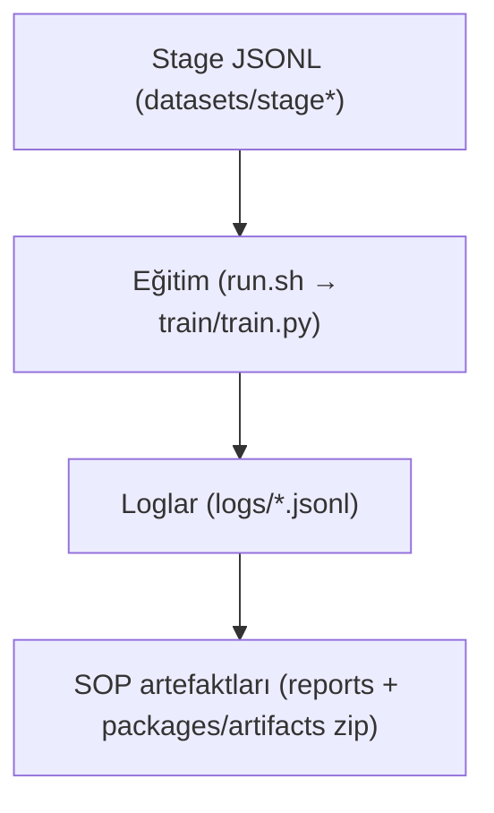

## MertFormer Titan (Build 30 V2)

Kontrollü yerel dağıtım ve dürüst ML systems kanıtı için offline-first, denetlenebilir yapay zeka altyapısı.
Mevcut olgunluk: **pilota hazır eğitim öncesi baseline**.
Mevcut exact repo-side readiness: `TRAIN_ALLOWED`, reason `READY_REMOTE_BOOTSTRAP`.

### İlk Bakışta Bilinmesi Gerekenler
- Başvuru açısından ana kapı: gerçek owned training run + checkpoint-bound evidence.
- Exact `45K`, tercih edilen ciddi doğrulama hedefidir; tek kabul edilebilir başvuru eşiği değildir.
- Kiralık makinede önerilen repo-side lane: `remote_bootstrap`.
- Sıkı yerel lane: `offline_clean` (sabit öğretmen `meta-llama/Llama-3.3-70B-Instruct` ile strict precomputed KD).
- Kalan non-winning blocker'lar: `offline_clean:PRECOMPUTED_LOGITS_MISSING_AND_PHASE0_NOT_ACTIONABLE`, `online_teacher:MISSING_HF_TOKEN`.
- Hâlâ açık olan post-run evidence sınıfı: trained final weights, best/latest checkpoint proof, checkpoint-bound benchmark outputs, trained demo bundle ve trained export/device measurements.

### En Kısa Doğru Okuma Sırası
1. [START_HERE.md](START_HERE.md)
2. [docs/PROJECT_MASTER_TRUTH.md](docs/PROJECT_MASTER_TRUTH.md)
3. [docs/CHESS_ONEFILE_MASTER_TRUTH_TR.md](docs/CHESS_ONEFILE_MASTER_TRUTH_TR.md)
4. [docs/PROJECT_MASTER_TRUTH_TR.md](docs/PROJECT_MASTER_TRUTH_TR.md)
5. [reports/final_truth_matrix.md](reports/final_truth_matrix.md)
6. [reports/known_limits_v1.md](reports/known_limits_v1.md)
7. [reports/systems_performance_case_study.md](reports/systems_performance_case_study.md)
8. [reports/offline_assistant_case_study.md](reports/offline_assistant_case_study.md)
9. [reports/chess_proof_teaching_case_study.md](reports/chess_proof_teaching_case_study.md)
10. [applications/anthropic/README.md](applications/anthropic/README.md)

### Anthropic İçin Yüksek-Sinyal Noktalar
- training efficiency ve systems debugging disiplini
- measured vs unmeasured claim sınırının açık tutulması
- low-bit runtime ve backend-routing dürüstlüğü
- governance-gated tool execution ile offline-first assistant foundation
- eksik post-run kanıtı tamamlanmış gibi anlatmayan benchmark disiplini

### Kanonik Komutlar
- Repo doğrulaması: `bash scripts/verify_all.sh`
- Sadece readiness kontrolü: `bash zero_touch_start.sh --check-only`
- Kanonik owned training lane başlatma: `bash zero_touch_start.sh`
- Tek-komut closure akışı (`SOP` = `Standard Operating Procedure`): `bash scripts/one_command_full_sop.sh`
- Final sync, release artifacts ve hash yenileme: `bash scripts/final_one_shot.sh`
- Opsiyonel Phase-0 yardımcı yüzeyi: `scripts/precompute_logits_topk.py` (strict precomputed-KD yolu için offline teacher Top-K shard üreticisi)

### Doğruluk Sınırı
- `measured` / `target` / `vision` ayrı claim etiketleridir.
- `verified` / `hypothesis` / `creative_or_folklore` ayrı çıktı modlarıdır.
- Varsayılan mod `verified`’dır.
- Bu depo, production-scale kalite iddiaları için **pre-training / doğrulanmamış** durumdadır.
- Trained checkpoint oluşmadan benchmark durumu `NOT ELIGIBLE FOR CLAIM` olarak kalır.
- Bu geçiş final ürün iddiası değil, bir proof-of-system mühendislik release’idir.
- Büyük compute, kişisel finansman zorunluluğu değildir; asıl kapı dürüst verified evidence ve coherent systems signal’dır.

### Açık Teknik Notlar
- `MLA etiketli GQA dikkat bloğu (mevcut implementasyon)`
- `Yönlendirme politikası: token-choice top-k.`
- `prompts/system_v1.txt`, bu closure turunda tek kanonik system prompt yüzeyi olarak kilitli kalır.
- Closure-57 şeffaflık notu: `out_of_scope_pending_ids=[8, 9, 11, 12, 51, 52, 54, 55, 56, 57]`


<div align="center">
  <a href="README.md">🇬🇧 English</a> | <a href="README_TR.md">🇹🇷 Türkçe</a>
</div>

---

## Yasal Güvenlik Politikası (Build 30 V2)

Bu repo yalnızca yasal, denetlenebilir ve insan onaylı kullanım için tasarlanmıştır.

- Operasyonel kararlarda human-in-the-loop zorunludur.
- Orchestrator/runtime tarafında audit izi ve policy sınırları zorunludur.
- İzinsiz gözetim, gizli takip ve onaysız müdahale kapsam dışıdır.
- Pilot iddiaları öncesi güvenlik ve governance kapıları geçilmelidir.

## Closure 57 Raporu

Build 30 V2 ile birlikte makine tarafından doğrulanabilen kapanış kapısı vardır:

```bash
python3 scripts/check_57_matrix.py
mertformer 57-report --out reports/closure_57_matrix.json
```

Çıktılar:
- `reports/closure_57_matrix.json`
- `reports/closure_57_matrix.md`
- `reports/closure_57_matrix_TR.md`
- Şeffaflık notu: Closure-57 süreç düzeyinde yeşildir (`57/57`) ve mevcut raporda `out_of_scope_pending_ids=[8, 9, 11, 12, 51, 52, 54, 55, 56, 57]` listelenir.
<br />

```
 __  __          _   ______
 |  \/  |        | | |  ____|
 | \  / | ___ _ _| |_| |__ ___  _ __ _ __ ___   ___ _ __
 | |\/| |/ _ \ '__| __|  __/ _ \| '__| '_ ` _ \ / _ \ '__|
 | |  | |  __/ |  | |_| | | (_) | |  | | | | | |  __/ |
 |_|  |_|\___|_|   \__|_|  \___/|_|  |_| |_| |_|\___|_|
      _______ _ _
     |__   __(_) |
        | |   _| |_ __ _ _ __
        | |  | | __/ _` | '_ \
        | |  | | || (_| | | | |
        |_|  |_|\__\__,_|_| |_|

   M  O  B  I  L  E     F  I  R  S  T     E  D  G  E     A  I
```

# 🦅 MertFormer Titan: Otonom Sürü Mimarisi
> **Hedef: Mobil maliyetle, sınır-üstü kodlama yeteneği (eğitim/benchmark sonrası).**
> **Geliştirme Aşaması:** Pilota hazır eğitim öncesi baseline (`Build 30 V2`, eğitim/benchmark iddiaları beklemede).

## 🇹🇷 Sivil/Komutan Özeti (Teknik Olmayan Okuyucu İçin)
> **Kaynak kod okumayan karar vericiler için**

**Bu proje nedir?**
MertFormer, sürekli bulut bağımlılığı olmadan, kontrollü yerel donanımda çalışmak üzere tasarlanmış offline-first bir yapay zeka altyapısıdır.

**Neden stratejiktir?**
1. **Veri Kontrolü:** Ana tasarım hedefi yerel/offline çalışmadır; dış veri maruziyetini azaltır.
2. **Operasyonel Süreklilik:** Mimari, kısıtlı bağlantı koşullarında çalışmayı sürdürecek şekilde kurgulanmıştır.
3. **Dil/Alan Uyumu:** Türkçe odaklı dokümantasyon ve iş akışı uyumu çekirdek gereksinim olarak ele alınır.

**Kısaca:** Bu sistem, genel amaçlı internet sohbet botu değil; görev odaklı ve disiplinli bir yapay zeka altyapısı olarak konumlandırılmıştır.

### ✅ Doğrulama Kanıtı (Son Yerel Koşu)
| Kapı | Sonuç |
| :--- | :--- |
| `python3 -m pytest -q` | `240 passed, 3 skipped` |
| `.titan-venv/bin/python -m ruff check .` | `All checks passed` |
| `bash scripts/verify_all.sh` | `[verify] OK` |

## 🚀 Eğitim Hazırlık Durumu (Operasyonel)
**Durum:** `TRAIN_ALLOWED`

**Öne çıkan özellik:** kanonik 45K yolu artık `bash zero_touch_start.sh`; exact readiness verdict, run lock, resume policy ve post-train autorun sözleşmesi bu katmanda toplanır.

Bu depo artık sadece fikir/prototip seviyesinde değildir. Mevcut working tree, `remote_bootstrap` lane üzerinden repo-side 45K-start-ready durumundadır; fakat gerçek uzun koşu hedef donanımda henüz çalışmadığı için trained çıktılar henüz yoktur. Sıkı yerel `offline_clean` lane ise, yerel logits veya yerel actionable Phase-0 olmadan hâlâ blokludur.

### Kanıt Özeti
1. **Çekirdek kalite kapıları geçti**
   - `pytest` geçti (`240 passed, 3 skipped`)
   - `ruff check` geçti (`All checks passed`)
   - `verify_all.sh` geçti (`[verify] OK`)
2. **Mimari ve güvenlik kontrolleri geçti**
   - Offline preflight tüm adımlarda yeşil tamamlandı.
   - Operator gate geçti (overfit, failure-budget, golden-samples).
3. **İzlenebilir artefaktlar üretildi**
   - `logs/preflight/titan_preflight.log`
   - `logs/operator_mode/*.manifest.json`
   - `reports/run_contract.md`
   - `reports/post_train_automation_contract.md`
   - `reports/final_truth_matrix.md`

### Güncel Exact Boundary
- Önerilen repo-side yol: `remote_bootstrap`
- Exact readiness verdict: `TRAIN_ALLOWED` / `READY_REMOTE_BOOTSTRAP`
- Sıkı yerel offline-clean kuralı: ya complete precomputed logits ya da actionable Phase-0 precompute; 45K yolunda teacherless fallback yok
- Kalan non-winning blocker'lar: `offline_clean:PRECOMPUTED_LOGITS_MISSING_AND_PHASE0_NOT_ACTIONABLE`, `online_teacher:MISSING_HF_TOKEN`

### Uzun eğitim koşusundan önce son önkoşullar
- Hedef donanım (GPU/edge) kaynağı ayrılmış olmalıdır.
- Repo/package artefaktları gerçek eğitim makinesine taşınmalı ve kanonik start gate orada yeniden koşturulmalıdır.
- `HF_TOKEN`, önerilen `remote_bootstrap` lane için hedef makinede enjekte edilmelidir; explicit online teacher lane için de gereklidir.
- Dataset lisans/hash iş akışı uyumlu kalmalıdır.
- Tam eğitim koşusu ve benchmark çıktıları bu önkoşullardan sonra kayda alınır.
- Varsayılan token bütçesi artık `fixed_steps` (45K). `open_ended` yalnızca açık hedef override ile kullanılmalıdır.
- Başarılı post-train closeout artık hedef makineden toplu indirme için `artifacts/mertformer_training_outputs_bundle.zip` + SHA256 + manifest üretir.
- `cuda.lock` hedef eğitim makinesinde üretilmelidir.

### Kanonik readiness kapısı
```bash
bash zero_touch_start.sh --check-only
```

### Hedef eğitim donanımında başlatma komutu
```bash
HF_TOKEN=... TITAN_OFFLINE=0 TITAN_INSTALL=1 TITAN_PROFILE=stable bash zero_touch_start.sh
```

### Taşınabilir Eğitim Hazırlık Checklist'i (Zip/Taşı/Çalıştır)
1. Kanonik runtime planını incele:
```bash
bash zero_touch_start.sh --plan-only
```
2. Eğitimi başlatmadan strict readiness doğrulaması:
```bash
bash zero_touch_start.sh --check-only
```
3. Gerekli ortam değişkenleri:
- `HF_TOKEN` (önerilen `remote_bootstrap` lane için hedef makinede zorunlu)
- `WANDB_API_KEY` (opsiyonel)
4. Transfer/unzip sonrası tek-komut eğitim başlatma:
```bash
HF_TOKEN=... TITAN_OFFLINE=0 TITAN_INSTALL=1 TITAN_PROFILE=stable bash zero_touch_start.sh
```
Opsiyonel online teacher yolu:
```bash
HF_TOKEN=... TITAN_OFFLINE=0 TITAN_INSTALL=1 TITAN_PROFILE=stable bash zero_touch_start.sh
```
5. Exact readiness ve start-gate raporları:
- `reports/train_readiness_decision.json`
- `reports/train_readiness_decision.md`
- `reports/start_gate_report.json`
6. Dataset manifest politikası:
- Build30 Final Convergence turunda mevcut dataset manifesti sabit tutulur (major genişleme yok).
7. Legacy yardımcı akışlar:
- `run.sh`, `--test`, `--sitl-demo` ve `--cleanroom-verify` için kullanılmaya devam eder; fakat kanonik 45K train-end launcher artık değildir.

| Mühendislik Durumu | `Pilota hazır eğitim öncesi baseline` |
| :--- | :--- |
| **Eğitim Başlatma Hazırlığı** | ✅ TRAIN_ALLOWED (`READY_REMOTE_BOOTSTRAP`; sıkı yerel offline_clean logits/yerel Phase-0 olmadan bloklu, online_teacher `HF_TOKEN` olmadan bloklu) |
| **Kod Tabanı** | ✅ Uygulandı (testler + offline preflight geçiyor) |
| **Offline Doğrulama** | ✅ PASS (`bash scripts/verify_all.sh`) |
| **Dataset Uyumu** | ✅ Offline-clean için hazır (`lisans/hash iş akışı aktif; stage JSONL dosyaları mevcut working tree’de mevcut`) |
| **Tam Eğitim Koşusu** | ▶️ Henüz başlatılmadı (`ayrılmış donanımda ilk uzun koşu ile başlar`) |
| **Benchmarklar** | ⛔ Eğitimli checkpoint olmadan iddia için uygun değil (`NOT ELIGIBLE FOR CLAIM`) |

### Parametre Açıklaması (İddia Sınırı)
- **Tasarım hedefi (Build 30 V2):** `2.64B` parametre.
- **Son ölçülen runtime toplamı:** `3,698,246,156` parametre (`~3.70B`).
- **Yorum:** `2.64B` mimari/konumlandırma hedefidir; `~3.70B` mevcut ölçülen runtime toplamıdır ve olgusal iddialarda esas alınmalıdır.

Mühendislik gerçeği (katı): `reports/verified_matrix_TR.md`.

> **MertFormer Titan, yapay zeka çıkarım maliyetlerini cihaz düzeyinde minimize ederek kurumsal zekayı merkezsizleştiren yapısal bir verimlilik standardıdır.**

---

### 💼 Yönetici Özeti (Executive Brief)
**Bu bölüm, yapısal verimlilik konumlandırmasını teknik ve yönetici karar vericiler için operasyonel çıktılara dönüştürür.**

*   **💰 Hedeflenen ~%90 Operasyonel Tasarruf (Tahmini/Hedef)**: Bulut sunucu masrafları minimize edilir. MertFormer, enerjiyi NPU düzeyinde optimize ederek işlem maliyetlerini azaltmayı hedefler.
*   **🛡️ Veri Egemenliği**: Veriler cihazda işlenir. Bu, savunma sanayi, hukuk ve finans gibi "yüksek güvenlik" standartlarına sahip pazarlar için yapısal bir avantajdır.
*   **🌍 Ölçeklenebilir Erişim (Hedef)**: İnternet bağımlılığı olmadan, düşük bant genişliğine sahip bölgelerde bile GPT-3.5 düzeyini hedefleyen otonom bir sistemdir.

*Not: Tüm performans ve eğitim süresi rakamları eğitim öncesi tahmindir; tam eğitim sonrası ölçümle doğrulanacaktır.*

---

### 🏰 Stratejik Hendek (The Strategic Moat)
**Neden MertFormer Titan kopyalanamaz?**
1.  **Cihaz Özgü Mimari (Edge-Native Focus)**: Büyük teknoloji şirketlerinin modelleri bulut üzerinde devasa hesaplama gücü için optimize edilmiştir. Titan'ın 1.58-bit katmanları, donanıma doğrudan entegre (hardware-aware) olarak tasarlanmıştır; bu, sonradan kuantize edilen modellere göre net bir verimlilik farkı yaratır.
2.  **Liquid Momentum**: Tescilli `LiquidRouter`, veriyi sadece statik bir girdi olarak değil, bir zamansal akış (momentum) olarak işler. Bu matematiksel yaklaşım, sistemi rakiplerin sadece işlem gücüyle kapatamayacağı bir avantajla konumlandırır.
3.  **Adli Güven**: Zincirlenmiş eğitim logları ve kriptografik çıktılar, projenin şeffaflığını ve kurumsal/askeri güven standartlarına uyumunu doğrular.

### 🔒 Lisans Sınırı (Hızlı Not)
- Bu depo **özel ve gizlidir**.
- Kaynak kod, varlıklar ve yöntemler yalnızca açık yazılı sözleşme veya iş ilişkisi kapsamında kullanılabilir.
- Gizli teknik detayların üçüncü taraflarla paylaşımı, imzalı NDA şartlarına tabidir.
- Tam hukuki çerçeve için [`LICENSE`](LICENSE) ve [`LICENSE_TR`](LICENSE_TR) dosyaları geçerlidir.

---

[](./LICENSE)
[](https://github.com/latentcore/mertformer-titan-core)
[](https://github.com/latentcore/mertformer-titan-core)
[](https://www.microsoft.com/en-us/research/publication/the-era-of-1-bit-llms-all-large-language-models-are-in-1-58-bits/)
[](https://arxiv.org/abs/2310.11453)

## 🏗️ Tasarım İlkeleri
*   **Önce Üretim (Production-First)**: İlk günden itibaren stabilite, güvenlik ve ölçeklenebilirlik için tasarlandı.
*   **Güvenlik Odaklı Mimari**: Dahili anahtar yönetimi, rol tabanlı erişim ve saldırı simülasyonları.
*   **Ölçeklenebilir Sürü Orkestrasyonu**: Görev karmaşıklığına göre 3 ajandan (Nano) 45 ajana (Omega) kadar otomatik ölçekleme.
*   **Gözlemlenebilirlik**: Tam loglama, otopsi analizi (post-mortem) ve adli denetim izleri.

---

## 📋 İçindekiler

- [Doküman Dizini](#docs-index)
- [Genel Bakış](#genel-bakış)
- [Gerçek Dünya Uygulaması (Deneysel)](#real-world-application-experimental-tr)
- [Temel Özellikler](#temel-özellikler)
- [Mimari](#mimari)
- [Performans](#performans)
- [Hızlı Başlangıç](#hızlı-başlangıç)
- [SDK API Hızlı Başlangıç](#sdk-api-tr-quickstart)
- [Sorun Giderme](#sorun-giderme)
- [Eğitim](#eğitim)
- [Eğitim Stratejisi (Baseline -> Build 30 V2 Tuning)](#egitim-stratejisi-baseline-build-30-v2-tuning)
- [Dağıtım (Deployment)](#dağıtım-deployment)
- [Entegrasyon Hedefleri](#entegrasyon-hedefleri)
- [Kıyaslamalar (Benchmarks)](#kıyaslamalar-benchmarks)
- [Türkiye Vizyonu](#türkiye-vizyonu)
- [SSS](#sss)
- [Lisans](#lisans)
- [Stratejik İş Birliği](#stratejik-is-birligi)
- [Ölçeklenebilirlik Vizyonu](#olceklenebilirlik-vizyonu)
- [İletişim](#iletişim)

---

<a id="docs-index"></a>
## 📚 Doküman Dizini

**Çekirdek**
Ana giriş dokümanları ve checklistler.
- [README.md](README.md) — İngilizce genel bakış.
- [README_TR.md](README_TR.md) — Türkçe genel bakış.
- [CITATION.cff](CITATION.cff) — Atıf metadata dosyası.
- [CONTRIBUTING.md](CONTRIBUTING.md) — Katkı yönergeleri (dahili kullanım).
- [CONTRIBUTING_TR.md](CONTRIBUTING_TR.md) — Katkı yönergeleri (TR).
- [README_CHECKLIST.md](README_CHECKLIST.md) — README denetim checklist'i (EN).
- [README_CHECKLIST_TR.md](README_CHECKLIST_TR.md) — README denetim checklist'i (TR).
- [scripts/README.md](scripts/README.md) — Script kataloğu (EN).
- [scripts/README_TR.md](scripts/README_TR.md) — Script kataloğu (TR).
- [snake_demo.py](snake_demo.py) — Pygame cyberpunk Snake autoplayer (LIVE DEMO).
- [USAGE_GUIDE.md](USAGE_GUIDE.md) — Operasyonel kullanım kılavuzu (EN).
- [USAGE_GUIDE_TR.md](USAGE_GUIDE_TR.md) — Operasyonel kullanım kılavuzu (TR).
- [TROUBLESHOOTING.md](TROUBLESHOOTING.md) — Sorun giderme kılavuzu (EN).
- [TROUBLESHOOTING_TR.md](TROUBLESHOOTING_TR.md) — Sorun giderme kılavuzu (TR).
- [MODEL_LICENSE.md](MODEL_LICENSE.md) — Model lisansı özeti (EN).
- [MODEL_LICENSE_TR.md](MODEL_LICENSE_TR.md) — Model lisansı özeti (TR).
- [.env.example](.env.example) — Ortam değişkeni şablonu.
- [docs/CHAIN_MAP.md](docs/CHAIN_MAP.md) — Bağlı vs bağımsız zincir haritası (EN).
- [docs/CHAIN_MAP_TR.md](docs/CHAIN_MAP_TR.md) — Bağlı vs bağımsız zincir haritası (TR).
- [reports/commercial_handover/known_issues.md](reports/commercial_handover/known_issues.md) — Devir risk görünürlüğü için bilinen sorunlar kaydı.
- [reports/commercial_handover/known_issues_TR.md](reports/commercial_handover/known_issues_TR.md) — Devir risk görünürlüğü için bilinen sorunlar kaydı (TR).
- [reports/commercial_handover/handover_scope.md](reports/commercial_handover/handover_scope.md) — Devir kapsamı ve kapsam dışı sınırlar.
- [reports/commercial_handover/handover_scope_TR.md](reports/commercial_handover/handover_scope_TR.md) — Devir kapsamı ve kapsam dışı sınırlar (TR).
- [reports/commercial_handover/ownership_and_role.md](reports/commercial_handover/ownership_and_role.md) — Devir sonrası sahiplik modeli ve karar hakları.
- [reports/commercial_handover/ownership_and_role_TR.md](reports/commercial_handover/ownership_and_role_TR.md) — Devir sonrası sahiplik modeli ve karar hakları (TR).
- [reports/commercial_handover/sla_kpi_90_180.md](reports/commercial_handover/sla_kpi_90_180.md) — 90/180 gün SLA ve KPI işletim planı.
- [reports/commercial_handover/sla_kpi_90_180_TR.md](reports/commercial_handover/sla_kpi_90_180_TR.md) — 90/180 gün SLA ve KPI işletim planı (TR).
- [reports/commercial_handover/contract_terms_checklist.md](reports/commercial_handover/contract_terms_checklist.md) — IP, sorumluluk, operasyon ve çıkış için sözleşme checklisti.
- [reports/commercial_handover/contract_terms_checklist_TR.md](reports/commercial_handover/contract_terms_checklist_TR.md) — IP, sorumluluk, operasyon ve çıkış için sözleşme checklisti (TR).

**SDK**
Edge dağıtım için paket + CLI.
- [mertformer_sdk/](mertformer_sdk/) — SDK paketi (API + CLI + kernel).
- [SDK_GUIDE.md](SDK_GUIDE.md) — SDK hızlı kılavuz (EN).
- [SDK_GUIDE_TR.md](SDK_GUIDE_TR.md) — SDK hızlı kılavuz (TR).

**Planlar**
Yol haritaları ve operatör planları.
- [TASK.md](TASK.md) — Operatör Modu görev planı (EN).
- [TASK_TR.md](TASK_TR.md) — Operatör Modu görev planı (TR).
- [IMPLEMENTATION_PLAN.md](IMPLEMENTATION_PLAN.md) — Uygulama planı (EN).
- [IMPLEMENTATION_PLAN_TR.md](IMPLEMENTATION_PLAN_TR.md) — Uygulama planı (TR).
- [TRAINING_PLAN.md](TRAINING_PLAN.md) — Eğitim yol haritası (EN).
- [TRAINING_PLAN_TR.md](TRAINING_PLAN_TR.md) — Eğitim yol haritası (TR).
- [CHANGELOG.md](CHANGELOG.md) — Sürüm değişiklik kaydı (EN).
- [CHANGELOG_TR.md](CHANGELOG_TR.md) — Sürüm değişiklik kaydı (TR).

**Teknik**
Derin teknik analiz ve araştırma referansları.
- [TECHNICAL_REPORT.md](TECHNICAL_REPORT.md) — Teknik derin inceleme (EN).
- [TECHNICAL_REPORT_TR.md](TECHNICAL_REPORT_TR.md) — Teknik derin inceleme (TR).
- [WHITE_PAPER_LIQUIDROUTER.md](WHITE_PAPER_LIQUIDROUTER.md) — LiquidRouter white paper (EN).
- [WHITE_PAPER_LIQUIDROUTER_TR.md](WHITE_PAPER_LIQUIDROUTER_TR.md) — LiquidRouter white paper (TR).

**Dahili**
Dahili yol haritası ve yetenek boşluk haritalaması (kamusal değil).
- [INTERNAL_AGI_GAP.md](INTERNAL_AGI_GAP.md) — Dahili AGI boşluk haritası (EN).
- [INTERNAL_AGI_GAP_TR.md](INTERNAL_AGI_GAP_TR.md) — Dahili AGI boşluk haritası (TR).

**Denetim & Strateji**
Rapor doğruluk denetimi ve stratejik değer özeti.
- [reports/report_accuracy_audit.md](reports/report_accuracy_audit.md) — Rapor doğruluk denetimi (EN).
- [reports/report_accuracy_audit_TR.md](reports/report_accuracy_audit_TR.md) — Rapor doğruluk denetimi (TR).
- [reports/codex_deep_audit_EN.md](reports/codex_deep_audit_EN.md) — Derin mühendislik denetimi (EN).
- [reports/codex_deep_audit_DE.md](reports/codex_deep_audit_DE.md) — Derin mühendislik denetimi (DE).
- [reports/codex_deep_audit_TR.md](reports/codex_deep_audit_TR.md) — Derin mühendislik denetimi (TR).
- [reports/codex_deep_audit_EN_TR.md](reports/codex_deep_audit_EN_TR.md) — EN denetim raporu için TR pointer dosyası (kanonik içerik `codex_deep_audit_TR.md`).
- [reports/codex_deep_audit_DE_TR.md](reports/codex_deep_audit_DE_TR.md) — DE denetim raporu için TR pointer dosyası (kanonik içerik `codex_deep_audit_TR.md`).
- DE dilindeki denetim dosyaları, Almanca konuşan paydaşlar için dış inceleme artifact’i olarak korunur.
- [reports/verified_matrix.md](reports/verified_matrix.md) — Verified vs Target matrisi (EN).
- [reports/verified_matrix_TR.md](reports/verified_matrix_TR.md) — Verified vs Target matrisi (TR).
- [reports/review_checklist.md](reports/review_checklist.md) — Dış inceleme checklist'i (EN).
- [reports/review_checklist_TR.md](reports/review_checklist_TR.md) — Dış inceleme checklist'i (TR).
- [reports/release_snapshot.md](reports/release_snapshot.md) — Release snapshot (EN).
- [reports/release_snapshot_TR.md](reports/release_snapshot_TR.md) — Release snapshot (TR).
- [reports/final_sync_matrix.md](reports/final_sync_matrix.md) — Final senkron matris (EN).
- [reports/final_sync_matrix_TR.md](reports/final_sync_matrix_TR.md) — Final senkron matris (TR).
- [reports/go_status_matrix.md](reports/go_status_matrix.md) — GO/NO-GO durum matrisi (EN).
- [reports/go_status_matrix_TR.md](reports/go_status_matrix_TR.md) — GO/NO-GO durum matrisi (TR).
- [reports/go_nogo_signoff_onepager.md](reports/go_nogo_signoff_onepager.md) — Teknik GO/NO-GO tek sayfa imza özeti (EN).
- [reports/go_nogo_signoff_onepager_TR.md](reports/go_nogo_signoff_onepager_TR.md) — Teknik GO/NO-GO tek sayfa imza özeti (TR).
- [reports/closure_57_matrix.md](reports/closure_57_matrix.md) — Closure 57 matrisi (EN).
- [reports/closure_57_matrix_TR.md](reports/closure_57_matrix_TR.md) — Closure 57 matrisi (TR).
- [reports/report_truth_matrix.md](reports/report_truth_matrix.md) — Rapor doğruluk matrisi (EN).
- [AGENTS.md](AGENTS.md) — Katkıcılar ve coding agent'lar için closure anayasası.
- [reports/source_of_truth_map.md](reports/source_of_truth_map.md) — Güncel source-of-truth yetki haritası.
- [reports/final_backlog_classification.md](reports/final_backlog_classification.md) — Güncel gruplanmış backlog durum muhasebesi.
- [reports/final_truth_matrix.md](reports/final_truth_matrix.md) — Güncel claim-to-evidence doğruluk matrisi.
- [reports/release_closure_note.md](reports/release_closure_note.md) — Release kapanış notu (EN).
- [reports/kpi_pack_v1.md](reports/kpi_pack_v1.md) — KPI paketi (EN).
- [reports/kpi_pack_v1_TR.md](reports/kpi_pack_v1_TR.md) — KPI paketi (TR).
- [reports/cleanroom_verification.md](reports/cleanroom_verification.md) — Temiz clone tekrar üretim kanıtı (EN).
- [reports/cleanroom_verification_TR.md](reports/cleanroom_verification_TR.md) — Temiz clone tekrar üretim kanıtı (TR).
- [reports/legal_cleanroom_signoff_internal.md](reports/legal_cleanroom_signoff_internal.md) — Dahili cleanroom hukuki imza kaydı (EN).
- [reports/teacher_output_license_assessment.md](reports/teacher_output_license_assessment.md) — Teacher/output lisans dahili değerlendirme (EN).
- [reports/contamination_report_build30.md](reports/contamination_report_build30.md) — Build30 contamination raporu (EN).
- [reports/kpi_contract_build30.md](reports/kpi_contract_build30.md) — GO kararı için teknik KPI sözleşmesi (EN).
- [reports/benchmarks/README.md](reports/benchmarks/README.md) — Benchmark çıktıları rehberi (EN).
- [reports/benchmarks/README_TR.md](reports/benchmarks/README_TR.md) — Benchmark çıktıları rehberi (TR).
- [reports/benchmarks/smoke_train_metrics.json](reports/benchmarks/smoke_train_metrics.json) — Smoke benchmark metrik snapshot'ı (makine-okur).
- [reports/strategic_value.md](reports/strategic_value.md) — Stratejik değer özeti (EN).
- [reports/strategic_value_TR.md](reports/strategic_value_TR.md) — Stratejik değer özeti (TR).
- [reports/efficiency_convergence_analysis.md](reports/efficiency_convergence_analysis.md) — Yakınsama analizi (BitNet/Liquid/MoE, öngörü, EN).
- [reports/efficiency_convergence_analysis_TR.md](reports/efficiency_convergence_analysis_TR.md) — Yakınsama analizi (BitNet/Liquid/MoE, öngörü, TR).

**Sunum & Asset**
Yatırımcı materyalleri ve lansman varlıkları.
- [PITCH.md](PITCH.md) — Yatırımcı pitch (EN).
- [PITCH_TR.md](PITCH_TR.md) — Yatırımcı pitch (TR).
- [reports/investor_deck.pptx](reports/investor_deck.pptx) — Yatırımcı deck (EN).
- [reports/investor_deck_TR.pptx](reports/investor_deck_TR.pptx) — Yatırımcı deck (TR).
- [reports/one_pager.md](reports/one_pager.md) — One-pager (EN).
- [reports/one_pager_TR.md](reports/one_pager_TR.md) — One-pager (TR).
- [reports/technical_snapshot.md](reports/technical_snapshot.md) — Teknik snapshot (EN).
- [reports/technical_snapshot_TR.md](reports/technical_snapshot_TR.md) — Teknik snapshot (TR).
- [reports/asset_stack.md](reports/asset_stack.md) — Asset index (EN).
- [reports/asset_stack_TR.md](reports/asset_stack_TR.md) — Asset index (TR).
- [assets/snake_demo_proof.mp4](assets/snake_demo_proof.mp4) — 30 saniyelik snake demo kanıt videosu.
- [assets/snake_demo_preview.gif](assets/snake_demo_preview.gif) — Gömülü snake demo önizlemesi (GIF).
- [assets/sources/README.md](assets/sources/README.md) — Düzenlenebilir görsel kaynak arşiv standardı (EN).
- [assets/sources/README_TR.md](assets/sources/README_TR.md) — Düzenlenebilir görsel kaynak arşiv standardı (TR).


Tam video: [assets/snake_demo_proof.mp4](assets/snake_demo_proof.mp4)
- [reports/founders_hub_application.md](reports/founders_hub_application.md) — Founders Hub taslağı (EN).
- [reports/founders_hub_application_TR.md](reports/founders_hub_application_TR.md) — Founders Hub taslağı (TR).
- [reports/security_compliance.md](reports/security_compliance.md) — Güvenlik & uyum özeti (EN).
- [reports/security_compliance_TR.md](reports/security_compliance_TR.md) — Güvenlik & uyum özeti (TR).
- [reports/poc_protocol.md](reports/poc_protocol.md) — Pilot/PoC protokolü (EN).
- [reports/poc_protocol_TR.md](reports/poc_protocol_TR.md) — Pilot/PoC protokolü (TR).
- [reports/pilot_readiness_kit.md](reports/pilot_readiness_kit.md) — Pilot hazırlık kiti (EN).
- [reports/pilot_readiness_kit_TR.md](reports/pilot_readiness_kit_TR.md) — Pilot hazırlık kiti (TR).
- [reports/pilot_offer_packages.md](reports/pilot_offer_packages.md) — Standart pilot teklif paketleri (EN).
- [reports/pilot_offer_packages_TR.md](reports/pilot_offer_packages_TR.md) — Standart pilot teklif paketleri (TR).
- [reports/sales_funnel_90d.md](reports/sales_funnel_90d.md) — 90 günlük B2B pilot satış hunisi (EN).
- [reports/sales_funnel_90d_TR.md](reports/sales_funnel_90d_TR.md) — 90 günlük B2B pilot satış hunisi (TR).
- [reports/drone_sitl_demo.md](reports/drone_sitl_demo.md) — SITL drone kanıt protokolü (EN).
- [reports/drone_sitl_demo_TR.md](reports/drone_sitl_demo_TR.md) — SITL drone kanıt protokolü (TR).
- [reports/pilots/README.md](reports/pilots/README.md) — Pilot kanıt klasörü standardı (EN).
- [reports/pilots/README_TR.md](reports/pilots/README_TR.md) — Pilot kanıt klasörü standardı (TR).
- [reports/pilot_acceptance_signoff.md](reports/pilot_acceptance_signoff.md) — Pilot kabul imza şablonu (EN).
- [reports/pilot_acceptance_signoff_TR.md](reports/pilot_acceptance_signoff_TR.md) — Pilot kabul imza şablonu (TR).
- [reports/ip_licensing_split.md](reports/ip_licensing_split.md) — Sektörel fikri hak ayrımı çerçevesi (EN).
- [reports/ip_licensing_split_TR.md](reports/ip_licensing_split_TR.md) — Sektörel fikri hak ayrımı çerçevesi (TR).
- [reports/dataset_health.md](reports/dataset_health.md) — Dataset sağlık raporu (EN).
- [reports/dataset_health_TR.md](reports/dataset_health_TR.md) — Dataset sağlık raporu (TR).
- [reports/model_health.md](reports/model_health.md) — Model sağlık raporu (EN).
- [reports/model_health_TR.md](reports/model_health_TR.md) — Model sağlık raporu (TR).
- [reports/system_hardware.md](reports/system_hardware.md) — Sistem donanım raporu (EN).
- [reports/system_hardware_TR.md](reports/system_hardware_TR.md) — Sistem donanım raporu (TR).
- [reports/cli_smoke_log.md](reports/cli_smoke_log.md) — CLI smoke log (EN).
- [reports/cli_smoke_log_TR.md](reports/cli_smoke_log_TR.md) — CLI smoke log (TR).


**Operasyon & Yönetişim**
Güvenlik, veri kökeni, yeniden üretilebilirlik ve operasyon notları.
- [MODEL_CARD.md](MODEL_CARD.md) — Model kartı (EN).
- [MODEL_CARD_TR.md](MODEL_CARD_TR.md) — Model kartı (TR).
- [USE_POLICY.md](USE_POLICY.md) — Kullanım politikası (EN).
- [USE_POLICY_TR.md](USE_POLICY_TR.md) — Kullanım politikası (TR).
- [SECURITY.md](SECURITY.md) — Güvenlik politikası (EN).
- [SECURITY_TR.md](SECURITY_TR.md) — Güvenlik politikası (TR).
- [DECISIONS.md](DECISIONS.md) — Mimari kararlar (EN).
- [DECISIONS_TR.md](DECISIONS_TR.md) — Mimari kararlar (TR).
- [datasets/README.md](datasets/README.md) — Dataset genel bakış (EN).
- [datasets/README_TR.md](datasets/README_TR.md) — Dataset genel bakış (TR).
- [datasets/SOURCES.md](datasets/SOURCES.md) — Veri kaynakları (EN).
- [datasets/SOURCES_TR.md](datasets/SOURCES_TR.md) — Veri kaynakları (TR).
- [datasets/LICENSES.md](datasets/LICENSES.md) — Lisanslar (EN).
- [datasets/LICENSES_TR.md](datasets/LICENSES_TR.md) — Lisanslar (TR).
- [datasets/inventory.md](datasets/inventory.md) — Dataset envanteri (otomatik, EN).
- [datasets/inventory_TR.md](datasets/inventory_TR.md) — Dataset envanteri (otomatik, TR).
- [datasets/inventory.json](datasets/inventory.json) — Dataset envanteri (otomatik, makine-okur).
- [repro/seed_policy.md](repro/seed_policy.md) — Seed politikası (EN).
- [repro/seed_policy_TR.md](repro/seed_policy_TR.md) — Seed politikası (TR).
- [repro/python.md](repro/python.md) — Python 3.11 baseline kurulum (EN).
- [repro/python_TR.md](repro/python_TR.md) — Python 3.11 baseline kurulum (TR).
- [repro/accelerate_default.yaml](repro/accelerate_default.yaml) — Örnek accelerate config (yerel).
- [repro/pip_freeze.txt](repro/pip_freeze.txt) — Ortam envanteri (pip freeze).
- [logs/README.md](logs/README.md) — Log dizini + birleşik logbook notları.
- `logs/ALL_LOGS.jsonl` — Birleşik logbook artifact (gitignored; `.titan-venv/bin/python scripts/logbook_build.py --append` ile üretilir).
- [.github/workflows/ci.yml](.github/workflows/ci.yml) — CI pipeline (pytest + preflight + secret scan).
- [interfaces/inference_contract.md](interfaces/inference_contract.md) — Çıkarım sözleşmesi (EN).
- [interfaces/inference_contract_TR.md](interfaces/inference_contract_TR.md) — Çıkarım sözleşmesi (TR).
- [interfaces/pilot_report_v1.schema.json](interfaces/pilot_report_v1.schema.json) — Pilot raporu JSON şeması.
- [economics/cost_model.md](economics/cost_model.md) — Maliyet modeli (EN).
- [economics/cost_model_TR.md](economics/cost_model_TR.md) — Maliyet modeli (TR).
- [economics/efficiency_report.md](economics/efficiency_report.md) — Verim raporu (EN).
- [economics/efficiency_report_TR.md](economics/efficiency_report_TR.md) — Verim raporu (TR).
- [limits/scaling_breakpoints.md](limits/scaling_breakpoints.md) — Ölçek kırılma noktaları (EN).
- [limits/scaling_breakpoints_TR.md](limits/scaling_breakpoints_TR.md) — Ölçek kırılma noktaları (TR).
- [postmortems/README.md](postmortems/README.md) — Olay raporu dizini (EN).
- [postmortems/README_TR.md](postmortems/README_TR.md) — Olay raporu dizini (TR).
- [postmortems/_template.md](postmortems/_template.md) — Postmortem şablonu (EN).
- [postmortems/_template_TR.md](postmortems/_template_TR.md) — Postmortem şablonu (TR).
- [postmortems/example_001.md](postmortems/example_001.md) — Postmortem örneği (EN).
- [postmortems/example_001_TR.md](postmortems/example_001_TR.md) — Postmortem örneği (TR).
- [prompts/changelog.md](prompts/changelog.md) — Prompt değişim günlüğü (EN).
- [prompts/changelog_TR.md](prompts/changelog_TR.md) — Prompt değişim günlüğü (TR).
- [tokenizer/stats.md](tokenizer/stats.md) — Tokenizer istatistikleri (EN).
- [tokenizer/stats_TR.md](tokenizer/stats_TR.md) — Tokenizer istatistikleri (TR).
- [tokenizer/drift_report.md](tokenizer/drift_report.md) — Tokenizer drift raporu (EN).
- [tokenizer/drift_report_TR.md](tokenizer/drift_report_TR.md) — Tokenizer drift raporu (TR).
- [tokenizer/tr/README.md](tokenizer/tr/README.md) — Turkish tokenizer cache note (EN).
- [tokenizer/tr/README_TR.md](tokenizer/tr/README_TR.md) — Turkish tokenizer cache note (TR).
- [ablations/results.md](ablations/results.md) — Ablation sonuçları (EN).
- [ablations/results_TR.md](ablations/results_TR.md) — Ablation sonuçları (TR).
- [ablations/no_moe/README.md](ablations/no_moe/README.md) — MoE kapalı ablation (EN).
- [ablations/no_moe/README_TR.md](ablations/no_moe/README_TR.md) — MoE kapalı ablation (TR).
- [ablations/no_liquid/README.md](ablations/no_liquid/README.md) — Liquid kapalı ablation (EN).
- [ablations/no_liquid/README_TR.md](ablations/no_liquid/README_TR.md) — Liquid kapalı ablation (TR).
- [ablations/dense_only/README.md](ablations/dense_only/README.md) — Dense-only ablation (EN).
- [ablations/dense_only/README_TR.md](ablations/dense_only/README_TR.md) — Dense-only ablation (TR).
- [ablations/bitlinear_off/README.md](ablations/bitlinear_off/README.md) — BitNet kapalı ablation (EN).
- [ablations/bitlinear_off/README_TR.md](ablations/bitlinear_off/README_TR.md) — BitNet kapalı ablation (TR).
- [experiments/exp_001_baseline/notes.md](experiments/exp_001_baseline/notes.md) — Deney notları (EN).
- [experiments/exp_001_baseline/notes_TR.md](experiments/exp_001_baseline/notes_TR.md) — Deney notları (TR).
- [tools/abuse_tests.md](tools/abuse_tests.md) — Tool abuse testleri (EN).
- [tools/abuse_tests_TR.md](tools/abuse_tests_TR.md) — Tool abuse testleri (TR).
- [tools/sandbox/README.md](tools/sandbox/README.md) — Tool sandbox (EN).
- [tools/sandbox/README_TR.md](tools/sandbox/README_TR.md) — Tool sandbox (TR).
- [tools/contracts/README.md](tools/contracts/README.md) — Tool sözleşmeleri (EN).
- [tools/contracts/README_TR.md](tools/contracts/README_TR.md) — Tool sözleşmeleri (TR).
- [training_dynamics/cold_vs_warm.md](training_dynamics/cold_vs_warm.md) — Eğitim dinamiği notu (EN).
- [training_dynamics/cold_vs_warm_TR.md](training_dynamics/cold_vs_warm_TR.md) — Eğitim dinamiği notu (TR).

---

<a id="genel-bakış"></a>
## 🎯 Genel Bakış

MertFormer Titan, mobil platformlarda **cihaz içi çıkarım (inference)** için tasarlanmış, son teknoloji ürünü **2.64B parametreli** bir dil modelidir. **BitNet 1.58-bit kuantizasyon**, **Liquid Neural Networks**, **Seyrek Uzmanlar Karışımı (MoE)** ve **MLA etiketli GQA dikkat bloğu (mevcut implementasyon)** teknolojilerini birleştirerek, tamamen bir akıllı telefonda çalışırken **GPT-3.5 seviyesinde performans hedefler (eğitim öncesi hedef)**.

Mimari doğruluk notu: `layers/mla.py` sınıf adı `MLA` olarak korunur; mevcut attention çekirdeği GQA tabanlıdır (`num_kv_heads` projeksiyonu + KV head çoğaltma). Tam latent-MLA bottleneck yol haritası kalemidir.

İsim açılımı:
- **MERT**: **Modüler Uçta Akıl Yürütme Transformer**
- **MertFormer**: **Cihaz Üstü Modüler Yürütme ve Güvenilirlik için Modüler Uçta Akıl Yürütme Transformer Çatısı**

### 🔗 Zincir Haritası (Bağlı vs Bağımsız)


Tam harita: [`docs/CHAIN_MAP_TR.md`](docs/CHAIN_MAP_TR.md)

### Neden MertFormer Titan?

- 🛡️ **Önce Gizlilik**: %100 cihaz içi, sıfır bulut bağımlılığı
- ⚡ **Ultra Verimli**: BitNet kuantizasyonu ile teorik **FP32’ye göre ~20x daha küçük** (32-bit → 1.58-bit; low-bit inference yolu gerektirir)
- 🏭 **Endüstriyel Sınıf**: Endüstri standardı optimizasyonlar (Flash Attention 2, torch.compile, NCCL tuning)
- 📱 **Mobil Optimize**: Samsung S25 NPU için JIT derlemesi
- 🧪 **Araştırma Düzeyi**: Özgün LiquidRouter mimarisi (bağlamsal MoE yönlendirme)
- 🇹🇷 **Türkiye'ye Hazır**: Türk dili ve kültürü için optimize edildi

<a id="real-world-application-experimental-tr"></a>
### 🚁 Gerçek Dünya Uygulaması (Deneysel)

- **Proof-of-system hedefi:** Gerçek dünya kısıtlarında, otonom UAV/drone sınıfı platformlarda doğrulanabilir olacak şekilde tasarlanmıştır.
- **Sistem odağı:** Kısıtlı donanım, gecikme ve sensör belirsizliği altında algı → karar → kontrol hattının çalışmasıdır.
- **Güvenlik önceliği:** Risk/güven eşiği aşıldığında fail-safe guardrail ve watchdog benzeri override mekanizmalarıyla deterministik fallback davranışı hedeflenir.
- **Konumlandırma:** Bu sürüm mühendislik doğrulama kapsamındadır; sertifikalı/production dağıtım iddiası sunmaz.
- **Mevcut kısıt:** Doğrulama hızı, GPU/edge donanım ve kontrollü saha testi kaynaklarına erişimle sınırlıdır.
- **İş birliği çağrısı:** Kilometre taşlarını hızlandırmak için compute desteği, kontrollü test ortamı ve mühendislik mentorluğu iş birliği arıyoruz.

---

<a id="temel-özellikler"></a>
## 🔥 Temel Özellikler

### 1. **BitNet 1.58-bit Kuantizasyon** 🤏
- Üçlü (Ternary) ağırlıklar: `{-1, 0, +1}`
- INT8 aktivasyonlar: `[-127, 127]`
- **FP32’ye göre teorik ~20x daha küçük** (32-bit → 1.58-bit; low-bit inference yolu gerektirir)
- Gradyan akışı için Straight-Through Estimator (STE)
- Stabilite için RMS ölçekleme (legacy yol Build 30 V2 içine entegre edildi)

### 2. **LiquidRouter (Zamansal Conv Yönlendirici)** 🌍
- **Implementasyon gerçeği**: MoE yönlendirmesi causal depthwise `Conv1d` + rolling state buffer ile yapılır.
- **CfC ayrımı**: Kapalı form sürekli zamanlı (CfC) hücreler `LiquidMixer/LiquidCell` içinde çalışır; `LiquidRouter` içinde değil.
- **Etki**: Standart (hafızasız) yönlendiricilere kıyasla **tahmini %15-20 daha iyi yönlendirme kalitesi**.
- **Zamansal Rota**: Geçmişi hatırlayan "Trafik Polisi" mantığıyla uzman çökmesini önler.
- **Dinamik**: Stabilite için zaman sabiti adaptasyonu ve jitter desteği.
- **Akademik Değer**: Koşullu hesaplamada (conditional computation) yeni bir paradigma.

### 3. **MLA Etiketli GQA Dikkat Bloğu (Mevcut Implementasyon)** 🧠
- GQA tabanlı KV paylaşımı (`num_heads=16`, `num_kv_heads=8` varsayılan profil).
- LLaMA-3 uyumlu RoPE (interleaved & decoupled)
- Opsiyonel hiyerarşik KV cache yolu (kısa/uzun ayrımı) ile decode verimliliği.
- Stabilite için QK normalizasyonu
- Flash Attention 2 entegrasyonu (+%30 hızlanma)
- Uzun bağlam hazır (theta=100K)

### 4. **Liquid Neural Networks (CfC)** 💧
- Gerçek Kapalı Form Sürekli Zamanlı hücreler
- Dinamik tau (zaman sabiti) adaptasyonu
- Zamansal akıl yürütme yetenekleri
- NPU optimizasyonu için JIT derlemeli
- 3 aşamalı koruma sistemi (3-strike safeguard)

### 5. **Seyrek Uzmanlar Karışımı (MoE) & 🚀 LiquidRouter** 🧩
- 8 uzman, top-2 yönlendirme
- Yönlendirme politikası: token-choice top-k.
- **Momentum Bazlı Yönlendirme:** Standart yönlendiricilerin aksine, `LiquidRouter` sadece anlık kelimeye değil, verinin geliş hızına ve zamansal momentumuna (`Fluid Path`) bakarak uzman seçer.
- **Causal Conv1d Entegrasyonu:** Uzman seçimi sırasında geçmiş 4 token'lık pencereyi (`history_window`) dikkate alarak "trafik polisinden" ziyade bir "stratejik zeka" gibi çalışır.
- **Donanım Uyumluluğu:** `LiquidRouter`ın keskin seçimleri sayesinde gereksiz uzmanların tetiklenmesi önlenir, bu da Samsung S25 NPU biriminde tahmini %40'a varan enerji tasarrufu sağlar.
- Yük dengeleme + Z-loss + Switch loss
- BitSwiGLU uzmanları (kuantize edilmiş)
- Çökme önleme için acil durum jitter desteği
- Yönlendirici sağlık izleme

### 6. **Gelişmiş Eğitim Hattı** 🚂
- **Bilgi Damıtma (Knowledge Distillation)**: Llama-3.3-70B → 2.64B tasarım hedefi (%80 alpha)
- **4 Çekirdek Aşama + 1 Araç/API Fazı**: Mantık → Bilgi → Dil → Ruh (+ Araç Kullanımı/API)
- **WSD Zamanlayıcı**: Warmup-Stable-Decay (grokking optimize edilmiş)
- **Diferansiyel Öğrenme Oranları**: Router 1.5x, Gövde 1.0x
- **Erken Durdurma**: Sabır tabanlı en iyi kontrol noktası kaydı
- **Dinamik Alpha**: Aşamalı damıtma ağırlığı ayarlaması

### 7. **Performans Optimizasyonları (v1.0 (Build 30 V2))** ⚡
- ✅ **Flash Attention 2**: Tahmini +%30 hızlanma (A100/H100)
- ✅ **Fused RMSNorm**: Tahmini +%10 hızlanma (torch.compile)
- ✅ **torch.compile (max-autotune)**: Tahmini +%15 hızlanma
- ✅ **CUDA TF32 + cuDNN**: Tahmini +%10 hızlanma
- ✅ **Geliştirilmiş DataLoader**: Tahmini +%5 hızlanma (16 işçi, prefetch=4)
- ✅ **NCCL Tuning**: Tahmini +%5-10 hızlanma (multi-GPU, otomatik algılama)
- **Tahmini toplam: %70-80 daha hızlı eğitim.**

### 8. **Güvenlik & Güvenilirlik** 🛡️
- ✅ **OOM Kurtarma**: Otomatik toplu iş boyutu (batch size) azaltma
- ✅ **NaN/Inf Tespiti**: Yeniden deneme limiti ile gradyan sıfırlama
- ✅ **Disk Alanı İzleme**: Kontrol noktası kayıt hatalarını önler
- ✅ **GPU Bellek Takibi**: Gerçek zamanlı kullanım raporlaması
- ✅ **Gradyan Norm İzleme**: Çöküş/patlama tespiti
- ✅ **Liquid Ani Artış Korumaları**: 3 aşamalı dondurma mekanizması
- ✅ **En İyi Kontrol Noktası Kaydı**: Optimal model durumunu korur

### 9. **Teknolojik Üstünlük (Build 30 V2 Yükseltmesi)** 🛠️
- **GaLore Entegrasyonu**: Tüketici GPU'larında bellek verimliliği için Gradient Low-Rank Projection optimizasyonu (Kilitli).
- **8-bit AdamW**: Bellek optimize edilmiş optimizer, optimizer durum belleğini %75 azaltır (Kilitli).
- **Çevrimdışı Bilgi Damıtma (Offline KD)**: Sıfır yüklü öğretmen eğitimi için önceden hesaplanmış Llama-3-70B logitleri (precomputed shard gerektirir; yoksa online öğretmene düşer).
- **Akıllı Paralel Orkestrasyon (Hyper-Threading)**: Veri indirme, damıtma ve eğitimin eş zamanlı gerçekleştiği sıfır gecikmeli boru hattı.

### QINN Durumu (Mevcut Build)
- **Varsayılan durum:** `use_qinn=False` (Build 30 V2'de kapalı).
- **Şu an neden kapalı:** ana eğitim hattında stabilite, throughput ve edge/NPU uyumluluğu önceliklendirildi.
- **İleride açılırsa:** deneysel bir düzenleme katmanı olarak ablation ile test edilebilir; ek hesaplama yükü ve yakınsama riski oluşturabilir.
- **Referans dosya:** `layers/qinn.py` (kontrollü deneyler için kod tabanında tutulur).

---

<a id="mimari"></a>
## 🏗️ Mimari

### Build 30 V2 Bilişsel Genişletmeler (Feature-Flag, varsayılan KAPALI)
Bu modüller kodda uygulanmıştır ve eğitim/çıkarım öncesi config ile açılabilir:

- `use_hierarchical_kv_cache` -> Kısa/uzun ayrımlı hiyerarşik KV cache (`layers/mla.py`)
- `use_global_workspace_broadcast` -> Global workspace broadcast katmanı (`layers/cognitive_extensions.py`)
- `use_cross_expert_sync_bus` -> Uzmanlar arası senkronizasyon yolu (`layers/moe.py`)
- `use_latent_ode_state_channel` -> Sürekli-zaman latent ODE durum kanalı (`layers/cognitive_extensions.py`)
- `use_neuromodulatory_gain` -> Nöromodülatör gain katmanı (`layers/cognitive_extensions.py`)
- `use_hebbian_plasticity` -> Hebbian plastisite iz katmanı (`layers/cognitive_extensions.py`)
- `use_neuro_symbolic_layer` -> Nöro-sembolik artık köprü katmanı (`layers/cognitive_extensions.py`)
- `use_world_model_head` -> Nedensel dünya modeli yan-çıktıları (`layers/world_model_head.py`)
- `use_lifelong_safety_layer` -> Yaşam boyu güvenlik/adaptasyon koruması (`layers/lifelong_safety.py`)
- `use_structural_plasticity` -> Uzman büyütme-budama politika kancaları (`layers/moe.py`)
- `use_continual_adapter` -> Eğitimde continual learning adaptör yolu (`train/continual_adapter.py`)
- `use_expert_paging` -> Çıkarım-öncelikli uzman sayfalama (on-demand residency) (`layers/moe.py`)

Çalışma notu:
- Varsayılanlar KAPALI tutulur; stabil baseline korunur.
- Bu bileşenler non-breaking uzantılar olarak entegredir ve deney bazında açılır.

### İleri Özellik Matrisi (Stable vs Max-Arch)
`run.sh`, `TITAN_PROFILE` ile profil sözleşmesi destekler.

| Bayrak | Stable (varsayılan) | Max-Arch | Amaç | Dosya |
| --- | --- | --- | --- | --- |
| `use_hierarchical_kv_cache` | `false` | `true` | Decode sırasında kısa/uzun KV ayrımı | `layers/mla.py` |
| `use_global_workspace_broadcast` | `false` | `true` | Tokenlar arası ortak çalışma alanı sinyali | `layers/cognitive_extensions.py` |
| `use_neuromodulatory_gain` | `false` | `true` | Workspace tabanlı gain/bias modülasyonu | `layers/cognitive_extensions.py` |
| `use_latent_ode_state_channel` | `false` | `true` | Sürekli-zaman latent durum dinamiği | `layers/cognitive_extensions.py` |
| `use_cross_expert_sync_bus` | `false` | `true` | MoE uzmanlar arası senkronizasyon | `layers/moe.py` |
| `use_structural_plasticity` | `false` | `true` | Uzman büyütme/budama kancaları | `layers/moe.py` |
| `use_hebbian_plasticity` | `false` | `true` | Lokal plastisite iz katmanı | `layers/cognitive_extensions.py` |
| `use_neuro_symbolic_layer` | `false` | `true` | Kural-koşullu artık köprü | `layers/cognitive_extensions.py` |
| `use_world_model_head` | `false` | `true` | Yan-kanal nedensel tahmin çıktısı | `layers/world_model_head.py` |
| `use_lifelong_safety_layer` | `false` | `true` | Drift farkındalıklı adaptif güvenlik | `layers/lifelong_safety.py` |
| `use_continual_adapter` | `false` | `true` | Eğitimde continual replay/drift adaptörü | `train/continual_adapter.py` |
| `use_expert_paging` | `false` | `true` | İhtiyaç anında uzman yerleşimi (inference-first) | `layers/moe.py` |
| `use_qinn` | `false` | `false` | Build30'de stabilite/throughput için kapalı tutulur | `layers/qinn.py` |

Profil örnekleri:
```bash
#- Stabil baseline (varsayılan)
bash run.sh

#- Max mimari profil
TITAN_PROFILE=max_arch bash run.sh

#- Sadece readiness kapısı
bash zero_touch_start.sh --check-only
```

### Chess Onefile Feature-Bundle Yolu
`scripts/chess_5080_onefile.py` artık mirror edilen ileri mimari yüzeyler için isimli bundle overlay'leri ve tekil flag override'larını destekler.

- Bundle CLI: `--feature-bundle <isim>`
- Tekil flag CLI: `--enable-features flag_a,flag_b` ve `--disable-features flag_c`
- Kanonik 24 saatlik RTX 4060 eğitim-başlangıç profili: `strength_4060_24h`
- Desteklenen taşınabilir baseline profil: `production_5080`
- Donmuş chess lane üzerinde release-candidate uygun olan tek profil `strength_4060_24h` profilidir
- Yardımcı satranç head bundle’ı: `objective_stack`
- Koşu-sonrası analiz bundle’ı: `postrun_analysis_stack`
- Research-only 24 saatlik RTX 4060 profilleri: `strength_4060_24h_all_on_experimental` ve `strength_4060_24h_omni_max`
- Yeni yardımcı head’ler: `phase_head`, `wdl_head`, `legality_head`
- Koşu başına bundle kanıtı: `reports/feature_flag_report.json` ve `reports/feature_flag_report.md`
- Yeni koşu-sonrası satranç artefaktları: `reports/selfplay_report.json`, `reports/inference_mode_tournament_report.json`, `reports/replay_buffer_manifest.json`
- Kanonik operatör runbook/checklist yolu: `runbooks/chess_4060_24h.md` ve `checklists/chess_4060_24h.md`
- Research-only runbook/checklist yolu: `runbooks/chess_4060_24h_all_on_experimental.md` ve `checklists/chess_4060_24h_all_on_experimental.md`

Örnek:
```bash
python3 scripts/chess_5080_onefile.py --mode train --profile strength_4060_24h
```

### Genel 5080 Final Onefile Yolu
`scripts/mertformer_5080_final_onefile.py`, dış lab'den promote edilmiş kanonik genel amaçlı 5080 teslim hattıdır.

- Varsayılan operatör profili: `safe_5080`
- Opsiyonel agresif profil: `challenge_5080`
- Desteklenen modlar: `run`, `verify`, `smoke`, `benchmark`, `package`, `chat`
- Aktif çalışma zamanı model sınıfı: `RepoParityMertFormerModel`
- Legacy scaffold compatibility sınıfı: `LegacyOnecellMertFormerTiny`
- Delivery helper: `python3 scripts/build_mertformer_5080_final_delivery.py`
- Truth boundary referansı: `docs/MERTFORMER_5080_FINAL_ONEFILE_TRUTH_TR.md`
- Claim kuralı: ölçülmüş benchmark kanıtı olmadan Gemma-2B üstünlüğü iddiası açılmaz

```text
      ╔═══════════════════════════════════════════════════════════════════════════╗
      ║  M E R T F O R M E R   T I T A N   (O N Y X   S T O R M)                  ║
      ║  » TEKNİK PLAN v1.0 (Build 30 V2) // HEDEF: SAMSUNG S25 NPU «                ║
      ╚═══════════════════════════════════════════════════════════════════════════╝
                                            │
      ┌─────────────────────────────────────▼─────────────────────────────────────┐
      │  GİRİŞ EMBEDDINGS [Batch, Seq, 2048]  ⚡  RoPE (Theta=100k, Float32)       │
      └─────────────────────────────────────┬─────────────────────────────────────┘
                                            │ [B, S, 2048]
                  ┌─────────────────────────▼──────────────────────────┐
                  │            R E Z İ D Ü E L   A K I Ş               │◄──┐
                  └─────────────────────────┬──────────────────────────┘   │
      ┌─────────────────────────────────────▼─────────────────────────────────────┐
      │  TRANSFORMER BLOĞU [Katman 0-17]  (Yinelemeli Süreç)                      │
      │                                                                           │
      │  ┌──────────────┐    ┌─────────────────────────────────────────────────┐  │
      │  │ RMSNorm (F)  │───►│ [MLA ETIKETLI GQA] ATTENTION       │  │
      │  └──────────────┘    │ » GQA başlıkları: Q=16, KV=8 (varsayılan profil)                 │  │
      │                      │ » İşlem: Softmax(Q·K^T / √d) · V                │  │
      │                      │ » Donanım: FlashAttn2 Kernel (SRAM Optimize)    │  │
      │                      └────────────────────────┬────────────────────────┘  │
      │    (Ekle) ────────────────────────────────────┘                           │
      │      ▼                                                                    │
      │  ┌──────────────┐    ┌─────────────────────────────────────────────────┐  │
      │  │ RMSNorm (F)  │───►│ [ROUTER] LIQUID BAĞLAM FARKINDALIĞI             │  │
      │  └──────────────┘    │ » Giriş: [B, S, 2048]                           │  │
      │                      │ » İşlem: CausalConv1d(k=4) + SiLU + Linear      │  │
      │                      └────────────────────────┬────────────────────────┘  │
      │                                               ▼ [B, S, Uzman_Sayısı]      │
      │                        ┌───────────────────────────────────────┐          │
      │                        │     TOP-2 DİNAMİK UZMAN SEÇİMİ (Gate) │          │
      │     └─┬───────┬───────┬───────┬───────┬───────┬───────┬───────┬─┘         │
      │       │       │       │       │       │       │       │       │           │
      │       ▼       ▼       ▼       ▼       ▼       ▼       ▼       ▼           │
      │    ┌─────┐ ┌─────┐ ┌─────┐ ┌─────┐ ┌─────┐ ┌─────┐ ┌─────┐ ┌─────┐        │
      │    │EXP_0│ │EXP_1│ │EXP_2│ │EXP_3│ │EXP_4│ │EXP_5│ │EXP_6│ │EXP_7│        │
      │    │(Bit)│ │(Bit)│ │(Bit)│ │(Bit)│ │(Bit)│ │(Bit)│ │(Bit)│ │(Bit)│        │
      │    └─────┘ └─────┘ └─────┘ └─────┘ └─────┘ └─────┘ └─────┘ └─────┘        │
      │       │       │       │       │       │       │       │       │           │
      │       └───────┴───────┴───────┼───────┴───────┴───────┴───────┘           │
      │                               ▼ [B, S, 2048]                              │
      │                     (Ağırlıklı Toplam Σ g(x)·E(x))                        │
      │                              │                                            │
      │  ┌───────────────────────────▼─────────────────────────────────────────┐  │
      │  │ [LIQUID MIXER] (Sadece Katman 4, 10, 16'da Aktif)                   │  │
      │  │ » Çekirdek: CfC (Closed-form Continuous) Hücreleri                  │  │
      │  │ » Denklem:  x(t) = (-1/τ)x(t) + A·I(t)                              │  │
      │  │ » Görev: Uzun Vadeli Bağımlılık & Zamansal Akıl Yürütme             │  │
      │  └───────────────────────────┬─────────────────────────────────────────┘  │
      │                              │                                            │
      │    (Ekle) <──────────────────┘                                            │
      │      │ [B, S, 2048]                                                       │
      └──────┼────────────────────────────────────────────────────────────────────┘
             │
      ┌──────▼────────────────────────────────────────────────────────────────────┐
      │ [RMSNorm] + [LM HEAD] 1.58-bit İzdüşüm ──► ÇIKIŞ LOGİTLERİ [B, S, 128k]   │
      └───────────────────────────────────────────────────────────────────────────┘
```

### 🦅 MertFormer Titan: Sinaptik Katman Hiyerarşisi


Verinin 0'dan 17'ye kadar olan yolculuğu:

*   **Katman 0 (Giriş Bloğu):** Vektörleştirilen verinin ilk durağıdır; temel kelime ilişkileri kurulur ve `RMSNorm` ile sinyal genliği stabilize edilir.
*   **Katman 1 (Gramer Temeli):** Dilin en temel yapı taşları işlenir; `MLA` etiketli GQA attention mekanizması ilk odaklanma haritasını oluşturur.
*   **Katman 2 (Verimlilik Mührü):** Kelimeler arası basit bağlamlar kurulur; `BitNet 1.58-bit` yapısı sayesinde tüm ağırlıklar $\{-1, 0, +1\}$ uzayında en düşük enerjiyle işlenir.
*   **Katman 3 (Uzman Dağıtımı):** Anlamsal yoğunluk artar; `MoE` yapısı devreye girerek veriyi ilgili 8 uzmandan en uygun 2'sine yönlendirir.
*   **Katman 4 (İlk Liquid Teması):** **Kritik Eşik.** İlk `LiquidMixer` (CfC) burada devreye girerek veriye ilk "zamansal akış" ve "momentum" algısını yükler.
*   **Katman 5 (Akışkan Dikkat):** Akışkanlık kazanan veri, `MLA` etiketli GQA attention tarafından daha derin bir boyutta süzülerek bağlamsal ilişkiler güçlendirilir.
*   **Katman 6 (Karmaşık Sözdizimi):** Cümle içindeki dolaylı yapılar çözülür; `MoE` uzmanları spesifik analizlere devam eder.
*   **Katman 7 (Matematiksel Kararlılık):** Mantıksal çıkarımların temeli atılır; `UnitaryQINN` yolu yalnızca `use_qinn=true` olduğunda devreye alınır (Build 30 V2 varsayılanı: KAPALI).
*   **Katman 8 (Soyutlama):** Veri somut kelimelerden soyut kavramlara evrilir; hiyerarşik yapı `MLA` etiketli GQA attention ile derinleştirilir.
*   **Katman 9 (Niyet Analizi):** Karar mekanizmaları güçlenir; model kullanıcı niyetini ve sorunun arka planını kavramaya başlar.
*   **Katman 10 (İkinci Liquid Teması):** **Kritik Eşik.** İkinci `LiquidMixer` burada aktifleşir; karmaşık mantık yürütme sırasında verinin zamansal hafızası ve hızı dinamik olarak tazelenir.
*   **Katman 11 (Stratejik Karar):** Akışkanlık kazanan mantık, `MoE` uzmanları tarafından stratejik yanıt parametrelerine dönüştürülür.
*   **Katman 12 (Üst Seviye Anlam):** Bilgi "bilgelik" seviyesine yaklaşır; cümlenin tonu, amaçı ve hedefi bu aşamada netleşir.
*   **Katman 13 (Yanıt İnşası):** Üretilecek cevabın iskeleti kurulur; `MLA` etiketli GQA attention cevabın en kritik noktalarına odaklanır.
*   **Katman 14 (Kültürel Adaptasyon):** Teknik detaylar ile Türkçe kültürel ve deyimsel yapılar bu aşamada modele enjekte edilir.
*   **Katman 15 (Ön Final Analizi):** Cevap son formunu almadan önceki son büyük denetim ve kalite kontrol katmanıdır.
*   **Katman 16 (Nihai Liquid Mührü):** **Kritik Eşik.** Son `LiquidMixer` devreye girer; tüm bilgi çıkıştan önce nihai bir "akışkan zekaya" dönüştürülür ve zamansal tutarlılık mühürlenir.
*   **Katman 17 (Final Bloğu):** Son kontroller yapılır; `RMSNorm` ve `LM Head` aracılığıyla işlenen veriler kullanıcıya sunulacak kelime olasılıklarına (logits) dönüştürülür.
```


```
MertFormer Titan (2.64B Parametre)
├── Gömme Katmanı (Embedding Layer) (128256 kelime hazinesi, Llama-3 tokenizer)
├── 18× Transformer Blokları
│   ├── RMSNorm (torch.compile ile birleştirilmiş)
│   ├── MLA etiketli GQA dikkat bloğu (mevcut implementasyon)
│   │   ├── BitLinear İzdüşümleri (Q, K, V, O)
│   │   ├── RoPE (theta=100K, uzun bağlam hazır)
│   │   ├── QK Normalizasyonu (stabilite)
│   │   ├── Flash Attention 2 (eğitim modu)
│   │   └── KV Önbellek (inference modu)
│   ├── LiquidMixer (katmanlar 4, 10, 16)
│   │   ├── LiquidCell (CfC çekirdeği)
│   │   ├── Dinamik Tau (zaman sabiti)
│   │   ├── CfC Güncelleme Kuralı
│   │   └── Artık (Residual) + LayerNorm
│   ├── RMSNorm (torch.compile ile birleştirilmiş)
│   └── Seyrek MoE / Yoğun FFN
│       ├── LiquidRouter (Conv1d bağlam farkındalıklı)
│       ├── 8× BitSwiGLU Uzmanları
│       ├── Top-2 Yönlendirme
│       ├── Aux Kaybı (yük denge + Z-loss + switch)
│       └── Acil Durum Jitter Desteği
└── LM Başlığı (BitLinear izdüşümü)
```

**Model Özellikleri:**
- **Gizli Boyut (Hidden Size)**: 2048
- **Ara Boyut (Intermediate Size)**: 5632
- **Katman Sayısı**: 18 (mobil optimize)
- **Başlık Sayısı**: 16
- **Başlık Boyutu**: 128
- **Maksimum Dizi Uzunluğu**: 4096 (8K-16K'ya genişletilebilir)
- **Kelime Hazinesi Boyutu**: 128256 (Llama-3 tokenizer)
- **RoPE Tabanı**: 100,000 (uzun bağlam desteği)

---

<a id="performans"></a>
## 📊 Performans

**İddia politikası:** Bu bölümde açıkça ölçülmüş olarak işaretlenmeyen tüm değerler hedef/tahmindir ve benchmark iddiası kanıtı değildir.

### Performans Hedefleri (Öngörülen vs Temel, Ölçülmemiş) — Eğitim Hızı (8x A100 80GB)
| Yapılandırma | Süre/Adım | Verim (Throughput) | GPU Kullanımı | VRAM Kullanımı |
| :--- | :---: | :---: | :---: | :---: |
| **Temel (Baseline)** | 2.0 sn | 64 tok/sn | %47 | 38 GB |
| **v1.0 (Build 30 V2) (Optimize)** | **~1.2 sn** (Tahmini) | **~107 tok/sn** (Tahmini) | **~%95** (Hedef) | **~76 GB** (Hedef) |
| **Hızlanma (Öngörü)** | **+%67** | **+%67** | **+%102** | **+%100** |
**Toplam Throughput Hedefi (Projeksiyon): 11.000 tok/sn seviyesine kadar.**
Bu değer, tanımlı dağıtım profilindeki toplam sistem kapasitesi için yol haritası hedefidir; **tek cihazda ölçülmüş benchmark sonucu değildir**.
Operasyonel anlamı: daha yüksek eşzamanlı oturum kapasitesi, yük altında daha düşük birim inference maliyeti ve çok kullanıcılı senaryolarda daha kısa kuyruk süreleri.
*Not: Performans metrikleri mimari simülasyonlara dayanan eğitim öncesi tahminlerdir. BitNet 1.58 çıkarımı opsiyonel düşük-bit kernel yolu içerir; Tensor Core yolu **deneysel** ve opt-in’dir (`MERTFORMER_TENSORCORE=1`). Enerji/TOPS kazanımları gerçek cihaz ölçümü gerektirir. Kernel eleştirisi sadece inference için geçerlidir; BitNet eğitim katmanı mevcut, low-bit inference ise açıkça yol haritası maddesidir. **Eğitim hâlâ standart PyTorch matmul yollarıyla yürür; düşük-bit kernel eğitimi hızlandırmaz.** Ayrıca, **Residual Scaling Etkisi** ile 18 katman boyunca sinyal kararlılığı, 1/√2 (1/sqrt(2)) katsayısı ile korunarak en derin katmanda bile gradyan akışının stabil kalması hedeflenmektedir.*

### Bellek Ayak İzi
| Bileşen | FP32 | BF16 | BitNet 1.58 |
| :--- | :---: | :---: | :---: |
| Ağırlıklar | 10.4 GB | 5.2 GB | **~0.65 GB (tahmini)** |
| Optimizasyoncu (AdamW) | 41.6 GB | 20.8 GB | **20.8 GB** (dağıtık) |
| Aktivasyonlar | 40 GB | 20 GB | **12 GB** (checkpointing ile) |
| **Toplam (GPU başına)** | 92 GB | 46 GB | **33.45 GB** |
| **Toplam (8 GPUs)** | 736 GB | 368 GB | **267.6 GB** |
*Not: Bu tabloda yer alan değerler mimari karşılaştırmalar ve benzer modellerden elde edilen öngörülere dayanmaktadır.*

### Çıkarım (Inference) (Samsung S25 - Tahmini)
- ⏱️ **Gecikme (Latency)**: ~50ms/token (NPU optimize)
- 💾 **Bellek**: <2GB RAM
- 🔋 **Güç**: <3W (cihaz içi)
- 🏎️ **Verim**: ~45+ token/sn (NPU Kernel Optimizasyonu ile 100+ hedeflenmektedir)
*Not: Samsung S25 ve Snapdragon 8 Elite NPU değerleri, üretici yol haritaları ve benzer NPU mimarileri temel alınarak yapılan teorik çıkarım sonuçlarıdır. 1.58-bit mimarisi sayesinde bant genişliği darboğazı aşıldığı için çok daha yüksek hızlar mümkündür.*

### 🔄 Evrensel Uyumluluk & Sistem Gereksinimleri
BitNet mimarisi sayesinde MertFormer, sadece amiral gemilerinde değil, **neredeyse her cihazda** çalışabilir:

| Cihaz Sınıfı | Örnek Donanım | Beklenen Performans | Çalışma Modu |
| :--- | :--- | :---: | :---: |
| **Tier 1 (Hedef)** | S25, iPhone 17, 8 Elite | **~100 tok/sn** | **NPU / Neural Engine** |
| **Tier 2 (Modern)** | S23/S24, Pixel 8, iPhone 14 | **~40-60 tok/sn** | GPU / DSP |
| **Tier 3 (Giriş)** | Galaxy A54, A34 | **~15-25 tok/sn** | CPU (Optimize) |
| **Tier 4 (Legacy)** | Samsung M51 (Snapdragon 730G) | **~12 tok/sn** | CPU (BitNet) |

**Minimum Gereksinimler:**
- **RAM**: 2GB (Hedef; ~0.65GB VRAM tahmini)
- **Depolama**: 2GB boş alan
- **OS**: Android 10+ / iOS 15+ / Windows / macOS / Linux


---

<a id="hızlı-başlangıç"></a>
## 🚀 Hızlı Başlangıç

### Baseline (Review-Ready)
- Python **3.11** (bkz: `repro/python_TR.md`)
- Varsayılan çalışma şekli offline-first (`TITAN_OFFLINE=1`): HF/WandB login veya dataset download ancak açıkça etkinleştirilirse.

### Kurulum (Önerilen)
Python 3.11 ile `.titan-venv` oluşturur/günceller ve deps + dev tooling kurar:

```bash
bash scripts/bootstrap_venv.sh
```

Opsiyonel demo bağımlılıkları (pygame):

```bash
bash scripts/bootstrap_venv.sh --demo
```

### Doğrula (Offline-First, Tek Komut)

```bash
bash scripts/verify_all.sh
```

### BitNet Kernel Benchmark (Standalone, Tek Dosya)

```bash
python3 scripts/bitnet_kernel_benchmark_standalone.py --shapes 2048x2048x2048,4096x2048x2048
```

Bu script bilerek tek dosyalıdır: kernel kodu, quantization yolu, referans yol ve benchmark akışı aynı `.py` içinde bulunur.
Ayrıca Jupyter/Colab uyumludur: çalışma zamanının eklediği argümanlar (`-f kernel.json` gibi) otomatik yoksayılır.
CLI argümanı olmadan varsayılan çalıştırmak için:

```python
from scripts.bitnet_kernel_benchmark_standalone import run_default
run_default()
```

Performans notu: bu benchmark tek bir seçili cihazda çalışır ve çoklu GPU'ları (örneğin T4 x2) birleştirerek ölçmez.

SDK düzeyi doğrulama ve pilot raporlama:

```bash
mertformer verify
mertformer pilot-report --out reports/pilot_report.json
```

<a id="sdk-api-tr-quickstart"></a>
### 🧪 SDK API Hızlı Başlangıç (Geliştirici)

```python
from mertformer_sdk.api import load_model, generate, benchmark

#- Üretim/pilot akışında eğitimli checkpoint kullanın.
model, tokenizer, device = load_model(
    ckpt="checkpoints/my_trained.pt",
    strict_checkpoint=True,
)

text = generate(
    model,
    tokenizer,
    prompt="Doğrulama kapılarını tek paragrafta özetle.",
    max_new_tokens=96,
)
print(text)

results = benchmark(
    ckpt="checkpoints/my_trained.pt",
    out_dir="reports/benchmarks",
    samples=5,
    strict_checkpoint=True,
)
print(results)
```

```python
from mertformer_sdk.pilot import run_verify_all, build_pilot_report, write_pilot_report

verify_summary = run_verify_all(offline=True)
report = build_pilot_report(verify_summary=verify_summary)
write_pilot_report("reports/pilot_report_v1.json", report)
```

`strict_checkpoint=False` yalnızca kontrollü random-weight teşhis akışlarında kullanılmalıdır.

### LIVE DEMO (Snake Autoplayer)

```bash
bash scripts/bootstrap_venv.sh --demo
.titan-venv/bin/python snake_demo.py
```

### Drone SITL Kanıt Demosu (Offline, Fiziksel Drone Gerekmez)

```bash
python3 scripts/drone_sitl_demo.py --pilot-id pilot_001 --runs 3 --steps 120
bash run.sh --sitl-demo
```

Çıktılar `reports/pilots/<pilot_id>/sitl_<timestamp>/` klasörüne yazılır.
Varsayılan politika motoru `mertformer_liquidrouter` (BitLinear + LiquidRouter aksiyon önerisi, fail-safe override aktif).

Baseline karşılaştırması:

```bash
python3 scripts/drone_sitl_demo.py --pilot-id pilot_001 --policy-engine baseline
```

### Clean-Room Doğrulama (Temiz Clone + Yeni Venv)

```bash
bash run.sh --cleanroom-verify
```

### Sadece Preflight

```bash
TITAN_OFFLINE=1 bash run.sh --test
```

### Full Preflight Log (Güncel Snapshot, 2026-03-07)

```text
2026-03-07 21:25:01,761 - [INFO] - ✈️ ============================================================
2026-03-07 21:25:01,761 - [INFO] - ✈️ 🚀 MERTFORMER TITAN - ULTIMATE PREFLIGHT JUDGE 🚀
2026-03-07 21:25:01,761 - [INFO] - ✈️ ============================================================
2026-03-07 21:25:01,761 - [WARNING] - ⚠️ .env file not found, skipping local load.
2026-03-07 21:25:01,761 - [INFO] - ✈️ STEP 1: SECRET SCAN...
2026-03-07 21:25:01,761 - [WARNING] - ⚠️ HF_TOKEN missing (offline mode): OK (online checks will be skipped).
2026-03-07 21:25:01,761 - [WARNING] - ⚠️ WANDB_API_KEY missing (offline mode): OK (WandB checks disabled).
2026-03-07 21:25:01,761 - [INFO] - ✅ Secrets check completed.
2026-03-07 21:25:01,761 - [INFO] - ✈️ STEP 2: ARCHITECTURAL AUDIT...
2026-03-07 21:25:01,761 - [INFO] - ✅ Layer configuration validated: No Liquid/MoE conflicts.
2026-03-07 21:25:01,761 - [INFO] - ✅ MLA Dimensions: Consistent (2048 features).
2026-03-07 21:25:01,761 - [INFO] - ✅ BitNet b1.58 logic: ACTIVE (Locked).
2026-03-07 21:25:01,761 - [INFO] - ✈️ STEP 3: DATA & DISTILLATION TEST...
2026-03-07 21:25:02,483 - [INFO] - ✈️ Offline mode: skipping Hugging Face connectivity checks.
2026-03-07 21:25:02,483 - [INFO] - 🛡️ Teacher Model mocked (Prevented 140GB download).
2026-03-07 21:25:02,483 - [INFO] - ⚙️  Pre-computing logits for preflight...
2026-03-07 21:25:02,722 - [INFO] - ✅ Saved Final Chunk 0: <REPO_ROOT>/temp_preflight_logits/preflight_test_part_0.pt
2026-03-07 21:25:02,723 - [INFO] - ✅ Distillation pipeline: PROVEN (Logits generated/saved).
2026-03-07 21:25:02,723 - [INFO] - ✈️ STEP 4: MOE GURU LEARNING TEST...
2026-03-07 21:25:02,724 - [INFO] - ✈️ 🏗️  CONFIG: Using 'Mini-Titan' (2 Layers, 256 Hidden, forced MoE/Liquid) for RAM safety.
2026-03-07 21:25:02,909 - [INFO] - ✈️ Checking Architectural Gradient Health...
2026-03-07 21:25:02,915 - [INFO] - ✅ MoE Learning: PROVEN (48 expert params receiving gradients).
2026-03-07 21:25:02,915 - [INFO] - ✅ Liquid Dynamics: PROVEN (7 liquid params receiving gradients).
2026-03-07 21:25:02,915 - [INFO] - ✈️ Shared Expert Grad: OK
2026-03-07 21:25:02,915 - [INFO] - ✅ MertFormer forward/backward pass verified.
2026-03-07 21:25:02,916 - [INFO] - ✅ OVERALL SYSTEM STATUS: 100% PROTECTED & READY.
2026-03-07 21:25:02,916 - [INFO] - ✈️ CLEANUP: Removing temporary files...
2026-03-07 21:25:02,916 - [INFO] - ✈️ Removed <REPO_ROOT>/temp_preflight_data
2026-03-07 21:25:02,940 - [INFO] - ✈️ Removed <REPO_ROOT>/temp_preflight_logits
2026-03-07 21:25:02,940 - [INFO] - ✅ CLEANUP: Done.
2026-03-07 21:25:02,940 - [INFO] - ✈️ Preflight Duration: 1.18s
2026-03-07 21:25:02,940 - [INFO] - ✈️ ============================================================
2026-03-07 21:25:02,940 - [INFO] - ✈️ RESULT: 🏆 ALL GREEN
2026-03-07 21:25:02,940 - [INFO] - ✈️ Full Report: <REPO_ROOT>/logs/preflight/titan_preflight.log
2026-03-07 21:25:02,940 - [INFO] - ✈️ ============================================================
```

Historical snapshot (2026-02-10) arşiv kanıtı olarak git geçmişinde korunur.


### Eğitim (Online / Eğitim Donanımı)

```bash
#- Online modu açıkça etkinleştir + (opsiyonel) WandB + kurulum
TITAN_OFFLINE=0 TITAN_WANDB=1 TITAN_INSTALL=1 bash run.sh
```

Notlar:
- Online mod `HF_TOKEN` gerektirir. WandB opsiyoneldir (`TITAN_WANDB=0`).
- Bağımlılık kurulumu `TITAN_INSTALL=1` ile opt-in. Deterministik kurulum için bootstrap önerilir.

### Operator Modu Gate
Tek girişli güvenlik ve hazır olma süiti (varsayılan güvenli mod):

```bash
TITAN_OFFLINE=1 .titan-venv/bin/python scripts/operator_mode_gate.py --no-pytest --overfit-dataset datasets/validation.jsonl
#- Eğitim donanımında tam mod için --full kullanın
```

### Operator Modu Kontrol Listesi (Kanıt Dosyaları)
Aşağıdaki maddeler uygulanmıştır ve kanıt dosyaları ile eşlenmiştir:

- Phase -1: Safety & Failure Budget
- Auto-Kill NaN Injection: `scripts/nan_kill_test.py`
- Failure Budget (Pivot/Debug tetikleyici): `orchestrator/failure_budget.py`
- Checkpoint Restore Drill: `scripts/checkpoint_restore_drill.py`
- Phase 0: Infrastructure & Reality Gates
- Reproducibility Stamp (git/config/seed/datasets): `scripts/operator_mode_gate.py`, `utils/logger.py`
- Overfit Gate (1MB): `scripts/overfit_gate.py` (güvenli mod çalıştı; tam 1MB gate için eğitim donanımında `--full`)
- Observability (grad norms/router entropy/VRAM): `orchestrator/telemetry.py`
- Golden Sample Eval (50 prompt): `datasets/golden_samples.jsonl`, `scripts/golden_eval.py`
- Phase 1: Telemetry-Driven Execution
- Expected vs Actual altyapısı: `orchestrator/telemetry.py`
- Master Training (2.64B tasarım hedefi): eğitim donanımında çalıştırılacak (yerelde koşulmadı)
- Internal Truth Benchmarks (HumanEval/MBPP): `scripts/benchmarks_internal.py`
- Phase 2: Asset Stack
- Snake kanıt videosu üretimi: `.titan-venv/bin/python snake_demo.py --headless --record assets/snake_demo_proof.mp4 --record-seconds 30`
- One-Pager / Technical Snapshot: `reports/one_pager.md`, `reports/technical_snapshot.md`, `PITCH.md`
- Founders Hub Başvuru Taslağı: `reports/founders_hub_application.md`
- Phase 3: Future Horizons
- White Paper: `WHITE_PAPER_LIQUIDROUTER.md`
- Verification Plan
- Sanity Drills: `scripts/checkpoint_restore_drill.py`, `scripts/failure_budget_drill.py`

Operator-mode artifact'leri:
- `logs/operator_mode/` altında üretilir (varsayılan gitignored; commit edilmez).
- Script stdout'a JSON özet basar; inceleme eki olarak onu kullanın.

### 🛡️ Tanısal Mükemmellik (Uçuş Öncesi Kontrol)
Preflight (offline-first):

```bash
TITAN_OFFLINE=1 .titan-venv/bin/python scripts/titan_preflight.py
#- veya:
TITAN_OFFLINE=1 bash run.sh --test
```

Neleri doğrular:
- Secrets kontrolü (token parçası yazdırmaz; offline modda secrets yoksa `TITAN_PREFLIGHT_REQUIRE_SECRETS=1` haricinde FAIL etmez)
- Mimari audit (cfg + MLA boyutları)
- Distillation dry-run (teacher mock; geçici logits; cleanup)
- MoE/Liquid gradient sağlığı

Artifact:
- `logs/preflight/titan_preflight.log` (gitignored; üretilen çıktı)

---

### 🧾 Birleşik Logbook
Tüm loglar tek bir artifact dosyasında birleştirilebilir: `logs/ALL_LOGS.jsonl` (gitignored).

Oluşturma/ekleme:

```bash
.titan-venv/bin/python scripts/logbook_build.py --append
```

Bu dosya her log satırı için kaynak metadata içerir ve denetim‑seviyesi izlenebilirlik sağlar.

---

### 💻 İnteraktif Terminal Simülasyonu
Aşağıdaki blok, bir MertFormer Ajanının karmaşık bir hatayı nasıl analiz edip çözdüğünü temsil eder:

```bash
[TITAN-ORCHESTRATOR] ⚡ Ajan 'Architect' yetkilendirildi...
[ARCHITECT] 🔍 Analiz ediliyor: MLA Layer-4 boyut uyuşmazlığı.
[ARCHITECT] 💡 Sebep tespit edildi: GQA Repetition faktörü Mini-Titan konfigürasyonunda hatalı.
[TITAN-SEC] 🛡️ Güvenlik Denetimi: Kod değişikliği güvenli. İmza: 0x88AF
[ARCHITECT] 🛠️  Yama uygulandı: cfg.num_kv_heads = 2
[TITAN-ORCHESTRATOR] ✅ Hata giderildi. Preflight Durumu: 🏆 ALL GREEN
```

---

<a id="sorun-giderme"></a>
## 🛠️ Sorun Giderme

| Belirti | Muhtemel Neden | Aksiyon |
| :--- | :--- | :--- |
| `run.sh` eğitimi başlatmıyor | `TITAN_OFFLINE=1` (offline-first varsayılanı) | `TITAN_OFFLINE=0` ile ve gerekli kimlik bilgileriyle çalıştırın. |
| `HF_TOKEN is missing` | Online mod token olmadan açık | Ortam veya `.env` içine `HF_TOKEN` ekleyin ya da offline moda dönün. |
| `WANDB_API_KEY missing` uyarısı | `TITAN_WANDB=1` ama anahtar yok | `WANDB_API_KEY` tanımlayın veya `TITAN_WANDB=0` yapın. |
| `Checkpoint not found` | `strict_checkpoint=True` ve dosya yok | Geçerli checkpoint yolu verin; `strict_checkpoint=False` sadece kontrollü teşhis içindir. |
| `verify_all.sh` başarısız | Bir veya daha fazla kalite kapısı kırık | `python3 -m pytest -q`, `ruff check`, `bash scripts/verify_all.sh` sırasıyla tekrar çalıştırın; `logs/preflight/titan_preflight.log` inceleyin. |
| Low-bit/Tensor Core davranışı beklenenden farklı | Deneysel kernel yolu açık | `MERTFORMER_LOWBIT_KERNEL=1` ve `MERTFORMER_TENSORCORE=1` yollarını opt-in deneysel olarak kullanın; üretim kapılarında baseline yolu koruyun. |

---

<a id="eğitim"></a>
## 🎓 Eğitim

### Eğitim Yapılandırması

**Dosya**: [`config/config.py`](config/config.py)

Temel hiperparametreler:
```python
#- Model Mimarisi
hidden_size = 2048
num_layers = 18
num_heads = 16
intermediate_size = 5632

#- Eğitim
learning_rate = 1.5e-3
max_steps = 45000
warmup_steps = 3000
batch_size = 128  # Global (GPU başına otomatik yapılandırılır)
grad_clip = 2.0

#- Damıtma (Distillation)
teacher_model = "meta-llama/Llama-3.3-70B-Instruct"
distill_alpha = 0.8  # Dinamik (0.8 → 0.15)
teacher_temp = 1.0

#- Optimizasyonlar
use_torch_compile = False
torch_compile_mode = "max-autotune"
use_gradient_checkpointing = True

#- Güvenlik
early_stop_patience = 5
liquid_warmup_steps = 10000
liquid_spike_threshold = 5.0
```

### Ortam Değişkenleri (Operasyonel Kontroller)

| Değişken | Varsayılan | Kapsam | Amaç |
| :--- | :--- | :--- | :--- |
| `TITAN_OFFLINE` | `1` | `run.sh` / çalışma zamanı | Offline-first modu açar; `0` yapılmadıkça online bağımlı adımları bloklar. |
| `TITAN_WANDB` | Otomatik (`0` offline, `1` online) | `run.sh` / izleme | Moda göre WandB akışını açar/kapatır. |
| `TITAN_INSTALL` | `0` | `run.sh` | Yalnızca `1` verildiğinde bağımlılık kurulumu yapar. |
| `TITAN_PYTHON` | unset | launcher | Özel Python yorumlayıcısı yolunu zorlar. |
| `TITAN_BOOTSTRAP` | `1` | launcher | Yerel venv yoksa `.titan-venv` otomatik bootstrap eder. |
| `MERTFORMER_TENSORCORE` | unset/`0` | kernel yolu | Deneysel Tensor Core low-bit yolunu açar (opt-in). |
| `MERTFORMER_LOWBIT_KERNEL` | unset/`0` | kernel yolu | Deneysel low-bit inference kernel yolunu açar (opt-in). |
| `HF_TOKEN` | unset | online operasyon | Kimlik doğrulamalı online dataset/model adımları için gerekir. |
| `WANDB_API_KEY` | unset | izleme | Sadece online modda WandB açıkken gerekir. |

### Müfredatla Öğrenme (4 Çekirdek Aşama + 1 Araç/API Fazı)

| Aşama | Adımlar | Odak | Veri Seti Boyutu |
| :--- | :---: | :--- | :--- |
| **1. Mantık & Muhakeme** | %0-42 | Matematik, kodlama, mantık | Corpus'un %42'si |
| **2. Dünya Bilgisi** | %42-72 | Gerçekler, tarih, bilim | Corpus'un %30'u |
| **3. Dil (TR)** | %72-80 | Gramer, akıcılık, kültür | Corpus'un %8'i |
| **4. Ruh (Kimlik)** | %80-88 | Kişilik, talimat takibi | Corpus'un %8'i |
| **5. Araç Kullanımı** | %88-100 | Fonksiyon çağırma, API | Corpus'un %12'si |

**Toplam Token**: ~23.6 Milyar (yüksek kaliteli, KD odaklı)
*Not: Damıtma, token başına etkin öğrenmeyi artırır; ancak ham token sayısını artırmaz.*

Bu eğitim sırası ve token bütçesi, **güçlü bir temel için yeterli** olacak şekilde tasarlanmıştır.
**Niş veya özel alanlar** için, en yüksek uzmanlık seviyesine çıkmak amaçıyla **hedefli fine‑tune** önerilir.

<a id="egitim-stratejisi-baseline-build-30-v2-tuning"></a>
### Eğitim Stratejisi (Baseline -> Build 30 V2 Tuning, Claim-Safe)

Baseline eğitim öncesinde acil bir mimari değişiklik zorunlu değildir.
Ancak ilk tuning turunda aşağıdaki maddeler kalite çarpanı olarak ele alınmalıdır.

**Önerilen Build 30 V2 tuning maddeleri (baseline kanıtından sonra):**
1. Kimlik kayması gözlenirse Stage 4 (`Ruh/Kimlik`) etkisini artırma (oran yükseltme veya kontrollü oversample).
2. Modelin rol/sınır/misyon tonunu güçlendirmek için modele özel self-identity veri seti ekleme.
3. Baseline SFT korunurken DPO/RLHF hattını post-SFT alignment fazına alma.
4. Yakınsama under-training sinyali verirse efektif token bütçesini artırma (samples ve/veya epoch).
5. Stage 5 içine küçük ölçekli custom tool/orchestrator örnekleri enjekte etme.

**Operasyon sırası:**
1. Baseline eğitimi değiştirmeden başlat:
   `cd \"$(git rev-parse --show-toplevel)\" && TITAN_OFFLINE=0 TITAN_INSTALL=1 bash run.sh`
2. İlk checkpoint + ilk benchmark kanıtını üret (referans baseline).
3. Build 30 V2 tuning paketini tek kontrollü turda uygula.
4. Baseline ile Build 30 V2 tuning turunu A/B karşılaştırmasıyla ölç ve kazananı ana hat yap.

Yukarıdaki maddeler claim-safe'tir; ölçüm/kanıt üretilmeden kesin performans iddiası sayılmaz.

### İzleme

Eğitim metrikleri şuralara kaydedilir:
- 📈 **WandB**: Gerçek zamanlı panolar (loss, grad norm, MoE sağlığı vb.)
- 📄 **CSV**: `logs/run_*.csv` (artifact; gitignored)
- 📋 **JSONL**: `logs/run_*.jsonl` (artifact; gitignored)
- 🧾 **Birleşik logbook**: `logs/ALL_LOGS.jsonl` (artifact; gitignored)
- 💻 **Konsol**: Adım adım ilerleme

Not: Politika gereği `logs/` altında sadece **artifact** tutulur ve commit edilmez (`logs/README.md` hariç).

---

<a id="dağıtım-deployment"></a>
## 📱 Dağıtım (Deployment)

### ONNX Export

```bash
python scripts/mobile_export.py
```

Şunları oluşturur:
- `checkpoints/mertformer_titan_prod/titan_s25_fp32.onnx` (Dinamik eksenler)
- `checkpoints/mertformer_titan_prod/titan_s25_int8_quantized.onnx`
- Samsung S25 NPU için optimize edildi
- INT8 kuantizasyon hazır

### Çıkarım (Inference)

Dağıtım/çalışma zamanı doğrulaması için eğitimli checkpoint kullanın:

```python
from mertformer_sdk.api import load_model, generate

model, tokenizer, device = load_model(
    ckpt="checkpoints/my_trained.pt",
    strict_checkpoint=True,
)

response = generate(
    model,
    tokenizer,
    prompt="Hayatın anlamı nedir?",
    max_new_tokens=256,
    temperature=0.7,
)
print(response)
```

**Bağlam limitleri**: varsayılan giriş limiti **4096 token** (`cfg.max_seq_len`). Çıktı uzunluğu çağıran tarafından belirlenir; `scripts/chat.py` varsayılanı `--max_tokens=128`, `scripts/benchmarks_internal.py` varsayılanı `--max-new-tokens=256`.

---

<a id="entegrasyon-hedefleri"></a>
## 🔌 Entegrasyon Hedefleri

Bu bölüm, gerçekçi entegrasyon yollarını güncel durumlarıyla birlikte listeler.

### Mevcut (Repo İçinde Hazır Olan)

| Hedef | Entegrasyon Yöntemi | Durum | Ana Yollar |
| :--- | :--- | :---: | :--- |
| Yerel Offline Operasyon | CLI + gate çalıştırma (`verify`, `pilot-report`, `verify_all.sh`) | ✅ Mevcut | `mertformer_sdk/cli.py`, `scripts/verify_all.sh`, `scripts/operator_mode_gate.py` |
| Python Uygulamasına Gömme | SDK import + doğrudan API kullanımı | ✅ Mevcut | `mertformer_sdk/api.py`, `SDK_GUIDE_TR.md` |
| Edge Export Hattı | Edge/mobile dağıtım için ONNX export akışı | ✅ Mevcut | `scripts/mobile_export.py`, `mertformer_sdk/export.py`, `config/export/onnx_mobile.yaml` |
| Pilot Kanıt Teslimi | Rapor + log + şema tabanlı pilot paketi | ✅ Mevcut | `reports/pilots/`, `interfaces/pilot_report_v1.schema.json` |
| SITL Demo Akışı | Deterministik drone SITL kanıt protokolü | ✅ Mevcut (Demo) | `scripts/drone_sitl_demo.py`, `reports/drone_sitl_demo.md` |

### Planlanan / Opsiyonel (Tamamlandı İddiası Yok)

| Hedef | Kapsam | Durum | Not |
| :--- | :--- | :---: | :--- |
| Fine-tuning | Temel model sonrası alan uzmanlaştırma | 🟡 Planlı / Opsiyonel | Claim-ready kalite için gerçek alan verisi + compute + doğrulama koşuları gerekir. |
| Koordineli Çok-Etmenli Çalışma | Swarm/rol tabanlı orkestrasyon akışları | 🟡 Planlı / Hedef Mimari | `orchestrator/` altında kısmi/deneysel modüller var; üretim orkestrasyonu için ek doğrulama gerekir. |
| Genişletilmiş On-Prem Bağlayıcılar | Ortama özel kurumsal entegrasyon adaptörleri | 🟡 Opsiyonel | Yalnız müşteri entegrasyon sözleşmesi ve güvenlik politikasına göre uygulanmalıdır. |

---

<a id="kıyaslamalar-benchmarks"></a>
## 🏆 Kıyaslamalar (Benchmarks)
**Durum: Eğitim Öncesi Projeksiyon (İddia İçin Uygun Değil)**
*Not: Aşağıdaki metrikler hedef/tahmin değerleridir; gerçek benchmark iddiası için tam eğitim koşusu ve gerçek checkpoint ile ampirik doğrulama gerekir.*

### Benchmark Ön-Kanıt (Proof-of-Learning)
| Benchmark | Durum | Notlar |
| :--- | :---: | :--- |
| linkedin_sweetspot (35K adım) | loss: 0.8368, exact_match: 2.5%, division: 27.3% | run_20260318_144125 — loss gate ✅ speed gate ✅ |
| HumanEval | TBD | Tam eğitimli checkpoint sonrası raporlanacak. |

### Benzer Modellerle Karşılaştırma

| Model | Parametreler | Kuantizasyon | Mobil-Hazır | Cihaz-İçi | Türkçe Desteği |
| :--- | :---: | :---: | :---: | :---: | :---: |
| **MertFormer Titan** | **2.64B** | **1.58-bit** | ✅ | ✅ | ✅ |
| Llama-3.2-3B | 3.0B | BF16 | ❌ | ❌ | Kısmi |
| Phi-3-mini | 3.8B | FP16 | ❌ | ❌ | ❌ |
| Gemma-2B | 2.0B | BF16 | ❌ | ❌ | ❌ |

### Performans Metrikleri (Tahmini)

| Görev | MertFormer Titan | Llama-3.2-3B | Phi-3-mini |
| :--- | :---: | :---: | :---: |
| **MMLU** | ~%55 | %63 | %69 |
| **HellaSwag** | ~%70 | %72 | %75 |
| **TruthfulQA** | ~%45 | %50 | %55 |
| **Türkçe NLU** | **~%65** | %45 | %30 |

*Not: Kıyaslamalar eğitim tamamlandıktan sonra güncellenecektir*

---

<a id="türkiye-vizyonu"></a>
## 🇹🇷 Türkiye Vizyonu & Milli Egemenlik

### Türkiye'nin Dijital Egemenliği İçin Neden Önemli?

MertFormer Titan, **Türkiye'nin dijital egemenliği** için kritik bir adımdır. Bugün dünyada AI, birkaç dev şirketin (OpenAI, Google, Meta) bulut sunucularında çalışıyor ve **tüm verileriniz onların elinde**.

**MertFormer Titan farkı:**
- ✅ **%100 Cihaz İçi**: Verileriniz telefonunuzdan çıkmaz
- ✅ **Türkçe Optimizasyonu**: Türk kültürü ve dili için özel eğitim
- ✅ **Milli Teknoloji**: Yerli geliştirme; lisans politikası `LICENSE` dosyasında
- ✅ **Bağımsızlık**: Bulut bağımlılığı yok, internet gereksiz

### Vizyon: Dijital Bağımsızlık

> **"Tohumu ektik, şimdi ormanı izleme vakti."**

MertFormer Titan, sadece bir AI modeli değil, **dijital bağımsızlık manifestosu**dur:

1. **Veri Egemenliği**: Türk vatandaşlarının verileri Türkiye'de kalır
2. **Teknoloji Bağımsızlığı**: Yabancı bulut servislerine bağımlılık sıfır
3. **Kültürel Koruma**: Türk dili ve kültürü AI'da temsil edilir
4. **Ekonomik Tasarruf**: Bulut maliyeti yok, cihazda çalışır

### Türkçe Corpus (Build 30 V2 Sonrası Yol Haritası)

Planlanan Türkçe veri kaynakları:
- **Vikipedi TR**: ~500K makale
- **Türk Haberleri**: Haber arşivleri
- **Edebiyat**: Türk edebiyatı klasikleri
- **Sosyal Medya**: Twitter/X Türkçe corpus (filtrelenmiş)
- **Devlet**: Resmi belgeler (açık kaynak)

**Hedef**: %30+ Türkçe performans artışı

---

<a id="sss"></a>
## ❓ SSS

### S: Neden 2.64B parametre? Daha büyük olabilir miydi?

**C**: 2.64B, **Build 30 V2 için mevcut tasarım hedefidir**:
- Samsung S25 (12GB RAM) rahatça çalıştırır
- BitNet ile ~0.65GB weights (tahmini)
- Hız/kalite dengesi mükemmel
- Daha büyük modeller (7B+) mobilde yavaş

### S: BitNet 1.58-bit kuantizasyon kaliteyi düşürür mü?

**C**: Kalite etkisi **göreve bağlıdır** ve tam benchmark ile doğrulanmalıdır:
- Bilgi Damıtma (Knowledge Distillation) ile telafi edilir
- Llama-3.3-70B teacher'dan öğrenir
- Üretimde kanıtlanmış (Microsoft Research)

### S: Flash Attention 2 neden sadece eğitimde?

**C**: **KV önbellek uyumsuzluğu**:
- Flash Attention 2, KV önbelleğini desteklemiyor (henüz)
- Çıkarımda (Inference) standart attention kullanılır
- Hız farkı minimal (çıkarım zaten hızlı)

### S: NCCL tuning ne işe yarar?

**C**: **Çoklu GPU iletişim optimizasyonu**:
- GPU'lar arası veri transferi hızlanır
- NVLink varsa P2P aktif olur
- 8x GPU'da %5-10 hızlanma

### S: Eğitim ne kadar sürer?

**C**: **8x A100 80GB için projeksiyon**dur (**benchmark iddiası değildir**):
- Temel: ~25 saat (45K adım × 2 sn/adım)
- v1.0 (Build 30 V2) Optimize: **tahmini** (45K adım; süre donanım/throughput'a bağlı, koşu sonrası netleşir)
- **10 saat tasarruf!**

### S: Samsung S25'te gerçekten çalışır mı?

**C**: **Evet, teorik olarak**:
- ONNX export hazır
- NPU optimizasyonu planlandı
- Gerçek cihaz testi: Build 30 V2 sonrası yol haritası
- Gerçek cihaz performans ölçümleri henüz tamamlanmadı

### S: Low-bit kernel production-ready mi?

**C**: **Deneysel referans kernel** (doğruluk öncelikli):
- BitNet eğitim yolu ayrı bir katman (mevcut)
- Low-bit inference yolu **opt-in**
- Tensor Core yolu **deneysel** (`MERTFORMER_TENSORCORE=1`)
- Gerçek profil/ölçüm olmadan hız/enerji iddiası yapılmaz

### S: Türkçe tokenizer var mı?

**C**: **Opt-in** (varsayılan kapalı):
- `use_tr_tokenizer=false` (default)
- `scripts/download_tr_tokenizer.py` ile indirilebilir
- Distillation uyumu için risk kontrollü POC önerilir

### S: Pilot-ready ile Claim-ready arasındaki fark nedir?

**C**:
- **Pilot-ready**: kontrollü demo/pilot için kapılar, güvenlik akışı ve operasyonel dokümantasyon hazırdır.
- **Claim-ready**: eğitilmiş checkpoint + tekrarlanabilir benchmark kanıtı + ölçüm logları gerektirir.

### S: Offline ve online modda hangi environment değişkenleri zorunludur?

**C**:
- **Offline mod (`TITAN_OFFLINE=1`)**: temel doğrulama akışı için harici kimlik bilgisi zorunlu değildir.
- **Online mod (`TITAN_OFFLINE=0`)**: doğrulamalı online veri/model işlemleri için `HF_TOKEN` zorunludur.
- `WANDB_API_KEY` yalnızca `TITAN_WANDB=1` ise zorunludur.

---

### SOP Çıktı Artefaktları

- `reports/one_command_full_sop_summary.md` — Uçtan uca tek komut SOP koşusunun tek belgede özet sonucu.
- `reports/one_command_full_sop.log` — Aynı koşunun ham tam yürütme logu.
- Not: her yeni full SOP koşusunda bu iki dosya güncellenir/üzerine yazılır.

### Son SOP Snapshot (Kaynak: `reports/one_command_full_sop_summary.md`)

- Kanonik kaynak: `reports/one_command_full_sop_summary.md` (her full SOP koşusunda yenilenir)
- Dahil edilen kontroller: `pytest`, `md_quality_all`, `linkcheck_all`, `unicode_path_guard`, `duplicate_zip_guard`, `clean_runtime_artifacts_check`, `zip_denylist_audit`, `secret_scan`
- Güncel paket hash değeri özet dosyada `release_zip_sha256` alanında tutulur
- Ham log: `reports/one_command_full_sop.log`


<a id="proje-yapısı"></a>
## 📂 Proje Yapısı

### Repo Kontrol Haritası

- `Çekirdek Sistem`: `config/`, `layers/`, `model/`, `train/`, `utils/`
- `SDK ve Çalışma Katmanı`: `mertformer_sdk/`, `scripts/`, `run.sh`
- `Veri ve Kanıt`: `datasets/`, `reports/`, `logs/`, `interfaces/`
- `Araştırma ve Uzantılar`: `ablations/`, `experiments/`, `orchestrator/`, `economics/`, `limits/`

### Kanonik Yerleşim (Build 30 V2)

```text
mertformer-titan-core/  # proje kökü (git ls-files envanteri)
├── .github/  # dizin
│   ├── workflows/  # dizin
│   │   └── ci.yml  # YAML yapılandırma dosyası
│   └── CODEOWNERS  # artefakt
├── ablations/  # dizin
│   ├── bitlinear_off/  # dizin
│   │   ├── README.md  # ana dokümantasyon (EN)
│   │   └── README_TR.md  # Türkçe doküman karşılığı
│   ├── dense_only/  # dizin
│   │   ├── README.md  # ana dokümantasyon (EN)
│   │   └── README_TR.md  # Türkçe doküman karşılığı
│   ├── no_liquid/  # dizin
│   │   ├── README.md  # ana dokümantasyon (EN)
│   │   └── README_TR.md  # Türkçe doküman karşılığı
│   ├── no_moe/  # dizin
│   │   ├── README.md  # ana dokümantasyon (EN)
│   │   └── README_TR.md  # Türkçe doküman karşılığı
│   ├── results.md  # dokümantasyon/rapor dosyası
│   └── results_TR.md  # Türkçe doküman karşılığı
├── adr/  # dizin
│   ├── ADR-0001-source-of-truth-and-claim-boundary.md  # dokümantasyon/rapor dosyası
│   ├── ADR-0002-change-control-and-closure-governance.md  # dokümantasyon/rapor dosyası
│   └── ADR-0003-chess-oneclick-delivery-runtime-contract.md  # dokümantasyon/rapor dosyası
├── applications/  # dizin
│   └── anthropic/  # dizin
│       ├── PACKET_POINTER_20260419.md  # dokümantasyon/rapor dosyası
│       ├── README.md  # ana dokümantasyon (EN)
│       ├── application_strategy.md  # dokümantasyon/rapor dosyası
│       ├── interview_prep.md  # dokümantasyon/rapor dosyası
│       ├── measured_evidence_summary.md  # dokümantasyon/rapor dosyası
│       ├── mertformer_anthropic_packet_20260419.zip.sha256  # artefakt sağlama toplamı
│       ├── performance_engineer_fallback.md  # dokümantasyon/rapor dosyası
│       ├── project_summary.md  # dokümantasyon/rapor dosyası
│       ├── science_of_scaling_cv_seed.md  # dokümantasyon/rapor dosyası
│       ├── strongest_stories.md  # dokümantasyon/rapor dosyası
│       ├── tokens_variant_notes.md  # dokümantasyon/rapor dosyası
│       └── why_anthropic_science_of_scaling.md  # dokümantasyon/rapor dosyası
├── apps/  # dizin
│   └── chess_gui/  # dizin
│       ├── checkpoints/  # dizin
│       │   └── README.md  # ana dokümantasyon (EN)
│       ├── logs/  # dizin
│       │   └── README.md  # ana dokümantasyon (EN)
│       ├── .gitignore  # git ignore politikası
│       ├── README.md  # ana dokümantasyon (EN)
│       ├── launch_mertformer_chess_gui.command  # artefakt
│       └── play_mertformer_chess_web.py  # Python modülü/scripti (play mertformer chess web için modül)
├── artifacts/  # dizin
│   └── mertformer_release.zip.sha256  # artefakt sağlama toplamı
├── assets/  # dizin
│   ├── sources/  # dizin
│   │   ├── README.md  # ana dokümantasyon (EN)
│   │   └── README_TR.md  # Türkçe doküman karşılığı
│   ├── header.png  # medya varlığı
│   ├── snake_demo_preview.gif  # medya varlığı
│   ├── snake_demo_proof.mp4  # medya varlığı
│   └── synaptic_map.png  # medya varlığı
├── checklists/  # dizin
│   ├── README.md  # ana dokümantasyon (EN)
│   ├── chess_4060_24h.md  # dokümantasyon/rapor dosyası
│   ├── chess_4060_24h_TR.md  # Türkçe doküman karşılığı
│   ├── chess_4060_24h_all_on_experimental.md  # dokümantasyon/rapor dosyası
│   └── chess_4060_24h_all_on_experimental_TR.md  # Türkçe doküman karşılığı
├── config/  # dizin
│   ├── export/  # dizin
│   │   └── onnx_mobile.yaml  # YAML yapılandırma dosyası
│   ├── model/  # dizin
│   │   ├── mertformer_max_arch.yaml  # YAML yapılandırma dosyası
│   │   ├── mertformer_moe.yaml  # YAML yapılandırma dosyası
│   │   └── mertformer_small.yaml  # YAML yapılandırma dosyası
│   ├── train/  # dizin
│   │   ├── finetune.yaml  # YAML yapılandırma dosyası
│   │   └── pretrain.yaml  # YAML yapılandırma dosyası
│   ├── __init__.py  # Python modülü/scripti (config paket başlatıcısı ve dışa aktarmalar)
│   ├── base.yaml  # YAML yapılandırma dosyası
│   └── config.py  # Python modülü/scripti (çalışma zamanı konfigürasyon modeli ve doğrulama yardımcıları)
├── configs/  # dizin
│   ├── README.md  # ana dokümantasyon (EN)
│   └── chess_onefile_profile_contract.md  # dokümantasyon/rapor dosyası
├── datasets/  # dizin
│   ├── INTERNAL_POLICY.md  # dokümantasyon/rapor dosyası
│   ├── INTERNAL_POLICY_TR.md  # Türkçe doküman karşılığı
│   ├── LICENSES.md  # dokümantasyon/rapor dosyası
│   ├── LICENSES_TR.md  # Türkçe doküman karşılığı
│   ├── README.md  # ana dokümantasyon (EN)
│   ├── README_TR.md  # Türkçe doküman karşılığı
│   ├── SOURCES.md  # dokümantasyon/rapor dosyası
│   ├── SOURCES_TR.md  # Türkçe doküman karşılığı
│   ├── filters.yaml  # YAML yapılandırma dosyası
│   ├── golden_assertions.jsonl  # JSONL veri/log artefaktı
│   ├── golden_samples.jsonl  # JSONL veri/log artefaktı
│   ├── hashes.json  # JSON veri artefaktı
│   ├── inventory.json  # JSON veri artefaktı
│   ├── inventory.md  # dokümantasyon/rapor dosyası
│   ├── inventory_TR.md  # Türkçe doküman karşılığı
│   └── validation.jsonl  # JSONL veri/log artefaktı
├── docs/  # dizin
│   ├── CHAIN_MAP.md  # dokümantasyon/rapor dosyası
│   ├── CHAIN_MAP_TR.md  # Türkçe doküman karşılığı
│   ├── CHESS_ONEFILE_MASTER_TRUTH.md  # dokümantasyon/rapor dosyası
│   ├── CHESS_ONEFILE_MASTER_TRUTH_TR.md  # Türkçe doküman karşılığı
│   ├── MERTFORMER_5080_ARTIFACT_INTAKE_CHECKLIST_TR.md  # Türkçe doküman karşılığı
│   ├── MERTFORMER_5080_FINAL_ONEFILE_TRUTH.md  # dokümantasyon/rapor dosyası
│   ├── MERTFORMER_5080_FINAL_ONEFILE_TRUTH_TR.md  # Türkçe doküman karşılığı
│   ├── PROJECT_MASTER_TRUTH.md  # dokümantasyon/rapor dosyası
│   └── PROJECT_MASTER_TRUTH_TR.md  # Türkçe doküman karşılığı
├── documents/  # dizin
│   ├── README_TR_before_final_simplification.md  # dokümantasyon/rapor dosyası
│   ├── README_before_final_simplification.md  # dokümantasyon/rapor dosyası
│   └── README_snapshot_source.md  # dokümantasyon/rapor dosyası
├── economics/  # dizin
│   ├── cost_model.md  # dokümantasyon/rapor dosyası
│   ├── cost_model_TR.md  # Türkçe doküman karşılığı
│   ├── efficiency_report.md  # dokümantasyon/rapor dosyası
│   ├── efficiency_report_TR.md  # Türkçe doküman karşılığı
│   └── flops_estimator.py  # Python modülü/scripti (flops estimator için modül)
├── eval/  # dizin
│   ├── agentic_suite.py  # Python modülü/scripti (agentic suite için değerlendirme rutini)
│   ├── generalization_suite.py  # Python modülü/scripti (generalization suite için değerlendirme rutini)
│   ├── golden.py  # Python modülü/scripti (golden için değerlendirme rutini)
│   ├── gsm8k.py  # Python modülü/scripti (gsm8k için değerlendirme rutini)
│   ├── humaneval.py  # Python modülü/scripti (humaneval için değerlendirme rutini)
│   └── report_builder.py  # Python modülü/scripti (report builder için değerlendirme rutini)
├── evidence/  # dizin
│   ├── build30_t4_onecell/  # dizin
│   │   ├── EVIDENCE_POINTER.md  # dokümantasyon/rapor dosyası
│   │   ├── run_summary.json  # JSON veri artefaktı
│   │   ├── sha256.txt  # metin artefaktı
│   │   └── smoke_test_result.md  # dokümantasyon/rapor dosyası
│   ├── README.md  # ana dokümantasyon (EN)
│   └── chess_evidence_contract.md  # dokümantasyon/rapor dosyası
├── experiments/  # dizin
│   └── exp_001_baseline/  # dizin
│       ├── config.yaml  # YAML yapılandırma dosyası
│       ├── metrics.json  # JSON veri artefaktı
│       ├── notes.md  # dokümantasyon/rapor dosyası
│       └── notes_TR.md  # Türkçe doküman karşılığı
├── interfaces/  # dizin
│   ├── backlog_item_v1.schema.json  # JSON şema artefaktı
│   ├── closure_57_matrix_v1.schema.json  # JSON şema artefaktı
│   ├── inference_contract.md  # dokümantasyon/rapor dosyası
│   ├── inference_contract_TR.md  # Türkçe doküman karşılığı
│   ├── kpi_report_v1.schema.json  # JSON şema artefaktı
│   ├── pilot_report_v1.schema.json  # JSON şema artefaktı
│   ├── run_manifest_v1.schema.json  # JSON şema artefaktı
│   ├── tokenizer_spec.json  # JSON veri artefaktı
│   └── workspace_hygiene_manifest_v1.schema.json  # JSON şema artefaktı
├── knowledge/  # dizin
│   ├── README.md  # ana dokümantasyon (EN)
│   └── chess_onefile_glossary.md  # dokümantasyon/rapor dosyası
├── layers/  # dizin
│   ├── __init__.py  # Python modülü/scripti (layers paket başlatıcısı ve dışa aktarmalar)
│   ├── bitlinear.py  # Python modülü/scripti (BitLinear düşük-bit linear katman implementasyonu)
│   ├── bitnet_patch.py  # Python modülü/scripti (BitNet kuantizasyon patch ve runtime kancaları)
│   ├── cognitive_extensions.py  # Python modülü/scripti (opsiyonel bilişsel genişletme blokları)
│   ├── ffn.py  # Python modülü/scripti (feed-forward ağ blokları (dense ve sparse yollar))
│   ├── lifelong_safety.py  # Python modülü/scripti (yaşam boyu güvenlik koruma katmanı)
│   ├── liquid.py  # Python modülü/scripti (liquid sinir dinamik katmanları)
│   ├── mertformer_block.py  # Python modülü/scripti (çekirdek transformer blok bileşimi)
│   ├── mla.py  # Python modülü/scripti (çok başlı latent attention implementasyonu)
│   ├── moe.py  # Python modülü/scripti (mixture-of-experts yönlendirme ve uzman çalıştırma)
│   ├── qinn.py  # Python modülü/scripti (QINN deneysel regülasyon katmanı (feature-flag))
│   └── world_model_head.py  # Python modülü/scripti (dünya-modeli yardımcı çıktı kafası)
├── limits/  # dizin
│   ├── scaling_breakpoints.md  # dokümantasyon/rapor dosyası
│   ├── scaling_breakpoints_TR.md  # Türkçe doküman karşılığı
│   └── stress_curves.png  # medya varlığı
├── logs/  # dizin
│   ├── README.md  # ana dokümantasyon (EN)
│   └── README_TR.md  # Türkçe doküman karşılığı
├── mertformer_sdk/  # dizin
│   ├── kernels/  # dizin
│   │   ├── cpp/  # dizin
│   │   │   ├── __init__.py  # Python modülü/scripti (cpp paket başlatıcısı ve dışa aktarmalar)
│   │   │   ├── bitnet_cpu.cpp  # C++ kaynak dosyası
│   │   │   └── loader.py  # Python modülü/scripti (loader için SDK bileşeni)
│   │   ├── metal/  # dizin
│   │   │   ├── __init__.py  # Python modülü/scripti (metal paket başlatıcısı ve dışa aktarmalar)
│   │   │   └── engine.py  # Python modülü/scripti (engine için SDK bileşeni)
│   │   ├── npu/  # dizin
│   │   │   ├── __init__.py  # Python modülü/scripti (npu paket başlatıcısı ve dışa aktarmalar)
│   │   │   └── engine.py  # Python modülü/scripti (engine için SDK bileşeni)
│   │   ├── vulkan/  # dizin
│   │   │   ├── __init__.py  # Python modülü/scripti (vulkan paket başlatıcısı ve dışa aktarmalar)
│   │   │   └── engine.py  # Python modülü/scripti (engine için SDK bileşeni)
│   │   ├── __init__.py  # Python modülü/scripti (kernels paket başlatıcısı ve dışa aktarmalar)
│   │   ├── dispatcher.py  # Python modülü/scripti (dispatcher için SDK bileşeni)
│   │   ├── onnx_custom_op.py  # Python modülü/scripti (onnx custom op için SDK bileşeni)
│   │   └── triton_ternary.py  # Python modülü/scripti (triton ternary için SDK bileşeni)
│   ├── utils/  # dizin
│   │   ├── __init__.py  # Python modülü/scripti (utils paket başlatıcısı ve dışa aktarmalar)
│   │   ├── bitpack.py  # Python modülü/scripti (bitpack için SDK bileşeni)
│   │   └── onnx_meta.py  # Python modülü/scripti (onnx meta için SDK bileşeni)
│   ├── __init__.py  # Python modülü/scripti (mertformer_sdk paket başlatıcısı ve dışa aktarmalar)
│   ├── api.py  # Python modülü/scripti (api için SDK bileşeni)
│   ├── cli.py  # Python modülü/scripti (cli için SDK bileşeni)
│   ├── export.py  # Python modülü/scripti (export için SDK bileşeni)
│   ├── kpi.py  # Python modülü/scripti (kpi için SDK bileşeni)
│   └── pilot.py  # Python modülü/scripti (pilot için SDK bileşeni)
├── model/  # dizin
│   ├── __init__.py  # Python modülü/scripti (model paket başlatıcısı ve dışa aktarmalar)
│   └── transformers.py  # Python modülü/scripti (MertFormer model montajı ve ileri geçiş grafiği)
├── orchestrator/  # dizin
│   ├── __init__.py  # Python modülü/scripti (orchestrator paket başlatıcısı ve dışa aktarmalar)
│   ├── agent_registry.py  # Python modülü/scripti (agent registry için orkestratör runtime bileşeni)
│   ├── alignment_contracts.py  # Python modülü/scripti (alignment contracts için orkestratör runtime bileşeni)
│   ├── audio_sense.py  # Python modülü/scripti (audio sense için orkestratör runtime bileşeni)
│   ├── cognitive.py  # Python modülü/scripti (cognitive için orkestratör runtime bileşeni)
│   ├── cognitive_loop.py  # Python modülü/scripti (cognitive loop için orkestratör runtime bileşeni)
│   ├── compute_orchestrator.py  # Python modülü/scripti (compute orchestrator için orkestratör runtime bileşeni)
│   ├── core.py  # Python modülü/scripti (core için orkestratör runtime bileşeni)
│   ├── distillation_manager.py  # Python modülü/scripti (distillation manager için orkestratör runtime bileşeni)
│   ├── experience_store.py  # Python modülü/scripti (experience store için orkestratör runtime bileşeni)
│   ├── failure_budget.py  # Python modülü/scripti (failure budget için orkestratör runtime bileşeni)
│   ├── governance.py  # Python modülü/scripti (governance için orkestratör runtime bileşeni)
│   ├── hardware.py  # Python modülü/scripti (hardware için orkestratör runtime bileşeni)
│   ├── memory.py  # Python modülü/scripti (memory için orkestratör runtime bileşeni)
│   ├── paths.py  # Python modülü/scripti (paths için orkestratör runtime bileşeni)
│   ├── planner.py  # Python modülü/scripti (planner için orkestratör runtime bileşeni)
│   ├── reasoning_engine.py  # Python modülü/scripti (reasoning engine için orkestratör runtime bileşeni)
│   ├── self_audit.py  # Python modülü/scripti (self audit için orkestratör runtime bileşeni)
│   ├── self_improvement_guard.py  # Python modülü/scripti (self improvement guard için orkestratör runtime bileşeni)
│   ├── sense_engine.py  # Python modülü/scripti (sense engine için orkestratör runtime bileşeni)
│   ├── swarm_runtime.py  # Python modülü/scripti (swarm runtime için orkestratör runtime bileşeni)
│   ├── telemetry.py  # Python modülü/scripti (telemetry için orkestratör runtime bileşeni)
│   ├── tool_executor.py  # Python modülü/scripti (tool executor için orkestratör runtime bileşeni)
│   ├── tool_registry.py  # Python modülü/scripti (tool registry için orkestratör runtime bileşeni)
│   ├── verifier.py  # Python modülü/scripti (verifier için orkestratör runtime bileşeni)
│   └── web_sense.py  # Python modülü/scripti (web sense için orkestratör runtime bileşeni)
├── packages/  # dizin
│   └── MertFormer_Titan_OnyxStorm_v2.0_B30_Release.zip.sha256  # artefakt sağlama toplamı
├── policy/  # dizin
│   └── allow_deny_policy.yaml  # YAML yapılandırma dosyası
├── postmortems/  # dizin
│   ├── README.md  # ana dokümantasyon (EN)
│   ├── README_TR.md  # Türkçe doküman karşılığı
│   ├── _template.md  # dokümantasyon/rapor dosyası
│   ├── _template_TR.md  # Türkçe doküman karşılığı
│   ├── example_001.md  # dokümantasyon/rapor dosyası
│   └── example_001_TR.md  # Türkçe doküman karşılığı
├── prompts/  # dizin
│   ├── changelog.md  # dokümantasyon/rapor dosyası
│   ├── changelog_TR.md  # Türkçe doküman karşılığı
│   └── system_v1.txt  # metin artefaktı
├── registry/  # dizin
│   └── mertformer_v0.1.json  # JSON veri artefaktı
├── releases/  # dizin
│   ├── README.md  # ana dokümantasyon (EN)
│   └── chess_release_contract.md  # dokümantasyon/rapor dosyası
├── reports/  # dizin
│   ├── benchmarks/  # dizin
│   │   ├── linkedin_sweetspot/  # dizin
│   │   │   ├── README.md  # ana dokümantasyon (EN)
│   │   │   ├── README_TR.md  # Türkçe doküman karşılığı
│   │   │   ├── run_20260318_144125_artifact_index.json  # JSON veri artefaktı
│   │   │   ├── run_20260318_144125_compare.csv  # CSV veri artefaktı
│   │   │   ├── run_20260318_144125_compare.json  # JSON veri artefaktı
│   │   │   ├── run_20260318_144125_compare.md  # dokümantasyon/rapor dosyası
│   │   │   ├── run_20260318_144125_health.txt  # metin artefaktı
│   │   │   ├── run_20260318_144125_run_log.jsonl  # JSONL veri/log artefaktı
│   │   │   ├── run_20260318_144125_step_metrics.csv  # CSV veri artefaktı
│   │   │   ├── run_20260318_144125_summary.json  # JSON veri artefaktı
│   │   │   └── zip_manifest.json  # JSON veri artefaktı
│   │   ├── math_fastproof/  # dizin
│   │   │   ├── README.md  # ana dokümantasyon (EN)
│   │   │   ├── README_TR.md  # Türkçe doküman karşılığı
│   │   │   ├── run_20260315_050133_artifact_index.json  # JSON veri artefaktı
│   │   │   ├── run_20260315_050133_compare.csv  # CSV veri artefaktı
│   │   │   ├── run_20260315_050133_compare.json  # JSON veri artefaktı
│   │   │   ├── run_20260315_050133_compare.md  # dokümantasyon/rapor dosyası
│   │   │   ├── run_20260315_050133_health.txt  # metin artefaktı
│   │   │   ├── run_20260315_050133_run_log.jsonl  # JSONL veri/log artefaktı
│   │   │   ├── run_20260315_050133_step_metrics.csv  # CSV veri artefaktı
│   │   │   ├── run_20260315_050133_summary.json  # JSON veri artefaktı
│   │   │   └── zip_manifest.json  # JSON veri artefaktı
│   │   ├── text_understanding/  # dizin
│   │   │   ├── README.md  # ana dokümantasyon (EN)
│   │   │   ├── README_TR.md  # Türkçe doküman karşılığı
│   │   │   ├── run_20260315_180151_artifact_index.json  # JSON veri artefaktı
│   │   │   ├── run_20260315_180151_compare.csv  # CSV veri artefaktı
│   │   │   ├── run_20260315_180151_compare.json  # JSON veri artefaktı
│   │   │   ├── run_20260315_180151_compare.md  # dokümantasyon/rapor dosyası
│   │   │   ├── run_20260315_180151_health.txt  # metin artefaktı
│   │   │   ├── run_20260315_180151_run_log.jsonl  # JSONL veri/log artefaktı
│   │   │   └── run_20260315_180151_summary.json  # JSON veri artefaktı
│   │   ├── README.md  # ana dokümantasyon (EN)
│   │   ├── README_TR.md  # Türkçe doküman karşılığı
│   │   ├── agentic_suite_build30.json  # JSON veri artefaktı
│   │   ├── generalization_suite_build30.json  # JSON veri artefaktı
│   │   ├── internal_smoke_summary.json  # JSON veri artefaktı
│   │   ├── kaggle_compare_build30.csv  # CSV veri artefaktı
│   │   ├── kaggle_compare_build30.json  # JSON veri artefaktı
│   │   ├── kaggle_compare_build30.md  # dokümantasyon/rapor dosyası
│   │   ├── smoke_train_metrics.json  # JSON veri artefaktı
│   │   ├── summary.json  # JSON veri artefaktı
│   │   └── summary.md  # dokümantasyon/rapor dosyası
│   ├── commercial_handover/  # dizin
│   │   ├── contract_terms_checklist.md  # dokümantasyon/rapor dosyası
│   │   ├── contract_terms_checklist_TR.md  # Türkçe doküman karşılığı
│   │   ├── handover_scope.md  # dokümantasyon/rapor dosyası
│   │   ├── handover_scope_TR.md  # Türkçe doküman karşılığı
│   │   ├── known_issues.md  # dokümantasyon/rapor dosyası
│   │   ├── known_issues_TR.md  # Türkçe doküman karşılığı
│   │   ├── ownership_and_role.md  # dokümantasyon/rapor dosyası
│   │   ├── ownership_and_role_TR.md  # Türkçe doküman karşılığı
│   │   ├── sla_kpi_90_180.md  # dokümantasyon/rapor dosyası
│   │   └── sla_kpi_90_180_TR.md  # Türkçe doküman karşılığı
│   ├── outreach/  # dizin
│   │   ├── github_release_post.md  # dokümantasyon/rapor dosyası
│   │   ├── huggingface_launch.md  # dokümantasyon/rapor dosyası
│   │   └── reddit_post.md  # dokümantasyon/rapor dosyası
│   ├── pilots/  # dizin
│   │   ├── README.md  # ana dokümantasyon (EN)
│   │   └── README_TR.md  # Türkçe doküman karşılığı
│   ├── snapshots/  # dizin
│   │   └── 2026-02-24/  # dizin
│   │       ├── claim_matrix_v2_2026-02-24.json  # JSON veri artefaktı
│   │       ├── commercial_scenarios_v1_2026-02-24.json  # JSON veri artefaktı
│   │       ├── evidence_snapshot_2026-02-24.json  # JSON veri artefaktı
│   │       ├── mertformer_master_decision_report_TR_2026-02-24.md  # dokümantasyon/rapor dosyası
│   │       ├── readiness_scorecard_v1_2026-02-24.json  # JSON veri artefaktı
│   │       ├── report_interface_schema_v1.json  # JSON şema artefaktı
│   │       └── web_validation_sources_2026-02-24.md  # dokümantasyon/rapor dosyası
│   ├── adr_index.md  # dokümantasyon/rapor dosyası
│   ├── architecture_honesty_audit.md  # dokümantasyon/rapor dosyası
│   ├── artifacts_zip_denylist_audit.json  # JSON veri artefaktı
│   ├── asset_stack.md  # dokümantasyon/rapor dosyası
│   ├── asset_stack_TR.md  # Türkçe doküman karşılığı
│   ├── automation_boundary_policy.md  # dokümantasyon/rapor dosyası
│   ├── backlog_operating_contract.md  # dokümantasyon/rapor dosyası
│   ├── backup_restore_report.json  # JSON veri artefaktı
│   ├── bench_cpp_report.json  # JSON veri artefaktı
│   ├── bench_metal_report.json  # JSON veri artefaktı
│   ├── bench_npu_report.json  # JSON veri artefaktı
│   ├── bench_vulkan_report.json  # JSON veri artefaktı
│   ├── bench_zero_copy_report.json  # JSON veri artefaktı
│   ├── benchmark_compare_report.json  # JSON veri artefaktı
│   ├── benchmark_compare_report.md  # dokümantasyon/rapor dosyası
│   ├── benchmark_contract.md  # dokümantasyon/rapor dosyası
│   ├── canonical_entrypoint.md  # dokümantasyon/rapor dosyası
│   ├── cfc_moe_tolerance_report.json  # JSON veri artefaktı
│   ├── change_control_sop.md  # dokümantasyon/rapor dosyası
│   ├── checkpoint_contract.md  # dokümantasyon/rapor dosyası
│   ├── checkpoint_hash_manifest.json  # JSON veri artefaktı
│   ├── checkpoint_restore_report.json  # JSON veri artefaktı
│   ├── chess_gui_onefile_sync_report.json  # JSON veri artefaktı
│   ├── chess_gui_onefile_sync_report.md  # dokümantasyon/rapor dosyası
│   ├── chess_onefile_extension_report.json  # JSON veri artefaktı
│   ├── chess_onefile_extension_report.md  # dokümantasyon/rapor dosyası
│   ├── chess_proof_teaching_case_study.md  # dokümantasyon/rapor dosyası
│   ├── chess_teaching_contract_report.json  # JSON veri artefaktı
│   ├── chess_teaching_contract_report.md  # dokümantasyon/rapor dosyası
│   ├── chess_training_readiness_report.json  # JSON veri artefaktı
│   ├── chess_training_readiness_report.md  # dokümantasyon/rapor dosyası
│   ├── claim_number_audit.json  # JSON veri artefaktı
│   ├── claim_registry.json  # JSON veri artefaktı
│   ├── cleanroom_verification.md  # dokümantasyon/rapor dosyası
│   ├── cleanroom_verification_TR.md  # Türkçe doküman karşılığı
│   ├── cleanup_scoped_closure_junk_report.json  # JSON veri artefaktı
│   ├── cli_smoke_log.md  # dokümantasyon/rapor dosyası
│   ├── cli_smoke_log_TR.md  # Türkçe doküman karşılığı
│   ├── closure_57_matrix.json  # JSON veri artefaktı
│   ├── closure_57_matrix.md  # dokümantasyon/rapor dosyası
│   ├── closure_57_matrix_TR.md  # Türkçe doküman karşılığı
│   ├── closure_report_build30_v2.md  # dokümantasyon/rapor dosyası
│   ├── closure_risk_register.md  # dokümantasyon/rapor dosyası
│   ├── cloud_readiness_report.md  # dokümantasyon/rapor dosyası
│   ├── code_truth_contract.md  # dokümantasyon/rapor dosyası
│   ├── code_truth_delta_audit.json  # JSON veri artefaktı
│   ├── code_truth_delta_audit.md  # dokümantasyon/rapor dosyası
│   ├── codex_deep_audit_DE.md  # dokümantasyon/rapor dosyası
│   ├── codex_deep_audit_DE_TR.md  # Türkçe doküman karşılığı
│   ├── codex_deep_audit_EN.md  # dokümantasyon/rapor dosyası
│   ├── codex_deep_audit_EN_TR.md  # Türkçe doküman karşılığı
│   ├── codex_deep_audit_TR.md  # Türkçe doküman karşılığı
│   ├── commercial_handover_pack.md  # dokümantasyon/rapor dosyası
│   ├── contamination_report_build30.md  # dokümantasyon/rapor dosyası
│   ├── customer_ready_definition.md  # dokümantasyon/rapor dosyası
│   ├── data_pipeline_contract.md  # dokümantasyon/rapor dosyası
│   ├── data_pipeline_provenance.json  # JSON veri artefaktı
│   ├── data_pipeline_token_probe.json  # JSON veri artefaktı
│   ├── dataset_health.md  # dokümantasyon/rapor dosyası
│   ├── dataset_health_TR.md  # Türkçe doküman karşılığı
│   ├── dataset_health_final.md  # dokümantasyon/rapor dosyası
│   ├── dataset_lineage_final.json  # JSON veri artefaktı
│   ├── dealroom_reference.json  # JSON veri artefaktı
│   ├── demo_bundle.md  # dokümantasyon/rapor dosyası
│   ├── demo_bundle_manifest.json  # JSON veri artefaktı
│   ├── deprecated_surface_report.md  # dokümantasyon/rapor dosyası
│   ├── determinism_report.json  # JSON veri artefaktı
│   ├── differential_backend_report.json  # JSON veri artefaktı
│   ├── doc_alignment_report.json  # JSON veri artefaktı
│   ├── doc_alignment_report.md  # dokümantasyon/rapor dosyası
│   ├── doc_ownership_matrix.md  # dokümantasyon/rapor dosyası
│   ├── docs_dedup_canonical_list.md  # dokümantasyon/rapor dosyası
│   ├── docs_packages_hash_manifest.json  # JSON veri artefaktı
│   ├── drone_sitl_demo.md  # dokümantasyon/rapor dosyası
│   ├── drone_sitl_demo_TR.md  # Türkçe doküman karşılığı
│   ├── dry_run_report.json  # JSON veri artefaktı
│   ├── dry_run_report.md  # dokümantasyon/rapor dosyası
│   ├── duplicate_source_of_truth_report.md  # dokümantasyon/rapor dosyası
│   ├── duplicate_zip_guard_report.json  # JSON veri artefaktı
│   ├── edge_readiness_plan.md  # dokümantasyon/rapor dosyası
│   ├── efficiency_convergence_analysis.md  # dokümantasyon/rapor dosyası
│   ├── efficiency_convergence_analysis_TR.md  # Türkçe doküman karşılığı
│   ├── energy_baseline.json  # JSON veri artefaktı
│   ├── entrypoint_deprecation_map.md  # dokümantasyon/rapor dosyası
│   ├── execution_trace.json  # JSON veri artefaktı
│   ├── exit_code_standard.md  # dokümantasyon/rapor dosyası
│   ├── expected_artifacts_list.md  # dokümantasyon/rapor dosyası
│   ├── export_validation_report.json  # JSON veri artefaktı
│   ├── external_readability_checklist.md  # dokümantasyon/rapor dosyası
│   ├── fallback_policy_report.json  # JSON veri artefaktı
│   ├── feature_flag_governance.md  # dokümantasyon/rapor dosyası
│   ├── file_state_inventory.json  # JSON veri artefaktı
│   ├── final_artifact_manifest.json  # JSON veri artefaktı
│   ├── final_backlog_classification.json  # JSON veri artefaktı
│   ├── final_backlog_classification.md  # dokümantasyon/rapor dosyası
│   ├── final_backlog_coverage_diff.md  # dokümantasyon/rapor dosyası
│   ├── final_backlog_missing_items.md  # dokümantasyon/rapor dosyası
│   ├── final_checksum_manifest.json  # JSON veri artefaktı
│   ├── final_commands.md  # dokümantasyon/rapor dosyası
│   ├── final_evidence_pack.md  # dokümantasyon/rapor dosyası
│   ├── final_freeze_manifest.json  # JSON veri artefaktı
│   ├── final_freeze_manifest.md  # dokümantasyon/rapor dosyası
│   ├── final_master_plan_freeze.md  # dokümantasyon/rapor dosyası
│   ├── final_orchestrator_status.json  # JSON veri artefaktı
│   ├── final_orchestrator_status.md  # dokümantasyon/rapor dosyası
│   ├── final_repo_audit.md  # dokümantasyon/rapor dosyası
│   ├── final_sync_matrix.md  # dokümantasyon/rapor dosyası
│   ├── final_sync_matrix_TR.md  # Türkçe doküman karşılığı
│   ├── final_truth_constitution.md  # dokümantasyon/rapor dosyası
│   ├── final_truth_matrix.md  # dokümantasyon/rapor dosyası
│   ├── folder_drift_report.json  # JSON veri artefaktı
│   ├── folder_structure_policy.md  # dokümantasyon/rapor dosyası
│   ├── founders_hub_application.md  # dokümantasyon/rapor dosyası
│   ├── founders_hub_application_TR.md  # Türkçe doküman karşılığı
│   ├── github_policy_report.json  # JSON veri artefaktı
│   ├── go_nogo_signoff_onepager.md  # dokümantasyon/rapor dosyası
│   ├── go_nogo_signoff_onepager_TR.md  # Türkçe doküman karşılığı
│   ├── go_status_matrix.md  # dokümantasyon/rapor dosyası
│   ├── go_status_matrix_TR.md  # Türkçe doküman karşılığı
│   ├── gtm_master_plan.md  # dokümantasyon/rapor dosyası
│   ├── hardening_bundle_summary.json  # JSON veri artefaktı
│   ├── immutable_evidence_register.json  # JSON veri artefaktı
│   ├── immutable_evidence_register.md  # dokümantasyon/rapor dosyası
│   ├── investable_definition.md  # dokümantasyon/rapor dosyası
│   ├── investor_deck.pptx  # artefakt
│   ├── investor_deck_TR.pptx  # artefakt
│   ├── ip_licensing_split.md  # dokümantasyon/rapor dosyası
│   ├── ip_licensing_split_TR.md  # Türkçe doküman karşılığı
│   ├── kaggle_onefile_closure_verify.json  # JSON veri artefaktı
│   ├── kernel_fuzz_report.json  # JSON veri artefaktı
│   ├── known_limits_v1.md  # dokümantasyon/rapor dosyası
│   ├── kpi_contract_build30.md  # dokümantasyon/rapor dosyası
│   ├── kpi_pack_v1.md  # dokümantasyon/rapor dosyası
│   ├── kpi_pack_v1_TR.md  # Türkçe doküman karşılığı
│   ├── kpi_report_v1.json  # JSON veri artefaktı
│   ├── latency_baseline.json  # JSON veri artefaktı
│   ├── legal_cleanroom_signoff_internal.md  # dokümantasyon/rapor dosyası
│   ├── legal_ip_pack.md  # dokümantasyon/rapor dosyası
│   ├── license_gate_report.json  # JSON veri artefaktı
│   ├── linkcheck_report.json  # JSON veri artefaktı
│   ├── local_50step_proof_report.json  # JSON veri artefaktı
│   ├── logger_contract.md  # dokümantasyon/rapor dosyası
│   ├── logits_integrity_report.md  # dokümantasyon/rapor dosyası
│   ├── master_closure_matrix.json  # JSON veri artefaktı
│   ├── master_closure_matrix.md  # dokümantasyon/rapor dosyası
│   ├── master_operating_plan.md  # dokümantasyon/rapor dosyası
│   ├── md_lint_report.json  # JSON veri artefaktı
│   ├── model_health.md  # dokümantasyon/rapor dosyası
│   ├── model_health_TR.md  # Türkçe doküman karşılığı
│   ├── model_health_final.md  # dokümantasyon/rapor dosyası
│   ├── offline_assistant_case_study.md  # dokümantasyon/rapor dosyası
│   ├── one_command_full_sop.log  # metin/log artefaktı (tek komut uçtan uca SOP ham logu; her çalıştırmada üzerine yazılır)
│   ├── one_command_full_sop_summary.md  # dokümantasyon/rapor dosyası (tek komut uçtan uca SOP özeti; her çalıştırmada üzerine yazılır)
│   ├── one_pager.md  # dokümantasyon/rapor dosyası
│   ├── one_pager_TR.md  # Türkçe doküman karşılığı
│   ├── owner_matrix.md  # dokümantasyon/rapor dosyası
│   ├── ownership_proof_bundle.json  # JSON veri artefaktı
│   ├── package_smoke_report.json  # JSON veri artefaktı
│   ├── package_validation_report.md  # dokümantasyon/rapor dosyası
│   ├── param_accounting_report.md  # dokümantasyon/rapor dosyası
│   ├── phase2_carryover.md  # dokümantasyon/rapor dosyası
│   ├── pilot_acceptance_signoff.md  # dokümantasyon/rapor dosyası
│   ├── pilot_acceptance_signoff_TR.md  # Türkçe doküman karşılığı
│   ├── pilot_offer_packages.md  # dokümantasyon/rapor dosyası
│   ├── pilot_offer_packages_TR.md  # Türkçe doküman karşılığı
│   ├── pilot_readiness_kit.md  # dokümantasyon/rapor dosyası
│   ├── pilot_readiness_kit_TR.md  # Türkçe doküman karşılığı
│   ├── plot_contract.md  # dokümantasyon/rapor dosyası
│   ├── poc_protocol.md  # dokümantasyon/rapor dosyası
│   ├── poc_protocol_TR.md  # Türkçe doküman karşılığı
│   ├── post_45k_decision_tree.md  # dokümantasyon/rapor dosyası
│   ├── post_train_automation_contract.md  # dokümantasyon/rapor dosyası
│   ├── post_train_autorun_status.json  # JSON veri artefaktı
│   ├── post_train_autorun_status.md  # dokümantasyon/rapor dosyası
│   ├── post_train_state_machine.md  # dokümantasyon/rapor dosyası
│   ├── presentation_readiness_final.md  # dokümantasyon/rapor dosyası
│   ├── proje_zip_rebuild_manifest_v2.json  # JSON veri artefaktı
│   ├── proje_zip_rebuild_manifest_v2.md  # dokümantasyon/rapor dosyası
│   ├── quality_gate_matrix.md  # dokümantasyon/rapor dosyası
│   ├── ram_guard_report.json  # JSON veri artefaktı
│   ├── release_closure_lock_report.json  # JSON veri artefaktı
│   ├── release_closure_note.md  # dokümantasyon/rapor dosyası
│   ├── release_snapshot.md  # dokümantasyon/rapor dosyası
│   ├── release_snapshot_TR.md  # Türkçe doküman karşılığı
│   ├── rented_machine_bringup.md  # dokümantasyon/rapor dosyası
│   ├── repo_closure_scorecard.json  # JSON veri artefaktı
│   ├── repo_closure_scorecard.md  # dokümantasyon/rapor dosyası
│   ├── repo_directory_contract.md  # dokümantasyon/rapor dosyası
│   ├── repo_external_handoff.md  # dokümantasyon/rapor dosyası
│   ├── report_accuracy_audit.md  # dokümantasyon/rapor dosyası
│   ├── report_accuracy_audit_TR.md  # Türkçe doküman karşılığı
│   ├── report_truth_matrix.md  # dokümantasyon/rapor dosyası
│   ├── repro_build_report.json  # JSON veri artefaktı
│   ├── resume_compat_report.json  # JSON veri artefaktı
│   ├── review_checklist.md  # dokümantasyon/rapor dosyası
│   ├── review_checklist_TR.md  # Türkçe doküman karşılığı
│   ├── run_contract.md  # dokümantasyon/rapor dosyası
│   ├── runbook_validation_report.json  # JSON veri artefaktı
│   ├── sales_funnel_90d.md  # dokümantasyon/rapor dosyası
│   ├── sales_funnel_90d_TR.md  # Türkçe doküman karşılığı
│   ├── sanitizer_report.json  # JSON veri artefaktı
│   ├── sbom.cdx.json  # JSON veri artefaktı
│   ├── scoped_external_intake_matrix.json  # JSON veri artefaktı
│   ├── scoped_external_intake_matrix.md  # dokümantasyon/rapor dosyası
│   ├── security_compliance.md  # dokümantasyon/rapor dosyası
│   ├── security_compliance_TR.md  # Türkçe doküman karşılığı
│   ├── smoke_run_report.json  # JSON veri artefaktı
│   ├── snapshot_manifest_dealroom.json  # JSON veri artefaktı
│   ├── snapshot_manifest_main.json  # JSON veri artefaktı
│   ├── source_of_truth_map.md  # dokümantasyon/rapor dosyası
│   ├── stale_script_report.md  # dokümantasyon/rapor dosyası
│   ├── start_gate_operator_decision.json  # JSON veri artefaktı
│   ├── start_gate_operator_decision.md  # dokümantasyon/rapor dosyası
│   ├── start_gate_report.json  # JSON veri artefaktı
│   ├── startup_selfcheck_report.json  # JSON veri artefaktı
│   ├── static_analysis_report.json  # JSON veri artefaktı
│   ├── strategic_value.md  # dokümantasyon/rapor dosyası
│   ├── strategic_value_TR.md  # Türkçe doküman karşılığı
│   ├── support_maintenance_policy.md  # dokümantasyon/rapor dosyası
│   ├── surface_lifecycle_matrix.md  # dokümantasyon/rapor dosyası
│   ├── system_hardware.md  # dokümantasyon/rapor dosyası
│   ├── system_hardware_TR.md  # Türkçe doküman karşılığı
│   ├── system_memory_policy.md  # dokümantasyon/rapor dosyası
│   ├── system_stats.jsonl  # JSONL veri/log artefaktı
│   ├── systems_performance_case_study.md  # dokümantasyon/rapor dosyası
│   ├── target_machine_handoff_manifest.json  # JSON veri artefaktı
│   ├── target_machine_handoff_manifest.md  # dokümantasyon/rapor dosyası
│   ├── teacher_decision_record.md  # dokümantasyon/rapor dosyası
│   ├── teacher_output_license_assessment.md  # dokümantasyon/rapor dosyası
│   ├── technical_snapshot.md  # dokümantasyon/rapor dosyası
│   ├── technical_snapshot_TR.md  # Türkçe doküman karşılığı
│   ├── test_verification_matrix.md  # dokümantasyon/rapor dosyası
│   ├── thermal_baseline.json  # JSON veri artefaktı
│   ├── tokenizer_sync_final_report.md  # dokümantasyon/rapor dosyası
│   ├── train_readiness_decision.json  # JSON veri artefaktı
│   ├── train_readiness_decision.md  # dokümantasyon/rapor dosyası
│   ├── training_outputs_bundle_manifest.json  # JSON veri artefaktı
│   ├── training_outputs_bundle_manifest.md  # dokümantasyon/rapor dosyası
│   ├── training_readiness_manifest.json  # JSON veri artefaktı
│   ├── turk_telekom_call_faq.md  # dokümantasyon/rapor dosyası
│   ├── unicode_path_guard_report.json  # JSON veri artefaktı
│   ├── update_first_policy.md  # dokümantasyon/rapor dosyası
│   ├── verified_matrix.md  # dokümantasyon/rapor dosyası
│   ├── verified_matrix_TR.md  # Türkçe doküman karşılığı
│   ├── workspace_hygiene_manifest.json  # JSON veri artefaktı
│   ├── workspace_hygiene_manifest.md  # dokümantasyon/rapor dosyası
│   ├── xla_smoke_report.json  # JSON veri artefaktı
│   ├── zip_audit_artifacts.json  # JSON veri artefaktı
│   └── zip_audit_packages.json  # JSON veri artefaktı
├── repro/  # dizin
│   ├── accelerate_default.yaml  # YAML yapılandırma dosyası
│   ├── cuda.lock  # artefakt
│   ├── env.lock  # artefakt
│   ├── pip_freeze.txt  # metin artefaktı
│   ├── python.md  # dokümantasyon/rapor dosyası
│   ├── python_TR.md  # Türkçe doküman karşılığı
│   ├── seed_policy.md  # dokümantasyon/rapor dosyası
│   └── seed_policy_TR.md  # Türkçe doküman karşılığı
├── runbooks/  # dizin
│   ├── README.md  # ana dokümantasyon (EN)
│   ├── chess_4060_24h.md  # dokümantasyon/rapor dosyası
│   ├── chess_4060_24h_TR.md  # Türkçe doküman karşılığı
│   ├── chess_4060_24h_all_on_experimental.md  # dokümantasyon/rapor dosyası
│   └── chess_4060_24h_all_on_experimental_TR.md  # Türkçe doküman karşılığı
├── scripts/  # dizin
│   ├── reports/  # dizin
│   │   ├── model_health.md  # dokümantasyon/rapor dosyası
│   │   └── model_health_TR.md  # Türkçe doküman karşılığı
│   ├── runs/  # dizin
│   │   └── preflight/  # dizin
│   │       └── config_snapshot.json  # JSON veri artefaktı
│   ├── tools/  # dizin
│   │   ├── claim_number_audit.py  # Python modülü/scripti (claim number audit için otomasyon scripti)
│   │   └── denylist_scan_zip.py  # Python modülü/scripti (denylist scan zip için otomasyon scripti)
│   ├── README.md  # ana dokümantasyon (EN)
│   ├── README_TR.md  # Türkçe doküman karşılığı
│   ├── __init__.py  # Python modülü/scripti (scripts paket başlatıcısı ve dışa aktarmalar)
│   ├── apply_github_policy.sh  # kabuk otomasyon scripti
│   ├── benchmarks_internal.py  # Python modülü/scripti (benchmarks internal için otomasyon scripti)
│   ├── bitnet_kernel_benchmark_standalone.py  # Python modülü/scripti (bitnet kernel benchmark standalone için otomasyon scripti)
│   ├── bootstrap_venv.sh  # kabuk otomasyon scripti
│   ├── build_artifacts_release_zip.sh  # kabuk otomasyon scripti
│   ├── build_chess_5080_windows_delivery.py  # Python modülü/scripti (build chess 5080 windows delivery için otomasyon scripti)
│   ├── build_chess_onefile_extension_report.py  # Python modülü/scripti (build chess onefile extension report için otomasyon scripti)
│   ├── build_chess_teaching_contract_report.py  # Python modülü/scripti (build chess teaching contract report için otomasyon scripti)
│   ├── build_chess_training_readiness_report.py  # Python modülü/scripti (build chess training readiness report için otomasyon scripti)
│   ├── build_closure_governance_pack.py  # Python modülü/scripti (build closure governance pack için otomasyon scripti)
│   ├── build_code_truth_audit.py  # Python modülü/scripti (build code truth audit için otomasyon scripti)
│   ├── build_investor_deck.py  # Python modülü/scripti (build investor deck için otomasyon scripti)
│   ├── build_master_closure_matrix.py  # Python modülü/scripti (build master closure matrix için otomasyon scripti)
│   ├── build_max_closure_handoff.py  # Python modülü/scripti (build max closure handoff için otomasyon scripti)
│   ├── build_mertformer_5080_final_delivery.py  # Python modülü/scripti (build mertformer 5080 final delivery için otomasyon scripti)
│   ├── build_offline_closure_pack.py  # Python modülü/scripti (build offline closure pack için otomasyon scripti)
│   ├── build_scoped_external_intake_matrix.py  # Python modülü/scripti (build scoped external intake matrix için otomasyon scripti)
│   ├── build_summary_pdf.py  # Python modülü/scripti (build summary pdf için otomasyon scripti)
│   ├── build_target_machine_handoff_bundle.py  # Python modülü/scripti (build target machine handoff bundle için otomasyon scripti)
│   ├── build_train_readiness_contract.py  # Python modülü/scripti (build train readiness contract için otomasyon scripti)
│   ├── build_training_outputs_bundle.py  # Python modülü/scripti (build training outputs bundle için otomasyon scripti)
│   ├── build_validation_set.py  # Python modülü/scripti (build validation set için otomasyon scripti)
│   ├── build_workspace_hygiene_manifest.py  # Python modülü/scripti (build workspace hygiene manifest için otomasyon scripti)
│   ├── cfc_moe_tolerance_check.py  # Python modülü/scripti (cfc moe tolerance check için otomasyon scripti)
│   ├── chat.py  # Python modülü/scripti (chat için otomasyon scripti)
│   ├── check_57_matrix.py  # Python modülü/scripti (check 57 matrix için otomasyon scripti)
│   ├── check_doc_claim_consistency.py  # Python modülü/scripti (check doc claim consistency için otomasyon scripti)
│   ├── check_tokenizer_sync.py  # Python modülü/scripti (check tokenizer sync için otomasyon scripti)
│   ├── check_translation_pointer_policy.py  # Python modülü/scripti (check translation pointer policy için otomasyon scripti)
│   ├── checkpoint_restore_drill.py  # Python modülü/scripti (checkpoint restore drill için otomasyon scripti)
│   ├── chess_5080_onefile.py  # Python modülü/scripti (chess 5080 onefile için otomasyon scripti)
│   ├── chess_onefile_contract.py  # Python modülü/scripti (chess onefile contract için otomasyon scripti)
│   ├── clean_runtime_artifacts.sh  # kabuk otomasyon scripti
│   ├── cleanroom_verify.sh  # kabuk otomasyon scripti
│   ├── cleanup_scoped_closure_junk.py  # Python modülü/scripti (cleanup scoped closure junk için otomasyon scripti)
│   ├── data_pipeline.py  # Python modülü/scripti (data pipeline için otomasyon scripti)
│   ├── dealroom_sync.py  # Python modülü/scripti (dealroom sync için otomasyon scripti)
│   ├── decrypt_mertformer_result_package.py  # Python modülü/scripti (decrypt mertformer result package için otomasyon scripti)
│   ├── docs_inventory.py  # Python modülü/scripti (markdown envanteri ve klasör politika raporlayıcısı)
│   ├── download_tr_tokenizer.py  # Python modülü/scripti (download tr tokenizer için otomasyon scripti)
│   ├── drone_sitl_demo.py  # Python modülü/scripti (drone sitl demo için otomasyon scripti)
│   ├── duplicate_zip_guard.py  # Python modülü/scripti (duplicate zip guard için otomasyon scripti)
│   ├── eval.py  # Python modülü/scripti (eval için otomasyon scripti)
│   ├── export_chess_5080_share.py  # Python modülü/scripti (export chess 5080 share için otomasyon scripti)
│   ├── extract_dataset_refs.py  # Python modülü/scripti (extract dataset refs için otomasyon scripti)
│   ├── failure_budget_drill.py  # Python modülü/scripti (failure budget drill için otomasyon scripti)
│   ├── final_one_shot.sh  # kabuk otomasyon scripti
│   ├── final_orchestrator.py  # Python modülü/scripti (final orchestrator için otomasyon scripti)
│   ├── generate_bench_reports.py  # Python modülü/scripti (generate bench reports için otomasyon scripti)
│   ├── generate_energy_baselines.py  # Python modülü/scripti (generate energy baselines için otomasyon scripti)
│   ├── generate_sbom.py  # Python modülü/scripti (generate sbom için otomasyon scripti)
│   ├── golden_eval.py  # Python modülü/scripti (golden eval için otomasyon scripti)
│   ├── golden_score.py  # Python modülü/scripti (golden score için otomasyon scripti)
│   ├── hardening_bundle.py  # Python modülü/scripti (hardening bundle için otomasyon scripti)
│   ├── hash_manifest_to_json.py  # Python modülü/scripti (hash manifest to json için otomasyon scripti)
│   ├── kaggle_onecell_t4_build30.py  # Python modülü/scripti (kaggle onecell t4 build30 için otomasyon scripti)
│   ├── kaggle_onefile_closure_build30.py  # Python modülü/scripti (kaggle onefile closure build30 için otomasyon scripti)
│   ├── kaggle_onefile_demo_build30.py  # Python modülü/scripti (kaggle onefile demo build30 için otomasyon scripti)
│   ├── kaggle_onefile_demo_build30_colab_math_fastproof.py  # Python modülü/scripti (kaggle onefile demo build30 colab math fastproof için otomasyon scripti)
│   ├── kaggle_onefile_demo_build30_text_understanding.py  # Python modülü/scripti (kaggle onefile demo build30 text understanding için otomasyon scripti)
│   ├── kaggle_train_compare_build30.py  # Python modülü/scripti (kaggle train compare build30 için otomasyon scripti)
│   ├── linkcheck_gate.py  # Python modülü/scripti (linkcheck gate için otomasyon scripti)
│   ├── logbook_build.py  # Python modülü/scripti (logbook build için otomasyon scripti)
│   ├── mac_simulation.py  # Python modülü/scripti (mac simulation için otomasyon scripti)
│   ├── macos_keepawake.sh  # kabuk otomasyon scripti
│   ├── mathfp_interactive_chat.py  # Python modülü/scripti (mathfp interactive chat için otomasyon scripti)
│   ├── md_build30_sweep.py  # Python modülü/scripti (md build30 sweep için otomasyon scripti)
│   ├── md_integrity_check.py  # Python modülü/scripti (md integrity check için otomasyon scripti)
│   ├── md_quality_gate.py  # Python modülü/scripti (md quality gate için otomasyon scripti)
│   ├── mertformer_5080_final_onefile.py  # Python modülü/scripti (mertformer 5080 final onefile için otomasyon scripti)
│   ├── mini_titan_poc.py  # Python modülü/scripti (mini titan poc için otomasyon scripti)
│   ├── mobile_export.py  # Python modülü/scripti (mobile export için otomasyon scripti)
│   ├── nan_kill_test.py  # Python modülü/scripti (nan kill test için otomasyon scripti)
│   ├── offline_4060_demo_train.py  # Python modülü/scripti (offline 4060 demo train için otomasyon scripti)
│   ├── one_command_full_sop.sh  # kabuk otomasyon scripti
│   ├── operator_mode_gate.py  # Python modülü/scripti (operator mode gate için otomasyon scripti)
│   ├── overfit_gate.py  # Python modülü/scripti (overfit gate için otomasyon scripti)
│   ├── plot_training_log.py  # Python modülü/scripti (plot training log için otomasyon scripti)
│   ├── post_train_autorun.py  # Python modülü/scripti (post train autorun için otomasyon scripti)
│   ├── precompute_logits_topk.py  # Python modülü/scripti (precompute logits topk için otomasyon scripti)
│   ├── ram_guard.py  # Python modülü/scripti (ram guard için otomasyon scripti)
│   ├── record_dataset_hashes.py  # Python modülü/scripti (record dataset hashes için otomasyon scripti)
│   ├── release_build30.sh  # kabuk otomasyon scripti
│   ├── release_closure_lock.sh  # kabuk otomasyon scripti
│   ├── repro_build_check.py  # Python modülü/scripti (repro build check için otomasyon scripti)
│   ├── resume_compat_check.py  # Python modülü/scripti (resume compat check için otomasyon scripti)
│   ├── run_and_clean_pycache.py  # Python modülü/scripti (komut çalıştırma + garanti pycache temizliği; venv cache temizliği için --include-venv-caches kullan)
│   ├── scaling_audit_math.py  # Python modülü/scripti (scaling audit math için otomasyon scripti)
│   ├── secret_scan.py  # Python modülü/scripti (secret scan için otomasyon scripti)
│   ├── smart_runner.py  # Python modülü/scripti (smart runner için otomasyon scripti)
│   ├── smoke_train_benchmark.py  # Python modülü/scripti (smoke train benchmark için otomasyon scripti)
│   ├── start_gate.py  # Python modülü/scripti (start gate için otomasyon scripti)
│   ├── sync_chess_gui_onefile.py  # Python modülü/scripti (sync chess gui onefile için otomasyon scripti)
│   ├── sync_manifest.py  # Python modülü/scripti (release manifest ve proje-yapısı senkron üreticisi)
│   ├── test_onnx_export.py  # Python modülü/scripti (test onnx export için otomasyon scripti)
│   ├── titan_onnx_stress_test.py  # Python modülü/scripti (titan onnx stress test için otomasyon scripti)
│   ├── titan_preflight.py  # Python modülü/scripti (titan preflight için otomasyon scripti)
│   ├── train_smoke.py  # Python modülü/scripti (train smoke için otomasyon scripti)
│   ├── train_tpu_turbo.py  # Python modülü/scripti (train tpu turbo için otomasyon scripti)
│   ├── unicode_path_guard.py  # Python modülü/scripti (unicode path guard için otomasyon scripti)
│   ├── update_investor_deck.py  # Python modülü/scripti (update investor deck için otomasyon scripti)
│   ├── update_system_hardware.py  # Python modülü/scripti (update system hardware için otomasyon scripti)
│   ├── verify_all.sh  # kabuk otomasyon scripti
│   ├── verify_datasets.py  # Python modülü/scripti (verify datasets için otomasyon scripti)
│   ├── verify_onnx_local.py  # Python modülü/scripti (verify onnx local için otomasyon scripti)
│   ├── version_checker.py  # Python modülü/scripti (version checker için otomasyon scripti)
│   ├── write_cuda_lock.py  # Python modülü/scripti (write cuda lock için otomasyon scripti)
│   ├── xray.py  # Python modülü/scripti (xray için otomasyon scripti)
│   └── zip_denylist_audit.py  # Python modülü/scripti (zip denylist audit için otomasyon scripti)
├── telemetry/  # dizin
│   └── metrics_schema.json  # JSON şema artefaktı
├── tests/  # dizin
│   ├── test_57_matrix_gate.py  # Python modülü/scripti (57 matrix gate için otomatik test modülü)
│   ├── test_agi_cognitive.py  # Python modülü/scripti (agi cognitive için otomatik test modülü)
│   ├── test_architecture_integrity.py  # Python modülü/scripti (architecture integrity için otomatik test modülü)
│   ├── test_build_chess_5080_windows_delivery.py  # Python modülü/scripti (build chess 5080 windows delivery için otomatik test modülü)
│   ├── test_build_chess_onefile_extension_report.py  # Python modülü/scripti (build chess onefile extension report için otomatik test modülü)
│   ├── test_build_chess_teaching_contract_report.py  # Python modülü/scripti (build chess teaching contract report için otomatik test modülü)
│   ├── test_build_chess_training_readiness_report.py  # Python modülü/scripti (build chess training readiness report için otomatik test modülü)
│   ├── test_build_closure_governance_pack.py  # Python modülü/scripti (build closure governance pack için otomatik test modülü)
│   ├── test_build_code_truth_audit.py  # Python modülü/scripti (build code truth audit için otomatik test modülü)
│   ├── test_build_max_closure_handoff.py  # Python modülü/scripti (build max closure handoff için otomatik test modülü)
│   ├── test_build_target_machine_handoff_bundle.py  # Python modülü/scripti (build target machine handoff bundle için otomatik test modülü)
│   ├── test_build_training_outputs_bundle.py  # Python modülü/scripti (build training outputs bundle için otomatik test modülü)
│   ├── test_build_workspace_hygiene_manifest.py  # Python modülü/scripti (build workspace hygiene manifest için otomatik test modülü)
│   ├── test_check_doc_claim_consistency.py  # Python modülü/scripti (check doc claim consistency için otomatik test modülü)
│   ├── test_chess_5080_onefile.py  # Python modülü/scripti (chess 5080 onefile için otomatik test modülü)
│   ├── test_chess_gui_contract.py  # Python modülü/scripti (chess gui contract için otomatik test modülü)
│   ├── test_chess_onefile_curated_suites.py  # Python modülü/scripti (chess onefile curated suites için otomatik test modülü)
│   ├── test_cognitive_extensions.py  # Python modülü/scripti (cognitive extensions için otomatik test modülü)
│   ├── test_comprehensive.py  # Python modülü/scripti (comprehensive için otomatik test modülü)
│   ├── test_config_contract.py  # Python modülü/scripti (config contract için otomatik test modülü)
│   ├── test_continual_adapter.py  # Python modülü/scripti (continual adapter için otomatik test modülü)
│   ├── test_cpp_kernel_loader.py  # Python modülü/scripti (cpp kernel loader için otomatik test modülü)
│   ├── test_dispatcher_extended.py  # Python modülü/scripti (dispatcher extended için otomatik test modülü)
│   ├── test_distillation_topk.py  # Python modülü/scripti (distillation topk için otomatik test modülü)
│   ├── test_drone_sitl_demo.py  # Python modülü/scripti (drone sitl demo için otomatik test modülü)
│   ├── test_duplicate_zip_guard.py  # Python modülü/scripti (duplicate zip guard için otomatik test modülü)
│   ├── test_eval_suites.py  # Python modülü/scripti (eval suites için otomatik test modülü)
│   ├── test_export_chess_5080_share.py  # Python modülü/scripti (export chess 5080 share için otomatik test modülü)
│   ├── test_export_metadata.py  # Python modülü/scripti (export metadata için otomatik test modülü)
│   ├── test_final_orchestrator_cli.py  # Python modülü/scripti (final orchestrator cli için otomatik test modülü)
│   ├── test_kaggle_compare_script.py  # Python modülü/scripti (kaggle compare script için otomatik test modülü)
│   ├── test_kaggle_onefile_closure_build30.py  # Python modülü/scripti (kaggle onefile closure build30 için otomatik test modülü)
│   ├── test_kaggle_onefile_colab_math_fastproof.py  # Python modülü/scripti (kaggle onefile colab math fastproof için otomatik test modülü)
│   ├── test_kaggle_onefile_compile_guard.py  # Python modülü/scripti (kaggle onefile compile guard için otomatik test modülü)
│   ├── test_kaggle_onefile_config.py  # Python modülü/scripti (kaggle onefile config için otomatik test modülü)
│   ├── test_kaggle_onefile_feature_coverage.py  # Python modülü/scripti (kaggle onefile feature coverage için otomatik test modülü)
│   ├── test_kaggle_onefile_zero_shot_unseen.py  # Python modülü/scripti (kaggle onefile zero shot unseen için otomatik test modülü)
│   ├── test_kernel_dispatcher.py  # Python modülü/scripti (kernel dispatcher için otomatik test modülü)
│   ├── test_kernel_equivalence.py  # Python modülü/scripti (kernel equivalence için otomatik test modülü)
│   ├── test_kpi_report_cli.py  # Python modülü/scripti (kpi report cli için otomatik test modülü)
│   ├── test_lifelong_safety.py  # Python modülü/scripti (lifelong safety için otomatik test modülü)
│   ├── test_liquid_safeguard.py  # Python modülü/scripti (liquid safeguard için otomatik test modülü)
│   ├── test_mertformer_5080_final_onefile.py  # Python modülü/scripti (mertformer 5080 final onefile için otomatik test modülü)
│   ├── test_mla_regressions.py  # Python modülü/scripti (mla regressions için otomatik test modülü)
│   ├── test_model.py  # Python modülü/scripti (model için otomatik test modülü)
│   ├── test_onnx_custom_op_contract.py  # Python modülü/scripti (onnx custom op contract için otomatik test modülü)
│   ├── test_onnx_export_path.py  # Python modülü/scripti (onnx export path için otomatik test modülü)
│   ├── test_onnx_metadata_hook.py  # Python modülü/scripti (onnx metadata hook için otomatik test modülü)
│   ├── test_orchestrator_swarm_runtime.py  # Python modülü/scripti (orchestrator swarm runtime için otomatik test modülü)
│   ├── test_post_train_autorun_cli.py  # Python modülü/scripti (post train autorun cli için otomatik test modülü)
│   ├── test_scoped_external_tools.py  # Python modülü/scripti (scoped external tools için otomatik test modülü)
│   ├── test_sdk_api.py  # Python modülü/scripti (sdk api için otomatik test modülü)
│   ├── test_sdk_pilot_cli.py  # Python modülü/scripti (sdk pilot cli için otomatik test modülü)
│   ├── test_start_gate.py  # Python modülü/scripti (start gate için otomatik test modülü)
│   ├── test_sync_chess_gui_onefile.py  # Python modülü/scripti (sync chess gui onefile için otomatik test modülü)
│   ├── test_telemetry_logger_contract.py  # Python modülü/scripti (telemetry logger contract için otomatik test modülü)
│   ├── test_titan_preflight_contract.py  # Python modülü/scripti (titan preflight contract için otomatik test modülü)
│   ├── test_train_loop_sanity.py  # Python modülü/scripti (train loop sanity için otomatik test modülü)
│   ├── test_triad_omega_api.py  # Python modülü/scripti (triad omega api için otomatik test modülü)
│   └── test_world_model_head.py  # Python modülü/scripti (world model head için otomatik test modülü)
├── tokenizer/  # dizin
│   ├── tr/  # dizin
│   │   ├── README.md  # ana dokümantasyon (EN)
│   │   └── README_TR.md  # Türkçe doküman karşılığı
│   ├── drift_report.md  # dokümantasyon/rapor dosyası
│   ├── drift_report_TR.md  # Türkçe doküman karşılığı
│   ├── stats.md  # dokümantasyon/rapor dosyası
│   ├── stats_TR.md  # Türkçe doküman karşılığı
│   └── tokenizer.json  # JSON veri artefaktı
├── tools/  # dizin
│   ├── contracts/  # dizin
│   │   ├── README.md  # ana dokümantasyon (EN)
│   │   └── README_TR.md  # Türkçe doküman karşılığı
│   ├── sandbox/  # dizin
│   │   ├── README.md  # ana dokümantasyon (EN)
│   │   └── README_TR.md  # Türkçe doküman karşılığı
│   ├── abuse_tests.md  # dokümantasyon/rapor dosyası
│   └── abuse_tests_TR.md  # Türkçe doküman karşılığı
├── train/  # dizin
│   ├── __init__.py  # Python modülü/scripti (train paket başlatıcısı ve dışa aktarmalar)
│   ├── continual_adapter.py  # Python modülü/scripti (eğitim için continual learning adaptör yolu)
│   └── train.py  # Python modülü/scripti (ana eğitim döngüsü giriş noktası)
├── training_dynamics/  # dizin
│   ├── cold_vs_warm.md  # dokümantasyon/rapor dosyası
│   └── cold_vs_warm_TR.md  # Türkçe doküman karşılığı
├── utils/  # dizin
│   ├── __init__.py  # Python modülü/scripti (utils paket başlatıcısı ve dışa aktarmalar)
│   ├── dataset_registry.py  # Python modülü/scripti (dataset registry için modül)
│   ├── liquid_safeguard.py  # Python modülü/scripti (liquid safeguard için modül)
│   ├── logger.py  # Python modülü/scripti (logger için modül)
│   └── safety.py  # Python modülü/scripti (safety için modül)
├── .gitignore  # git ignore politikası
├── AGENTS.md  # dokümantasyon/rapor dosyası
├── CHANGELOG.md  # dokümantasyon/rapor dosyası
├── CHANGELOG_TR.md  # Türkçe doküman karşılığı
├── CHESS_5080_POC_INTERNAL.md  # dokümantasyon/rapor dosyası
├── CHESS_5080_POC_INTERNAL_TR.md  # Türkçe doküman karşılığı
├── CITATION.cff  # atıf metaverisi
├── CONTRIBUTING.md  # dokümantasyon/rapor dosyası
├── CONTRIBUTING_TR.md  # Türkçe doküman karşılığı
├── DECISIONS.md  # dokümantasyon/rapor dosyası
├── DECISIONS_TR.md  # Türkçe doküman karşılığı
├── Dockerfile  # container build baseline
├── IMPLEMENTATION_PLAN.md  # dokümantasyon/rapor dosyası
├── IMPLEMENTATION_PLAN_TR.md  # Türkçe doküman karşılığı
├── INTERNAL_AGI_GAP.md  # dokümantasyon/rapor dosyası
├── INTERNAL_AGI_GAP_TR.md  # Türkçe doküman karşılığı
├── LICENSE  # lisans koşulları (EN)
├── LICENSE_TR  # lisans koşulları (TR)
├── MISSION.md  # dokümantasyon/rapor dosyası
├── MISSION_TR.md  # Türkçe doküman karşılığı
├── MODEL_CARD.md  # dokümantasyon/rapor dosyası
├── MODEL_CARD_TR.md  # Türkçe doküman karşılığı
├── MODEL_LICENSE.md  # dokümantasyon/rapor dosyası
├── MODEL_LICENSE_TR.md  # Türkçe doküman karşılığı
├── OFFLINE_4060_DEMO.md  # dokümantasyon/rapor dosyası
├── PITCH.md  # dokümantasyon/rapor dosyası
├── PITCH_TR.md  # Türkçe doküman karşılığı
├── README.md  # ana dokümantasyon (EN)
├── README_CHECKLIST.md  # dokümantasyon/rapor dosyası
├── README_CHECKLIST_TR.md  # Türkçe doküman karşılığı
├── README_SUMMARY.md  # dokümantasyon/rapor dosyası
├── README_SUMMARY.pdf  # artefakt
├── README_SUMMARY_TR.md  # Türkçe doküman karşılığı
├── README_SUMMARY_TR.pdf  # artefakt
├── README_TR.md  # Türkçe doküman karşılığı
├── SDK_GUIDE.md  # dokümantasyon/rapor dosyası
├── SDK_GUIDE_TR.md  # Türkçe doküman karşılığı
├── SECURITY.md  # dokümantasyon/rapor dosyası
├── SECURITY_TR.md  # Türkçe doküman karşılığı
├── START_HERE.md  # dokümantasyon/rapor dosyası
├── TASK.md  # dokümantasyon/rapor dosyası
├── TASK_TR.md  # Türkçe doküman karşılığı
├── TECHNICAL_REPORT.md  # dokümantasyon/rapor dosyası
├── TECHNICAL_REPORT_TR.md  # Türkçe doküman karşılığı
├── TRAINING_PLAN.md  # dokümantasyon/rapor dosyası
├── TRAINING_PLAN_TR.md  # Türkçe doküman karşılığı
├── TROUBLESHOOTING.md  # dokümantasyon/rapor dosyası
├── TROUBLESHOOTING_TR.md  # Türkçe doküman karşılığı
├── USAGE_GUIDE.md  # dokümantasyon/rapor dosyası
├── USAGE_GUIDE_TR.md  # Türkçe doküman karşılığı
├── USE_POLICY.md  # dokümantasyon/rapor dosyası
├── USE_POLICY_TR.md  # Türkçe doküman karşılığı
├── V2_BACKLOG_SEED.md  # dokümantasyon/rapor dosyası
├── WHITE_PAPER_LIQUIDROUTER.md  # dokümantasyon/rapor dosyası
├── WHITE_PAPER_LIQUIDROUTER_TR.md  # Türkçe doküman karşılığı
├── conftest.py  # Python modülü/scripti (conftest için modül)
├── launch_mertformer_kaggle_closure.command  # artefakt
├── pyproject.toml  # proje metaverisi
├── requirements.txt  # metin artefaktı
├── run.sh  # kabuk otomasyon scripti
├── snake_demo.py  # Python modülü/scripti (snake demo için modül)
└── zero_touch_start.sh  # kabuk otomasyon scripti
```

### Tıklanabilir Yol Haritası

- `Çekirdek Sistem`: [config/](config/), [layers/](layers/), [model/](model/), [train/](train/), [utils/](utils/)
- `SDK ve Çalışma Katmanı`: [mertformer_sdk/](mertformer_sdk/), [scripts/](scripts/), [run.sh](run.sh)
- `Veri ve Kanıt`: [datasets/](datasets/), [reports/](reports/), [logs/](logs/), [interfaces/](interfaces/)
- `Araştırma ve Uzantılar`: [ablations/](ablations/), [experiments/](experiments/), [orchestrator/](orchestrator/), [economics/](economics/), [limits/](limits/)
- `Ana Dokümanlar`: [README.md](README.md), [README_TR.md](README_TR.md), [USAGE_GUIDE_TR.md](USAGE_GUIDE_TR.md), [SDK_GUIDE_TR.md](SDK_GUIDE_TR.md)

### Bakım Kuralı

- Gezinme için bu kontrol haritası esas alınır.
- Kanonik yerleşim, takipli dosyalardan (`git ls-files`) üretilir ve release kapanışında güncellenir.
- Nokta-zaman envanterleri `reports/final_sync_matrix.md` ve `reports/release_snapshot.md` içinde tutulur.
- README içindeki linklerde yalnızca mevcut yollar referans verilmelidir.

---

<a id="lisans"></a>
## 📄 Lisans

Bu proje **gizli ve tescillidir**. Tüm hakları **MertFormer AI Team** tarafından saklıdır. İzinsiz kopyalanması, değiştirilmesi veya dağıtılması kesinlikle yasaktır. Tüm detaylar için [LICENSE](LICENSE) dosyasına bakın.

---

## 🙏 Teşekkürler

- **Meta AI**: Llama-3.3-70B teacher modeli & tokenleştirici
- **Microsoft Research**: BitNet kuantizasyon araştırması
- **Liquid AI**: Liquid Neural Networks (CfC) ilhamı
- **Araştırma Konumlandırması**: MertFormer, MoE yönlendirmesine liquid dinamiklerini entegre ederek zamansal zekaya ortogonal bir yaklaşım geliştirir.
- **DeepSeek**: MLA literatürü için ilham (bu repoda mevcut implementasyon MLA etiketli GQA)
- **HazyResearch / Stanford (Tri Dao ve ekip)**: Flash Attention 2
- **PyTorch**: Temel eğitim ve çıkarım çerçevesi
- **Triton**: Deneysel düşük-bit kernel çalışmaları
- **ONNX / ONNX Runtime**: Export ve doğrulama araçları
- **SentencePiece**: Tokenization aracı
- **Weights & Biases (WandB)**: Deney takip sistemi
- **NVIDIA**: Apex optimizasyonları, NCCL
- **Hugging Face**: Transformers, Accelerate, Datasets kütüphaneleri
- **Türkçe Yapay Zeka Topluluğu**: Destek ve geri bildirim

---

<a id="stratejik-is-birligi"></a>
## 🤝 Stratejik İş Birliği

MertFormer, kontrollü ve kanıt-öncelikli bir iş birliği formatını benimser.

**Paylaşılabilir (kontrollü kapsam):**
- `reports/` altındaki mimari ve doğrulama dokümanları
- Pilot kanıt paketleri (`verify_all`, operator gate, `pilot_report_v1`)
- Entegrasyon gereksinimleri ve dağıtım kısıtları

**Açık hukuki kontrol olmadan paylaşılmayacaklar:**
- Ham kaynak kod dağıtım hakları
- Checkpoint/ağırlık dosyaları ve sır içeren artefaktlar
- Onay kapsamı dışındaki iç güvenlik prosedürleri

Tüm ticari/kurumsal etkileşimler, `LICENSE` ile uyumlu yazılı sözleşme ve gizlilik kontrolleri altında yürütülür.

---

<a id="iletişim"></a>
## 📧 İletişim

**Proje**: MertFormer Titan (Onyx Storm)
**Sürüm**: v1.0 (Build 30 V2, Eğitim Öncesi Baseline)
**Durum**: 🟡 Pilota Hazır (eğitim ve benchmark iddiaları beklemede)
**Türkiye'de geliştirildi**

---

## ✅ Satışa Hazır Checklist (B2B Pilot Modu)

Eğitim öncesi aşamada ücretli pilot için minimum kabul seti:

- `bash scripts/verify_all.sh` offline modda geçmelidir.
- Operator mode gate logları pilot teslimine eklenmelidir.
- `mertformer pilot-report --out <json>` çıktısı `pilot_report_v1` olarak teslim edilmelidir.
- Eğitimli checkpoint yoksa benchmark durumu `NOT ELIGIBLE FOR CLAIM` olarak kalmalıdır.
- Müşteri tarafında offline çalıştırma (`mertformer verify`) canlı gösterilmelidir.
- Ticari kapanış hedefi: 2 ücretli pilot sözleşmesi veya imzalı PoC niyet mektubu.

---

## 🛡️ Stratejik Şeffaflık ve Yol Haritası

### Nihai Kapsam ve Niyet
Bu proje, tasarım gereği proof-of-system seviyesinde tamamlanır. Amaç, gerçek dünya kısıtları altında çalışan bütüncül bir otonom akıl yürütme hattını göstermek; production-ready veya sertifikalı bir platform iddiası sunmak değildir. Mimari sınırlar, güvenlik davranışı, gerçek zaman kısıtları ve hata modları birincil mühendislik konusu olarak ele alınır. Büyük ölçekli dağıtım, sertifikasyon ve uzun süreli saha doğrulaması bu sürüm için bilinçli olarak kapsam dışıdır.

### ⚠️ Teknik Risk Faktörleri
*   **Performans Projeksiyonu**: Mobil NPU metrikleri (<50ms/token) şu an için mimari simülasyon bazlıdır ve eğitim sonrası fiziksel testlerle doğrulanacaktır.
*   **Donanım Uyumluluğu**: Mobilde 1.58-bit ternary yürütme, en yüksek hız için standart ONNX çalışma zamanlarının ötesinde özel kernel optimizasyonu gerektirebilir.
*   **MoE Kararlılığı**: `LiquidRouter` yeni bir araştırma katkısıdır; klasik router'lara göre kesin avantajı tam ölçekli eğitim sırasında benchmark edilecektir.

### 🗺️ Doğrulama Yol Haritası
- [x] **Faz 0**: Mimari Simülasyonu ve Matematiksel Doğrulama
- [ ] **Faz 1**: Eğitim Yakınsaması ve Distilasyon Sağlık Kontrolü
- [ ] **Faz 2**: Çok Alanlı Benchmark Testleri (GSM8K, HumanEval, MMLU)
- [ ] **Faz 3**: Fiziksel Cihaz Performans Ölçümü (S25/M4)
- [ ] **Faz 4**: Düşük Seviye Kernel Optimizasyonu (C++ / ENN / QNN, eğitim sonrası opsiyonel hat)

<a id="olceklenebilirlik-vizyonu"></a>
### 📈 Ölçeklenebilirlik Vizyonu (Claim-Safe)
Build 30 V2, bilinçli olarak **2.64B** doğrulama ve tekrar üretilebilir kanıt kapılarına odaklanır.
Gelecekteki **13B / 70B / 256B** araştırmaları koşullu bir hat olarak ele alınır ve yalnızca şu şartlardan sonra değerlendirilir:
- 2.64B için eğitimli checkpoint kanıtı,
- tekrar üretilebilir benchmark çıktıları,
- donanım/maliyet fizibilite incelemesi,
- güvenlik ve uyumluluk sınır kontrolleri.

### 🚫 MertFormer Titan Ne Değildir?
*   **Genel Bir Chatbot Değildir**: Özellikle kod orkestrasyonu ve yapısal mantık yürütme için optimize edilmiştir.
*   **Bulut-Ölçekli Altyapı Rakibi Değildir**: Devasa veri merkezleri üzerinden genel bulut hizmeti vermek yerine, özel ve yerel cihaz içi "uç" (edge) yürütme için optimize edilmiştir.
*   **Sıradan Bir Transformer Değildir**: CfC, MLA etiketli GQA attention ve BitNet katmanlarının standart dışı bir sentezidir.

---

## 📜 Atıf

```bibtex
@software{mertformer_titan_2026,
  author = {MertFormer AI Team},
  title = {MertFormer Titan: 1.58-bit Mobile-First LLM},
  year = {2026},
  publisher = {GitHub},
  journal = {GitHub repository},
  howpublished = {\url{https://github.com/latentcore/mertformer-titan-core}}
}
```

---
<div align="center">

**🚀 Cihaz İçi Yapay Zekanın Geleceği İçin İnşa Edildi 🚀**

*"En iyi yapay zeka, gizliliğinize saygı duyandır."*

**"Tohumu ektik, şimdi ormanı izleme vakti."**

</div>

## Build30 V1 Final Kapanis Eki (2026-02-28)

`scripts/kaggle_onefile_demo_build30_colab_math_fastproof.py` one-file companion dosyasi kapanis sozlesmesi seviyesine yukseltilmistir:

- Payload semalari guncellendi: `build30_colab_math_fastproof_payload_v2`, `build30_colab_math_fastproof_compare_v2`, `kaggle_onefile_deep_build30_v6`.
- Kati run/config yonetisimi: schema dogrulamasi, zorunlu alan fail-fast, unknown-key reddi, override/source trace.
- Compile stall mitigasyonu: compile varsayilan OFF, timeout fallback, compile/cudagraph guard telemetry.
- Kanit genisletmeleri: ownership proof, runtime fingerprint, redacted env snapshot, reproduce komutu.
- Eval genisletmeleri: unseen-range zero-shot exact-match raporlama ve interpretability artefaktlari.
- Ozellik takibi: tum maddeleri kapsayan `feature_coverage_matrix` ve completeness yuzdesi.

## Build30 Kaggle Tek-Hucre Eki (2026-04-19)

Kanonik terminal-oncelikli Kaggle closure lane'i `scripts/kaggle_onefile_closure_build30.py` olarak kalir.

Tek T4 GPU icin kopyala-yapistir, tek-hucre, repo-import'suz Kaggle lane'i ise `scripts/kaggle_onecell_t4_build30.py` dosyasidir.

- Otomatik profil secimi: `GPU T4 x2` icin `t4x2_dist`, tek `T4` icin `onecell_t4_sweetspot`, `GPU P100` icin `p100_safe`, diger durumlarda `sweetspot`.
- Tek-hucre lane'i varsayilan olarak non-interactive, no-menu, no-input ve single-T4 safe calisir.
- Lane; `config_snapshot.json`, `runtime_preflight_report.json`, `layer_parity_manifest.json`, `event_manifest.json`, `final_summary.json`, `sha256_manifest.txt` ve fatal durumda `fatal_report.json` uretir.
- Repo parity acik sekilde beyan edilir: `layers/` kapsami gomulu parity manifest ile, `always_on` / `default_on` / `guarded_off` durumlariyla yazilir.
- Claim-boundary korunur: checkpoint yoksa egitim/benchmark iddiasi acik sekilde bloklu kalir.
