```mermaid
graph TD
    subgraph "MertFormer Titan: 18 Katmanlı Sinaptik Akış"
        direction TB
        Phase4["💎 BİLGELİK (WISDOM) - Katman 16-17<br/>Nihai Liquid Mührü | Bilginin Kelimeye Dönüşümü"]
        Phase3["🎭 MUHAKEME (REASONING) - Katman 10-15<br/>Liquid Momentum | Stratejik Mantık & Kültürel Adaptasyon"]
        Phase2["☁️ SOYUTLAMA (ABSTRACTION) - Katman 3-9<br/>MoE Uzman Dağıtımı | Kavramsal Derinlik & İlk Liquid Teması (L4)"]
        Phase1["🧱 TEMEL (FOUNDATION) - Katman 0-2<br/>BitNet 1.58-bit | Gramer Kurulumu & RMSNorm Stabilizasyonu"]
        
        Phase1 ==> Phase2 ==> Phase3 ==> Phase4
    end
    
    subgraph "Her Katmanın (Blok) Mühendislik Kalbi"
        style BlockInner fill:#1a1a1a,stroke:#3fb1e3,stroke-width:2px
        BlockInner[Giriş] --> Norm1[RMSNorm]
        Norm1 --> MLA["Çok Başlı Latent Dikkat (MLA)"]
        MLA --> Norm2[RMSNorm]
        Norm2 --> Router{"LiquidRouter (Zamansal Seçici)"}
        Router -- "En Uygun 2 Uzman" --> MoE["BitSwiGLU Uzmanları"]
        Router -- "Dinamik Akış" --> Liquid["Liquid CfC Hücresi"]
        MoE --> Combine[Kombine Sinyal]
        Liquid --> Combine
        Combine --> FinalNorm[Residual Add]
    end
```

<div align="center">
  <a href="README.md">🇬🇧 English</a> | <a href="README_TR.md">🇹🇷 Türkçe</a>
</div>
<br />

```
 __  __          _   ______                              
 |  \/  |        | | |  ____|                             
 | \  / | ___ _ _| |_| |__ ___  _ __ _ __ ___   ___ _ __  
 | |\/| |/ _ \ '__| __|  __/ _ \| '__| '_ ` _ \ / _ \ '__|
 | |  | |  __/ |  | |_| | | (_) | |  | | | | | |  __/ |   
 |_|  |_|\___|_|   \__|_|  \___/|_|  |_| |_| |_|\___|_|   
      _______ _ _                 
     |__   __(_) |                
        | |   _| |_ __ _ _ __     
        | |  | | __/ _` | '_ \    
        | |  | | || (_| | | | |   
        |_|  |_|\__\__,_|_| |_|   
                                  
   M  O  B  I  L  E     F  I  R  S  T     E  D  G  E     A  I
```

# 🦅 MertFormer Titan: Otonom Sürü Mimarisi
> **Hedef: Mobil maliyetle, sınır-üstü kodlama yeteneği (eğitim/benchmark sonrası).**

| Mevcut Durum | `ALFA / EĞİTİM ÖNCESİ` |
| :--- | :--- |
| **Mimari** | ✅ Tasarlandı & Doğrulandı |
| **Kod Tabanı** | ✅ Tamamlandı |
| **Eğitim Hattı** | ✅ Ölçeklemeye Hazır |
| **Benchmarklar** | ⏳ Eğitim Sonrası Bekleniyor |

> **MertFormer Titan, yapay zeka çıkarım maliyetlerini cihaz düzeyinde minimize ederek kurumsal zekayı merkezsizleştiren yapısal bir verimlilik standardıdır.**

---

### 💼 Yönetici Özeti (Executive Brief)
**MertFormer Titan, yapay zeka çıkarım (inference) maliyetlerini cihaz düzeyinde minimize ederek kurumsal zekayı merkezsizleştiren yapısal bir verimlilik standardıdır.**

*   **💰 Hedeflenen ~%90 Operasyonel Tasarruf (Tahmini/Hedef)**: Bulut sunucu masrafları minimize edilir. MertFormer, enerjiyi NPU düzeyinde optimize ederek işlem maliyetlerini azaltmayı hedefler.
*   **🛡️ Veri Egemenliği**: Veriler cihazda işlenir. Bu, savunma sanayi, hukuk ve finans gibi "yüksek güvenlik" standartlarına sahip pazarlar için yapısal bir avantajdır.
*   **🌍 Ölçeklenebilir Erişim (Hedef)**: İnternet bağımlılığı olmadan, düşük bant genişliğine sahip bölgelerde bile GPT-3.5 düzeyini hedefleyen otonom bir sistemdir.

---

### 🏰 Stratejik Hendek (The Strategic Moat)
**Neden MertFormer Titan kopyalanamaz?**
1.  **Cihaz Özgü Mimari (Edge-Native Focus)**: Büyük teknoloji şirketlerinin modelleri bulut üzerinde devasa hesaplama gücü için optimize edilmiştir. Titan'ın 1.58-bit katmanları, donanıma doğrudan entegre (hardware-aware) olarak tasarlanmıştır; bu, sonradan kuantize edilen modellere göre net bir verimlilik farkı yaratır.
2.  **Liquid Momentum**: Tescilli `LiquidRouter`, veriyi sadece statik bir girdi olarak değil, bir zamansal akış (momentum) olarak işler. Bu matematiksel yaklaşım, sistemi rakiplerin sadece işlem gücüyle kapatamayacağı bir avantajla konumlandırır.
3.  **Adli Güven**: Zincirlenmiş eğitim logları ve kriptografik çıktılar, projenin şeffaflığını ve kurumsal/askeri güven standartlarına uyumunu doğrular.

---

[](./LICENSE)
[](https://github.com/latentcore/mertformer-titan-v27)
[](https://github.com/latentcore/mertformer-titan-v27)
[](https://www.microsoft.com/en-us/research/publication/the-era-of-1-bit-llms-all-large-language-models-are-in-1-58-bits/)
[](https://arxiv.org/abs/2310.11453)

## 🏗️ Tasarım İlkeleri
*   **Önce Üretim (Production-First)**: İlk günden itibaren stabilite, güvenlik ve ölçeklenebilirlik için tasarlandı.
*   **Güvenlik Odaklı Mimari**: Dahili anahtar yönetimi, rol tabanlı erişim ve saldırı simülasyonları.
*   **Ölçeklenebilir Sürü Orkestrasyonu**: Görev karmaşıklığına göre 3 ajandan (Nano) 45 ajana (Omega) kadar otomatik ölçekleme.
*   **Gözlemlenebilirlik**: Tam loglama, otopsi analizi (post-mortem) ve adli denetim izleri.

---

## 📋 İçindekiler

- [Doküman Dizini](#docs-index)
- [Genel Bakış](#genel-bakış)
- [Temel Özellikler](#temel-özellikler)
- [Mimari](#mimari)
- [Performans](#performans)
- [Hızlı Başlangıç](#hızlı-başlangıç)
- [Eğitim](#eğitim)
- [Dağıtım (Deployment)](#dağıtım-deployment)
- [Kıyaslamalar (Benchmarks)](#kıyaslamalar-benchmarks)
- [Türkiye Vizyonu](#türkiye-vizyonu)
- [SSS](#sss)
- [Ek: Sürü Mimarisi (v5.2)](#appendix-swarm)
- [Lisans](#lisans)
- [İletişim](#iletişim)

---

<a id="docs-index"></a>
## 📚 Doküman Dizini

**Çekirdek**
Ana giriş dokümanları ve checklistler.
- [README.md](README.md) — İngilizce genel bakış.
- [README_TR.md](README_TR.md) — Türkçe genel bakış.
- [README_CHECKLIST.md](README_CHECKLIST.md) — README denetim checklisti (EN).
- [README_CHECKLIST_TR.md](README_CHECKLIST_TR.md) — README denetim checklisti (TR).
- [scripts/README.md](scripts/README.md) — Script kataloğu (EN).
- [scripts/README_TR.md](scripts/README_TR.md) — Script kataloğu (TR).

**SDK**
Edge dağıtım için paket + CLI.
- [mertformer_sdk/](mertformer_sdk/) — SDK paketi (API + CLI + kernel).
- [SDK_GUIDE.md](SDK_GUIDE.md) — SDK hızlı kılavuz (EN).
- [SDK_GUIDE_TR.md](SDK_GUIDE_TR.md) — SDK hızlı kılavuz (TR).

**Planlar**
Yol haritaları ve operatör planları.
- [TASK.md](TASK.md) — Operatör Modu görev planı (EN).
- [TASK_TR.md](TASK_TR.md) — Operatör Modu görev planı (TR).
- [IMPLEMENTATION_PLAN.md](IMPLEMENTATION_PLAN.md) — Uygulama planı (EN).
- [IMPLEMENTATION_PLAN_TR.md](IMPLEMENTATION_PLAN_TR.md) — Uygulama planı (TR).
- [TRAINING_PLAN.md](TRAINING_PLAN.md) — Eğitim yol haritası (EN).
- [TRAINING_PLAN_TR.md](TRAINING_PLAN_TR.md) — Eğitim yol haritası (TR).

**Teknik**
Derin teknik analiz ve araştırma referansları.
- [TECHNICAL_REPORT.md](TECHNICAL_REPORT.md) — Teknik derin inceleme (EN).
- [TECHNICAL_REPORT_TR.md](TECHNICAL_REPORT_TR.md) — Teknik derin inceleme (TR).
- [WHITE_PAPER_LIQUIDROUTER.md](WHITE_PAPER_LIQUIDROUTER.md) — LiquidRouter white paper (EN).
- [WHITE_PAPER_LIQUIDROUTER_TR.md](WHITE_PAPER_LIQUIDROUTER_TR.md) — LiquidRouter white paper (TR).

**Dahili**
Dahili yol haritası ve yetenek boşluk haritalaması (kamusal değil).
- [INTERNAL_AGI_GAP.md](INTERNAL_AGI_GAP.md) — Dahili AGI boşluk haritası (EN).
- [INTERNAL_AGI_GAP_TR.md](INTERNAL_AGI_GAP_TR.md) — Dahili AGI boşluk haritası (TR).

**Denetim & Strateji**
Rapor doğruluk denetimi ve stratejik değer özeti.
- [reports/report_accuracy_audit.md](reports/report_accuracy_audit.md) — Rapor doğruluk denetimi (EN).
- [reports/report_accuracy_audit_TR.md](reports/report_accuracy_audit_TR.md) — Rapor doğruluk denetimi (TR).
- [reports/benchmarks/README.md](reports/benchmarks/README.md) — Benchmark çıktıları rehberi (EN).
- [reports/benchmarks/README_TR.md](reports/benchmarks/README_TR.md) — Benchmark çıktıları rehberi (TR).
- [reports/strategic_value.md](reports/strategic_value.md) — Stratejik değer özeti (EN).
- [reports/strategic_value_TR.md](reports/strategic_value_TR.md) — Stratejik değer özeti (TR).

**Sunum & Asset**
Yatırımcı materyalleri ve lansman varlıkları.
- [PITCH.md](PITCH.md) — Yatırımcı pitch (EN).
- [PITCH_TR.md](PITCH_TR.md) — Yatırımcı pitch (TR).
- [reports/investor_deck.pptx](reports/investor_deck.pptx) — Yatırımcı deck (EN).
- [reports/investor_deck_TR.pptx](reports/investor_deck_TR.pptx) — Yatırımcı deck (TR).
- [reports/one_pager.md](reports/one_pager.md) — One-pager (EN).
- [reports/one_pager_TR.md](reports/one_pager_TR.md) — One-pager (TR).
- [reports/technical_snapshot.md](reports/technical_snapshot.md) — Teknik snapshot (EN).
- [reports/technical_snapshot_TR.md](reports/technical_snapshot_TR.md) — Teknik snapshot (TR).
- [reports/asset_stack.md](reports/asset_stack.md) — Asset index (EN).
- [reports/asset_stack_TR.md](reports/asset_stack_TR.md) — Asset index (TR).
- [reports/demo_video_script.md](reports/demo_video_script.md) — Demo video script (EN).
- [reports/demo_video_script_TR.md](reports/demo_video_script_TR.md) — Demo video script (TR).
- [reports/founders_hub_application.md](reports/founders_hub_application.md) — Founders Hub taslağı (EN).
- [reports/founders_hub_application_TR.md](reports/founders_hub_application_TR.md) — Founders Hub taslağı (TR).
- [reports/security_compliance.md](reports/security_compliance.md) — Güvenlik & uyum özeti (EN).
- [reports/security_compliance_TR.md](reports/security_compliance_TR.md) — Güvenlik & uyum özeti (TR).
- [reports/poc_protocol.md](reports/poc_protocol.md) — Pilot/PoC protokolü (EN).
- [reports/poc_protocol_TR.md](reports/poc_protocol_TR.md) — Pilot/PoC protokolü (TR).
- [reports/dataset_health.md](reports/dataset_health.md) — Dataset sağlık raporu (EN).
- [reports/dataset_health_TR.md](reports/dataset_health_TR.md) — Dataset sağlık raporu (TR).
- [reports/model_health.md](reports/model_health.md) — Model sağlık raporu (EN).
- [reports/model_health_TR.md](reports/model_health_TR.md) — Model sağlık raporu (TR).
- [reports/system_hardware.md](reports/system_hardware.md) — Sistem donanım raporu (EN).
- [reports/system_hardware_TR.md](reports/system_hardware_TR.md) — Sistem donanım raporu (TR).
- [reports/cli_smoke_log.md](reports/cli_smoke_log.md) — CLI smoke log (EN).
- [reports/cli_smoke_log_TR.md](reports/cli_smoke_log_TR.md) — CLI smoke log (TR).

*Not: Bu adımda PPTX dosyalarına dokunulmadı (plan gereği). Gerekirse sonra tek satır ekleriz.*

**Operasyon & Yönetişim**
Güvenlik, veri kökeni, yeniden üretilebilirlik ve operasyon notları.
- [MODEL_CARD.md](MODEL_CARD.md) — Model kartı (EN).
- [MODEL_CARD_TR.md](MODEL_CARD_TR.md) — Model kartı (TR).
- [USE_POLICY.md](USE_POLICY.md) — Kullanım politikası (EN).
- [USE_POLICY_TR.md](USE_POLICY_TR.md) — Kullanım politikası (TR).
- [SECURITY.md](SECURITY.md) — Güvenlik politikası (EN).
- [SECURITY_TR.md](SECURITY_TR.md) — Güvenlik politikası (TR).
- [DECISIONS.md](DECISIONS.md) — Mimari kararlar (EN).
- [DECISIONS_TR.md](DECISIONS_TR.md) — Mimari kararlar (TR).
- [datasets/README.md](datasets/README.md) — Dataset genel bakış (EN).
- [datasets/README_TR.md](datasets/README_TR.md) — Dataset genel bakış (TR).
- [datasets/SOURCES.md](datasets/SOURCES.md) — Veri kaynakları (EN).
- [datasets/SOURCES_TR.md](datasets/SOURCES_TR.md) — Veri kaynakları (TR).
- [datasets/LICENSES.md](datasets/LICENSES.md) — Lisanslar (EN).
- [datasets/LICENSES_TR.md](datasets/LICENSES_TR.md) — Lisanslar (TR).
- [repro/seed_policy.md](repro/seed_policy.md) — Seed politikası (EN).
- [repro/seed_policy_TR.md](repro/seed_policy_TR.md) — Seed politikası (TR).
- [repro/pip_freeze.txt](repro/pip_freeze.txt) — Ortam envanteri (pip freeze).
- [interfaces/inference_contract.md](interfaces/inference_contract.md) — Çıkarım sözleşmesi (EN).
- [interfaces/inference_contract_TR.md](interfaces/inference_contract_TR.md) — Çıkarım sözleşmesi (TR).
- [economics/cost_model.md](economics/cost_model.md) — Maliyet modeli (EN).
- [economics/cost_model_TR.md](economics/cost_model_TR.md) — Maliyet modeli (TR).
- [economics/efficiency_report.md](economics/efficiency_report.md) — Verim raporu (EN).
- [economics/efficiency_report_TR.md](economics/efficiency_report_TR.md) — Verim raporu (TR).
- [limits/scaling_breakpoints.md](limits/scaling_breakpoints.md) — Ölçek kırılma noktaları (EN).
- [limits/scaling_breakpoints_TR.md](limits/scaling_breakpoints_TR.md) — Ölçek kırılma noktaları (TR).
- [postmortems/README.md](postmortems/README.md) — Olay raporu dizini (EN).
- [postmortems/README_TR.md](postmortems/README_TR.md) — Olay raporu dizini (TR).
- [postmortems/_template.md](postmortems/_template.md) — Postmortem şablonu (EN).
- [postmortems/_template_TR.md](postmortems/_template_TR.md) — Postmortem şablonu (TR).
- [postmortems/example_001.md](postmortems/example_001.md) — Postmortem örneği (EN).
- [postmortems/example_001_TR.md](postmortems/example_001_TR.md) — Postmortem örneği (TR).
- [prompts/changelog.md](prompts/changelog.md) — Prompt değişim günlüğü (EN).
- [prompts/changelog_TR.md](prompts/changelog_TR.md) — Prompt değişim günlüğü (TR).
- [tokenizer/stats.md](tokenizer/stats.md) — Tokenizer istatistikleri (EN).
- [tokenizer/stats_TR.md](tokenizer/stats_TR.md) — Tokenizer istatistikleri (TR).
- [tokenizer/drift_report.md](tokenizer/drift_report.md) — Tokenizer drift raporu (EN).
- [tokenizer/drift_report_TR.md](tokenizer/drift_report_TR.md) — Tokenizer drift raporu (TR).
- [ablations/results.md](ablations/results.md) — Ablation sonuçları (EN).
- [ablations/results_TR.md](ablations/results_TR.md) — Ablation sonuçları (TR).
- [ablations/no_moe/README.md](ablations/no_moe/README.md) — MoE kapalı ablation (EN).
- [ablations/no_moe/README_TR.md](ablations/no_moe/README_TR.md) — MoE kapalı ablation (TR).
- [ablations/no_liquid/README.md](ablations/no_liquid/README.md) — Liquid kapalı ablation (EN).
- [ablations/no_liquid/README_TR.md](ablations/no_liquid/README_TR.md) — Liquid kapalı ablation (TR).
- [ablations/dense_only/README.md](ablations/dense_only/README.md) — Dense-only ablation (EN).
- [ablations/dense_only/README_TR.md](ablations/dense_only/README_TR.md) — Dense-only ablation (TR).
- [ablations/bitlinear_off/README.md](ablations/bitlinear_off/README.md) — BitNet kapalı ablation (EN).
- [ablations/bitlinear_off/README_TR.md](ablations/bitlinear_off/README_TR.md) — BitNet kapalı ablation (TR).
- [experiments/exp_001_baseline/notes.md](experiments/exp_001_baseline/notes.md) — Deney notları (EN).
- [experiments/exp_001_baseline/notes_TR.md](experiments/exp_001_baseline/notes_TR.md) — Deney notları (TR).
- [tools/abuse_tests.md](tools/abuse_tests.md) — Tool abuse testleri (EN).
- [tools/abuse_tests_TR.md](tools/abuse_tests_TR.md) — Tool abuse testleri (TR).
- [tools/sandbox/README.md](tools/sandbox/README.md) — Tool sandbox (EN).
- [tools/sandbox/README_TR.md](tools/sandbox/README_TR.md) — Tool sandbox (TR).
- [tools/contracts/README.md](tools/contracts/README.md) — Tool sözleşmeleri (EN).
- [tools/contracts/README_TR.md](tools/contracts/README_TR.md) — Tool sözleşmeleri (TR).
- [training_dynamics/cold_vs_warm.md](training_dynamics/cold_vs_warm.md) — Eğitim dinamiği notu (EN).
- [training_dynamics/cold_vs_warm_TR.md](training_dynamics/cold_vs_warm_TR.md) — Eğitim dinamiği notu (TR).

---

<a id="genel-bakış"></a>
## 🎯 Genel Bakış

MertFormer Titan, mobil platformlarda **cihaz içi çıkarım (inference)** için tasarlanmış, son teknoloji ürünü **2.64B parametreli** bir dil modelidir. **BitNet 1.58-bit kuantizasyon**, **Liquid Neural Networks**, **Seyrek Uzmanlar Karışımı (MoE)** ve **Çok Başlı Latent Dikkat (MLA)** teknolojilerini birleştirerek, tamamen bir akıllı telefonda çalışırken **GPT-3.5 seviyesinde performans hedefler (egitim oncesi hedef)**.

### Neden MertFormer Titan?

- 🛡️ **Önce Gizlilik**: %100 cihaz içi, sıfır bulut bağımlılığı
- ⚡ **Ultra Verimli**: BitNet kuantizasyonu ile teorik %93.75 bellek tasarrufu
- 🏭 **Endüstriyel Sınıf**: Endüstri standardı optimizasyonlar (Flash Attention 2, torch.compile, NCCL tuning)
- 📱 **Mobil Optimize**: Samsung S25 NPU için JIT derlemesi
- 🧪 **Araştırma Düzeyi**: Özgün LiquidRouter mimarisi (bağlamsal MoE yönlendirme)
- 🇹🇷 **Türkiye'ye Hazır**: Türk dili ve kültürü için optimize edildi

---

<a id="temel-özellikler"></a>
## 🔥 Temel Özellikler

### 1. **BitNet 1.58-bit Kuantizasyon** 🤏
- Üçlü (Ternary) ağırlıklar: `{-1, 0, +1}`
- INT8 aktivasyonlar: `[-127, 127]`
- **teorik %93.75 bellek azaltma** (32-bit → 1.58-bit; low-bit inference yolu gerektirir)
- Gradyan akışı için Straight-Through Estimator (STE)
- Stabilite için RMS ölçekleme (v26.0 yükseltmesi)

### 2. **LiquidRouter (Dünyada İlk)** 🌍
- **Yenilik**: Liquid Sinir Ağlarının **MoE Yönlendirmesi** için kullanıldığı ilk mimari.
- **Etki**: Standart (hafızasız) yönlendiricilere kıyasla **tahmini %15-20 daha iyi yönlendirme kalitesi**.
- **Zamansal Rota**: Geçmişi hatırlayan "Trafik Polisi" mantığıyla uzman çökmesini önler.
- **Dinamik**: Stabilite için zaman sabiti adaptasyonu ve jitter desteği.
- **Akademik Değer**: Koşullu hesaplamada (conditional computation) yeni bir paradigma.

### 3. **Çok Başlı Latent Dikkat (MLA)** 🧠
- LLaMA-3 uyumlu RoPE (interleaved & decoupled)
- KV önbellek sıkıştırma (%40-50 bellek tasarrufu)
- Stabilite için QK normalizasyonu
- Flash Attention 2 entegrasyonu (+%30 hızlanma)
- Uzun bağlam hazır (theta=100K)

### 4. **Liquid Neural Networks (CfC)** 💧
- Gerçek Kapalı Form Sürekli Zamanlı hücreler
- Dinamik tau (zaman sabiti) adaptasyonu
- Zamansal akıl yürütme yetenekleri
- NPU optimizasyonu için JIT derlemeli
- 3 aşamalı koruma sistemi (3-strike safeguard)

### 5. **Seyrek Uzmanlar Karışımı (MoE) & 🚀 LiquidRouter** 🧩
- 8 uzman, top-2 yönlendirme
- **Momentum Bazlı Yönlendirme:** Standart yönlendiricilerin aksine, `LiquidRouter` sadece anlık kelimeye değil, verinin geliş hızına ve zamansal momentumuna (`Fluid Path`) bakarak uzman seçer.
- **Causal Conv1d Entegrasyonu:** Uzman seçimi sırasında geçmiş 4 token'lık pencereyi (`history_window`) dikkate alarak "trafik polisinden" ziyade bir "stratejik zeka" gibi çalışır.
- **Donanım Uyumluluğu:** `LiquidRouter`ın keskin seçimleri sayesinde gereksiz uzmanların tetiklenmesi önlenir, bu da Samsung S25 NPU biriminde tahmini %40'a varan enerji tasarrufu sağlar.
- Yük dengeleme + Z-loss + Switch loss
- BitSwiGLU uzmanları (kuantize edilmiş)
- Çökme önleme için acil durum jitter desteği
- Yönlendirici sağlık izleme

### 6. **Gelişmiş Eğitim Hattı** 🚂
- **Bilgi Damıtma (Knowledge Distillation)**: Llama-3.3-70B → 2.6B (%80 alpha)
- **4 Aşamalı Müfredat**: Mantık → Bilgi → Dil → Ruh
- **WSD Zamanlayıcı**: Warmup-Stable-Decay (grokking optimize edilmiş)
- **Diferansiyel Öğrenme Oranları**: Router 1.5x, Gövde 1.0x
- **Erken Durdurma**: Sabır tabanlı en iyi kontrol noktası kaydı
- **Dinamik Alpha**: Aşamalı damıtma ağırlığı ayarlaması

### 7. **Performans Optimizasyonları (v27.0)** ⚡
- ✅ **Flash Attention 2**: Tahmini +%30 hızlanma (A100/H100)
- ✅ **Fused RMSNorm**: Tahmini +%10 hızlanma (torch.compile)
- ✅ **torch.compile (max-autotune)**: Tahmini +%15 hızlanma
- ✅ **CUDA TF32 + cuDNN**: Tahmini +%10 hızlanma
- ✅ **Geliştirilmiş DataLoader**: Tahmini +%5 hızlanma (16 işçi, prefetch=4)
- ✅ **NCCL Tuning**: Tahmini +%5-10 hızlanma (multi-GPU, otomatik algılama)
- **Tahmini toplam: %70-80 daha hızlı eğitim.**

### 8. **Güvenlik & Güvenilirlik** 🛡️
- ✅ **OOM Kurtarma**: Otomatik toplu iş boyutu (batch size) azaltma
- ✅ **NaN/Inf Tespiti**: Yeniden deneme limiti ile gradyan sıfırlama
- ✅ **Disk Alanı İzleme**: Kontrol noktası kayıt hatalarını önler
- ✅ **GPU Bellek Takibi**: Gerçek zamanlı kullanım raporlaması
- ✅ **Gradyan Norm İzleme**: Çöküş/patlama tespiti
- ✅ **Liquid Ani Artış Korumaları**: 3 aşamalı dondurma mekanizması
- ✅ **En İyi Kontrol Noktası Kaydı**: Optimal model durumunu korur

### 9. **Teknolojik Üstünlük (V27.0 Yükseltmesi)** 🛠️
- **GaLore Entegrasyonu**: Tüketici GPU'larında bellek verimliliği için Gradient Low-Rank Projection optimizasyonu (Kilitli).
- **8-bit AdamW**: Bellek optimize edilmiş optimizer, optimizer durum belleğini %75 azaltır (Kilitli).
- **Çevrimdışı Bilgi Damıtma (Offline KD)**: Sıfır yüklü öğretmen eğitimi için önceden hesaplanmış Llama-3-70B logitleri (precomputed shard gerektirir; yoksa online öğretmene düşer).
- **Akıllı Paralel Orkestrasyon (Hyper-Threading)**: Veri indirme, damıtma ve eğitimin eş zamanlı gerçekleştiği sıfır gecikmeli boru hattı.

---

<a id="mimari"></a>
## 🏗️ Mimari

```text
      ╔═══════════════════════════════════════════════════════════════════════════╗
      ║  M E R T F O R M E R   T I T A N   (O N Y X   S T O R M)                  ║
      ║  » TEKNİK PLAN v27.0 // HEDEF: SAMSUNG S25 NPU (SNAPDRAGON 8 ELITE) «     ║
      ╚═══════════════════════════════════════════════════════════════════════════╝
                                            │
      ┌─────────────────────────────────────▼─────────────────────────────────────┐
      │  GİRİŞ EMBEDDINGS [Batch, Seq, 2048]  ⚡  RoPE (Theta=100k, Float32)      │
      └─────────────────────────────────────┬─────────────────────────────────────┘
                                            │ [B, S, 2048]
                  ┌─────────────────────────▼──────────────────────────┐
                  │            R E Z İ D Ü E L   A K I Ş               │◄──┐
                  └─────────────────────────┬──────────────────────────┘   │
      ┌─────────────────────────────────────▼─────────────────────────────────────┐
      │  TRANSFORMER BLOĞU [Katman 0-17]  (Yinelemeli Süreç)                      │
      │                                                                           │
      │  ┌──────────────┐    ┌─────────────────────────────────────────────────┐  │
      │  │ RMSNorm (F)  │───►│ [MLA] ÇOK BAŞLI LATENT DİKKAT (Attention)       │  │
      │  └──────────────┘    │ » Boyut: 512 (Sıkıştırılmış KV)                 │  │
      │                      │ » İşlem: Softmax(Q·K^T / √d) · V                │  │
      │                      │ » Donanım: FlashAttn2 Kernel (SRAM Optimize)    │  │
      │                      └────────────────────────┬────────────────────────┘  │
      │    (Ekle) ────────────────────────────────────┘                           │
      │      ▼                                                                    │
      │  ┌──────────────┐    ┌─────────────────────────────────────────────────┐  │
      │  │ RMSNorm (F)  │───►│ [ROUTER] LIQUID BAĞLAM FARKINDALIĞI             │  │
      │  └──────────────┘    │ » Giriş: [B, S, 2048]                           │  │
      │                      │ » İşlem: CausalConv1d(k=4) + SiLU + Linear      │  │
      │                      └────────────────────────┬────────────────────────┘  │
      │                                               ▼ [B, S, Uzman_Sayısı]      │
      │                        ┌───────────────────────────────────────┐          │
      │                        │     TOP-2 DİNAMİK UZMAN SEÇİMİ (Gate) │          │
      │                        └───────┬───────┬───────┬───────┬───────┘          │
      │                                │       │       │       │                  │
      │        ┌───────┬───────┬───────┘       │       │       └───────┬───────┐  │
      │        ▼       ▼       ▼       ▼       ▼       ▼       ▼       ▼       │  │
      │    ┌─────┐ ┌─────┐ ┌─────┐ ┌─────┐ ┌─────┐ ┌─────┐ ┌─────┐ ┌─────┐    │  │ 
      │    │EXP_0│ │EXP_1│ │EXP_2│ │EXP_3│ │EXP_4│ │EXP_5│ │EXP_6│ │EXP_7│    │  │ 
      │    │(Bit)│ │(Bit)│ │(Bit)│ │(Bit)│ │(Bit)│ │(Bit)│ │(Bit)│ │(Bit)│    │  │ 
      │    └─────┘ └─────┘ └─────┘ └─────┘ └─────┘ └─────┘ └─────┘ └─────┘    │  │ 
      │       │       │       │       │       │       │       │       │       │  │ 
      │       └───────┴───────┴───────┼───────┴───────┴───────┴───────┘       │  │ 
      │                               ▼ [B, S, 2048]                              │
      │                     (Ağırlıklı Toplam Σ g(x)·E(x))                        │
      │                              │                                            │
      │  ┌───────────────────────────▼─────────────────────────────────────────┐  │
      │  │ [LIQUID MIXER] (Sadece Katman 4, 10, 16'da Aktif)                   │  │
      │  │ » Çekirdek: CfC (Closed-form Continuous) Hücreleri                  │  │
      │  │ » Denklem:  x(t) = (-1/τ)x(t) + A·I(t)                              │  │
      │  │ » Görev: Uzun Vadeli Bağımlılık & Zamansal Akıl Yürütme             │  │
      │  └───────────────────────────┬─────────────────────────────────────────┘  │
      │                              │                                            │
      │    (Ekle) <──────────────────┘                                            │
      │      │ [B, S, 2048]                                                       │
      └──────┼────────────────────────────────────────────────────────────────────┘
             │
      ┌──────▼────────────────────────────────────────────────────────────────────┐
      │ [RMSNorm] + [LM HEAD] 1.58-bit İzdüşüm ──► ÇIKIŞ LOGİTLERİ [B, S, 128k]   │
      └───────────────────────────────────────────────────────────────────────────┘```

### 🦅 MertFormer Titan: Sinaptik Katman Hiyerarşisi


Verinin 0'dan 17'ye kadar olan yolculuğu:

*   **Katman 0 (Giriş Bloğu):** Vektörleştirilen verinin ilk durağıdır; temel kelime ilişkileri kurulur ve `RMSNorm` ile sinyal genliği stabilize edilir.
*   **Katman 1 (Gramer Temeli):** Dilin en temel yapı taşları işlenir; `MLA` (Attention) mekanizması ilk odaklanma haritasını oluşturur.
*   **Katman 2 (Verimlilik Mührü):** Kelimeler arası basit bağlamlar kurulur; `BitNet 1.58-bit` yapısı sayesinde tüm ağırlıklar $\{-1, 0, +1\}$ uzayında en düşük enerjiyle işlenir.
*   **Katman 3 (Uzman Dağıtımı):** Anlamsal yoğunluk artar; `MoE` yapısı devreye girerek veriyi ilgili 8 uzmandan en uygun 2'sine yönlendirir.
*   **Katman 4 (İlk Liquid Teması):** **Kritik Eşik.** İlk `LiquidMixer` (CfC) burada devreye girerek veriye ilk "zamansal akış" ve "momentum" algısını yükler.
*   **Katman 5 (Akışkan Dikkat):** Akışkanlık kazanan veri, `MLA` tarafından daha derin bir boyutta süzülerek bağlamsal ilişkiler güçlendirilir.
*   **Katman 6 (Karmaşık Sözdizimi):** Cümle içindeki dolaylı yapılar çözülür; `MoE` uzmanları spesifik analizlere devam eder.
*   **Katman 7 (Matematiksel Kararlılık):** Mantıksal çıkarımların temeli atılır; `UnitaryQINN` katmanı ağın matematiksel stabilitesini mühürler.
*   **Katman 8 (Soyutlama):** Veri somut kelimelerden soyut kavramlara evrilir; hiyerarşik yapı `MLA` ile derinleştirilir.
*   **Katman 9 (Niyet Analizi):** Karar mekanizmaları güçlenir; model kullanıcı niyetini ve sorunun arka planını kavramaya başlar.
*   **Katman 10 (İkinci Liquid Teması):** **Kritik Eşik.** İkinci `LiquidMixer` burada aktifleşir; karmaşık mantık yürütme sırasında verinin zamansal hafızası ve hızı dinamik olarak tazelenir.
*   **Katman 11 (Stratejik Karar):** Akışkanlık kazanan mantık, `MoE` uzmanları tarafından stratejik yanıt parametrelerine dönüştürülür.
*   **Katman 12 (Üst Seviye Anlam):** Bilgi "bilgelik" seviyesine yaklaşır; cümlenin tonu, amacı ve hedefi bu aşamada netleşir.
*   **Katman 13 (Yanıt İnşası):** Üretilecek cevabın iskeleti kurulur; `MLA` cevabın en kritik noktalarına odaklanır.
*   **Katman 14 (Kültürel Adaptasyon):** Teknik detaylar ile Türkçe kültürel ve deyimsel yapılar bu aşamada modele enjekte edilir.
*   **Katman 15 (Ön Final Analizi):** Cevap son formunu almadan önceki son büyük denetim ve kalite kontrol katmanıdır.
*   **Katman 16 (Nihai Liquid Mührü):** **Kritik Eşik.** Son `LiquidMixer` devreye girer; tüm bilgi çıkıştan önce nihai bir "akışkan zekaya" dönüştürülür ve zamansal tutarlılık mühürlenir.
*   **Katman 17 (Final Bloğu):** Son kontroller yapılır; `RMSNorm` ve `LM Head` aracılığıyla işlenen veriler kullanıcıya sunulacak kelime olasılıklarına (logits) dönüştürülür.
```




```
MertFormer Titan (2.64B Parametre)
├── Gömme Katmanı (Embedding Layer) (128256 kelime hazinesi, Llama-3 tokenizer)
├── 18× Transformer Blokları
│   ├── RMSNorm (torch.compile ile birleştirilmiş)
│   ├── Çok Başlı Latent Dikkat (MLA)
│   │   ├── BitLinear İzdüşümleri (Q, K, V, O)
│   │   ├── RoPE (theta=100K, uzun bağlam hazır)
│   │   ├── QK Normalizasyonu (stabilite)
│   │   ├── Flash Attention 2 (eğitim modu)
│   │   └── KV Önbellek (inference modu)
│   ├── LiquidMixer (katmanlar 4, 10, 16)
│   │   ├── Causal Conv1d (zamansal bağlam)
│   │   ├── Dinamik Tau (zaman sabiti)
│   │   ├── CfC Güncelleme Kuralı
│   │   └── Artık (Residual) + LayerNorm
│   ├── RMSNorm (torch.compile ile birleştirilmiş)
│   └── Seyrek MoE / Yoğun FFN
│       ├── LiquidRouter (Conv1d bağlam farkındalıklı)
│       ├── 8× BitSwiGLU Uzmanları
│       ├── Top-2 Yönlendirme
│       ├── Aux Kaybı (yük denge + Z-loss + switch)
│       └── Acil Durum Jitter Desteği
└── LM Başlığı (BitLinear izdüşümü)
```

**Model Özellikleri:**
- **Gizli Boyut (Hidden Size)**: 2048
- **Ara Boyut (Intermediate Size)**: 5632
- **Katman Sayısı**: 18 (mobil optimize)
- **Başlık Sayısı**: 16
- **Başlık Boyutu**: 128
- **Maksimum Dizi Uzunluğu**: 4096 (8K-16K'ya genişletilebilir)
- **Kelime Hazinesi Boyutu**: 128256 (Llama-3 tokenizer)
- **RoPE Tabanı**: 100,000 (uzun bağlam desteği)

---

<a id="performans"></a>
## 📊 Performans

### Eğitim Hızı (8x A100 80GB)
| Yapılandırma | Süre/Adım | Verim (Throughput) | GPU Kullanımı | VRAM Kullanımı |
| :--- | :---: | :---: | :---: | :---: |
| **Temel (Baseline)** | 2.0 sn | 64 tok/sn | %47 | 38 GB |
| **v27.0 (Optimize)** | **~1.2 sn** (Tahmini) | **~107 tok/sn** (Tahmini) | **~%95** (Hedef) | **~76 GB** (Hedef) |
| **Hızlanma (Öngörü)** | **+%67** | **+%67** | **+%102** | **+%100** |
*Not: Performans metrikleri mimari simülasyonlara dayanan eğitim öncesi tahminlerdir. BitNet 1.58 çıkarımı opsiyonel düşük-bit kernel yolu içerir; Tensor Core yolu **deneysel** ve opt-in’dir (`MERTFORMER_TENSORCORE=1`). Enerji/TOPS kazanımları gerçek cihaz ölçümü gerektirir. Kernel eleştirisi sadece inference için geçerlidir; BitNet eğitim katmanı mevcut, low-bit inference ise açıkça yol haritası maddesidir. **Eğitim hâlâ standart PyTorch matmul yollarıyla yürür; düşük-bit kernel eğitimi hızlandırmaz.** Ayrıca, **Residual Scaling Etkisi** ile 18 katman boyunca sinyal kararlılığı, $1/\sqrt{2}$ formülüyle korunarak en derin katmanda bile gradyan akışının stabil kalması hedeflenmektedir.*

### Bellek Ayak İzi
| Bileşen | FP32 | BF16 | BitNet 1.58 |
| :--- | :---: | :---: | :---: |
| Ağırlıklar | 10.4 GB | 5.2 GB | **~0.65 GB (tahmini)** |
| Optimizasyoncu (AdamW) | 41.6 GB | 20.8 GB | **20.8 GB** (dağıtık) |
| Aktivasyonlar | 40 GB | 20 GB | **12 GB** (checkpointing ile) |
| **Toplam (GPU başına)** | 92 GB | 46 GB | **33.45 GB** |
| **Toplam (8 GPUs)** | 736 GB | 368 GB | **267.6 GB** |
*Not: Bu tabloda yer alan değerler mimari karşılaştırmalar ve benzer modellerden elde edilen öngörülere dayanmaktadır.*

### Çıkarım (Inference) (Samsung S25 - Tahmini)
- ⏱️ **Gecikme (Latency)**: ~50ms/token (NPU optimize)
- 💾 **Bellek**: <2GB RAM
- 🔋 **Güç**: <3W (cihaz içi)
- 🏎️ **Verim**: ~45+ token/sn (NPU Kernel Optimizasyonu ile 100+ hedeflenmektedir)
*Not: Samsung S25 ve Snapdragon 8 Elite NPU değerleri, üretici yol haritaları ve benzer NPU mimarileri temel alınarak yapılan teorik çıkarım sonuçlarıdır. 1.58-bit mimarisi sayesinde bant genişliği darboğazı aşıldığı için çok daha yüksek hızlar mümkündür.*

### 🔄 Evrensel Uyumluluk & Sistem Gereksinimleri
BitNet mimarisi sayesinde MertFormer, sadece amiral gemilerinde değil, **neredeyse her cihazda** çalışabilir:

| Cihaz Sınıfı | Örnek Donanım | Beklenen Performans | Çalışma Modu |
| :--- | :--- | :---: | :---: |
| **Tier 1 (Hedef)** | S25, iPhone 17, 8 Elite | **~100 tok/sn** | **NPU / Neural Engine** |
| **Tier 2 (Modern)** | S23/S24, Pixel 8, iPhone 14 | **~40-60 tok/sn** | GPU / DSP |
| **Tier 3 (Giriş)** | Galaxy A54, A34 | **~15-25 tok/sn** | CPU (Optimize) |
| **Tier 4 (Legacy)** | Samsung M51 (Snapdragon 730G) | **~12 tok/sn** | CPU (BitNet) |

**Minimum Gereksinimler:**
- **RAM**: 2GB (Hedef; ~0.65GB VRAM tahmini)
- **Depolama**: 2GB boş alan
- **OS**: Android 10+ / iOS 15+ / Windows / macOS / Linux


---

<a id="hızlı-başlangıç"></a>
## 🚀 Hızlı Başlangıç

### Ön Koşullar
- Python 3.10+
- PyTorch 2.0+
- CUDA 11.8+ (GPU eğitimi için)
- 50GB+ disk alanı
- (Opsiyonel) Tam eğitim için 8x A100 80GB

### Kurulum

```bash
# 1. Proje dizinini klonlayın (yerel)
cd NİHAİ

# 2. Uzman Bağımlılıklarını Yükleyin
pip install -r requirements.txt

# 3. (Opsiyonel) Flash Attention 2 Kurun (Sadece Linux, 5-10 dk)
pip install flash-attn --no-build-isolation
```

### SDK (Opsiyonel)

```bash
# SDK'yı editable modda kur
pip install -e .

# (Opsiyonel) CUDA + ONNX ekstralari
pip install -e ".[cuda,onnx]"

# CLI bilgi
mertformer info
```

### Eğitimi Başlatma

```bash
# 1. Nihai Sistem Testi (Preflight) - Her şeyden önce bunu çalıştırın
bash run.sh --test

# 2. Üretim Eğitimini Başlatma
bash run.sh
```

`run.sh` komut dosyası otomatik olarak şunları yapar:
1. ✅ Hugging Face & WandB'ye giriş yapar
2. ✅ Bağımlılıkları kurar (PyTorch, Accelerate, Flash Attention)
3. ✅ Accelerate'i çoklu GPU için yapılandırır
4. ✅ NCCL ayarlamasını uygular (çoklu GPU optimizasyonu)
5. ✅ Duman testi (smoke test) çalıştırır (kalkış öncesi kontrol)
6. ✅ Eğitimi tüm optimizasyonlarla başlatır
7. ✅ Eğitimden sonra **checkpoint bulunursa** dahili benchmarkları (HumanEval/MBPP) çalıştırır. Varsayılan **tam veri seti** (`BENCHMARK_SAMPLES=0`); `BENCHMARK_SAMPLES` ve `BENCHMARK_SKIP` ile kontrol edilir.

### Operator Modu Gate
Tek girişli güvenlik ve hazır olma süiti (varsayılan güvenli mod):

```bash
python scripts/operator_mode_gate.py
# Eğitim donanımında tam mod için --full kullanın
```

### Operator Modu Kontrol Listesi (Kanıt Dosyaları)
Aşağıdaki maddeler uygulanmıştır ve kanıt dosyaları ile eşlenmiştir:

- Phase -1: Safety & Failure Budget
- Auto-Kill NaN Injection: `scripts/nan_kill_test.py`
- Failure Budget (Pivot/Debug tetikleyici): `orchestrator/failure_budget.py`
- Checkpoint Restore Drill: `scripts/checkpoint_restore_drill.py`
- Phase 0: Infrastructure & Reality Gates
- Reproducibility Stamp (git/config/seed/datasets): `scripts/operator_mode_gate.py`, `utils/logger.py`
- Overfit Gate (1MB): `scripts/overfit_gate.py` (güvenli mod çalıştı; tam 1MB gate için eğitim donanımında `--full`)
- Observability (grad norms/router entropy/VRAM): `orchestrator/telemetry.py`
- Golden Sample Eval (50 prompt): `datasets/golden_samples.jsonl`, `scripts/golden_eval.py`
- Phase 1: Telemetry-Driven Execution
- Expected vs Actual altyapısı: `orchestrator/telemetry.py`
- Master Training (2.6B): eğitim donanımında çalıştırılacak (lokalde koşulmadı)
- Internal Truth Benchmarks (HumanEval/MBPP): `scripts/benchmarks_internal.py`
- Phase 2: Asset Stack
- Demo Video Script (offline): `reports/demo_video_script.md`
- Opsiyonel Otomatik Demo Video: `scripts/auto_demo_video.py` (ffmpeg gerekli)
- One-Pager / Technical Snapshot: `reports/one_pager.md`, `reports/technical_snapshot.md`, `PITCH.md`
- Founders Hub Başvuru Taslağı: `reports/founders_hub_application.md`
- Phase 3: Future Horizons
- White Paper: `WHITE_PAPER_LIQUIDROUTER.md`
- Verification Plan
- Sanity Drills: `scripts/checkpoint_restore_drill.py`, `scripts/failure_budget_drill.py`

Son operator-mode logları:
- `logs/operator_mode/`
Özet (son lokal koşu):
- Gate durumu: PASS (güvenli mod)
- Log paketi: `logs/operator_mode/operator_2026-02-03_22-09-00.jsonl` ve `.manifest.json`

### 🛡️ Tanısal Mükemmellik (Uçuş Öncesi Kontrol)
MertFormer Titan, profesyonel düzeyde bir tanı koyma sistemine sahiptir. `./run.sh --test` çalıştırdığınızda şu çıktıyı alırsınız:
```text
2026-01-31 16:47:39,881 - [INFO] - ✈️ ============================================================
2026-01-31 16:47:39,881 - [INFO] - ✈️ 🚀 MERTFORMER TITAN - ULTIMATE PREFLIGHT JUDGE 🚀
2026-01-31 16:47:39,881 - [INFO] - ✈️ ============================================================
2026-01-31 16:47:39,881 - [INFO] - ✈️ STEP 1: SECRET SCAN...
2026-01-31 16:47:39,881 - [INFO] - 🛡️ HF_TOKEN detected (starts with hf_Bg...)
2026-01-31 16:47:39,881 - [INFO] - 🛡️ WANDB_API_KEY detected (ends with ...kTBr)
2026-01-31 16:47:39,881 - [INFO] - ✅ Secrets validated.
2026-01-31 16:47:39,881 - [INFO] - ✈️ STEP 2: ARCHITECTURAL AUDIT...
2026-01-31 16:47:39,881 - [INFO] - ✅ Layer configuration validated: No Liquid/MoE conflicts.
2026-01-31 16:47:39,881 - [INFO] - ✅ MLA Dimensions: Consistent (2048 features).
2026-01-31 16:47:39,881 - [INFO] - ✅ BitNet b1.58 logic: ACTIVE (Locked).
2026-01-31 16:47:39,882 - [INFO] - ✈️ STEP 3: DATA & DISTILLATION TEST...
2026-01-31 16:50:25,090 - [INFO] - ✅ Connection to uonlp/CulturaX successful.
2026-01-31 16:50:54,272 - [INFO] - 🛡️ Teacher Model mocked (Prevented 140GB download).
2026-01-31 16:50:54,272 - [INFO] - ⚙️  Pre-computing logits for preflight...
2026-01-31 16:50:54,348 - [INFO] - ✅ Saved Final Chunk 0: .../temp_preflight_logits/preflight_test_part_0.pt
2026-01-31 16:50:54,348 - [INFO] - ✅ Distillation pipeline: PROVEN (Logits generated/saved).
2026-01-31 16:50:54,354 - [INFO] - ✈️ STEP 4: MOE GURU LEARNING TEST...
2026-01-31 16:50:54,354 - [INFO] - ✈️ 🏗️  CONFIG: Using 'Mini-Titan' (2 Layers, 256 Hidden, forced MoE/Liquid) for RAM safety.
2026-01-31 16:50:55,482 - [INFO] - ✈️ Checking Architectural Gradient Health...
2026-01-31 16:50:55,488 - [INFO] - ✅ MoE Learning: PROVEN (48 expert params receiving gradients).
2026-01-31 16:50:55,488 - [INFO] - ✅ Liquid Dynamics: PROVEN (7 liquid params receiving gradients).
2026-01-31 16:50:55,489 - [INFO] - ✈️ Shared Expert Grad: OK
2026-01-31 16:50:55,489 - [INFO] - ✅ MertFormer forward/backward pass verified.
2026-01-31 16:50:55,489 - [INFO] - ✅ OVERALL SYSTEM STATUS: 100% PROTECTED & READY.
2026-01-31 16:50:55,490 - [INFO] - ✈️ ============================================================
2026-01-31 16:50:55,490 - [INFO] - ✈️ FINAL RESULT: 🏆 ALL GREEN
2026-01-31 16:50:55,490 - [INFO] - ✈️ ============================================================
```

*Not: Yukarıdaki örnek log 2026-01-31 tarihinden. Güncel ortam için `./run.sh --test` çalıştırın.*

---

### 💻 İnteraktif Terminal Simülasyonu
Aşağıdaki blok, bir MertFormer Ajanının karmaşık bir hatayı nasıl analiz edip çözdüğünü temsil eder:

```bash
[TITAN-ORCHESTRATOR] ⚡ Ajan 'Architect' yetkilendirildi...
[ARCHITECT] 🔍 Analiz ediliyor: MLA Layer-4 boyut uyuşmazlığı.
[ARCHITECT] 💡 Sebep tespit edildi: GQA Repetition faktörü Mini-Titan konfigürasyonunda hatalı.
[TITAN-SEC] 🛡️ Güvenlik Denetimi: Kod değişikliği güvenli. İmza: 0x88AF
[ARCHITECT] 🛠️  Yama uygulandı: cfg.num_kv_heads = 2
[TITAN-ORCHESTRATOR] ✅ Hata giderildi. Preflight Durumu: 🏆 ALL GREEN
```

---

<a id="egitim"></a>
## 🎓 Eğitim

### Eğitim Yapılandırması

**Dosya**: [`config/config.py`](config/config.py)

Temel hiperparametreler:
```python
# Model Mimarisi
hidden_size = 2048
num_layers = 18
num_heads = 16
intermediate_size = 5632

# Eğitim
learning_rate = 1.5e-3
max_steps = 45000
warmup_steps = 3000
batch_size = 128  # Global (GPU başına otomatik yapılandırılır)
grad_clip = 2.0

# Damıtma (Distillation)
teacher_model = "meta-llama/Llama-3.3-70B-Instruct"
distill_alpha = 0.8  # Dinamik (0.8 → 0.15)
teacher_temp = 1.0

# Optimizasyonlar
use_torch_compile = True
torch_compile_mode = "max-autotune"
use_gradient_checkpointing = True
gradient_checkpoint_policy = "selective"

# Güvenlik
early_stop_patience = 5
liquid_warmup_steps = 10000
liquid_spike_threshold = 5.0
```

### Müfredatla Öğrenme (4 Aşama)

| Aşama | Adımlar | Odak | Veri Seti Boyutu |
| :--- | :---: | :--- | :--- |
| **1. Mantık & Muhakeme** | %0-25 | Matematik, kodlama, mantık | Corpus'un %25'i |
| **2. Dünya Bilgisi** | %25-55 | Gerçekler, tarih, bilim | Corpus'un %30'u |
| **3. Dil (TR)** | %55-75 | Gramer, akıcılık, kültür | Corpus'un %20'si |
| **4. Ruh (Kimlik)** | %75-85 | Kişilik, talimat takibi | Corpus'un %10'u |
| **5. Araç Kullanımı** | %85-100 | Fonksiyon çağırma, API | Corpus'un %15'i |

**Toplam Token**: ~24 Milyar (yüksek kaliteli, KD odaklı)  
*Not: Damıtma, token başına etkin öğrenmeyi artırır; ancak ham token sayısını artırmaz.*

Bu eğitim sırası ve token bütçesi, **güçlü bir temel için yeterli** olacak şekilde tasarlanmıştır.  
**Niş veya özel alanlar** için, en yüksek uzmanlık seviyesine çıkmak amacıyla **hedefli fine‑tune** önerilir.

### İzleme

Eğitim metrikleri şuralara kaydedilir:
- 📈 **WandB**: Gerçek zamanlı panolar (loss, grad norm, MoE sağlığı vb.)
- 📄 **CSV**: `logs/run_*.csv`
- 📋 **JSONL**: `logs/run_*.jsonl`
- 💻 **Konsol**: Adım adım ilerleme

---

<a id="dağıtım-deployment"></a>
## 📱 Dağıtım (Deployment)

### ONNX Export

```bash
python scripts/mobile_export.py
```

Şunları oluşturur:
- `checkpoints/nano_titan_v27.onnx` (Dinamik eksenler)
- Samsung S25 NPU için optimize edildi
- INT8 kuantizasyon hazır

### Çıkarım (Inference)

```python
from titan_chat import TitanChat

# Modeli yükle
chat = TitanChat(checkpoint="checkpoints/nano_titan_v27_best.pt")

# Üret
response = chat.generate(
    prompt="Hayatın anlamı nedir?",
    max_tokens=256,
    temperature=0.7
)
print(response)
```

**Bağlam limitleri**: varsayılan giriş limiti **4096 token** (`cfg.max_seq_len`). Çıktı uzunluğu çağıran tarafından belirlenir; `scripts/chat.py` varsayılanı `--max_tokens=128`, `scripts/benchmarks_internal.py` varsayılanı `--max-new-tokens=256`.

---

<a id="kıyaslamalar-benchmarks"></a>
## 🏆 Kıyaslamalar (Benchmarks)
**Durum: Eğitim öncesi tahmin (Pre-training projection)**
*Not: Aşağıdaki metrikler eğitim öncesi tahmin/ hedef değerlerdir; tam eğitim sonrası doğrulanacaktır.*

### Benzer Modellerle Karşılaştırma

| Model | Parametreler | Kuantizasyon | Mobil-Hazır | Cihaz-İçi | Türkçe Desteği |
| :--- | :---: | :---: | :---: | :---: | :---: |
| **MertFormer Titan** | **2.64B** | **1.58-bit** | ✅ | ✅ | ✅ |
| Llama-3.2-3B | 3.0B | BF16 | ❌ | ❌ | Kısmi |
| Phi-3-mini | 3.8B | FP16 | ❌ | ❌ | ❌ |
| Gemma-2B | 2.0B | BF16 | ❌ | ❌ | ❌ |

### Performans Metrikleri (Tahmini)

| Görev | MertFormer Titan | Llama-3.2-3B | Phi-3-mini |
| :--- | :---: | :---: | :---: |
| **MMLU** | ~%55 | %63 | %69 |
| **HellaSwag** | ~%70 | %72 | %75 |
| **TruthfulQA** | ~%45 | %50 | %55 |
| **Türkçe NLU** | **~%65** | %45 | %30 |

*Not: Kıyaslamalar eğitim tamamlandıktan sonra güncellenecektir*

---

<a id="türkiye-vizyonu"></a>
## 🇹🇷 Türkiye Vizyonu & Milli Egemenlik

### Neden MertFormer Titan?

MertFormer Titan, **Türkiye'nin dijital egemenliği** için kritik bir adımdır. Bugün dünyada AI, birkaç dev şirketin (OpenAI, Google, Meta) bulut sunucularında çalışıyor ve **tüm verileriniz onların elinde**.

**MertFormer Titan farkı:**
- ✅ **%100 Cihaz İçi**: Verileriniz telefonunuzdan çıkmaz
- ✅ **Türkçe Optimizasyonu**: Türk kültürü ve dili için özel eğitim
- ✅ **Milli Teknoloji**: Yerli geliştirme; lisans politikası `LICENSE` dosyasında
- ✅ **Bağımsızlık**: Bulut bağımlılığı yok, internet gereksiz

### Vizyon: Dijital Bağımsızlık

> **"Tohumu ektik, şimdi ormanı izleme vakti."**

MertFormer Titan, sadece bir AI modeli değil, **dijital bağımsızlık manifestosu**dur:

1. **Veri Egemenliği**: Türk vatandaşlarının verileri Türkiye'de kalır
2. **Teknoloji Bağımsızlığı**: Yabancı bulut servislerine bağımlılık sıfır
3. **Kültürel Koruma**: Türk dili ve kültürü AI'da temsil edilir
4. **Ekonomik Tasarruf**: Bulut maliyeti yok, cihazda çalışır

### Türkçe Corpus (Yol Haritası v28.0)

Planlanan Türkçe veri kaynakları:
- **Vikipedi TR**: ~500K makale
- **Türk Haberleri**: Haber arşivleri
- **Edebiyat**: Türk edebiyatı klasikleri
- **Sosyal Medya**: Twitter/X Türkçe corpus (filtrelenmiş)
- **Devlet**: Resmi belgeler (açık kaynak)

**Hedef**: %30+ Türkçe performans artışı

---

<a id="sss"></a>
## ❓ SSS

### S: Neden 2.64B parametre? Daha büyük olabilir miydi?

**C**: 2.64B, **mobil cihazlar için optimal nokta**dır:
- Samsung S25 (16GB RAM) rahatça çalıştırır
- BitNet ile ~0.65GB weights (tahmini)
- Hız/kalite dengesi mükemmel
- Daha büyük modeller (7B+) mobilde yavaş

### S: BitNet 1.58-bit kuantizasyon kaliteyi düşürür mü?

**C**: **Minimal kayıp** (%1-2 doğruluk):
- Bilgi Damıtma (Knowledge Distillation) ile telafi edilir
- Llama-3.3-70B teacher'dan öğrenir
- Üretimde kanıtlanmış (Microsoft Research)

### S: Flash Attention 2 neden sadece eğitimde?

**C**: **KV önbellek uyumsuzluğu**:
- Flash Attention 2, KV önbelleğini desteklemiyor (henüz)
- Çıkarımda (Inference) standart attention kullanılır
- Hız farkı minimal (çıkarım zaten hızlı)

### S: NCCL tuning ne işe yarar?

**C**: **Çoklu GPU iletişim optimizasyonu**:
- GPU'lar arası veri transferi hızlanır
- NVLink varsa P2P aktif olur
- 8x GPU'da %5-10 hızlanma

### S: Eğitim ne kadar sürer?

**C**: **8x A100 80GB'de**:
- Temel: ~25 saat (45K adım × 2 sn/adım)
- v27.0 Optimize: **~15 saat** (45K adım × 1.2 sn/adım)
- **10 saat tasarruf!**

### S: Samsung S25'te gerçekten çalışır mı?

**C**: **Evet, teorik olarak**:
- ONNX export hazır
- NPU optimizasyonu planlandı
- Gerçek cihaz testi: Yol Haritası v29.0

### S: Low-bit kernel production-ready mi?

**C**: **Deneysel referans kernel** (doğruluk öncelikli):
- BitNet eğitim yolu ayrı bir katman (mevcut)
- Low-bit inference yolu **opt-in**
- Tensor Core yolu **deneysel** (`MERTFORMER_TENSORCORE=1`)
- Gerçek profil/ölçüm olmadan hız/enerji iddiası yapılmaz

### S: Türkçe tokenizer var mı?

**C**: **Opt-in** (varsayılan kapalı):
- `use_tr_tokenizer=false` (default)
- `scripts/download_tr_tokenizer.py` ile indirilebilir
- Distillation uyumu için risk kontrollü POC önerilir

---

<a id="proje-yapısı"></a>
## 📂 Proje Yapısı

```bash
NİHAİ/
├── 📄 MODEL_CARD.md         # Model karti (EN)
├── 📄 MODEL_CARD_TR.md      # Model karti (TR)
├── 📄 USE_POLICY.md         # Kullanim politikasi (EN)
├── 📄 USE_POLICY_TR.md      # Kullanim politikasi (TR)
├── 📂 config/              # Yapilandirma dosyalari
│   ├── 📄 config.py        # Model ve egitim hiperparametreleri (400+ satir)
│   ├── 📄 base.yaml        # Temel konfigurasyon overlay
│   ├── 📂 model/           # Model overlay'leri
│   │   ├── 📄 mertformer_small.yaml # Kucuk debug varyanti
│   │   └── 📄 mertformer_moe.yaml   # MoE baseline
│   ├── 📂 train/           # Egitim overlay'leri
│   │   ├── 📄 pretrain.yaml
│   │   └── 📄 finetune.yaml
│   └── 📂 export/          # Export overlay'leri
│       └── 📄 onnx_mobile.yaml
├── 📂 layers/              # Model bilesenleri
│   ├── 📄 bitlinear.py     # BitNet 1.58-bit kuantizasyon
│   ├── 📄 bitnet_patch.py  # BitNet patch yardimcilari
│   ├── 📄 mla.py           # Multi-Head Latent Attention + Flash Attention 2
│   ├── 📄 moe.py           # Sparse MoE + LiquidRouter (baglamsal routing)
│   ├── 📄 liquid.py        # Liquid Neural Networks (CfC)
│   ├── 📄 ffn.py           # Dense FeedForward (SwiGLU)
│   ├── 📄 mertformer_block.py  # Transformer blok
│   ├── 📄 qinn.py          # Quantum-Inspired Unitary Layer
│   └── 📄 __init__.py      # Paket isaretcisi
├── 📂 model/               # Model montaji
│   ├── 📄 transformers.py  # MertFormer ana sinif
│   └── 📄 __init__.py      # Paket isaretcisi
├── 📂 mertformer_sdk/      # SDK paketi (API + CLI + kernel)
│   ├── 📄 __init__.py
│   ├── 📄 api.py
│   ├── 📄 cli.py
│   ├── 📄 export.py
│   ├── 📂 kernels/
│   │   ├── 📄 __init__.py
│   │   └── 📄 triton_ternary.py
│   └── 📂 utils/
│       └── 📄 bitpack.py
├── 📂 train/               # Egitim hatti
│   ├── 📄 train.py         # Ana egitim dongusu (1200+ satir)
│   └── 📄 __init__.py      # Paket isaretcisi
├── 📂 utils/               # Yardimci araclar
│   ├── 📄 logger.py        # Log altyapisi (WandB, CSV, JSONL)
│   ├── 📄 safety.py        # Kill-switch yardimcilari
│   └── 📄 __init__.py      # Paket isaretcisi
├── 📂 scripts/             # Yardimci scriptler ve raporlar
│   ├── 📄 README.md        # Script katalogu (EN)
│   ├── 📄 README_TR.md     # Script katalogu (TR)
│   ├── 📄 smart_runner.py  # Parallel Orchestrator (Data -> Distill -> Train)
│   ├── 📄 titan_preflight.py # Sistem testi
│   ├── 📄 data_pipeline.py # Dataset Alchemy (5-asama mufredat)
│   ├── 📄 mobile_export.py # Mobil ONNX export
│   ├── 📄 chat.py          # Etkilesimli chat arayuzu
│   ├── 📄 xray.py          # Proje denetleyici
│   ├── 📄 operator_mode_gate.py # Tek girisli gate
│   ├── 📄 overfit_gate.py  # 1MB overfit gate
│   ├── 📄 golden_eval.py   # Golden sample evaluator
│   ├── 📄 benchmarks_internal.py # HumanEval/MBPP
│   ├── 📄 nan_kill_test.py # NaN kill-switch drill
│   ├── 📄 checkpoint_restore_drill.py # Checkpoint restore drill
│   ├── 📄 failure_budget_drill.py # Failure budget drill
│   ├── 📄 build_investor_deck.py # PPTX deck generator
│   ├── 📄 auto_demo_video.py # Opsiyonel demo video otomasyonu (ffmpeg)
│   ├── 📄 eval.py          # GSM8K eval stub
│   ├── 📄 mac_simulation.py # Mac simulasyon
│   ├── 📄 mini_titan_poc.py # Forensic PoC logger
│   ├── 📄 download_tr_tokenizer.py # Turkce tokenizer indirme (opt-in)
│   ├── 📄 update_system_hardware.py # Sistem donanimi raporu guncelleme
│   ├── 📄 scaling_audit_math.py # Scaling audit math
│   ├── 📄 test_onnx_export.py # ONNX export test
│   ├── 📄 titan_onnx_stress_test.py # ONNX stress test
│   ├── 📄 train_tpu_turbo.py # TPU training launcher
│   ├── 📄 verify_datasets.py # Dataset sanity checks
│   ├── 📄 verify_onnx_local.py # ONNX verification
│   ├── 📄 write_cuda_lock.py # repro/cuda.lock otomatik yazma
│   ├── 📄 __init__.py      # Paket isaretcisi
│   ├── 📂 reports/         # Script raporlari
│   └── 📂 runs/            # Script ciktilari
├── 📂 eval/                # Degerlendirme girisleri
│   ├── 📄 gsm8k.py          # GSM8K değerlendirici (çalıştırma + skor)
│   ├── 📄 humaneval.py      # HumanEval wrapper
│   ├── 📄 golden.py         # Golden evaluator wrapper
│   └── 📄 report_builder.py # Ozet olusturucu
├── 📂 ablations/           # Ablation sablonlari
│   ├── 📄 results.md        # Sonuc tablosu (EN)
│   ├── 📄 results_TR.md     # Sonuc tablosu (TR)
│   ├── 📂 no_moe/
│   │   ├── 📄 README.md
│   │   └── 📄 README_TR.md
│   ├── 📂 no_liquid/
│   │   ├── 📄 README.md
│   │   └── 📄 README_TR.md
│   ├── 📂 dense_only/
│   │   ├── 📄 README.md
│   │   └── 📄 README_TR.md
│   └── 📂 bitlinear_off/
│       ├── 📄 README.md
│       └── 📄 README_TR.md
├── 📂 experiments/         # Deney kayitlari
│   └── 📂 exp_001_baseline/
│       ├── 📄 config.yaml
│       ├── 📄 metrics.json
│       ├── 📄 notes.md
│       └── 📄 notes_TR.md
├── 📂 assets/              # Branding & Synaptic Maps
│   ├── 📄 header.png       # Header gorseli
│   └── 📄 synaptic_map.png # Katman hiyerarsisi
├── 📂 tests/               # Unit ve entegrasyon testleri
│   ├── 📄 test_architecture_integrity.py # Mimari testler
│   ├── 📄 test_comprehensive.py # Uctan uca testler
│   └── 📄 test_model.py    # Model unit testleri
├── 📂 orchestrator/        # Agentic runtime (opsiyonel / hedef v5.2)
│   ├── 📄 __init__.py      # Paket isaretcisi
│   ├── 📄 core.py          # Orchestrator girisi
│   ├── 📄 memory.py        # Memory store & retrieval
│   ├── 📄 sense_engine.py  # Text/vision sensing
│   ├── 📄 web_sense.py     # Web retrieval (opsiyonel)
│   ├── 📄 audio_sense.py   # Audio/TTS hooks (opsiyonel)
│   ├── 📄 cognitive.py     # Reasoning utilities
│   ├── 📄 distillation_manager.py # Distillation helper
│   ├── 📄 hardware.py      # Donanim snapshot
│   ├── 📄 paths.py         # Path registry
│   ├── 📄 telemetry.py     # Telemetry helpers
│   └── 📄 failure_budget.py # Failure budget monitor
├── 📂 interfaces/          # Cikartim sozlesmeleri
│   ├── 📄 inference_contract.md
│   ├── 📄 inference_contract_TR.md
│   └── 📄 tokenizer_spec.json
├── 📂 economics/           # Maliyet ve verimlilik
│   ├── 📄 cost_model.md
│   ├── 📄 cost_model_TR.md
│   ├── 📄 efficiency_report.md
│   ├── 📄 efficiency_report_TR.md
│   └── 📄 flops_estimator.py
├── 📂 limits/              # Scaling breakpoints
│   ├── 📄 scaling_breakpoints.md
│   ├── 📄 scaling_breakpoints_TR.md
│   └── 📄 stress_curves.png
├── 📂 postmortems/         # Olay sablonlari
│   ├── 📄 README.md
│   ├── 📄 README_TR.md
│   ├── 📄 _template.md
│   └── 📄 _template_TR.md
├── 📂 prompts/             # Sistem prompt surumleri
│   ├── 📄 system_v1.txt
│   ├── 📄 changelog.md
│   └── 📄 changelog_TR.md
├── 📂 tokenizer/           # Tokenizer metadata
│   ├── 📄 tokenizer.json
│   ├── 📄 stats.md
│   ├── 📄 stats_TR.md
│   ├── 📄 drift_report.md
│   ├── 📄 drift_report_TR.md
│   └── 📂 tr/              # Turkce tokenizer cache (opt-in)
│       ├── 📄 README.md
│       ├── 📄 README_TR.md
│       ├── 📄 tokenizer.json
│       ├── 📄 tokenizer_config.json
│       ├── 📄 special_tokens_map.json
│       └── 📄 vocab.txt
├── 📂 tools/               # Tool sandbox ve sozlesmeleri
│   ├── 📄 abuse_tests.md
│   ├── 📄 abuse_tests_TR.md
│   ├── 📂 sandbox/
│   │   ├── 📄 README.md
│   │   └── 📄 README_TR.md
│   └── 📂 contracts/
│       ├── 📄 README.md
│       └── 📄 README_TR.md
├── 📂 training_dynamics/   # Egitim dinamikleri notlari
│   ├── 📄 cold_vs_warm.md
│   └── 📄 cold_vs_warm_TR.md
├── 📂 repro/               # Reproducibility kilitleri
│   ├── 📄 env.lock
│   ├── 📄 cuda.lock
│   ├── 📄 seed_policy.md
│   ├── 📄 seed_policy_TR.md
│   └── 📄 pip_freeze.txt   # Ortam envanteri (pip freeze)
├── 📂 registry/            # Model registry
│   └── 📄 mertformer_v0.1.json
├── 📂 reports/             # Executive Health & Validation Reports
│   ├── 📄 one_pager.md      # One-pager (EN)
│   ├── 📄 one_pager_TR.md   # One-pager (TR)
│   ├── 📄 technical_snapshot.md # Technical snapshot (EN)
│   ├── 📄 technical_snapshot_TR.md # Technical snapshot (TR)
│   ├── 📄 report_accuracy_audit.md # Report accuracy audit (EN)
│   ├── 📄 report_accuracy_audit_TR.md # Report accuracy audit (TR)
│   ├── 📄 strategic_value.md # Strategic value summary (EN)
│   ├── 📄 strategic_value_TR.md # Strategic value summary (TR)
│   ├── 📄 demo_video_script.md # Demo video script (offline)
│   ├── 📄 demo_video_script_TR.md # Demo video script (TR)
│   ├── 📄 founders_hub_application.md # Founders Hub draft
│   ├── 📄 founders_hub_application_TR.md # Founders Hub draft (TR)
│   ├── 📄 security_compliance.md # Security & compliance brief (EN)
│   ├── 📄 security_compliance_TR.md # Security & compliance brief (TR)
│   ├── 📄 poc_protocol.md # Pilot/PoC protocol (EN)
│   ├── 📄 poc_protocol_TR.md # Pilot/PoC protocol (TR)
│   ├── 📄 investor_deck.pptx # Investor deck (EN)
│   ├── 📄 investor_deck_TR.pptx # Investor deck (TR)
│   ├── 📄 asset_stack.md    # Asset stack index
│   ├── 📄 asset_stack_TR.md # Asset stack index (TR)
│   ├── 📄 dataset_health.md # Dataset health report (EN)
│   ├── 📄 dataset_health_TR.md # Dataset health report (TR)
│   ├── 📄 model_health.md  # Model health report (EN)
│   ├── 📄 model_health_TR.md # Model health report (TR)
│   ├── 📄 system_hardware.md # System hardware report (EN)
│   ├── 📄 system_hardware_TR.md # System hardware report (TR)
│   ├── 📄 cli_smoke_log.md # CLI smoke log (EN)
│   └── 📄 cli_smoke_log_TR.md # CLI smoke log (TR)
├── 📂 checkpoints/         # Model checkpoints
├── 📂 datasets/            # Training data (5-stage curriculum)
│   ├── 📂 stage1/          # Curriculum stage 1
│   ├── 📂 stage2/          # Curriculum stage 2
│   ├── 📂 stage3/          # Curriculum stage 3
│   ├── 📂 stage4/          # Curriculum stage 4
│   ├── 📂 stage4_soul/     # Curriculum stage 4 (alt)
│   ├── 📂 stage5/          # Curriculum stage 5
│   ├── 📂 stage5_tools/    # Tool-use stage (alt)
│   ├── 📂 logits/          # Precomputed logits cache
│   ├── 📄 README.md        # Dataset overview (EN)
│   ├── 📄 README_TR.md     # Dataset overview (TR)
│   ├── 📄 SOURCES.md       # Sources (EN)
│   ├── 📄 SOURCES_TR.md    # Sources (TR)
│   ├── 📄 LICENSES.md      # Licenses (EN)
│   ├── 📄 LICENSES_TR.md   # Licenses (TR)
│   ├── 📄 filters.yaml     # Filtering policy
│   ├── 📄 hashes.json      # Snapshot hashes
│   ├── 📄 validation.jsonl # Validation set
│   └── 📄 golden_samples.jsonl # 50 golden prompts
├── 📂 logs/                # Training logs
├── 📄 Dockerfile           # Containarized Environment
├── 📄 run.sh               # Tek komut baslatici (auto-setup + NCCL tuning)
├── 📄 requirements.txt     # Python dependencies
├── 📄 pyproject.toml       # SDK paketleme metadatasi
├── 📄 SDK_GUIDE.md         # SDK hizli kilavuz (EN)
├── 📄 SDK_GUIDE_TR.md      # SDK hizli kilavuz (TR)
├── 📄 SECURITY.md          # Security policy (EN)
├── 📄 SECURITY_TR.md       # Security policy (TR)
├── 📄 DECISIONS.md         # Architecture decisions (EN)
├── 📄 DECISIONS_TR.md      # Architecture decisions (TR)
├── 📄 INTERNAL_AGI_GAP.md  # Internal AGI gap map (EN)
├── 📄 INTERNAL_AGI_GAP_TR.md # Internal AGI gap map (TR)
├── 📄 PITCH.md             # Investor Pitch Deck (English)
├── 📄 PITCH_TR.md          # Investor Pitch Deck (Turkish)
├── 📄 TRAINING_PLAN.md     # 3-Phase Execution Roadmap (English)
├── 📄 TRAINING_PLAN_TR.md  # 3-Phase Execution Roadmap (Turkish)
├── 📄 TASK.md              # Operator Mode Task Plan
├── 📄 TASK_TR.md           # Operator Mode Task Plan (TR)
├── 📄 IMPLEMENTATION_PLAN.md # Implementation Plan
├── 📄 IMPLEMENTATION_PLAN_TR.md # Implementation Plan (TR)
├── 📄 WHITE_PAPER_LIQUIDROUTER.md # Technical Deep-Dive (English)
├── 📄 WHITE_PAPER_LIQUIDROUTER_TR.md # Technical Deep-Dive (Turkish)
├── 📄 TECHNICAL_REPORT.md  # Detailed Technical Analysis (English)
├── 📄 TECHNICAL_REPORT_TR.md # Detailed Technical Analysis (Turkish)
├── 📄 README.md            # English Documentation
├── 📄 README_TR.md         # Turkish Documentation
├── 📄 README_CHECKLIST.md  # README audit checklist (EN)
├── 📄 README_CHECKLIST_TR.md # README audit checklist (TR)
├── 📄 LICENSE              # Proprietary License (English)
└── 📄 LICENSE_TR           # Ozel Lisans (Turkce)
```

---


<a id="forensics"></a>
## 🧬 Adli Doğrulama (Forensic Verification)

MertFormer Titan, eğitim sonuçlarını ve "Canlılık Kanıtı" (Proof of Life) metriklerini güvence altına almak için **Adli Kayıt Sistemi** (`scripts/mini_titan_poc.py v5.0`) içerir. Bu sistem, logları şifreli (SHA256) olarak zincirler.

### Nasıl Doğrulanır?
Paylaşılan bir eğitim sonucunun veya benchmark skorunun doğruluğunu teyit etmek için:

1. **HASH Kontrolü**: CSV/JSONL dosyaları, her adımın bir önceki adıma zincirlendiği SHA256 özetlerini içerir.
2. **Bütünlük Testi**:
   ```bash
   # Log dosyasının SHA256 özetini hesaplayın
   sha256sum logs/TITAN_POC_PROOF.jsonl
   ```
3. **Resmi Kayıtla Karşılaştırma**:

### Benchmark Anlık Görünüm (Örnek / Doğrulanmamış):
*Not: Aşağıdaki tablo **örnek/ön üretim** amaçlı bir placeholder'dır. Tam üretim koşusu tamamlanıp imzalandıktan sonra **ölçülen sonuçlarla** güncellenecektir.*
| Metrik | Full Titan (Liquid) | No-Liquid | Fark |
| :--- | :---: | :---: | :---: |
| **Final Loss** | TBD (eğitim sonrası) | TBD | - |
| **Ortalama Tau** | TBD | TBD | - |
| **Durum** | ⚪ Beklemede | ⚪ Beklemede | - |
| **Adli Hash** | beklemede | - | - |
   
> **Not:** Resmi hash değerleri, ilk üretim eğitimi tamamlandıktan ve imzalandıktan sonra buraya eklenecektir.

### 🛡️ Adli Doğrulama ve Güvenlik (Forensic Verification)
- **Kriptografik Proof-of-Life:** Eğitim sürecindeki her adım, bir önceki adımın SHA256 özetiyle zincirlenerek `TITAN_POC_PROOF.jsonl` dosyasına mühürlenir.
- **Bütünlük Garantisi:** Paylaşılan her benchmark sonucu, bu adli kayıt sistemi (`Mini-Titan v5.0-FORENSIC`) ile doğrulanabilir; böylece verilerin manipüle edilmediği garanti altına alınır.
- **Z-Loss ve Çökme Koruması:** `MoE` katmanındaki `z_loss` ve `switch_loss` mekanizmaları, modelin tek bir uzmana saplanıp (collapse) dengesinin bozulmasını engeller; sistemin her zaman dengeli kalmasını sağlar.

---

## 📈 Teknik Yol Haritası (Roadmap)

### ✅ Mevcut Sürüm (v27.0-FINAL)
*   **Optimizasyon**: Flash Attention, `torch.compile` ve NCCL çoklu-GPU ölçeklendirme.
*   **Dayanıklılık**: Proaktif OOM kurtarma, NaN tespiti ve disk duyarlı kontrol noktası kaydı.
*   **Çekirdek**: LiquidRouter MoE ve MLA ile BitNet 1.58-bit katmanları.

### 🚀 Gelecek Dönem Hedefleri
*   **v27.x**: Tam eğitim setinin tamamlanması ve Benchmark sonuçlarının yayınlanması.
*   **v28.0**: Uzun bağlam (16K token) genişletmesi ve Türkçe veri kümesi optimizasyonu.
*   **v29.0**: Yerel NPU dağıtımı ve gerçek cihaz performansı (Samsung S25).
*   **v30.0**: `LiquidRouter` mimarisinin akademik yayın ve makale süreci.
*   **v31.0**: Kapsamlı NLU kıyaslama paketi (MMLU, HumanEval-TR).
*   **v32.0+**: **Biyolojik Zeka Sentezi** (Sinaptik Plastisite ve Nöromodülasyon hedefleri).

---

<a id="appendix-swarm"></a>
## 🏢 MertFormer Inc. - Otonom Sürü Mimarisi (v5.2 - Bilge Sürümü) [HEDEF MİMARİ] 🦉
**Donanım**: NVIDIA RTX 5090 (45 Eşzamanlı Ajan)  
**Yazılım**: Çok Ajanlı Orkestratör (Python) + BitNet İşçileri (C++)

### 🏔️ VİZYON: BİLGE VE ÖĞRENEN (SAGE & LEARNER)
Bu sürüm, sadece üreten değil, her hatasından ders çıkaran ve her projede "Ustalık Seviyesi" artan bir sistemdir. **Bir hata sadece bir kez yapılır.**

### 🚦 TIER: DEFCON PROTOKOLLERİ
*   **Tier 1 (Nano)**: 3 Ajan.
*   **Tier 2 (Micro)**: 15 Ajan.
*   **Tier 3 (Omega)**: 45 Ajan.

### 📊 ORGANİZASYON ŞEMASI (Toplam: 45 Ajan)

#### 1. 🧠 YÖNETİM & STRATEJİ (EXECUTIVE) - [5 Ajan]
*   **1x CEO (Grandmaster - DIGITAL TWIN)**: Senin dijital kopyan (15M Token Arşivi). Son kararı verir.
*   **1x CTO (Architect)**: "Meta-Learning" Lideri. Her proje sonunda hataları analiz eder ve "Kurallar" koyar.
*   **1x CSO (Chief Safety Officer)**: Kill Switch ve Hizalama (Alignment).
*   **2x PM (Task Broker)**: İş dağıtımı ve takibi.

#### 2. 🏭 ÜRETİM HATTI (PRODUCTION) - [12 Ajan]
*   **5x Frontend Dev / 4x Backend Dev / 3x DevOps**: Kod Üretimi ve CI/CD süreçleri.

#### 3. 🛡️ KALİTE & GÜVENLİK (QA & SEC) - [8 Ajan]
*   **3x QA Tester / 3x Red Team / 2x Code Reviewer**: Sıkı denetim ve sızma testleri.

#### 4. 🌍 İSTİHBARAT & BELLEK (INTEL) - [10 Ajan]
*   **2x Researcher / 2x Oracle (Gemini) / 1x Legal**: Bilgi toplama ve hukuk süreçleri.
*   **3x JANITOR (MEMORY SURGEONS & HISTORIAN)**:
    *   *Vector Implant*: Bilgileri kalıcı saklar.
    *   ***The Historian (YENİ)***: Proje bitince devreye girer. Hatanın kök nedenini "Dersler Veritabanı"na işler.
*   **2x TOOLSMITH**: Eksik araçları (kazıyıcı, dönüştürücü) o an yazar.

#### 5. 🔮 SİMÜLASYON ve GELECEK (MATRIX) - [5 Ajan]
*   **3x Persona Bot / 2x Market Analyst**: Kullanıcı simülasyonu ve pazar analizi.

#### 6. 🎨 TASARIM (CREATIVE) - [3 Ajan]
*   **2x Designer**: UI/UX Tasarımı.
*   **1x Technical Writer (RAPORTÖR)**: Proje sonunda profesyonel "Otopsi Raporu" sunar.

#### 7. 🏛️ HAZİNE VE ADALET (TREASURY) - [2 Ajan]
*   **2x Ledger Keeper**: Blockchain tabanlı şeffaf işlem kaydı.

---

### 🧬 v5.2 BİLGE (SAGE) MEKANİZMALARI

1.  **🦉 The Wisdom Loop (Bilgelik Döngüsü)**: Sistem her sıfırlandığında tecrübesi artar. Hatalar otomatik kurala dönüşür.
2.  **👤 The Mert Protocol (Dijital İkiz)**: 15M tokenlik arşiv ile direkt senin gibi karar verir.
3.  **🚦 Adaptif Ölçekleme**: Görevin büyüklüğüne göre kaynak tüketir (Nano/Micro/Omega).
4.  **💰 Sürü Ekonomisi**: Ajanlar arası performans puanlama ile kaliteyi maksimize eder.

---

<a id="lisans"></a>
## 📄 Lisans

Bu proje **gizli ve tescillidir**. Tüm hakları **MertFormer AI Team** tarafından saklıdır. İzinsiz kopyalanması, değiştirilmesi veya dağıtılması kesinlikle yasaktır. Tüm detaylar için [LICENSE](LICENSE) dosyasına bakın.

---

## 🙏 Teşekkürler

- **Meta AI**: Llama-3.3-70B teacher modeli & tokenleştirici
- **Microsoft Research**: BitNet kuantizasyon araştırması
- **Liquid AI**: Liquid Neural Networks (CfC) ilhamı
- **DeepSeek**: Çok Başlı Latent Dikkat (MLA) mimarisi
- **HazyResearch / Stanford (Tri Dao ve ekip)**: Flash Attention 2
- **PyTorch**: Temel eğitim ve çıkarım çerçevesi
- **Triton**: Deneysel düşük-bit kernel çalışmaları
- **ONNX / ONNX Runtime**: Export ve doğrulama araçları
- **SentencePiece**: Tokenization aracı
- **Weights & Biases (WandB)**: Deney takip sistemi
- **NVIDIA**: Apex optimizasyonları, NCCL
- **Hugging Face**: Transformers, Accelerate, Datasets kütüphaneleri
- **Türkçe Yapay Zeka Topluluğu**: Destek ve geri bildirim

---

## 📧 İletişim

**Proje**: MertFormer Titan (Onyx Storm)
**Sürüm**: v27.0 FİNAL (Eğitim Öncesi)  
**Durum**: 🟡 EĞİTİM ÖNCESİ (Doğrulanmadı)
**Türkiye'de** ❤️ **ile yapıldı** 🇹🇷

---

## ✅ Satışa Hazır Checklist (Eğitim Sonrası)

**%100 satışa hazır** olmak için, aşağıdakiler eğitim donanımında tamamlanmalıdır:

- **Master Run (2.6B)** gerçek eğitim koşusu
- **Full 1MB Overfit Gate** (training hardware)
- **Gerçek benchmark çıktıları** (otomatik üretilen + loglanan)
- **Demo video** (offline + çalışan örnek)
- **README/raporlar ölçülen metriklerle güncellenecek** (tahminler yerine)

---

## 🛡️ Stratejik Şeffaflık ve Yol Haritası

### ⚠️ Teknik Risk Faktörleri
*   **Performans Projeksiyonu**: Mobil NPU metrikleri (<50ms/token) şu an için mimari simülasyon bazlıdır ve eğitim sonrası fiziksel testlerle doğrulanacaktır.
*   **Donanım Uyumluluğu**: Mobilde 1.58-bit ternary yürütme, en yüksek hız için standart ONNX çalışma zamanlarının ötesinde özel kernel optimizasyonu gerektirebilir.
*   **MoE Kararlılığı**: `LiquidRouter` yeni bir araştırma katkısıdır; klasik router'lara göre kesin avantajı tam ölçekli eğitim sırasında benchmark edilecektir.

### 🗺️ Doğrulama Yol Haritası
- [x] **Faz 0**: Mimari Simülasyonu ve Matematiksel Doğrulama
- [ ] **Faz 1**: Eğitim Yakınsaması ve Distilasyon Sağlık Kontrolü
- [ ] **Faz 2**: Çok Alanlı Benchmark Testleri (GSM8K, HumanEval, MMLU)
- [ ] **Faz 3**: Fiziksel Cihaz Performans Ölçümü (S25/M4)

### 🚫 MertFormer Titan Ne Değildir?
*   **Genel Bir Chatbot Değildir**: Özellikle kod orkestrasyonu ve yapısal mantık yürütme için optimize edilmiştir.
*   **Bulut-Ölçekli Altyapı Rakibi Değildir**: Devasa veri merkezleri üzerinden genel bulut hizmeti vermek yerine, özel ve yerel cihaz içi "uç" (edge) yürütme için optimize edilmiştir.
*   **Sıradan Bir Transformer Değildir**: CfC, MLA ve BitNet katmanlarının standart dışı bir sentezidir.

---

## 📜 Atıf

```bibtex
@software{mertformer_titan_2026,
  author = {MertFormer AI Team},
  title = {MertFormer Titan: 1.58-bit Mobile-First LLM},
  year = {2026},
  publisher = {GitHub},
  journal = {GitHub repository},
  howpublished = {\url{https://github.com/latentcore/mertformer-titan-v27}}
}
```

---
<div align="center">

**🚀 Cihaz İçi Yapay Zekanın Geleceği İçin İnşa Edildi 🚀**

*"En iyi yapay zeka, gizliliğinize saygı duyandır."*

**"Tohumu ektik, şimdi ormanı izleme vakti."**

</div>
