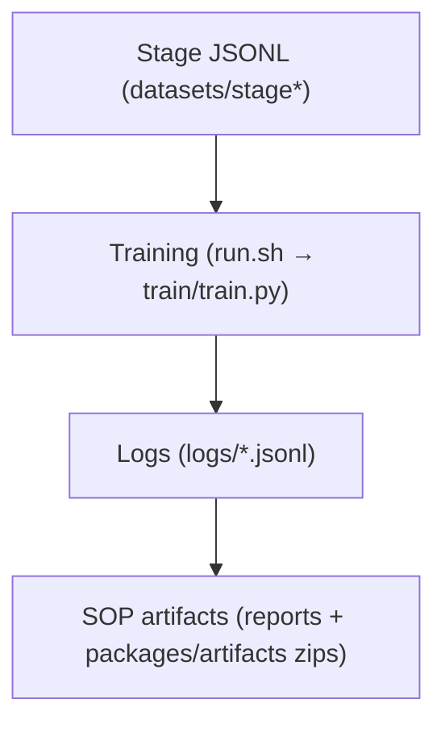
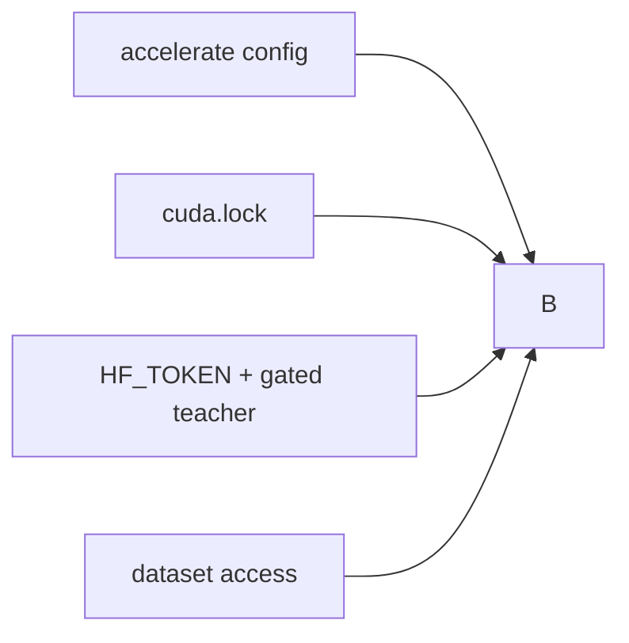
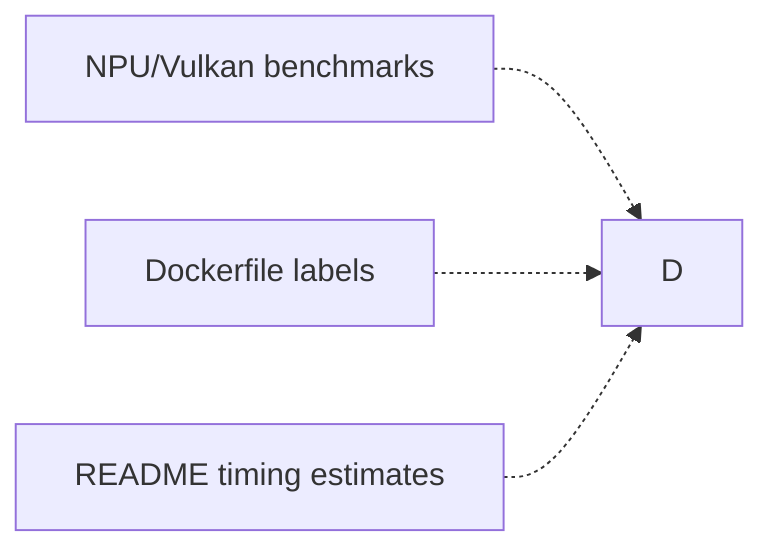

# Chain Map — Connected vs Independent

This map summarizes what is **strictly connected** in the training evidence chain vs what is **independent** (productization or deployment evidence).

## Connected Training Chain

## Prerequisite Gates (Before Training)

## Independent Evidence Streams

Notes:
- The dotted edges above are **not** training blockers; they affect deployment or documentation quality.
- The connected chain is the only path that produces **claim‑eligible** training evidence.
