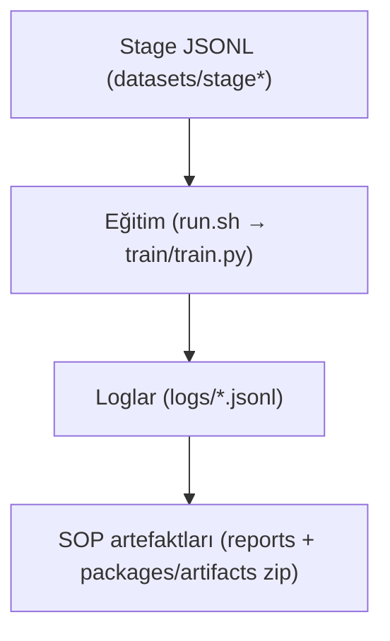
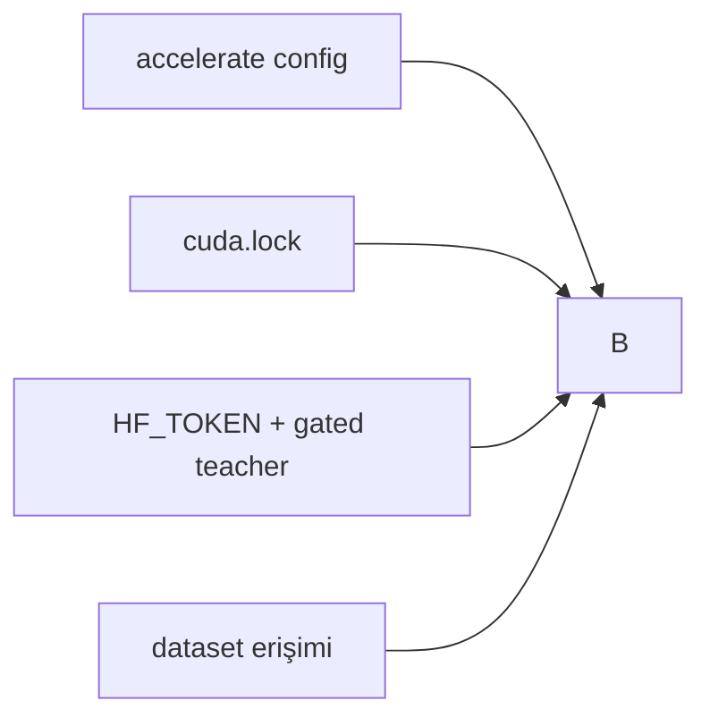
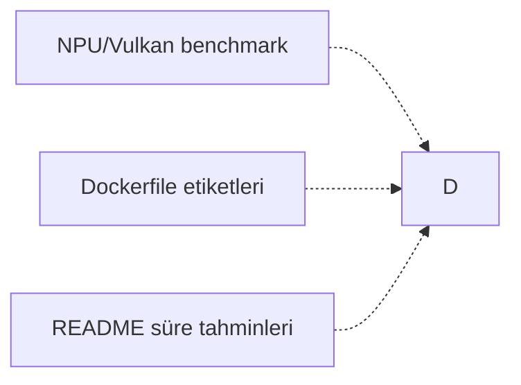

# Zincir Haritası — Bağlı vs Bağımsız

Bu harita, eğitim kanıt zincirinde **doğrudan bağlı** olanları ve **bağımsız** (ürünleşme/deployment) kanıt akışlarını özetler.

## Bağlı Eğitim Zinciri

## Önkoşul Kapıları (Eğitim Öncesi)

## Bağımsız Kanıt Akışları

Notlar:
- Noktalı oklar eğitim **bloklayıcısı değildir**; deployment/dokümantasyon kalitesini etkiler.
- Bağlı zincir, **claim‑eligible** eğitim kanıtı üreten tek yoldur.
